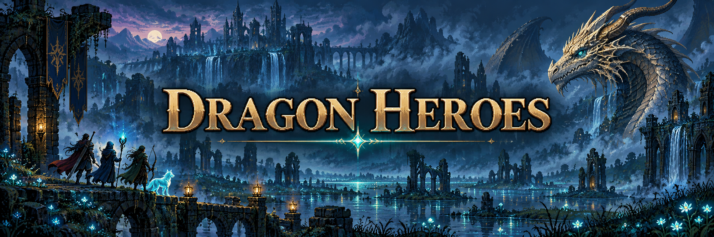

# Dragon Heroes

As a kid I started programming to create anything. What fueled me at first were fantastic worlds like the lord of rings, narnia and all those cartoon and videogame universes. I started off programming to create anything, at the time specifically something to play with my friends, and RPG or TCG we would create together (we were a bunch of creatives).

After years programming, I realized I ended up never actually building that game we would like to play together. With coding agents, the enormous amount of time demanded to create a game like this, with all the learning curves on different tools and whole research areas, is drastically reduced. 

I can finally create some of the things that kid once dreamed of - for pure joy, as he portrayed it to be.

=================================================================================================

Fast-paced dark-fantasy pixel-art multiplayer ARPG by IntelliGames: an infinite
procedurally generated world of creature hunts (a real adventure with friends),
weekly content drops, skill-based PvP and tournaments, and a real-money
player-to-player item marketplace settled via Pix.

**Start here:** [docs/00-canon.md](docs/00-canon.md) — the single source of truth for
every decision — then [docs/README.md](docs/README.md) for the full design document
set. Standing engineering guidelines: [CLAUDE.md](CLAUDE.md).

## Layout

| Dir          | What it is                                                                                                                                                            |
| ------------ | --------------------------------------------------------------------------------------------------------------------------------------------------------------------- |
| `docs/`    | Design/tech/business document set + canon                                                                                                                             |
| `sim/`     | C++20 CMake workspace: deterministic simulation core, procgen, netcode, headless server — one sim, three consumers (client prediction, authoritative server, RL env) |
| `game/`    | Godot 4.6+ client — presentation only, zero gameplay rules                                                                                                           |
| `content/` | All gameplay content as validated data (items, skills, creatures, biomes...)                                                                                          |
| `backend/` | Nakama + Go economy core (real-money ledgers) + liveops                                                                                                               |
| `web/`     | Marketplace + account portal (the only real-money surface)                                                                                                            |
| `ml/`      | RL training/eval/serving for boss AI and Champion Ghosts                                                                                                              |
| `art/`     | Source art: Aseprite files, archetype rigs, palettes                                                                                                                  |
| `tools/`   | Content validator, pipeline tooling                                                                                                                                   |
| `infra/`   | Docker, Kubernetes/Agones, Terraform                                                                                                                                  |

## Quickstart (today's M0 state)

```bash
# Build + test the simulation workspace (needs cmake >= 3.22, g++ >= 11)
cmake -S sim -B sim/build -DCMAKE_BUILD_TYPE=Release
cmake --build sim/build -j"$(nproc)"
ctest --test-dir sim/build --output-on-failure

# Run the M0 benchmark harness (entity budget + determinism fingerprint)
./sim/build/libs/dh-server/dh-server --entities 2000 --ticks 3000

# Validate the content pack (needs: pip install jsonschema)
python3 tools/validate_content.py
```

The Godot client (`game/`) opens with Godot 4.6+ (not vendored). Go 1.22+ builds
`backend/economy-core` when it grows past its stub.

## Non-negotiables

- **No paid randomness, ever** — items are cashable; paid RNG = gambling exposure
  (canon §2, [docs/business/30](docs/business/30-legal-payments-compliance.md)).
- **Server-authoritative everything** — the client is untrusted by design.
- **Weekly content never requires engine work** — content is data, validated in CI.
- **60 FPS, beautiful AND optimized** — every visual feature has a frame budget.
