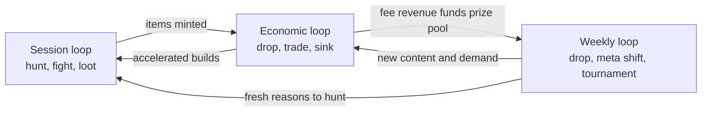

# Dragon Heroes — Vision & Pillars

> **Status:** v0.1 draft — 2026-07-07. Subordinate to [the canon](00-canon.md); where this
> document and the canon disagree, the canon wins.

## Purpose

This document states what Dragon Heroes is, who it is for, and the pillars every other design
and technical decision must serve. In a project combining an infinite world, weekly content,
real-money trading, and competitive PvP, hard trade-offs appear weekly; we resolve them by
asking "which pillar does this serve?" rather than by taste or fatigue. Everything here agrees
with [the canon](00-canon.md); numbers introduced here first are marked **(proposal)**.

## Elevator pitch

Dragon Heroes is a fast-paced online action-RPG hunter set in an infinite, procedurally
generated dark-fantasy world rendered in high-fidelity retro pixel art — "the 2D game a 64-bit
console generation would have produced." Players hunt creature packs across luminous, dangerous
biomes, capture Pets, socket Bestial Skills, and chase genuinely rare Legendary drops; new
items, creatures, and skills ship **every week**, a new biome every 4–6 weeks. Items are
player-owned and tradable for real money on a web marketplace built on Brazilian Pix rails,
while a hard power cap and a strict no-paid-power rule guarantee that skill, not wallet,
decides every fight. PC, Android, and iOS, cross-play from day one, made in Brazil first.

## Player fantasy

You are a professional monster hunter in a world that is beautiful the way deep ocean is
beautiful — bioluminescent, vast, indifferent to whether you survive it. Your mastery is
physical: dodging a Legendary boss's swept attack arc by centimeters, reading a pack, landing
the combo. It is also economic: you know which Elite packs drop the skill stone the new meta
wants, and when your once-in-a-hundred-hours Legendary drops it is *yours* — to build around,
to flex, or to sell for real money. Every week the world grows stranger; the hunt begins again.

## Design pillars

The pillars are ordered; when two collide, the earlier one wins.

### P1 — Beauty Beneath the Dark

Dark fantasy with deliberate contrast: a luminous, gorgeous world under a dark surface, never
grimdark sludge. Everbloom Wilds glows; Gloamfen shimmers; the danger matters precisely because
the world is worth being in. Every biome, creature, and VFX decision must land both notes —
wonder and threat. This is the identity test for [art direction](design/17-art-direction.md)
and [world and biome design](design/12-world-and-biomes.md).

### P2 — The World Grows Every Week

Weekly item/creature/skill drops and a new biome every 4–6 weeks are not liveops garnish —
they are the retention and meta engine. Generator-versioned chunks let new content generate in
virgin space; because everything is data (see [content pipeline](tech/23-content-pipeline.md)),
a weekly drop is a data patch, not a release. A design that cannot survive weekly extension is
the wrong design.

### P3 — Skill Is the Only Crown

Competitive outcomes are decided by hands and decisions, never by money. This is load-bearing
for both game and business: no paid power, no paid randomness (canon hard rules), a global item
power cap, input-segregated ranked queues, and a proposed per-slot power budget in ranked (see
[PvP and tournaments](design/16-pvp-and-tournaments.md)). RL bosses and Champion Ghosts train
with fairness constraints baked in, not bolted on (see [creature AI](tech/25-creature-ai-and-rl.md)).

### P4 — Loot Worth Bleeding For

Drops carry real stakes because Legendaries are genuinely rare, bosses are genuinely hard, and
items are genuinely ownable — tradable for real money. Rarity anchors value; value makes the
kill matter. The corollary is discipline: drop tables are published (a legal requirement in
Brazil, canon §8), the power cap is inviolable, and meta freshness comes from *diversity* —
never power inflation (see [items and affixes](design/14-items-loot-and-affixes.md)).

### P5 — Playing Beats Buying, Always

The marketplace accelerates progress; it must never exceed or replace it. Best-in-slot must be
reachable by playing, the drop chase must stay the emotionally dominant acquisition path, and
any system where the rational move is "open the marketplace instead of the game" is a design
defect (see [economy and marketplace](design/15-economy-and-marketplace.md) and the Diablo 3
lesson below). Our differentiator is also our most dangerous mechanic; this pillar polices it.

### P6 — Built to Be Extended

Classes, creatures, items, skills, biomes, and AI profiles are pure data with stable IDs;
adding a class is a content drop, not an engine change. The simulation is a pure C++ library
running identically as client prediction, zone server, and RL training environment (see
[architecture](tech/20-architecture-overview.md), [simulation core](tech/21-simulation-core.md)).
We accept up-front engineering cost to make P2 cheap forever.

## The three core loops

| Loop | Cadence | Beats | Primary emotion |
|---|---|---|---|
| **Session loop** | 30–60 min | Enter the Hunt → track and fight packs → boss attempt → loot (items, skill stones, Spirit Essences, capture) → extract, equip, or list | Mastery and jackpot |
| **Weekly loop** | 7 days | Data drop lands → new items/creatures/skills shift the meta → players theorycraft and re-hunt → weekly solo and guild tournaments crown winners → Champion Ghosts update | Curiosity and status |
| **Economic loop** | Continuous | Items drop in play → surplus is listed on the marketplace → buyers accelerate builds → fees fund the prize pool → items exit via consumption, enchanting sinks, and deprecated-meta churn | Ownership and stakes |

The loops interlock deliberately. The session loop is the only mint — every tradable item
enters the world through play (canon: no paid randomness, ever). The weekly loop is the demand
engine — each drop revalues existing inventory and gives the economic loop a reason to move,
and the weekly tournament is the stage where session-loop mastery and economic-loop gear meet.
The economic loop funds the prize pool through the marketplace fee (10% of sales, 20% of fee
revenue to prizes — canon proposals). Break any one loop and the other two starve.

## Target audience and the Brazilian angle

The core audience is **18+ action-RPG and extraction/hunter players** — people who already
play Path of Exile, Diablo, Hades, or Albion Online, value mechanical skill, and are motivated
by economies with real stakes. The 18+ gate with document-grade age verification is a legal
requirement, not a preference (canon §1, §8; see [legal and compliance](business/30-legal-payments-compliance.md)).

Brazil is the home market, not a localization afterthought: Pix makes real-money settlement
instant, cheap, and universal in a way no US/EU rail matches; the mobile-heavy player base is
served by day-one cross-play; servers in sa-east-1 give the home market the low latency the
netcode is tuned for (see [netcode and hosting](tech/22-netcode-and-server-hosting.md)); and
pt-BR ships at launch. Brazilian ARPG players are an underserved, high-passion market — the bet
is that a studio speaking their language, payment rail, and legal reality wins outsized loyalty
there before expanding.

## Positioning

| | Path of Exile | Diablo 4 | Albion Online | **Dragon Heroes** |
|---|---|---|---|---|
| Combat | Deep, build-driven | Polished, accessible | Tab-target, sandbox | Fast 2D action, precise hitboxes, skill-first |
| Economy | Player barter, no official cash-out | No real player economy | Player-driven, in-game silver | **Real-money Pix marketplace, phased cash-out** |
| Content cadence | Quarterly leagues | Seasonal | Periodic updates | **Weekly drops, new biome every 4–6 weeks** |
| World | Instanced maps | Shared open world | Fixed sandbox map | **Infinite seeded world that grows with content** |
| Home turf | Global/NZ | Global/US | Global/EU | **Brazil-first: Pix, pt-BR, sa-east-1** |

**The differentiator and the constraint are the same feature.** The Pix real-money marketplace
is what none of the three incumbents offer: true item ownership with a path to real-money
value, on rails Brazilians use daily. It is also the biggest design constraint, and Diablo 3 is
the cautionary tale: its real-money auction house (2012–2014) made buying gear strictly more
efficient than playing for it, hollowed out the drop chase, and was shut down by Blizzard
alongside the Loot 2.0 rework that restored drop-driven joy. Our structural answers: the hard
power cap, no paid randomness of any kind, drop rates tuned so the chase stays primary,
aggressive item sinks, and P5 as the tie-breaker in every economy decision. The marketplace
also drags in Brazilian gambling, consumer, and AML law — hence closed-loop Phase A before any
Pix cash-out (canon §2) and a legal parecer as a launch gate.

## What success looks like

Qualitatively: players log in on drop day to see what changed before they read patch notes; a
Legendary sale story ("paid my internet bill with a sword") circulates without the game being
called gambling or pay-to-win; tournament finals are watched; top ladders are populated by
grinders, not buyers.

Proposed measurable targets for the first two post-launch seasons (all **(proposal)**, to be
ratified in [the roadmap](business/31-roadmap.md)):

| Metric | Target (proposal) | Why it matters |
|---|---|---|
| D1 / D30 retention | 40% / 10% | Baseline ARPG health |
| Drop-day weekly return rate | ≥ 45% of MAU active within 48 h of a weekly drop | Proves P2 is the retention engine |
| Play-vs-buy ratio | ≥ 70% of equipped Epic+ items on ladder characters self-looted | The anti-RMAH health metric for P5 |
| Median Hunt session | 35–50 min | Session loop pacing |
| Marketplace GMV vs. infra cost | Fee revenue ≥ 2× server cost by season 2 | Business viability without paid power |
| Ranked participation | ≥ 15% of WAU play a ranked mode weekly | P3 has an audience, not just a principle |

## Top risks (honest list)

1. **Legal reclassification.** If regulators or courts read the marketplace as gambling or the
   tournaments as betting, the core business is dead on arrival. Mitigations are canonical (no
   paid randomness, no entry fees, phased cash-out, parecer as launch gate), but this remains
   the existential risk ([legal doc](business/30-legal-payments-compliance.md)).
2. **Economy design failure.** Two failure modes: the RMAH trap (buying beats playing → P5
   dead) and the inflation trap (weak sinks → prices collapse → P4 dead). Both are design
   problems before engineering ones; see [economy and marketplace](design/15-economy-and-marketplace.md).
3. **Scope.** Custom C++ simulation, custom netcode, infinite procgen, RL bosses, three-
   platform cross-play, a regulated marketplace, and weekly liveops is a very large surface for
   a small studio. Mitigation: milestone discipline, the data-driven architecture that makes
   content cheap, and cut-lines in [the roadmap](business/31-roadmap.md) (e.g., launching
   without Gloomfall or with fewer classes) agreed in advance, not in an emergency.
4. **Economy integrity.** Dupes, fraud, and stolen-account laundering become real-money crimes
   the day the marketplace opens; kill switches and reconciliation exist before then (canon
   §8; see [security and integrity](tech/27-security-anticheat-and-economy-integrity.md)).

## Open questions (for Ricardo)

1. Confirm the 18+ positioning as final for launch, or direct a study of a lower-rated variant
   with no cash-out (this reopens canon §1 and the entire economy design — decide now).
2. Ratify or replace the proposed success targets above (especially the ≥ 70% self-looted
   ladder-gear target, which will drive drop-rate and marketplace tuning from M1).
3. Marketing posture: lead public messaging with the real-money marketplace, or lead with the
   game and let the marketplace be discovered (slower economic-loop ignition, lower early
   regulatory attention)?
4. Launch geography: Brazil-only soft launch (smaller blast radius for economy/legal issues)
   versus global launch with Brazil-first infrastructure — which is the plan of record for
   [the roadmap](business/31-roadmap.md)?
5. Is Gloomfall (40-player battle royale) inside the launch cut-line, or is it the pre-agreed
   first scope cut if milestones slip (risk 3 above)?

## Sources

- [Dragon Heroes canon](00-canon.md) — all names, numbers, legal constraints, and decisions.
- No research digest was assigned to this document. The Diablo 3 auction-house account
  (operated 2012–2014, closed alongside Loot 2.0) is widely documented industry history; flag
  for a source-of-record citation in the next research pass.
