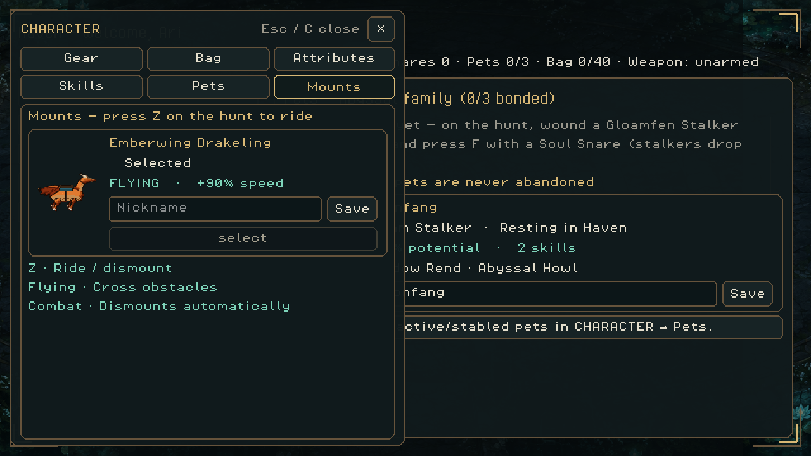
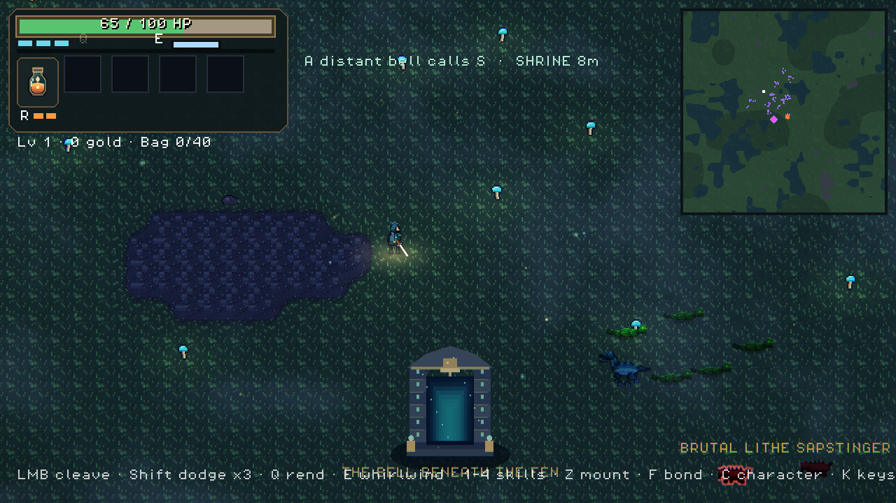
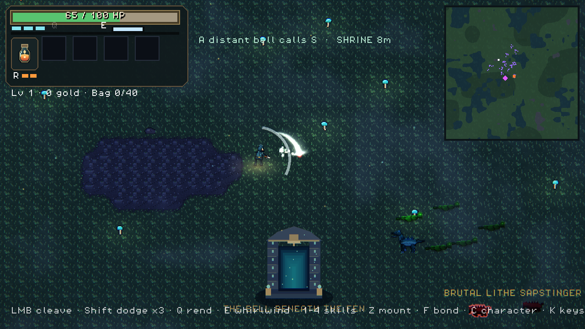

# Recovery slice — actual game frames

Run with the OpenGL compatibility renderer only:

```sh
godot --path game --rendering-method gl_compatibility res://prototype/tests/renewal_capture.tscn
```

The [capture script](../../../game/prototype/tests/renewal_capture.gd) shows
companion nicknames/sprites, organized mount cards, wrapped character tabs,
the saved visibility setting, Flask/HP/dodge HUD and finite action animations.
It uses a disposable character fixture; isolate XDG data/config when capturing.







These are actual game frames, not UI concepts. The tiny hunter, repetitive
floor and broader UI/art work remain visibly unfinished and tracked in R05/R06/
R09/R10. The generated [Haven source](../../../genforge/art_sources/haven-renewal/source.png)
is a separate candidate, created with the built-in imagegen tool; its exact
prompt and provenance live beside it. It is not yet the playable Haven.

The capture includes 300 warmed gameplay frames with repeated melee actions,
without screenshot readbacks: 60 FPS reported, median frame 16.668 ms,
95th percentile 16.911 ms, median process 3.813 ms / p95 4.218 ms on this Intel-GL
desktop. PNG readbacks themselves stall and are excluded from those samples.
This short desktop run is not proof of sustained performance or mobile support.
