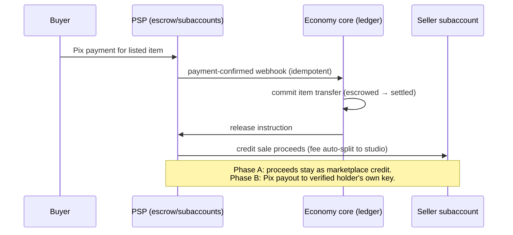

# 30 — Legal, Payments & Compliance Dossier (Brazil)

> **⚠️ DISCLAIMER — READ FIRST.** This document is a **research synthesis, current as of
> July 2026, written by a compliance-savvy producer. It is NOT legal advice and its author
> is NOT a lawyer.** Several positions below are reasoned inferences from statutes,
> first-instance rulings, and regulator behavior — not settled law. Per
> [canon §8](../00-canon.md), **a formal legal opinion (parecer) from a Brazilian
> gaming-law firm is a launch gate**: nothing in this document ships to production players
> without that sign-off. Where this document and future counsel disagree, counsel wins.

## Purpose

Dragon Heroes couples a free-to-play action RPG with a real-money player-to-player
marketplace ([15-economy-and-marketplace](../design/15-economy-and-marketplace.md)) and
fee-funded tournament prizes ([16-pvp-and-tournaments](../design/16-pvp-and-tournaments.md)).
That combination sits near four regulated perimeters in Brazil — gambling (Lei
14.790/2023), child protection (Lei 15.211/2025, the ECA Digital), payments (BCB
instituição de pagamento licensing), and tax (the 2026–2033 reform transition). This
dossier maps each perimeter, states the design decisions that keep us outside them,
identifies what is genuinely untested, and defines the compliance launch gates and the
precise questions we must put to counsel. It is the business-side counterpart to
[26-backend-and-services](../tech/26-backend-and-services.md) (economy core, ledgers) and
[27-security-anticheat-and-economy-integrity](../tech/27-security-anticheat-and-economy-integrity.md)
(fraud and kill switches).

---

## 1. The gambling line — Lei 14.790/2023

Brazil's [Lei 14.790/2023](https://www.gov.br/fazenda/pt-br/composicao/orgaos/secretaria-de-premios-e-apostas/apostas-de-quota-fixa)
regulates **"jogos online"**: games where outcomes determined by a random number
generator are wagered for money, licensed by the SPA/Ministério da Fazenda. The cost of
falling in scope is existential for a studio our size: a license runs **R$30M for 5
years**, plus taxation of **12% GGR at enactment, escalating 13% (2026) / 14% (2027) /
15% (2028) via LC 224** ([iGaming Brazil](https://igamingbrazil.com/legislacao/2026/05/20/regulamentacao-das-apostas-no-brasil-entenda-como-funciona-a-taxacao-para-empresas-e-apostadores/)).
Operating without a license remains the art. 50 LCP gambling contravention and now sits
inside an aggressive enforcement wave against illegal betting. **Dragon Heroes must never
fall in scope. This is not a cost-optimization question; it is a viability question.**

### 1.1 Our defensible position

The gambling trifecta is **consideration (payment) + chance + prize**. Dragon Heroes
deliberately breaks the first link: per [canon §2](../00-canon.md) (hard rule), **no
money ever buys a random outcome** — no purchasable loot boxes, keys, chests, gacha, or
paid rerolls, anywhere, ever. All random drops come exclusively from gameplay
([14-items-loot-and-affixes](../design/14-items-loot-and-affixes.md)); direct purchases
are limited to cosmetics and non-combat convenience. Because our items are cashable
(Phase B), even one paid-RNG mechanic would complete the trifecta and likely classify the
whole game as an unlicensed jogo online. The hard rule therefore has **no exceptions and
no "cosmetic-only loot box" carve-out** — cosmetics are sellable on the marketplace too.

### 1.2 The regulator template: NY AG v. Valve (February 2026)

The New York Attorney General's February 2026 suit against Valve over CS2
([GameVicio coverage](https://www.gamevicio.com/noticias/2026/02/valve-processo-loot-boxes-counter-strike-2/))
is the template Brazilian commentators already cite: **paid randomness (keys/cases) plus
a market that converts items to real money equals an illegal-gambling claim.** Note what
the suit attacks: not trading itself, but the combination of paid chance with cash
convertibility (via third-party leakage from Steam's closed loop). Dragon Heroes is
designed to present the opposite fact pattern — cash convertibility exists (Phase B), but
paid chance does not, anywhere.

### 1.3 The honest caveat: first-party cash-out is untested

We must be honest with ourselves about the limit of this analysis. Quoting the
[research digest](https://www.agitabrasil.com.br/noticia/lacuna-na-fiscalizacao-de-apostas-com-skins-e-ampla-comercializacao-de-lootboxes-e-desafio-para-legislacao-no-brasil)
caveat verbatim:

> "No Brazilian statute, SPA rule, or court decision yet squarely addresses a FIRST-PARTY
> cash-out marketplace for gameplay-earned items; the analysis that gameplay-earned drops
> avoid gambling classification is a reasoned inference from Lei 14.790's paid-wager
> element, not settled law — a regulator could still argue the game time/monetized
> ecosystem constitutes consideration, as the NY AG did against Valve."

Skin/item wagering is an acknowledged regulatory gap in Brazil, which cuts both ways: no
license path exists for us even if we wanted one, and enforcement proceeds under general
gambling and consumer law. This caveat is the single strongest reason the parecer is a
launch gate and why cash-out is phased (§10).

---

## 2. Minors — Lei 15.211/2025 (ECA Digital) and the TJDFT rulings

### 2.1 ECA Digital

[Lei 15.211/2025](https://www.gov.br/planalto/pt-br/acompanhe-o-planalto/noticias/2026/03/governo-do-brasil-regulamenta-o-eca-digital-novo-marco-na-protecao-de-criancas-e-adolescentes-na-internet),
in force since **17 March 2026**, defines **"caixas de recompensa"** (paid random
virtual-item mechanisms) and **prohibits them in any game directed at, or likely to be
accessed by, under-18s**. Sanctions reach **10% of Brazilian gross revenue**, suspension
of the game in Brazil, and press reports of R$50M minimum fines for serious violations
(secondary sourcing — confirm against the final statute text). **ANPD is the enforcement
authority**, with supervision phasing in: preliminary age-verification guidance published
March 2026, and **phase-2 supervision of game/app providers from August 2026** — one
month after this writing. Critically, **self-declared age is no longer acceptable**: age
verification must be CPF/document/biometric-grade
([Migalhas](https://www.migalhas.com.br/depeso/454158/verificacao-de-idade-no-eca-digital-do-marco-legal-a-implementacao)).

### 2.2 The June 2026 TJDFT condemnations

In June 2026 the 1ª Vara da Infância do DF issued Brazil's first loot-box condemnations:
roughly **R$298–333M in aggregate collective moral damages** across Riot Games
(**R$15M**), Sony, Microsoft, Valve, Nintendo, Google, Apple and others
([TJDFT press release](https://www.tjdft.jus.br/institucional/imprensa/noticias/2026/junho/justica-condena-empresa-de-jogos-eletronicos-por-pratica-abusiva-com-criancas-e-adolescentes-em-recompensas-pagas),
[Conjur](https://www.conjur.com.br/2026-jun-29/loot-boxes-em-games-sao-publicidade-abusiva-e-geram-danos-morais-a-criancas-e-adolescentes/),
[Migalhas](https://www.migalhas.com.br/quentes/458365/lol-e-condenado-em-r-15-mi-por-expor-menores-a-dinamica-de-aposta)).
The court held loot boxes to be **abusive embedded advertising and a defective service
under the CDC**, "structurally comparable to gambling," and ordered **probability
disclosure, randomness warnings, high-reliability age verification, and refunds to
minors**, backed by R$100k/day fines. **These rulings are first-instance and under
appeal** — the standard could soften or harden — but they prove Brazilian courts will act
under CDC/ECA without waiting for gambling regulators.

### 2.3 Consequences for Dragon Heroes

1. **18+ with real (CPF/document-grade) age verification is a launch blocker**, not a
   preference — this is [canon §1 and §8](../00-canon.md). A real-money marketplace plus
   randomly dropped items in a game accessible to minors combines ECA Digital fines with
   the exact fact pattern behind the TJDFT condemnations.
2. **We adopt the TJDFT compliance package proactively, even at 18+** (canon §8):
   publish exact drop-probability tables for every loot table (the content pipeline makes
   this cheap — drop tables are data,
   [23-content-pipeline](../tech/23-content-pipeline.md)), display randomness warnings on
   relevant screens, and operate a refund channel. This is now the de facto CDC standard
   for random mechanics in Brazil, and it costs us little because we sell no randomness.
3. Age verification happens at account level in the web portal (`web/account/`),
   **before any gameplay session (and therefore before any marketplace access)** —
   per [canon §1](../00-canon.md) the 18+ gate is a launch blocker on play itself, not
   just on the marketplace, and it is enforced in the login/session flow
   ([26-backend-and-services §8](../tech/26-backend-and-services.md)) — using a vendor
   performing CPF + document (and possibly biometric liveness) checks — vendor
   selection is an open question (§13), with LGPD consequences (§7).

---

## 3. Payments — the studio never touches funds

### 3.1 The structural rule

Per [canon §8](../00-canon.md): buyer funds go from the buyer to the PSP, sit in PSP
escrow/subaccounts, and release to the seller only after the economy core commits the
item transfer, with our fee taken as an automatic split. **The studio never holds,
transmits, or intermediates funds.** This keeps us outside Banco Central "instituição de
pagamento" licensing, which tightened materially in 2025–2026:
[Resolução BCB 506/2025](https://www.legisweb.com.br/legislacao/?id=484161) raised
requirements, opened a mandatory authorization window (May 2026) for pre-existing
unlicensed players, and imposes **R$15k per-transaction caps on unauthorized
institutions**. Becoming an accidental payment institution is a failure mode we design
out structurally, not procedurally.

### 3.2 PSP comparison (as of mid-2026)

| PSP | Model | KYC | Split | Pix cost / notes | Fit |
|---|---|---|---|---|---|
| **[Asaas](https://docs.asaas.com/docs/criacao-de-subcontas)** | White-label subaccounts created via API | Delegated: ID document + selfie + declared income, ~48h review, plus a mandatory "regulatory evaluation period" for new API subaccounts | Native | Pix acquiring up to ~0.99%, no monthly fee; Pix transfer (payout) APIs | **Primary.** Best white-label fit for paying out individual (CPF) sellers |
| **[OpenPix/Woovi](https://developers.openpix.com.br/en/docs/subaccount/split-sub-account-usecases)** | Pix-only subaccounts keyed to seller's Pix key (CPF/CNPJ) | Thin — studio retains more compliance burden | Commission retained automatically | Lightest integration | Alternate |
| **[Efí](https://dev.efipay.com.br/en/docs/api-pix/envio-pagamento-pix/)** (ex-Gerencianet) | Licensed payment institution; subaccounts | Own KYC | Yes | Strongest raw "envio Pix" API — cheapest high-volume payouts to any Pix key | Alternate (payout leg) |
| **[Mercado Pago](https://www.mercadopago.com.br/developers/pt/docs/split-payments/prerequisites)** | Split de Pagamentos | Fully absorbed by MP | 1:1 self-serve; 1:N needs commercial negotiation | Every seller must open an MP account linked via OAuth — forces sellers off-platform | Only if MP-account friction is acceptable |
| **[Stripe](https://support.stripe.com/questions/how-to-enable-pix-as-a-payment-method-in-brazil)** | Connect | — | — | Pix for Brazil-based businesses remains **invite-only in 2026**; 2026 Pix expansion targets US merchants selling into Brazil | Do not plan on it |
| **[EBANX](https://docs.ebanx.com/docs/payout/createPayout/br/createPixPayoutBR/)** | Enterprise cross-border | Mature payout API incl. Pix-key ownership verification | — | Only relevant if billing from a foreign entity | Not applicable while we are a Brazilian entity |

**Hard caveat (from both research tracks):** PSP commercial terms change frequently, and
**each PSP's risk appetite for a virtual-game-item RMT marketplace needs WRITTEN
confirmation before we build against it** — some classify RMT as high-risk /
gambling-adjacent and refuse. Getting that letter from Asaas (and one alternate) is a
checklist gate (§11). We also ask each PSP about its LC 214 tax-split-payment roadmap
(§5.2).

### 3.3 Escrow flow and disputes

Funds release **only after** the economy core's SERIALIZABLE item-transfer commit
([26-backend-and-services](../tech/26-backend-and-services.md)); a failed commit refunds
the buyer from escrow. Disputes: Pix **MED 2.0** (the BCB's special-return mechanism for
fraud) is handled by the PSP on its rails; our obligation is fast, evidence-rich
responses — the economy core's append-only ledger and item state machine give us a
complete audit trail per transaction. Marketplace terms of service must state the
finality model for item delivery vs. MED reversals; this is a question for counsel (§12).

---

## 4. VASP status — expressly out of scope

Game items and NFTs were **expressly left outside** Brazil's new virtual-asset regime.
Resolutions **BCB 519/520/521** (November 2025, in force February 2026, authorization
filings due by October 2026) follow Lei 14.478/2022's definition of virtual assets, which
**excludes items granting access to specific products or services** — per
[Mattos Filho's analysis](https://www.mattosfilho.com.br/unico/normas-regulamentacao-ativos-virtuais/)
and [Conjur](https://www.conjur.com.br/2025-nov-12/enfim-as-regras-do-banco-central-sobre-ativos-virtuais/).
The marketplace therefore **does not need BCB authorization as an SPSAV**. We ask counsel
to confirm this reading against our specific Phase B cash-out design (§12), and we keep
items strictly as in-game utility objects: no tokenization, no blockchain representation,
no interest-bearing or investment framing anywhere in product copy.

---

## 5. Tax

### 5.1 The studio

Our 10% (proposal, [canon §2](../00-canon.md)) marketplace fee is a paid intermediation
service. Obligations today and through the reform transition
([Câmara — 2026 transition](https://www.camara.leg.br/noticias/1237089-reforma-tributaria-comeca-fase-de-transicao-com-testes-de-novos-impostos-em-2026/)):

| Item | Today (2026) | Transition |
|---|---|---|
| ISS (municipal) | 2–5% on the commission | Phases out through 2032 |
| PIS/COFINS | Due (or Simples Nacional) | **Replaced by CBS in 2027** |
| IRPJ/CSLL | Due per regime | Unchanged by this reform |
| **CBS 0.9% + IBS 0.1%** | **2026 test year: must be highlighted on invoices** (optional on NFS-e initially), creditable against PIS/COFINS | Rates ramp from 2027 |
| NFS-e | **One per commission charged** — automate from day 1 | — |

We join the 2026 CBS/IBS test regime and register the platform as an IBS/CBS contributor
(recommendation from the research digest; entity/regime choice is an open question, §13).

### 5.2 LC 214/2025 arts. 22–23 — platform joint liability (the sleeper issue)

Under [LC 214/2025](https://www.planalto.gov.br/ccivil_03/leis/lcp/lcp214.htm) arts.
22–23, "digital platforms" that intermediate transactions and control payment, terms, or
delivery become **jointly liable for IBS/CBS of national suppliers who fail to issue
fiscal documents**, and act as substitutes for foreign suppliers. The platform must
register as a contributor, **report all intermediated operations**, and — when it
initiates payment — **provide the data for tax split payment at financial settlement**. A
safe harbor applies if the reporting and split duties are met
([Conjur analysis](https://www.conjur.com.br/2025-dez-29/responsabilidade-tributaria-das-plataformas-digitais-na-reforma/)).
How this applies to C2C sales between non-contribuinte individuals (most of our sellers)
awaits infralegal regulation, and obligations firm up from 2027 — but the engineering
consequence is immediate: **the economy core must record per-transaction reporting data
(parties' CPF/CNPJ, amounts, dates, fee) from day 1, and the PSP integration must be able
to carry split-payment data.** Build the reporting now; bolting it on later against a
live ledger is far more expensive.

### 5.3 Player-sellers

Individual sellers owe **15% capital-gains tax (GCAP) on profit**, but sales of "bens de
pequeno valor" up to **R$35,000/month are exempt**
([Portal Tributário](https://www.portaltributario.com.br/guia/isencao_ganho_capital_pf.html))
— covering virtually all casual players. **Habitual for-profit trading risks
recharacterization** as ordinary income (carnê-leão, up to 27.5%) or a demand to
formalize as a business; Receita has issued no game-item-specific ruling, so this rests
on general doctrine. The platform has no IR-withholding duty on P2P sales today (recent
RFB platform-withholding rules target licensed betting operators), but Pix flows are
fully visible to Receita via PSP reporting. Our commitments (canon §8): require CPF at
seller onboarding, **issue annual transaction statements to sellers**, and surface an
in-product notice about GCAP/the R$35k exemption. We are not tax advisors to players; the
notice links to official guidance.

### 5.4 Tournament prizes

Cash prizes from competitions generally attract **30% IRRF withheld by the payer (DARF
code 0916), remitted by the 3rd business day after the decêndio**
([Portal Tributário](https://www.portaltributario.com.br/guia/irf_sorteios.html)), and
Receita is actively building prize-tax tooling for virtual competitions
([RFB, March 2026](https://www.gov.br/receitafederal/pt-br/assuntos/noticias/2026/marco/receita-libera-ferramenta-para-calcular-ir-de-premios-em-bets-e-fantasy-sport)).
Payout flow ([16-pvp-and-tournaments](../design/16-pvp-and-tournaments.md), canon §5):
collect CPF, run PSP KYC, withhold 30% IRRF, pay via PSP Pix rails from the segregated
prize-pool ledger account. **Caveat:** performance-based prizes may instead be classed as
remuneration (labor income) with different withholding — the 30%/DARF-0916 treatment
comes from practitioner sources and **needs counsel confirmation for our exact
structure** (§12). And per canon, **no entry fees, ever**: entry fees funding
chance-influenced prizes is the fixed-odds-betting fact pattern under Lei 14.790/SPA.
Tournaments are structured as skill-predominant competitions with fee-funded (effectively
sponsored) pools.

---

## 6. AML/PLD — voluntary COAF-aligned program

The marketplace is not squarely an "obligated person" under Lei 9.613/1998, and §4 keeps
us outside the VASP regime — but RMT marketplaces are classic laundering vectors (value
moves by selling a rare item cheap to an accomplice), our regulated PSP will impose PLD/FT
requirements on the flows regardless, and the enforcement climate is hot: the Polícia
Federal's **July 2026 [Operação Véu de Maia](https://www.gov.br/pf/pt-br/assuntos/noticias/2026/07/pf-deflagra-operacao-para-apurar-esquema-de-lavagem-de-dinheiro-ligado-a-apostas-ilegais)**
targeted money laundering tied to illegal betting. Per [canon §8](../00-canon.md) we run
a **voluntary COAF-aligned PLD/FT program** from day 1:

| Control | Implementation |
|---|---|
| Seller KYC | Verified CPF + document via PSP delegated KYC (Asaas flow, §3.2) before first listing |
| Payout destination | **Only to a Pix key owned by the verified account holder** — enforced via PSP key-ownership-verification APIs |
| Transaction monitoring | Velocity limits, price-deviation detection (laundering via deliberately underpriced sales), wash-trade detection between linked accounts — economy-core jobs, see [27-security](../tech/27-security-anticheat-and-economy-integrity.md) |
| Volume limits | Per-account monthly sale caps, initial cap R$35k/month (proposal — aligned with the GCAP small-value threshold; raises require enhanced review) |
| Records | 5-year retention of KYC artifacts, transactions, and monitoring alerts |
| Escalation | Documented internal review procedure; counsel to advise whether/when voluntary COAF communications are appropriate (§12) |

Fraud adjacencies (stolen-card cash-out through item purchases, account-takeover-and-
liquidate, chargeback abuse) are covered in
[27-security-anticheat-and-economy-integrity](../tech/27-security-anticheat-and-economy-integrity.md);
the marketplace kill switches required by canon §8 exist before the marketplace opens.

---

## 7. LGPD

LGPD applies in full: we process payment data, CPF, and — if the age-verification vendor
uses biometrics — **sensitive personal data**. Program requirements (canon §8):

- **Appoint a DPO (encarregado)** before any real-user data collection.
- **DPIA/RIPD** covering (a) marketplace payment/KYC data flows and (b) age verification,
  explicitly analyzing biometric processing if the chosen vendor uses liveness/face-match.
- **Legal bases mapping:** contract execution for account and marketplace operation;
  legal obligation for KYC/tax/AML records (which also bounds retention: 5 years for AML,
  tax-statute periods for fiscal records); legitimate interest, with balancing test, for
  anti-fraud monitoring; consent where nothing else fits (e.g., Champion Ghost
  training per canon §5).
- **Minimization:** retain verification artifacts (document images, selfies) only as long
  as the verification decision needs support; prefer storing the vendor's attestation
  over raw biometrics.
- **Minors:** LGPD's best-interest rules for minors' data reinforce the 18+ gate — by not
  serving minors we avoid the hardest processing regime entirely; ANPD is simultaneously
  our ECA Digital supervisor (§2), so LGPD and age-verification compliance are reviewed
  by the same authority.

---

## 8. App stores

Per [canon §1](../00-canon.md), cross-play ships day 1 (PC/Android/iOS), which makes
app-store policy a compliance surface
([Stash — app-store regulations guide](https://www.stash.gg/blog/game-developers-guide-to-app-store-regulations)):

1. **The real-money marketplace is web-only** (`web/marketplace/`). No marketplace
   browsing, purchasing, listing, or cash-out UI inside the mobile apps — real-money
   trading and cash-out are account-ban risks under both stores' policies.
2. **No cash-out UI anywhere in mobile apps**, including deep links that read as a
   purchase funnel; the apps may show inventory but must not initiate real-money flows.
3. **No downloaded code on iOS**: weekly drops are data-only PCK patches
   ([23-content-pipeline](../tech/23-content-pipeline.md)) — never scripts.

---

## 9. Classificação indicativa — embrace the 18 rating

The Ministry of Justice's 2026 classificação indicativa guide includes the descriptor
**"Compras on-line (inclui itens aleatórios ou apostas)"**; the marketplace will drive an
**18 rating, which we embrace rather than fight**. An 18 rating is consistent with the
ECA Digital gate (§2), removes any argument that the game is "directed at or likely to be
accessed by" minors when combined with real age verification, and aligns store listings,
marketing, and the TJDFT package into one coherent story: an adults-only game that is
more transparent about randomness than the law requires.

---

## 10. Phased rollout as legal strategy

The phasing in [canon §2](../00-canon.md) is a legal posture, not just a product
sequence:

- **Phase A (launch) — closed loop.** Sale proceeds are **marketplace credit** held in
  PSP subaccounts, spendable only on the marketplace. This is the **Steam Community
  Market model** ([Steam FAQ](https://help.steampowered.com/en/faqs/view/61F0-72B7-9A18-C70B)),
  which survives regulatory scrutiny precisely because wallet funds cannot be cashed out
  and Valve bans third-party RMT — the NY AG suit attacks the leakage to cash-out sites,
  not the closed loop itself. Phase A lets us launch on the most defensible known fact
  pattern while operating every control (KYC, ledger, monitoring) at production scale.
- **Phase B — Pix cash-out**, enabled **only after** (a) the parecer explicitly blesses
  the cash-out design (§1.3's untested question), (b) KYC/AML controls have run in
  production with audited results, and (c) PSP written confirmation covers the payout
  leg. The architecture supports Phase B from day 1 (canon §2); the gate is legal, not
  technical. Precise gate criteria are an open decision for Ricardo
  ([canon §12](../00-canon.md), item 5).
- **Standing risk:** experts flag skin/item wagering as an open regulatory gap that
  could be closed by new SPA rulemaking with little notice
  ([Agita Brasil](https://www.agitabrasil.com.br/noticia/lacuna-na-fiscalizacao-de-apostas-com-skins-e-ampla-comercializacao-de-lootboxes-e-desafio-para-legislacao-no-brasil)) —
  standing counsel (§11) monitors this; Phase B reverts to Phase A behind a kill switch
  if the perimeter moves.

---

## 11. Compliance launch gates

Owners: **Producer** = compliance-savvy producer (this doc's author), **Ricardo** =
founder, **Counsel** = retained Brazilian gaming-law firm, **Backend** = economy-core
lead. Gates: **G-A** = blocks Phase A launch (marketplace open), **G-B** = blocks Phase B
(cash-out), **G-T** = blocks first cash-prize tournament.

| # | Item | Owner | Gate |
|---|---|---|---|
| 1 | Parecer from Brazilian gaming-law firm: gambling classification, ECA Digital, cash-out design | Counsel / Ricardo | G-A (scope A) and G-B (cash-out scope) |
| 2 | 18+ age verification live, CPF/document-grade, before any gameplay session (and therefore before any marketplace access) | Producer + Backend | G-A |
| 3 | TJDFT package: published drop tables, randomness warnings, refund channel | Producer | G-A |
| 4 | Paid-randomness audit: no purchasable RNG anywhere (incl. cosmetics pipeline review each content drop) | Producer | G-A + every weekly drop |
| 5 | PSP contract signed with **written** game-item-RMT acceptance (Asaas primary + one alternate) | Ricardo | G-A |
| 6 | Escrow flow + MED 2.0 dispute runbook tested end-to-end in PSP sandbox | Backend | G-A |
| 7 | PLD/AML program documented and running (KYC, own-key payouts, monitoring, 5-yr retention) | Producer + Backend | G-A (monitoring), G-B (payout controls audited) |
| 8 | Kill switches on every wealth-transfer vector + mint-anomaly alerts (canon §8) | Backend | G-A |
| 9 | LGPD: DPO appointed, DPIA/RIPD covering payments + age verification | Producer | G-A |
| 10 | NFS-e automation per commission; CBS/IBS 2026 test-regime registration; LC 214 reporting data captured per transaction | Ricardo (accountant) + Backend | G-A |
| 11 | Seller annual-statement pipeline + GCAP notice in seller onboarding | Backend | first fiscal year-end (build at G-A) |
| 12 | Tournament payout flow: CPF collection, 30% IRRF withholding (DARF 0916), remittance calendar; prize classification confirmed by counsel | Counsel + Backend | G-T |
| 13 | Classificação indicativa 18 rating filed; store listings consistent | Producer | G-A |
| 14 | App-store review: no marketplace/cash-out surface in mobile builds | Producer | G-A |
| 15 | Cash-out gate criteria met and signed off by Ricardo (canon §12.5) | Ricardo | G-B |

**Standing counsel budget line:** retain the gaming-law firm beyond the parecer — Brazil's
perimeter is moving quarterly (ECA Digital regulation still issuing, LC 214 infralegal
rules pending, possible skin-wagering rulemaking). Proposed: one-time parecer
**R$60k–120k (proposal)**; standing retainer **R$10k/month (proposal)** covering
regulatory watch, ToS/marketplace-terms maintenance, and incident response. Carried in
[31-roadmap](31-roadmap.md) as a fixed cost from the pre-launch quarter onward.

---

## 12. Open legal questions for the law firm

These go into the parecer engagement letter, verbatim:

1. **Gambling classification:** Does a first-party marketplace where players sell
   gameplay-earned items for BRL (Phase B: with Pix cash-out) fall outside Lei
   14.790/2023 and art. 50 LCP, given zero paid randomness? Does "consideration" reach
   game time or the monetized ecosystem (the NY AG v. Valve theory) under Brazilian law?
2. **ECA Digital sufficiency:** Does our CPF/document-grade verification meet ANPD's
   age-verification expectations for phase-2 supervision (August 2026)? Is an 18-rated
   game with real verification safely outside "likely to be accessed by minors"?
3. **TJDFT standard:** Given the rulings are under appeal, which elements (probability
   disclosure, refund channel scope, warning copy) should we treat as binding floor vs.
   prudent extra, and what refund obligations attach to an 18+ game with no paid RNG?
4. **VASP confirmation:** Confirm game items under our Phase B design remain outside
   Res. BCB 519/520/521 / Lei 14.478/2022 (no SPSAV authorization), including the
   marketplace-credit construct in Phase A.
5. **Payment-institution perimeter:** Confirm the PSP escrow/subaccount structure keeps
   IntelliGames outside instituição de pagamento licensing under Res. BCB 506/2025,
   including the marketplace-credit balances in Phase A.
6. **Tournament prize classification:** Performance-based remuneration vs. 30%-exclusive
   prize taxation (DARF 0916) for our fee-funded, no-entry-fee tournaments — exact
   withholding, remittance, and documentation duties.
7. **LC 214/2025:** Our concrete reporting and split-payment duties as a platform
   intermediating C2C sales between individuals, and how to preserve the art. 22–23 safe
   harbor from the 2026 test year onward.
8. **AML posture:** Whether any Lei 9.613/1998 obligated-person category could reach us;
   whether and when voluntary COAF communications are advisable; adequacy of the §6
   program.
9. **MED 2.0 vs. item finality:** Enforceable ToS treatment when a Pix payment is
   clawed back after an item has settled to the buyer (who bears the loss; can we
   contractually reclaim the item).
10. **Marketplace ToS package:** Draft/validate marketplace terms, refund policy,
    seller tax notices, and the Champion Ghost consent + revenue-share terms (canon §5).

---

## Open questions (for Ricardo)

1. Approve engaging a Brazilian gaming-law firm this quarter with the §12 question list,
   at the proposed budget (parecer R$60k–120k one-time; R$10k/month standing retainer —
   both proposals). The parecer is the critical-path item for the Phase A launch gate.
2. Confirm the 18+ positioning definitively (canon §12.1): accept the smaller addressable
   market, or commission a study of a no-cash-out redesign for a lower rating before more
   marketplace engineering lands.
3. Approve opening commercial negotiation with Asaas as primary PSP (plus Efí or
   OpenPix/Woovi as the alternate), with signed written acceptance of game-item RMT as a
   contract precondition — and decide the fallback if all shortlisted PSPs refuse the
   category.
4. Define the Phase A→B cash-out gate criteria (canon §12.5): minimally the parecer
   blessing cash-out, N months of clean AML monitoring in production, and PSP payout-leg
   confirmation — Ricardo to set N and any volume thresholds.
5. Choose the studio's tax regime with the accountant (Simples Nacional vs. Lucro
   Presumido/Real) and confirm we join the 2026 CBS/IBS test regime voluntarily — this
   affects marketplace fee economics and must precede NFS-e automation build.
6. Select the age-verification approach: document+CPF checks only, or add biometric
   liveness (stronger ANPD story, but sensitive-data processing under LGPD and higher
   per-user cost). Vendor shortlist and per-verification budget needed.
7. Decide the refund channel's scope beyond the legal minimum (TJDFT package): purchases
   only, or also marketplace transactions within a time window — this interacts with the
   MED 2.0 finality question (§12.9).
8. Approve the monthly per-account sale cap starting at R$35k (proposal, §6) and the
   enhanced-review process for raising it, since this throttles our highest-volume
   sellers.

## Sources

- [TJDFT — Justiça condena empresa de jogos eletrônicos por prática abusiva (jun/2026)](https://www.tjdft.jus.br/institucional/imprensa/noticias/2026/junho/justica-condena-empresa-de-jogos-eletronicos-por-pratica-abusiva-com-criancas-e-adolescentes-em-recompensas-pagas)
- [Conjur — Loot boxes em games são publicidade abusiva (29/jun/2026)](https://www.conjur.com.br/2026-jun-29/loot-boxes-em-games-sao-publicidade-abusiva-e-geram-danos-morais-a-criancas-e-adolescentes/)
- [Migalhas — LoL condenado em R$ 15 mi por expor menores a dinâmica de aposta](https://www.migalhas.com.br/quentes/458365/lol-e-condenado-em-r-15-mi-por-expor-menores-a-dinamica-de-aposta)
- [Planalto — Governo regulamenta o ECA Digital (Lei 15.211/2025), mar/2026](https://www.gov.br/planalto/pt-br/acompanhe-o-planalto/noticias/2026/03/governo-do-brasil-regulamenta-o-eca-digital-novo-marco-na-protecao-de-criancas-e-adolescentes-na-internet)
- [Migalhas — Verificação de idade no ECA Digital](https://www.migalhas.com.br/depeso/454158/verificacao-de-idade-no-eca-digital-do-marco-legal-a-implementacao)
- [GameVicio — Nova York processa Valve por loot boxes de CS2 (fev/2026)](https://www.gamevicio.com/noticias/2026/02/valve-processo-loot-boxes-counter-strike-2/)
- [SPA/Ministério da Fazenda — Apostas de Quota Fixa (Lei 14.790/2023)](https://www.gov.br/fazenda/pt-br/composicao/orgaos/secretaria-de-premios-e-apostas/apostas-de-quota-fixa)
- [iGaming Brazil — Taxação das apostas (LC 224, GGR 13–15%)](https://igamingbrazil.com/legislacao/2026/05/20/regulamentacao-das-apostas-no-brasil-entenda-como-funciona-a-taxacao-para-empresas-e-apostadores/)
- [Agita Brasil — Lacuna na fiscalização de apostas com skins](https://www.agitabrasil.com.br/noticia/lacuna-na-fiscalizacao-de-apostas-com-skins-e-ampla-comercializacao-de-lootboxes-e-desafio-para-legislacao-no-brasil)
- [Planalto — Lei Complementar 214/2025 (arts. 22–23)](https://www.planalto.gov.br/ccivil_03/leis/lcp/lcp214.htm)
- [Conjur — Responsabilidade tributária das plataformas digitais (dez/2025)](https://www.conjur.com.br/2025-dez-29/responsabilidade-tributaria-das-plataformas-digitais-na-reforma/)
- [Câmara — Reforma tributária, fase de transição 2026](https://www.camara.leg.br/noticias/1237089-reforma-tributaria-comeca-fase-de-transicao-com-testes-de-novos-impostos-em-2026/)
- [Portal Tributário — Isenção ganho de capital PF (R$35 mil/mês)](https://www.portaltributario.com.br/guia/isencao_ganho_capital_pf.html)
- [Portal Tributário — IRF sobre prêmios (30%, DARF 0916)](https://www.portaltributario.com.br/guia/irf_sorteios.html)
- [Receita Federal — ferramenta de IR para prêmios em competições virtuais (mar/2026)](https://www.gov.br/receitafederal/pt-br/assuntos/noticias/2026/marco/receita-libera-ferramenta-para-calcular-ir-de-premios-em-bets-e-fantasy-sport)
- [Mattos Filho — Normas do BCB sobre ativos virtuais (Res. 519/520/521; itens de jogos fora do escopo)](https://www.mattosfilho.com.br/unico/normas-regulamentacao-ativos-virtuais/)
- [Conjur — As regras do Banco Central sobre ativos virtuais (nov/2025)](https://www.conjur.com.br/2025-nov-12/enfim-as-regras-do-banco-central-sobre-ativos-virtuais/)
- [Resolução BCB nº 506/2025](https://www.legisweb.com.br/legislacao/?id=484161)
- [Polícia Federal — Operação Véu de Maia (jul/2026)](https://www.gov.br/pf/pt-br/assuntos/noticias/2026/07/pf-deflagra-operacao-para-apurar-esquema-de-lavagem-de-dinheiro-ligado-a-apostas-ilegais)
- [Asaas Docs — Criação de subcontas white label (KYC)](https://docs.asaas.com/docs/criacao-de-subcontas)
- [OpenPix Developers — Split com subcontas](https://developers.openpix.com.br/en/docs/subaccount/split-sub-account-usecases)
- [Efí — API Pix: envio e pagamento](https://dev.efipay.com.br/en/docs/api-pix/envio-pagamento-pix/)
- [Mercado Pago Developers — Split de Pagamentos](https://www.mercadopago.com.br/developers/pt/docs/split-payments/prerequisites)
- [Stripe Support — Pix no Brasil (invite-only)](https://support.stripe.com/questions/how-to-enable-pix-as-a-payment-method-in-brazil)
- [EBANX Developers — Create a PIX Payout (Brazil)](https://docs.ebanx.com/docs/payout/createPayout/br/createPixPayoutBR/)
- [Steam Support — Mercado da Comunidade FAQ (modelo closed-loop)](https://help.steampowered.com/en/faqs/view/61F0-72B7-9A18-C70B)
- [Stash — Game developers' guide to app store regulations](https://www.stash.gg/blog/game-developers-guide-to-app-store-regulations)
