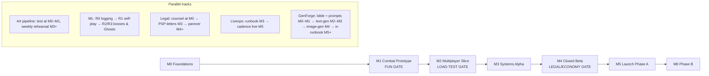

# 31 — Roadmap & Risk Register

> Part of the Dragon Heroes document set. Canon: [00-canon.md](../00-canon.md). Status: v0.1 draft, 2026-07-07.

## Purpose

This document sequences Dragon Heroes from empty repository to Phase B (Pix cash-out) as a chain of milestones with explicit exit gates, and records the top project risks with owners and mitigations. It deliberately contains **no calendar dates**: team size and composition are an open question (canon §12.6), so any date would be fiction. Instead, each milestone carries a relative effort estimate and a gate that must be objectively passed before the next milestone's spend begins. The ordering itself is the main decision this document encodes — legal posture and the simulation core are front-loaded because they are the two things that cannot be retrofitted later (see [Sequencing rationale](#sequencing-rationale)).

## How to read this roadmap

- **Milestones (M0–M6)** are strictly sequenced on the critical path. A milestone is *done* when its exit gate passes, not when its features are merged.
- **Relative effort** is expressed in units where M0 = 1.0×. These are planning weights, not promises — all values **(proposal)**.
- **Parallel tracks** (art, ML, legal, liveops) run alongside the mainline and have their own checkpoints pinned to milestones.
- **Exit gates** are pass/fail. A failed gate stops scaling, not the project: each gate names its fallback.

## Milestones

### M0 — Foundations (relative effort 1.0×)

Everything in M0 exists to make every later milestone cheaper and honest. Scope:

- **Repo scaffold** exactly per canon §10: `sim/` C++20 CMake workspace with the eight libraries, `game/` Godot 4.6+ project, `content/`, `backend/`, `web/`, `ml/`, `art/`, `tools/`, `infra/` — with the coupling rules enforced by CI lint (e.g. `sim/` may not import Godot outside `dh-godot`). See [architecture overview](../tech/20-architecture-overview.md).
- **`dh-sim` skeleton + benchmark harness.** Fixed-tick 30 Hz loop, struct-of-arrays entity store, own 2D hitbox math, seeded RNG — and a benchmark binary in `tools/` that proves the entity-count budget (hundreds of creatures + projectiles per zone tick within frame budget) on target server hardware. This validates the [simulation core](../tech/21-simulation-core.md) design *and* the RL compute math, which assumes a fast headless sim ([PufferLib-class throughput depends entirely on sim speed](https://github.com/PufferAI/PufferLib)).
- **Content schema v1 + validation CI.** JSON Schemas for the first content types (item, creature, skill, AI profile) in `content/schemas/`, validated on every commit per the [content pipeline](../tech/23-content-pipeline.md).
- **Godot client shell** rendering replicated sim state through `dh-godot` — no gameplay in GDScript, per coupling rule 2.
- **Replay logging from the first runnable build.** Server-side obs+action logging is a canonical requirement (canon §9); it is nearly free now and unlocks behavioral cloning, Champion Ghosts, and cheat forensics later ([rl-creature-ai digest](https://puffer.ai/)).

**Exit gate:** benchmark harness demonstrates the per-zone entity budget with ≥2× headroom (proposal) on a single core-equivalent; schema CI red/green works; client shell renders a moving sim entity; a replay file round-trips through a deterministic re-run. **Fallback:** if the budget fails, fix the sim architecture *now* — this is the cheapest moment it will ever be.

### M1 — Combat Prototype (relative effort 1.5×) — THE FUN GATE

One biome slice (Everbloom Wilds), **one class** (Reaver proposed — melee is the harshest test of game feel **(proposal)**), creature packs of 3–8 with **one Elite boss**, running **local single-player** (client embedding `dh-sim` directly, no netcode). Combat feel per [11-combat-and-controls](../design/11-combat-and-controls.md); creatures per [13-creatures-and-bestiary](../design/13-creatures-and-bestiary.md).

This is the project's most important gate. Everything downstream — netcode, marketplace, RL, weekly drops — is worthless if the moment-to-moment hunt is not fun. We validate with external playtesters **before scaling**, not after.

**Exit gate:** structured playtests with ≥10 external players (proposal); a pre-agreed fun bar (session length, willingness-to-return, qualitative feel notes) is met, and the Elite boss fight is rated genuinely hard-but-fair. **Fallback:** iterate inside M1 as long as it takes; if the core loop cannot be made fun, the honest options are pivot or stop — no further milestone spends until this passes.

### M2 — Multiplayer Vertical Slice (relative effort 2.0×) — THE LOAD-TEST GATE

- `dh-server` headless zone binary + **custom netcode** per canon §6: raw ENet/UDP, 20 Hz delta snapshots, prediction/reconciliation, 300 ms lag-compensation history, spatial-hash AOI. Never Godot's high-level multiplayer for combat — [CipSoft's Godot MMO demo collapsed at 80–100 connections on the stock API](https://forum.godotengine.org/t/our-experience-building-an-mmo-tech-demo-with-godot-4-4-1-net-c/134348).
- **4-player co-op Hunt** on the M1 slice.
- **Agones dev cluster** (sa-east-1 / southamerica-east1) with the orchestration abstraction from day one; server as plain Docker container.
- **Headless-bot load test** proving **50–80 CCU per zone** with real snapshot traffic, measured **from Brazilian residential ISPs** against the São Paulo region — the exit gate defined in [netcode & hosting](../tech/22-netcode-and-server-hosting.md).

**Exit gate:** load test passes at target CCU with bandwidth-per-player and tick-time within the budgets set in tech/22; co-op Hunt is playable at 60–100 ms simulated RTT without feel regression vs M1. **Fallback:** lower the CCU/zone target and shrink zones (the zone abstraction makes this a config change, not a redesign).

### M3 — Systems Alpha (relative effort 3.0×)

The game becomes *the game*:

- **Infinite procgen world + delta persistence** with generator versioning, per [24-procedural-world-generation](../tech/24-procedural-world-generation.md).
- **Full item/affix system** with the hard power cap, per [14-items-loot-and-affixes](../design/14-items-loot-and-affixes.md).
- **All 6 classes** per [10-classes-and-progression](../design/10-classes-and-progression.md).
- **1v1 PvP** (first Trophies ladder), per [16-pvp-and-tournaments](../design/16-pvp-and-tournaments.md).
- **Closed playtests** at increasing scale on the Agones cluster.
- **Weekly-drop rehearsal:** the art + content pipeline produces a real internal drop *every week* through M3 — schema-validated data pack, PCK patch, server activation — as a dress rehearsal for the launch cadence, per [23-content-pipeline](../tech/23-content-pipeline.md) and [17-art-direction](../design/17-art-direction.md).

**Exit gate:** closed-playtest cohort retention against pre-agreed bar; ≥6 consecutive internal weekly drops shipped on schedule without a client rebuild (proposal); persistence survives generator-version upgrade with no world corruption. **Fallback:** if cadence rehearsal fails, fix tooling before M4 — launch cadence is not negotiable later.

### M4 — Closed Beta (relative effort 3.0×)

The riskiest integrations land together, deliberately before launch:

- **Economy Phase A:** closed-loop marketplace as a **web-only surface**, PSP integration (Asaas primary per canon §8), escrow/subaccounts, seller KYC, the Go economy core as sole writer of money/item state, per [15-economy-and-marketplace](../design/15-economy-and-marketplace.md) and [26-backend-and-services](../tech/26-backend-and-services.md).
- **Tournaments v1:** weekly solo tournaments on Nakama's tournaments API, prize pools accruing (payouts only after legal sign-off).
- **Mobile clients + cross-play** (Android, iOS), input-segregated ranked queues.
- **Security hardening:** economy chaos tests (dupe races, idempotency violations, handoff double-saves — the failure classes behind the [OSRS 2024 dupe rollback](https://oldschool.runescape.wiki/w/Rollback)), external penetration test, kill switches for every wealth-transfer vector, per [27-security](../tech/27-security-anticheat-and-economy-integrity.md).
- **ECA-grade age verification live:** CPF/document-grade 18+ gate, mandatory under [Lei 15.211/2025](https://www.gov.br/planalto/pt-br/acompanhe-o-planalto/noticias/2026/03/governo-do-brasil-regulamenta-o-eca-digital-novo-marco-na-protecao-de-criancas-e-adolescentes-na-internet) before any gameplay session (and therefore before any real-money flow) — canon §1 gates play itself, not just the marketplace — per [30-legal-payments-compliance](30-legal-payments-compliance.md).

**Exit gate:** zero unresolved criticals from pentest and chaos tests; nightly reconciliation runs clean for 30 consecutive days (proposal); age verification and drop-probability disclosure live; marketplace beta shows players still primarily *play* for items (anti-D3 telemetry bar, defined in design/15). **Fallback:** launch can proceed with the marketplace dark (feature-flagged off) — the game must be launchable without it.

### M5 — Launch, Phase A (relative effort 1.5× to reach, then steady-state)

Public launch with the closed-loop economy: weekly drop cadence live on the rehearsed pipeline, weekly tournaments with fee-funded prize pools (30% IRRF withholding on cash prizes via PSP rails), kill switches and the incident playbook **rehearsed via game-day drills before launch day**, liveops on-call rotation staffed.

**Exit gate (into steady-state):** first 4 public weekly drops ship on time; first tournament pays out cleanly through KYC'd rails; no Sev-1 economy incident unresolved. A **banked buffer of 4 finished weekly drops (proposal)** exists at launch and is maintained.

### M6 — Phase B (relative effort 2.0×, partially parallel with M5 steady-state)

- **Pix cash-out**, enabled **only after** the formal parecer from a Brazilian gaming-law firm and proven KYC/AML controls (canon §2/§8, gate criteria are canon open question 5).
- **Champion Ghosts RL pipeline:** BC-pretrain on tournament winners' replays (collected since M1), RL fine-tune with KL penalty, ToS consent + champion revenue share, per [25-creature-ai-and-rl](../tech/25-creature-ai-and-rl.md).
- **RL bosses** for Elite/Legendary encounters, served as ONNX INT8 on server CPU, behind automated eval gates.

**Exit gate:** parecer delivered and its conditions implemented; first cash-outs settle to verified holders' own Pix keys; first RL boss and first Champion Ghost pass eval gates and player-perception tests. **Fallback:** Phase A is a complete, indefinitely viable business; Phase B ships only when the gates pass.

## Parallel tracks

| Track | M0 | M1 | M2 | M3 | M4 | M5 | M6 |
|---|---|---|---|---|---|---|---|
| **Art pipeline** | Art test of 3 authoring styles (hand-drawn / Spine stepped-keys / Dead-Cells-style 3D bake) on one archetype — all candidates bake through the canonical Aseprite/atlas pipeline, per [17-art-direction](../design/17-art-direction.md) | Pick authoring style; gen-AI curated pipeline stood up (style-locked models, palette enforcement, disclosure posture — [17-art-direction §5](../design/17-art-direction.md)); first rig | Rigs 2–3 | 6 launch rigs; weekly internal drops | Launch content complete | Weekly drops live | New archetypes |
| **ML** | Replay-log format built | **R0:** real playtest replays collected | **R1:** self-play experiments on `dh-env` | R1 continues; eval-gate harness | Bot QA on drops (exploit-finding) | — | **R2/R3:** RL bosses + Champion Ghosts live |
| **Legal** | **Engage counsel**; confirm 18+ posture | Monitor ECA/ANPD rules | PSP conversations open | **PSP written confirmations** that game-item RMT is accepted | **Parecer drafted**; LGPD DPIA; DPO appointed | Compliance ops live | Parecer final → cash-out |
| **Liveops** | CI/CD skeleton | — | Agones runbook v0 | **Weekly-drop runbook rehearsed** | Kill-switch drills; on-call defined | Cadence + incident playbook live | Cash-out monitoring |
| **GenForge** | World bible v0 + season-theme schema + prompt templates — no models yet, per [28-generation-service](../tech/28-generation-service.md) | Bible + prompt templates iterated against M1 content; still no models | First text-gen JSON candidates (schema-constrained), validated by the existing [content gauntlet](../tech/23-content-pipeline.md) | Text-gen candidates assist the internal weekly-drop rehearsal | Image-gen sprite candidates through the style-locked pipeline ([17 §5](../design/17-art-direction.md)), once the art test has picked the pipeline | **Fully in the weekly runbook**, behind the curation gates | Steady state; season themes feed drops |

The ML track is deliberately **off the launch critical path**: launch needs BT/utility AI only (canon §9); RL is an M6 deliverable, so its novel risks cannot delay M0–M5.

## Team-shape assumptions (open question)

Minimum viable team assumed by the effort weights above: **1 systems programmer (C++: sim/netcode/procgen), 1 gameplay engineer (Godot/GDScript presentation + tools), 1 backend engineer (Go/Nakama/infra), 1 pixel artist, 1 designer** — with producer/QA/legal shared or contracted. M4 additionally needs contracted security (pentest) and a web developer for the marketplace surface. If the team today is GDScript-only, **hiring the C++ systems role precedes M1** (canon §12.6). All milestone parallelism scales with headcount; the *sequence and gates do not change*.

## Risk register (top 10)

| # | Risk | Likelihood | Impact | Mitigation | Owner |
|---|---|---|---|---|---|
| 1 | **Legal reclassification of cash-out** as unlicensed gambling/betting ([Lei 14.790/2023](https://www.gov.br/fazenda/pt-br/composicao/orgaos/secretaria-de-premios-e-apostas/apostas-de-quota-fixa), art. 50 LCP, [TJDFT June 2026 rulings](https://www.tjdft.jus.br/institucional/imprensa/noticias/2026/junho/justica-condena-empresa-de-jogos-eletronicos-por-pratica-abusiva-com-criancas-e-adolescentes-em-recompensas-pagas)) | Medium | **Existential** | No paid randomness anywhere, ever; 18+ CPF-grade gate; phased cash-out with parecer as hard gate; counsel engaged at M0; Phase A viable indefinitely without cash-out | Ricardo + counsel |
| 2 | **Economy design failure** — D3 RMAH pattern: [buying beats playing, loot loop inverts](https://www.gamespot.com/articles/ten-years-later-lessons-from-diablo-iiis-auction-house-disaster-have-not-been-remembered/1100-6503489/) | Medium | Critical | Hard power cap; BiS reachable by play; marketplace-as-accelerator telemetry bar at M4 gate; marketplace can stay dark at launch | Design lead |
| 3 | **Godot netcode at scale unproven at this profile** — no shipped comparable; stock API fails at [40–100 CCU](https://forum.godotengine.org/t/our-experience-building-an-mmo-tech-demo-with-godot-4-4-1-net-c/134348) | Medium | High | Custom C++ netcode per canon §6; M2 headless-bot load-test gate from Brazilian ISPs; fallback = smaller zones/lower CCU target | Systems eng |
| 4 | **Weekly RL retraining publicly undemonstrated** — nobody has shipped weekly-cadence live bot retraining ([OpenAI Five "surgery" is the closest precedent](https://cdn.openai.com/dota-2.pdf)) | High | Medium | RL off launch critical path (M6); embedding-row obs schema; warm-start fine-tunes; automated eval gate; ship BT-only bosses if it fails | ML eng |
| 5 | **Hosting vendor risk** — [Hathora shut down May 2026 and stranded shipped games](https://www.gamedeveloper.com/business/stormgate-rushing-offline-mode-after-losing-server-access-to-an-ai-company) | Medium | High | Plain Docker containers; thin orchestration abstraction; Agones (self-managed) primary + Edgegap burst; migration tested | Backend eng |
| 6 | **PSP refuses the RMT vertical** — some PSPs classify game-item RMT as high-risk/gambling-adjacent | Medium | High | Written confirmations from Asaas + one alternate **during M3**, before M4 builds against one; shortlist of three (Asaas, OpenPix/Woovi, Efí) | Producer + counsel |
| 7 | **Scope** — this doc set describes a big game | High | High | Named cuttable scope, in cut order: **guild features → Gloomfall** can each slip past launch without breaking the core loop or economy. Pets are **not** cuttable scope: canon §3 makes perfect-roll pets a core marketplace chase asset, so cutting them would require a canon revision from Ricardo *and* would remove a marketplace-value pillar. Gates stop spend early | Producer |
| 8 | **Team/hiring risk on the C++ + Godot split** — the plan assumes a strong systems programmer | Medium | High | Hire before M1; M0 benchmark harness doubles as the hiring test; a deep C++ gamedev talent pool exists; GDScript-only fallback is *not* viable per tech/21 | Ricardo |
| 9 | **Mobile cross-play doubles the surface area** (input fairness, stores, patching, QA) | High | Medium | Input-segregated ranked queues (canon §1); marketplace web-only by design; data-only drops on mobile; mobile lands at M4 with full beta cycle | Gameplay eng |
| 10 | **Content cadence sustainability** — weekly is relentless for a small team | High | High | Cadence *rehearsed* at M3 with ≥6 internal weekly drops as a gate; 4-drop banked buffer at launch (proposal); archetype-rig + palette-LUT pipeline keeps per-drop art cost low | Producer + art |

## Sequencing rationale

Two decisions are front-loaded because they cannot be retrofitted, and everything else is ordered to protect them:

1. **Legal posture (M0 legal track).** The monetization hard rules — no paid randomness, 18+ verification, phased cash-out, studio never touching funds — must shape the economy, the rating, the marketplace surface, and even itemization *before* any of those systems are built. Discovering at beta that the model reads as unlicensed gambling means rebuilding the business, not patching it. Counsel is therefore engaged at M0, PSP acceptance is confirmed in writing at M3 before we build against a provider, and the parecer is drafted during M4 so Phase B is a switch-flip, not a scramble.
2. **The simulation core (M0 mainline).** `dh-sim` as a pure, fast, headless C++ library is the single decision that makes server authority, the RL training environment, replays, and the entity budget all possible at once. If it were built inside Godot nodes "temporarily," every later milestone — netcode (M2), load test gate, RL (M6) — would demand a rewrite. The M0 benchmark harness exists to prove this foundation before anything is stacked on it.

Everything else follows from gate economics: the **fun gate (M1)** comes before multiplayer because netcode cannot fix an unfun game; the **load-test gate (M2)** comes before world-scale systems because zone capacity determines world architecture; the **cadence rehearsal (M3)** comes before the beta because a live game that misses its weekly drops dies quietly; and the **economy/security gate (M4)** comes last before launch because real money is the one system where the first production failure can be terminal.

## Open questions (for Ricardo)

1. **Team commitment:** confirm the minimum-viable five-role team (C++ systems, Godot gameplay, Go backend, pixel artist, designer) as the M0 hiring target, or state the actual headcount so effort weights can be recalibrated (canon §12.6).
2. **Fun-gate authority and bar:** who holds kill/pivot authority at the M1 gate, and do you accept the proposed bar (≥10 external playtesters, pre-agreed session-length/return-intent thresholds) as binding?
3. **Cut order:** confirm the cuttable-scope priority — guilds first, then Gloomfall — or reorder it now, so mid-project cuts are execution rather than debate. Pets are off the cut list (canon §3 marketplace chase asset); putting them back requires a canon revision.
4. **External spend envelope for M4:** approve budget lines for the external pentest, the parecer, PSP onboarding, and an ECA-grade age-verification provider (the four unavoidable third-party costs).
5. **Launch buffer:** is a banked buffer of 4 finished weekly drops (proposal) at M5 sufficient, or do you want 6–8 given risk #10?
6. **Phase B commitment:** is M6 a committed roadmap item or contingent on Phase A economics? Please define the Phase A→B go/no-go criteria (this is also canon open decision 5).
7. **Cross-play at launch:** canon fixes cross-play from day 1, which makes mobile a launch blocker inside M4. If mobile slips there, do we slip the launch, or is a PC-first launch with mobile fast-follow an acceptable canon revision?

## Sources

- [CipSoft — Godot 4.4.1 MMO tech demo post-mortem (high-level API collapse at 80–100 CCU)](https://forum.godotengine.org/t/our-experience-building-an-mmo-tech-demo-with-godot-4-4-1-net-c/134348)
- [Game Developer — Stormgate stranded by Hathora shutdown after Fireworks AI acquisition (May 2026)](https://www.gamedeveloper.com/business/stormgate-rushing-offline-mode-after-losing-server-access-to-an-ai-company)
- [TJDFT — June 2026 loot-box condemnations press release](https://www.tjdft.jus.br/institucional/imprensa/noticias/2026/junho/justica-condena-empresa-de-jogos-eletronicos-por-pratica-abusiva-com-criancas-e-adolescentes-em-recompensas-pagas)
- [Planalto — ECA Digital regulation (Lei 15.211/2025, in force March 2026)](https://www.gov.br/planalto/pt-br/acompanhe-o-planalto/noticias/2026/03/governo-do-brasil-regulamenta-o-eca-digital-novo-marco-na-protecao-de-criancas-e-adolescentes-na-internet)
- [SPA/Ministério da Fazenda — Lei 14.790/2023 fixed-odds betting regime](https://www.gov.br/fazenda/pt-br/composicao/orgaos/secretaria-de-premios-e-apostas/apostas-de-quota-fixa)
- [GameSpot — Lessons from Diablo III's real-money auction house](https://www.gamespot.com/articles/ten-years-later-lessons-from-diablo-iiis-auction-house-disaster-have-not-been-remembered/1100-6503489/)
- [OpenAI — Dota 2 with Large-Scale Deep RL (policy "surgery" across patches)](https://cdn.openai.com/dota-2.pdf)
- [PufferLib — high-throughput RL training (GitHub)](https://github.com/PufferAI/PufferLib) and [Puffer.ai](https://puffer.ai/)
- [OSRS Wiki — October 2024 dupe: trade lockdown and rollback](https://oldschool.runescape.wiki/w/Rollback)
