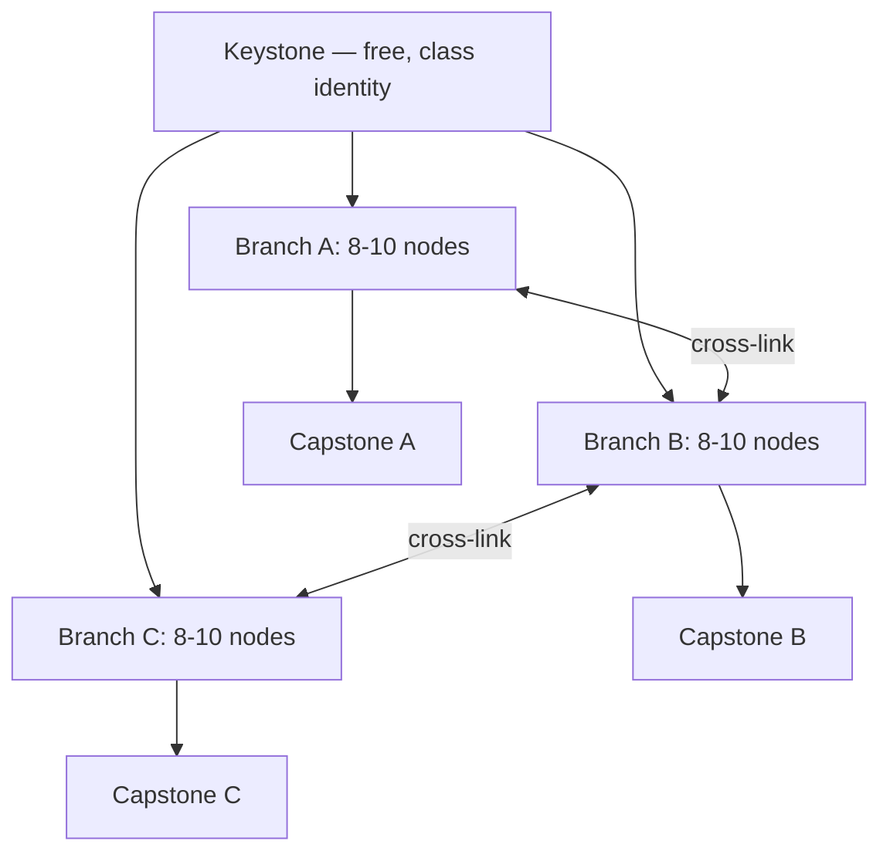

# 10 — Classes & Progression

> **Status:** v0.1 draft — 2026-07-07. Subordinate to [the canon](../00-canon.md)
> (v0.2.1, 2026-07-08); every
> number below marked **(proposal)** is a starting value for playtesting, everything
> unmarked restates a canonical decision.

## Purpose

This document defines how a Dragon Heroes character is built and how it grows: the single
base rig that every class layers onto, the shared attribute web, leveling pace to the
level-60 cap, the six launch classes with their fantasies and resource mechanics, the
~30-node skill trees, the 6-active/3-passive loadout, and how the creature-derived layers
(Pets, Bestial Skills, Spirit Essences) turn a class into a build. It also specifies what
a class *is* as data, so that shipping class number seven is a weekly content drop and not
an engineering project. Combat execution of these skills is specified in
[combat & controls](./11-combat-and-controls.md); the data pipeline that delivers them is
in [content pipeline](../tech/23-content-pipeline.md).

## One body, many heroes: the base character model

Canon: there is **one androgynous humanoid base rig**, and all classes, gear visuals, and
combat animations layer onto it. This is a production decision before it is an aesthetic
one, and it buys us four things:

1. **Weekly content is cheap where it must be cheap.** A new skill is a data definition
   referencing shared animation/behavior primitives already baked onto the base rig (see
   [art direction](./17-art-direction.md) for the primitive animation set). We never
   block a weekly drop on six class-specific animation passes.
2. **Server hitboxes come for free.** Per the [art pipeline canon](../00-canon.md), the
   Aseprite-exported per-frame JSON is the single source of truth for both client frames
   and server hitboxes. One rig means one hitbox timing table to keep honest in
   [dh-sim](../tech/21-simulation-core.md), which matters for a 30 Hz authoritative sim.
3. **Gear reads as gear.** Because the body is constant, silhouette changes always mean
   equipment, which keeps PvP readability high — critical for
   [Gloomfall and ranked](./16-pvp-and-tournaments.md).
4. **Classes are costumes over verbs, not bodies.** A class recolors and re-dresses the
   rig (palette-LUT shader, layered equipment sprites) and selects which primitives its
   skills invoke. Adding a class touches `content/`, never `art/` rig work.

The trade-off is accepted and explicit: no playable non-humanoid classes at launch, and
class visual identity must be carried by gear sets, VFX, and stance/idle variants rather
than unique body types.

## The shared attribute web

All six classes spend points on the same five attributes: **Might, Agility, Intellect,
Vitality, Willpower**. Canon grants **5 attribute points per level (proposal)** against a
**level cap of 60 (proposal)** — 295 lifetime points. Attributes are deliberately
class-agnostic: each one does the same thing for everyone, and each one does *something*
for everyone. There are no dump stats, only leanings.

| Attribute | Effect per point (all classes, proposal) | Fantasy |
|---|---|---|
| **Might** | +1% physical skill damage; +0.5 poise damage (stagger buildup dealt) | Raw force |
| **Agility** | +0.4% attack/cast speed; +0.15% move speed; +0.1% critical chance | Speed and precision |
| **Intellect** | +1% non-Physical skill damage (all six of the canonical Fire/Frost/Storm/Venom/Umbral/Blood types); +0.4% cooldown recovery rate | Arcane mastery |
| **Vitality** | +6 max HP; +0.2 HP/s out-of-combat regeneration; +0.5 armor (Physical mitigation) | Endurance |
| **Willpower** | +1% class resource pool and generation; +0.5% status/curse resistance; +0.3% resistance to the six non-Physical damage types (Fire/Frost/Storm/Venom/Umbral/Blood) | Inner fire |

Attack-speed and cooldown-recovery totals are hard-capped (**+40% each, proposal**) so
attribute stacking can never outrun animation budgets or the
[global power cap](./14-items-loot-and-affixes.md). Every value above is server-readable
balance data (canon §7): retuning an attribute is a hotfix, not a client patch.

This table is the owning definition of the attribute → armor/resistances mapping cited
by [combat & controls](./11-combat-and-controls.md) §3.2: **Vitality** contributes armor
(Physical mitigation) and **Willpower** contributes resistances to the six non-Physical
damage types plus status/curse resistance **(proposal)**. Attribute-derived armor and
resistances stack additively with gear-sourced armor/resists from
[items & affixes](./14-items-loot-and-affixes.md); neither source is exclusive.

Class leanings emerge from which damage tags a class's skills carry, not from special
rules. Expected primary/secondary leanings: Warden — Vitality/Might; Reaver —
Might/Agility; Hunter — Agility/Might; Occultist — Intellect/Willpower; Elementalist —
Intellect/Agility; Ritualist — Willpower/Vitality. A Reaver still wants Willpower (Fury
pool, curse resistance); an Elementalist still wants Vitality (Gloomfall survival). The
web rewards committed builds without punishing hybrids.

## Leveling to cap and pacing philosophy

- **Cap:** level 60 (proposal). **Target time-to-cap:** 35–50 hours of Hunt play for a
  focused player (proposal), with the curve front-loaded: roughly level 20 in the first
  three hours, 40 by hour fifteen, then a long tail.
- **Levels are the tutorial, the cap is the game.** Leveling paces the drip of skill
  points, attribute points, and biome difficulty; it is not the endgame treadmill. Per
  canon, there is a hard power cap and the meta stays fresh through *diversity* — new
  bases, affixes, Bestial Skills, Spirit Essences — never power inflation. The level cap
  will not rise with weekly drops.
- **Alts are first-class citizens.** Because weekly drops shift the meta, we want
  re-rolling a new class to be attractive: account-wide stash, and a **+50% XP catch-up
  bonus (proposal)** for characters below the account's highest level.
- **XP sources:** creature kills (scaled by [tier and rarity](./13-creatures-and-bestiary.md)),
  first-discovery of POIs, and Hunt objectives (see
  [world & biomes](./12-world-and-biomes.md)). No XP from PvP — Trophies and Glory are
  the PvP rewards (canon §5).

## The six launch classes

Canon fixes the six launch classes and their roles. Resource mechanics and signature
skills below are design proposals; each resource is a distinct verb so the classes *feel*
different in the hands, not just in the spreadsheet. All resources are simulated
server-side in `dh-sim` and predicted client-side like any other state
([netcode](../tech/22-netcode-and-server-hosting.md)).

| Class | Role (canon) | Resource (proposal) | One-line feel |
|---|---|---|---|
| Warden | Bulwark / control | Resolve | Immovable anchor who decides where the fight happens |
| Reaver | Melee damage | Fury | Reckless momentum, always one hit from a bigger hit |
| Hunter | Ranged physical | Focus | Patient marksman who wins by positioning |
| Occultist | Curses / summons | Dread | Slow strangulation through debuffs and minions |
| Elementalist | Burst caster | Flux | Glass cannon juggling elemental rotation |
| Ritualist | Support / blood magic | Vitae | Life itself as a currency, spent on allies |

### Warden — the bulwark

**Fantasy:** the last wall between the pack and the party. **Feel:** deliberate, heavy,
reads the fight two seconds ahead. **Resource — Resolve:** builds when the Warden blocks,
is struck, or lands melee hits; decays slowly; spent on control skills. Tanks generate
their currency by tanking. **Signature skills:** *Shield Rampart* (deployable arc wall
with its own HP that bodies projectiles), *Seismic Slam* (Resolve dump — AoE stagger in a
swept arc), *Chains of the Deep* (pull-and-root up to 3 targets to a point), *Unbreakable*
(brief self-invulnerability that taunts everything in radius — the "I've got this" button).

### Reaver — the edge of the knife

**Fantasy:** a whirlwind of steel that gets stronger the deeper it cuts. **Feel:** fast,
committal, rewards staying in melee when instinct says leave. **Resource — Fury:** builds
per melee hit taken or dealt, drains rapidly out of combat; big spenders want a full bar.
**Signature skills:** *Rend* (cleave applying stacking bleed), *Blood Rush* (dash through
enemies, damaging along the line — mobility and damage in one verb), *Executioner's Arc*
(full-Fury finisher, damage scaling with Fury consumed), *Frenzy* (active buff: attack
speed per current bleed stacks on nearby enemies).

### Hunter — the patient death

**Fantasy:** the apex predator of the Hunt itself. **Feel:** kiting, spacing, trap
geometry; deadly when planted, vulnerable when caught. **Resource — Focus:** regenerates
while not sprinting and drains per skill shot; standing ground is rewarded mechanically.
**Signature skills:** *Piercing Shot* (line projectile through all targets), *Trap-line*
(place up to 3 linked snares that root and reveal), *Vault* (backwards evade that reloads
a free instant shot), *Marked Quarry* (single-target mark: party damage amplified, target
revealed through AOI fog).

### Occultist — the slow strangler

**Fantasy:** everything dies eventually; the Occultist just schedules it. **Feel:**
indirect, managerial — curses tick, minions tank, the Occultist repositions. **Resource —
Dread:** generated by curse ticks and by minion kills; spent to summon and to detonate.
**Signature skills:** *Withering Curse* (DoT that jumps to a nearby enemy on death — the
pack-clearing engine against canonical 3–8 packs), *Summon Gravewretch* (persistent melee
minion, one concurrent per cast slot), *Soul Harvest* (consume all curses in radius for
burst damage and Dread refund), *Hex of Misfortune* (cursed enemies deal reduced damage
and cannot crit).

### Elementalist — the burst window

**Fantasy:** raw elemental violence, briefly and gloriously. **Feel:** rotation and
timing; huge numbers behind real wind-ups. **Resource — Flux:** a regenerating pool;
casting the same element twice in a row costs +50% (proposal), so optimal play rotates
**Fire/Frost/Storm** — the Elementalist's three of the seven canonical damage types
(canon §4) — the combo system is the resource. **Signature skills:** *Emberlance*
(fast fire bolt, ignites), *Glacial Bloom* (freeze nova around self — the panic button
that is also a setup), *Stormcall* (delayed lightning AoE on a marked zone), *Flux Surge*
(dump all Flux: next skill is free, instant, and amplified per Flux spent).

### Ritualist — the blood price

**Fantasy:** magic that always costs someone something. **Feel:** resource triage under
pressure; the strongest support in the game and its own worst enemy. **Resource — Vitae:**
built by sacrificing own HP (*Crimson Tithe* passive drip while channeling) and by
draining enemies; spent on heals, links, and zones. **Signature skills:** *Bloodbond*
(link to an ally: redirect 30% of their damage taken to the Ritualist), *Crimson Tithe*
(sacrifice HP to emit an AoE heal over time), *Ritual Circle* (ground zone: allies inside
gain lifesteal), *Exsanguinate* (channel drain — damage an enemy, restore Vitae and HP).
Solo viability comes from Exsanguinate sustain plus a Pet as Bloodbond target — support
classes must not require a party in a 1–4-player Hunt.

## Skill trees: ~30 nodes per class

Each class ships a tree of **~30 nodes (proposal, canon)**. Shape and economy:

- **Shape:** one free **keystone** (the class identity passive, granted at creation),
  three thematic **branches** of 8–10 nodes each, with **2–3 cross-links (proposal)**
  between branches at mid-depth so hybrid paths exist, and one **capstone** per branch.
  Example — Warden branches: *Bastion* (block/survival), *Warbreaker* (stagger/offense),
  *Chainwright* (control/utility).
- **Node types:** **actives** (~10 per tree) unlock a castable skill; **passives** (~12)
  unlock an equippable always-on effect; **modifiers** (~8) permanently alter one
  specific active the player has unlocked (e.g. *Rend* modifier: "bleeds spread on
  crit"). Modifiers are where weekly drops most often add depth — a new modifier node
  for an old skill re-opens a solved build.
- **Point economy (proposal):** 1 skill point per level (59 at cap). Node costs: active
  3, passive 2, modifier 2 — a full tree costs ~70 points, so a capped character
  allocates roughly 85% of the tree. The remainder forces identity choices without
  being punitive, because respec friction is low (below).

## Loadout: 6 actives + 3 passives

Canon fixes the loadout at **6 active skill slots + 3 passive slots (proposal)**. The
constraint is the buildcraft: a capped character *knows* ~10 class actives plus any
looted Bestial Skills, but *carries* six. Unlocking is permanent; equipping is the
decision. The count is also a cross-play decision — six actives is the honest ceiling for
touch controls, and identical slot counts across input classes keeps the input-segregated
ranked split (canon §1) about execution, not capability. Loadouts can be saved as named
presets and swapped freely out of combat (**3 preset slots, proposal**); passives are
chosen from unlocked passive nodes the same way. In ranked PvP the same loadout passes
through the per-slot power budget defined in [PvP & tournaments](./16-pvp-and-tournaments.md).

## Beyond class: Pets, Bestial Skills, Spirit Essences

The three creature-derived layers (canonical names, detailed in
[creatures & bestiary](./13-creatures-and-bestiary.md)) are what make two Reavers play
differently, and they are the progression surface that weekly drops feed forever:

- **Bestial Skills** are looted skill stones socketable into **any of the 6 active
  slots (proposal)**, competing directly with class actives. A Warden running a looted
  wing-buffet knockback in slot 6 is a different Warden. Bestial Skills scale from the
  same attribute web via their damage tags, so they slot into any class's stat spread.
- **Pets** occupy the **companion slot (1 active pet, proposal)** — outside the 6+3
  loadout. Pets bring their own skills and AI profile; classes interact through tags
  (an Occultist's minion passives that read "your summons" include the Pet **(proposal)**).
  Each pet *instance* rolls random attributes and a random skill set drawn from its
  creature family's pool — sparse family-shared skills plus species-signature skills —
  and is fully tradable; roll mechanics are specified in
  [creatures & bestiary](./13-creatures-and-bestiary.md) §7.1.
- **Spirit Essences** are enchantment materials socketed into gear
  ([items & affixes](./14-items-loot-and-affixes.md)), bending stats and adding
  triggered effects — the fine-tuning layer after class, tree, and loadout are set.

Build identity is therefore a five-layer stack — class tree, attribute web, 6+3 loadout,
companion, essence-enchanted gear — and only the first layer is fixed at character
creation. All five stay under the global power cap; layers add *options*, not multipliers
past it.

## Respec rules (proposal — friction stays low)

The meta must shift weekly (canon §4), so builds must be clay, not stone. Everything
below is proposal:

- **Loadout swaps** (actives, passives, Pet, presets): free, anywhere out of combat.
- **Skill tree:** refund any node for a trivial Gold fee (scaling with level, never with
  repetition) at any sanctuary; one free full-tree reset per weekly drop, granted to
  every character when the drop activates.
- **Attribute web:** same rules as the tree — per-point refunds for small Gold, full
  reset rides the same weekly free-reset grant.
- **No paid respecs, ever.** Respec convenience touching real money would sell power
  adjacency and violates canon §2 in spirit. Gold fees exist only as a mild sink
  coordinated with [economy](./15-economy-and-marketplace.md), not as friction.

## A new class is a content drop

Canon: classes are pure data + skill trees; adding one is a content drop, not an engine
change. A class definition in `content/*/classes/` (e.g. `2027-w03.class.dragoon`)
contains, validated by JSON Schema in CI ([content pipeline](../tech/23-content-pipeline.md)):

| Field group | Contents |
|---|---|
| Identity | Stable ID, localization keys, fantasy strings, UI icon/palette refs |
| Base stats | Starting HP/resource, per-level baselines, attribute-tag scaling coefficients |
| Resource | Reference to a resource behavior primitive (build/decay/spend rules as parameters) |
| Skill tree | Graph of ~30 nodes: costs, prerequisites, cross-links; node → skill/passive/modifier IDs |
| Skills | Skill definitions referencing shared animation/behavior primitives on the base rig |
| Visuals | Gear-set visual layers, VFX refs, stance/idle variant tags (client-side only) |
| AI hooks | Content-ID embedding registration so bots and Champion Ghosts can read the new skills ([creature AI & RL](../tech/25-creature-ai-and-rl.md)) |

The hard constraint is the **primitive vocabulary**: resource behaviors, skill behaviors
(projectile, sweep, dash, channel, summon, zone…), and rig animations must be rich enough
in `dh-sim` and the base rig that a designer composes a novel class without new code —
because iOS forbids downloaded code (canon §1) and `game/` contains zero gameplay rules
(canon §10). Growing that vocabulary is engine work planned per the
[roadmap](../business/31-roadmap.md); spending from it is a data drop.

## Multiclassing: out of scope at launch (proposal)

No multiclassing, subclassing, or cross-class tree access at launch **(proposal)**. The
role it would serve — build expression beyond one tree — is already covered by Bestial
Skills, Pets, and Spirit Essences, which are also the layers weekly drops feed. Six
resource mechanics that cleanly compose pairwise is a combinatorial balance and UX
problem we should not buy before the core meta is stable. The class-as-data design keeps
the door open: a future "second keystone" system would be new schema fields, not a
rewrite. Revisit no earlier than the second season.

## Open questions (for Ricardo)

1. **Time-to-cap:** approve the 35–50 hour target to level 60, or push shorter (~25 h)
   to get players into the weekly meta faster at the cost of leveling as content?
2. **Skill point economy:** confirm "~85% of tree allocatable at cap" (choices persist)
   versus 100% completion (choice lives only in the 6+3 loadout). This changes how
   respec-dependent the weekly meta shift is.
3. **Six bespoke resources:** approve one distinct resource mechanic per class, or unify
   to 2–3 shared mechanics to cut onboarding and balance surface for launch?
4. **Bestial Skill slotting:** confirm they compete for the same 6 active slots
   (proposed), or get 1–2 dedicated slots — dedicated slots guarantee creature-loot
   relevance but weaken the tightness of loadout choices.
5. **Respec sink vs. weekly agility:** confirm near-free respecs with a weekly free full
   reset, accepting that respec Gold is then a negligible sink (the
   [economy doc](./15-economy-and-marketplace.md) must find its sinks elsewhere).
6. **Multiclassing deferral:** confirm out-of-scope at launch, and whether the intended
   post-launch direction is a second-keystone/subclass system (shapes schema design now).
7. **Attribute-derived mitigation:** confirm the proposed Vitality → armor and
   Willpower → non-Physical/status resistance contributions, versus armor/resists coming
   only from gear — this shifts the balance between the attribute web and
   [gear affixes](./14-items-loot-and-affixes.md) and feeds the mitigation formulas in
   [combat & controls](./11-combat-and-controls.md).

## Sources

This document derives entirely from [the canon](../00-canon.md) (v0.2.1, 2026-07-08). No
external sources were used.
