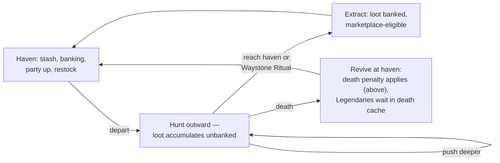

# The Hunt — World & Biomes

> **Status:** v0.2 draft — 2026-07-08. Owner: world design. Conforms to
> [canon](../00-canon.md) v0.2.1 §1 (cross-play, marketplace posture), §4 (world, biomes,
> packs, party size), and §7 (content-as-data). This document **owns the death-penalty
> rules** (§1). All numbers introduced here are marked **(proposal)**.

## Purpose

This document defines the player-facing design of the Hunt, Dragon Heroes' PvE mode: how a play session is structured, how the infinite world is perceived and navigated, the five launch biomes, POI and event design, encounter pacing, and what persists versus regenerates. It is the design counterpart to [procedural world generation](../tech/24-procedural-world-generation.md) (how the world is built) and [netcode and hosting](../tech/22-netcode-and-server-hosting.md) (how it is served). Everything here obeys the [canon](../00-canon.md): infinite seeded chunked world (64×64-tile chunks, 1 tile = 1 m), five launch biomes, packs of 3–8 led by an Elite or Legendary, parties of 1–4, new biomes every 4–6 weeks. Where this document introduces new numbers they are marked **(proposal)**.

---

## 1. Session structure: expedition hunts (proposal)

**Proposal — the Hunt is expedition-based, with a roguelite risk frame.** A session is a loop: you depart from a **haven** (a safe settlement), hunt outward as long as you dare, and must **extract** — physically return to a haven, or complete a return ritual — to **bank** what you found. Loot you carry in the field is *unbanked*; only banked items enter your stash, become enchantable, and become eligible for listing on the [marketplace](15-economy-and-marketplace.md) (which lives on the web account portal, never in the mobile apps, per canon).

**Death penalty (proposal — flagged for Ricardo):** if you die in the field you revive at the nearest kindled haven, and:

- **30% (proposal)** of your unbanked non-Legendary items are destroyed — permanently removed from the game and the economy. The survivors return with you.
- **25% (proposal)** of carried Gold is lost.
- **Legendary drops are never destroyed.** They fall into a **death cache** at the spot you died, recoverable by you (or your party) within the same play session **(proposal)**. Losing a Legendary to RNG would be intolerable in an economy where that item has real-money value; losing everything else must sting.

**These rules are owned here.** This document is the single source for the death penalty; [items, loot and affixes](14-items-loot-and-affixes.md) and [economy integrity](../tech/27-security-anticheat-and-economy-integrity.md) cite this section rather than restating the numbers.

Two justifications, both structural:

1. **A real-money economy needs real item sinks.** Every tradable item that enters the world eventually competes with fresh drops for buyers. Without destruction, supply only accumulates, prices trend to zero, and the loot chase dies — the failure mode behind Diablo 3's real-money auction house, where buying beat playing until Blizzard removed it ([GameSpot retrospective](https://www.gamespot.com/articles/ten-years-later-lessons-from-diablo-iiis-auction-house-disaster-have-not-been-remembered/1100-6503489/)). Death-loss is a sink that scales with play and with greed, complementing the crafting/enchanting sinks in [items and affixes](14-items-loot-and-affixes.md).
2. **Tension is the product.** "One more pack, or turn back?" is the core emotional beat of the Hunt. Extraction pressure converts the danger gradient (§3) from a difficulty dial into a decision the player makes every few minutes.

**Extraction mechanics (proposal):** reaching any kindled haven banks everything instantly. In the field, a hunter may channel a **Waystone Ritual** — 10 s **(proposal)**, interrupted by any damage — to teleport to the nearest kindled haven. The channel is loud and visible: extraction is a moment of vulnerability, not an escape hatch. There is no mid-field banking.

Expeditions are untimed. Unlike a hard-reset roguelite, nothing about your character resets — attributes, skills, and equipped gear persist per [classes and progression](10-classes-and-progression.md). The roguelite frame applies to *loot in transit* only. Equipped gear is never at risk from death **(proposal)**: destroying worn items would push players toward playing naked-cheap, which is the opposite of the loot-chase we want, and gear repair already exists as a Gold sink.

**Session length targets (proposal):** the structure should make a satisfying expedition possible in **15–20 minutes** (Frontier loop — this is the mobile session), a standard one in **30–45 minutes** (Deep Wilds push), and an evening-length one in **90+ minutes** (Far Reach expedition with a party). Cross-play (canon) means the same world must serve a phone commute and a desktop marathon; extraction-any-time is what makes both work without separate modes.

## 2. Solo and party scaling (1–4)

Party size in the Hunt is **1–4** (canon). The world is shared — other hunters exist in the same zones — but combat scaling keys off the party that engages.

| Dial | Solo baseline | Per additional member | Rationale |
|---|---|---|---|
| Creature HP | 100% | **+60% (proposal)** | Fights stay meaty without one-shot inflation |
| Creature damage | 100% | **+15% (proposal)** | Threat rises gently; coordination is the party's edge |
| Pack size roll | 3–8 (canon) | **bias +1 toward the top of the band (proposal)** | Bigger packs reward AoE builds and the Warden/Ritualist roles |
| Drop quantity | 100% | **+10% per member (proposal)** | Grouping is encouraged but never mandatory; per-player value stays slightly below solo, paid back in speed and safety |

**Loot is personal-instanced (proposal):** every drop rolls per entitled player and is visible and lootable only by them. With cashable items, open loot would make ninja-looting a real-money theft vector; instancing removes it entirely. Death-cache Legendaries (§1) are the one exception — party members can recover a fallen hunter's cache and it returns to the owner's unbanked inventory, never theirs **(proposal)**.

## 3. The world as the player perceives it

The player never sees a chunk boundary, a loading screen, or a wall. Chunks (64×64 tiles) stream in around each hunter server-side; the perceived experience is one seamless, endless landmass. What structures that endlessness is not geometry but **havens** and **distance**.

### Havens

Havens are safe settlements — no combat, no creature spawns — offering stash access and banking, party assembly, vendor repairs/restock, and a waystone. The origin haven, **First Hearth (proposal)**, is where every new hunter begins. Further havens are seeded by the generator roughly every **2.5–4 km (proposal)** and generate *dormant*: a party must reach one and **kindle** it (clear its lair-guardian event) to activate it permanently for the whole zone's population **(proposal)**. Kindling is the macro-goal of exploration — every kindled haven pushes the banking frontier outward and makes the deep rings survivable.

### The danger gradient

Danger and reward scale with **distance from the nearest kindled haven** — not with biome identity (§4). Bands below are radii in meters (= tiles); all values **(proposal)**:

| Ring | Distance | Creature tiers | Rarity weighting | Character |
|---|---|---|---|---|
| Haven Fields | 0–400 m | Normal packs only | Common/Uncommon | Warm-up, gathering, new-player space |
| Frontier | 400–1,200 m | Elite leaders appear | Rare enters the table | The bread-and-butter hunting ring |
| Deep Wilds | 1,200–3,000 m | Elite-led standard; Legendary bosses roam | Epic enters the table | Extraction tension is real; parties shine |
| The Far Reach | 3,000 m+ | Legendary lairs, hardest events | Best Legendary weights in the game | Where marketplace-anchor items come from |

Because kindling a haven re-centers the gradient, the Far Reach is always *somewhere* — the frontier of danger moves with civilization, and the world never runs out of edge. Exact rarity weights live in the loot tables of [items, loot and affixes](14-items-loot-and-affixes.md); tier/rarity definitions are in [creatures and bestiary](13-creatures-and-bestiary.md).

### Wayfinding

The player reads the gradient through the world itself, not through UI numbers. Three layers of signal, all **(proposal)**:

- **The map** is fog-of-war: chunks reveal as explored and stay revealed (a personal, not shared, map). Kindled havens, discovered shrines, and sighted lairs pin themselves automatically; nothing else does.
- **The compass** always shows the bearing and rough distance to the nearest kindled haven — the extraction decision (§1) must never be lost to disorientation, only to greed.
- **Environmental escalation:** the deeper the ring, the more the biome itself darkens and intensifies — denser canopy in Everbloom, thicker fog in Gloamfen, heavier ashfall in Cinderwastes. A hunter should be able to *feel* what ring they are in with the HUD hidden. The dressing rules per ring are art-direction deliverables ([art direction](17-art-direction.md)).

## 4. The five launch biomes

Canon fixes five launch biomes. They tile the infinite world as large organic regions (domain-warped Voronoi with blended seams — see [worldgen](../tech/24-procedural-world-generation.md)), and **every biome occurs at every danger ring (proposal)** — Everbloom Wilds at the Far Reach is as lethal as Umbral Depths there. Biomes are *flavor axes*, distance is the *difficulty axis*; this keeps all five visually in rotation forever instead of turning four of them into leveling zones. Each biome owns an expanding creature set (canon) using the six launch archetype rigs (quadruped, humanoid, winged beast, avian, spirit, dragon). Every biome expresses the art pillar from the [canon](../00-canon.md) — *a beautiful, luminous world under a dark surface* — as a literal mechanic: **in Dragon Heroes, the beautiful thing is the dangerous thing.** Palette accents below are design intent; final values belong to [art direction](17-art-direction.md).

| Biome | One-line identity | Palette accent | Flagship lair type |
|---|---|---|---|
| Everbloom Wilds | Forest in perpetual golden-hour bloom | Verdant green + warm gold | Heartwood beast-lairs |
| Gloamfen | Twilight swamp lit from below | Teal/cyan glow on near-black | Coven hollows |
| Cinderwastes | Black glass and ember light — dragon country | Ember orange on charcoal | Dragon roosts |
| Palecrown Peaks | White silence under auroras | Ice blue + aurora violet | High aeries |
| Umbral Depths | Lightless galleries, crystal light | Deep violet on true black | Depth-lairs |

### Everbloom Wilds — the luminous forest

A forest in perpetual golden-hour bloom: shafts of light through impossible canopies, drifting pollen, meadows that glow. This is the biome surrounding First Hearth, and the gentlest teacher of the world's rules.

- **Hazards:** entangling bloom patches that root hunters; spore clouds that stack poison; pollen fields that visibly *heal nearby creatures* while hunters stand in them **(proposal)**.
- **Creature themes:** stalking quadruped predators, territorial avian flocks, fey spirits, verdant humanoid wardens of the groves.
- **Signature POIs:** Heartwood Dens (pack homes inside colossal hollow trees), overgrown waystone shrines, sunken palace ruins swallowed by roots.
- **Beautiful vs deadly:** the brightest flowers ring carnivorous groves — the meadow that looks like a screenshot *is* the ambush. First-time players learn the core lesson here, gently.

### Gloamfen — the bioluminescent swamp

A twilight mire lit from below: black water threaded with teal light, lantern-like growths, fog that glows. Gloamfen deliberately inverts the readability rules players learned in Everbloom.

- **Hazards:** deep water that slows movement and disables dodges **(proposal)**; poison bogs; sinking mud pits; wisp-lights that lure toward danger.
- **Creature themes:** wisp spirits, amphibious quadrupeds, hag-coven humanoids, carrion avians.
- **Signature POIs:** drowned ruins (half-submerged loot vaults), witchfire shrines, coven dens on stilted platforms.
- **Beautiful vs deadly:** light is a lie. The inviting glow on the water is an angler-lure; the safe paths through the fen are the *dark* ones.

### Cinderwastes — the volcanic waste

Black glass plains under a sky of embers; rivers of gold that are rivers of fire. This is dragon country — the biome that carries the game's title fantasy.

- **Hazards:** lava flows; burning ground that stacks ignite; timed fumarole eruptions; ash storms that cut sight radius by half **(proposal)**.
- **Creature themes:** dragonkin (dragon rig) and their humanoid cults, magma-hide quadrupeds, cinder avians that reignite fallen allies.
- **Signature POIs:** obsidian forge ruins (crafting-material rich), fumarole shrines, and **dragon roosts** — the flagship Legendary lair type at launch.
- **Beautiful vs deadly:** the most breathtaking sight in the biome — veins of molten gold across black glass — is the terrain that kills; a gorgeous sunset means an ash storm is arriving.

### Palecrown Peaks — the frozen heights

Serene white silence, blue ice, and auroras that fill the night sky. The quietest biome, and the one where the environment itself is the primary predator.

- **Hazards:** blizzards (movement + visibility); thin ice over dark water; avalanche events triggered by loud combat **(proposal)**; exposure zones that punish standing still.
- **Creature themes:** wyvern winged beasts riding the thermals, white-pelt quadruped hunting packs, frost spirits, mountain-clan humanoids.
- **Signature POIs:** frozen monastery ruins, aurora shrines that only activate at night, high aeries reachable through contested passes — the winged-beast Legendary lair type.
- **Beautiful vs deadly:** aurora nights are the most beautiful skies in the game *and* empower frost creatures while they burn **(proposal)**; perfect silence precedes the avalanche.

### Umbral Depths — the caverns

The world under the world: lightless galleries lit only by crystal gardens and the hunters' own light. Cavern mouths in the other four biomes descend into Depths regions; on the simulation's flat plane it is a biome like any other, dressed as underground.

- **Hazards:** darkness itself (sight radius collapses outside light sources **(proposal)**); chasms; cave-in events; resonant crystals that scream and pull every pack in earshot when struck.
- **Creature themes:** the biome where spirits dominate, plus eyeless pale quadrupeds and deep-dwelling hollow-folk humanoids.
- **Signature POIs:** crystal gardens (the richest [Spirit Essence](13-creatures-and-bestiary.md) source in the game **(proposal)**), buried titan ruins, echo shrines, and depth-lairs where the darkness itself is the boss arena.
- **Beautiful vs deadly:** the crystals that light your way wake when broken — every light source you rely on is also an alarm.

## 5. POIs and events

POIs are hand-authored templates placed by the generator (density and placement rules in [worldgen](../tech/24-procedural-world-generation.md)); their loot hooks are data per the [content pipeline](../tech/23-content-pipeline.md), so weekly drops can add new POI variants without code.

| Type | What it is | Risk/reward contract |
|---|---|---|
| **Dens** | A pack's home: denser spawns, a nest at the center | Highest [Bestial Skill](13-creatures-and-bestiary.md) stone odds; clearing a den silences its pack respawns for a while **(proposal)** |
| **Shrines** | Interactable altars, biome-flavored | Activating grants a potent timed expedition buff **and** summons an ambush wave — the buff is earned mid-fight **(proposal)** |
| **Ruins** | Multi-room lootable set pieces with light environmental puzzles | Guaranteed chest(s), guarded; the biggest ruins are mini-dungeons with an Elite at the bottom |
| **World events** | Timed, chunk-scale happenings broadcast to nearby hunters: ash-storm eruptions, wisp processions, pack migrations, haven-kindling sieges | Public — any hunter in range can join; contribution-scaled personal loot **(proposal)**; pulls the shared world together |
| **Legendary boss lairs** | Marked, telegraphed arenas anchoring Deep Wilds / Far Reach; every lair boss is a Legendary-tier creature per canon | Genuinely hard, genuinely rare drops — these anchor marketplace value (canon); [RL-driven bosses](../tech/25-creature-ai-and-rl.md) live here |

Lairs are visible from a distance (a roost silhouette, a violet glow) and their bosses telegraph tier honestly per [combat](11-combat-and-controls.md) readability rules. Walking into one is always a choice.

## 6. Pack density and encounter pacing

Creatures roam in packs of 3–8 led by an Elite or Legendary (canon). Pacing targets, all **(proposal)**:

- **Time to first contact** after leaving a haven: under 60 s.
- **Rhythm:** roughly 40% combat / 60% traversal-and-decision in the Frontier, tightening to 55/45 in the Far Reach. The quiet between fights is where extraction decisions happen; wall-to-wall combat would erase the tension the expedition frame exists to create.
- **Density by ring:** Haven Fields ~1 pack per 80×80 m; Frontier ~1 per 60×60 m; Deep Wilds and beyond ~1 per 45×45 m, plus roaming Legendary bosses off the pack grid.
- **Fight length target:** at ring-appropriate gear, a pack's trash bodies fall in **20–45 s** collectively; its Elite leader is a hunt of its own at **90–180 s solo** — the Monster-Hunter-pacing band owned by [creatures and bestiary](13-creatures-and-bestiary.md), whose +60% HP per party member rule sets party durations. Legendary lair bosses run minutes, per the same TTK bands there.

Density numbers ultimately budget against the zone-process CCU target (50–80, canon) — see [netcode and hosting](../tech/22-netcode-and-server-hosting.md) — and will be tuned with bot load tests.

Pack composition and leader behavior are specified in [creatures and bestiary](13-creatures-and-bestiary.md); the pacing contract this document imposes on that design is simply: **packs are the unit of encounter, and empty space is a feature.** The Hunt is not a horde game — the space between packs is where players read the terrain, weigh the compass, and choose.

## 7. The Hunt and the other modes

The Hunt is the game's economic engine and its default mode; the PvP modes ([PvP and tournaments](16-pvp-and-tournaments.md)) are separate, matchmade experiences on their own maps. Three boundaries worth stating explicitly:

- **There is no open-world PvP in the Hunt (proposal).** With cashable loot and a death penalty, open-world PvP would turn every extraction into potential real-money robbery — a griefing and fraud surface we refuse. Hunters in the shared world are neighbors and occasional allies at world events, never threats.
- **Everything cashable enters through the Hunt.** PvP awards Trophies and Glory (cosmetics-only, canon); items, Bestial Skills, and Spirit Essences drop only from PvE. This keeps the [economy's](15-economy-and-marketplace.md) mint points auditable in one mode.
- **Gloomfall maps are generated by the same procgen stack** with the same biome data, so every biome drop enriches battle royale terrain for free — but Gloomfall sessions are ephemeral and persist nothing.

## 8. How the world grows: new biomes every 4–6 weeks

Canon: items, creatures, and skills drop weekly; a **new biome ships every 4–6 weeks**. The generator makes this safe: every chunk is stamped with the generator version that created it, so a new biome's rules apply **only to virgin, never-generated space**, with seam blending where new frontier meets old chunks — the pattern proven at scale by Minecraft's versioned world generation ([Alan Zucconi's analysis](https://www.alanzucconi.com/2022/06/05/minecraft-world-generation/), [region format](https://minecraft.wiki/w/Region_file_format)) and specified for us in [worldgen](../tech/24-procedural-world-generation.md).

**Player-facing framing:** *the world's edges are always growing.* Nothing you built, kindled, or mapped ever changes under your feet; the new biome is out there, past the current frontier, and the first weeks of a biome drop are a shared land-rush — scouts hunting the first seam, the first kindled haven in new terrain, the first kills of its creature set. Because danger scales with distance from kindled havens (§3), fresh biome frontier is automatically high-ring, high-reward space, which is exactly where a land-rush should be. Biome drops ship as data-only content packs on the weekly pipeline ([content pipeline](../tech/23-content-pipeline.md)); no client code changes, per canon.

## 9. Day/night and weather (proposal)

**Proposal:** a zone-synchronized day/night cycle of **90 real minutes (proposal)**, plus per-biome weather rolls (ash storm, blizzard, glowfog, bloom-surge). Both are *meta-variety modifiers*, not new systems: they reweight existing data — spawn tables (spirits and rare creatures surge at night **(proposal)**), hazard intensity, and specific POI availability (aurora shrines only at night). Since spawn tables, AI profiles, and hazards are already data-driven (canon §7), day/night phases and weather states are just additional selector tags on existing definitions — cheap to ship, easy to extend weekly, and they make the same square kilometer feel different on every expedition. Scope question for Ricardo below: launch feature or first post-launch drop.

## 10. Persistence: what stays, what returns

The world is shared and server-authoritative; persistence stores only deltas against the regenerable base world (canon; the Valheim seed-plus-deltas model — [reference](https://valheim.fandom.com/wiki/World_seed)). The design split:

| Persistent (stored as chunk deltas) | Regenerating (from seed + timers) |
|---|---|
| Kindled havens — permanent, zone-wide | Normal/Elite packs — respawn 5–15 min after their area empties of players **(proposal)** |
| Opened ruin chests and looted caches — per player **(proposal)**, with a lockout of ~22 h **(proposal)** | Resource/gathering nodes — short timers |
| Legendary boss kills — the lair sleeps 20–60 min zone-wide after a kill **(proposal)** | Ambient creatures, hazards, weather |
| World-event outcomes — until the event's natural reset | Terrain — never player-modified at launch, always regenerable |
| Death caches — until session end (§1) | Shrine states — reset on a daily cadence **(proposal)** |

**Chest instancing (proposal, mirrors §2):** containers and their loot are per-player — the chunk delta records *who* opened it. Shared chests in a persistent shared world are a depletion-griefing vector and, with cashable loot, an economic one. Boss kills, by contrast, are **shared**: a lair recently cleared by strangers is genuinely dormant, which makes the world feel alive and makes fresh lairs worth racing for. Full delta format and region storage are specified in [worldgen](../tech/24-procedural-world-generation.md); economy-relevant lockouts are enforced server-side and audited per [economy integrity](../tech/27-security-anticheat-and-economy-integrity.md).

## Open questions (for Ricardo)

1. **Approve the expedition/extraction frame with death-loss?** Default on the table: the death-penalty numbers as stated in §1. Alternatives: softer (durability damage only — weak as an economy sink) or harder (full unbanked loss, true extraction-shooter style — likely too punishing for a mobile-inclusive audience).
2. **Container policy:** per-player-instanced chests with ~22 h lockouts (proposed) vs. fully shared world containers. Instancing multiplies loot inflow across the population — [economy](15-economy-and-marketplace.md) sink tuning depends on this choice.
3. **Haven model:** generator-seeded havens that parties kindle (proposed) vs. player/guild-built outposts. Guild-built havens are a strong Gold sink and social hook but a much larger scope item — recommend kindling at launch, guild outposts as a candidate post-launch system.
4. **Biome-vs-difficulty relationship:** all five biomes at every danger ring (proposed) vs. a biome difficulty ladder (classic ARPG act structure). The ladder is more familiar but permanently demotes early biomes and fights the "infinite world" fantasy.
5. **Day/night + weather scope:** launch feature (adds polish risk to M-launch) or first major post-launch content drop? The data model costs little either way; the art/VFX load is the real cost — needs a read from [art direction](17-art-direction.md) capacity.
6. **Legendary death-cache duration:** same-session recovery (proposed) vs. a 24 h persistent cache. Longer is kinder; shorter is a sharper tension knob and simpler to persist.

## Sources

- [GameSpot — Ten Years Later, Lessons From Diablo III's Auction House Disaster](https://www.gamespot.com/articles/ten-years-later-lessons-from-diablo-iiis-auction-house-disaster-have-not-been-remembered/1100-6503489/) — the buying-beats-playing failure mode motivating death-loss and other sinks.
- [Alan Zucconi — The World Generation of Minecraft](https://www.alanzucconi.com/2022/06/05/minecraft-world-generation/) and [Minecraft Wiki — Region file format](https://minecraft.wiki/w/Region_file_format) — generator-version stamping so new content generates only in virgin space.
- [Valheim — World seed and persistence](https://valheim.fandom.com/wiki/World_seed) — regenerable base world + delta-only persistence model.
- Internal: the July 2026 "live-content-architecture" research digest (see `docs/README.md` for digest paths), as synthesized into the [canon](../00-canon.md).
