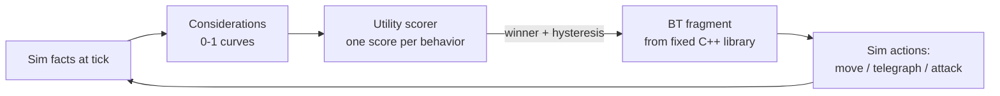

# 13 — Creatures & Bestiary

> **Status:** v0.2 draft — 2026-07-08. Owner: creature design. Conforms to
> [canon](../00-canon.md) v0.2 §3 (pet skill pools), §4 (tiers, rarities, packs, rigs, boss
> canon, field combos), §7 (content-as-data), and §9 (AI scoping). All numbers introduced here
> are marked **(proposal)**.

## Purpose

This document defines the creature system of Dragon Heroes: how creatures are built as pure
data, how the tier × rarity matrix sets their power and loot, how packs and bosses are composed,
what the archetype rigs afford, how designers author AI without touching code, and how creatures
feed the three creature-derived loot layers — **Pets**, **Bestial Skills**, and **Spirit
Essences** ([canon](../00-canon.md) §3). Creatures are the engine of the game economy: they gate
exploration risk in [the Hunt](../design/12-world-and-biomes.md), they are the sole source of
the drops the [marketplace](../design/15-economy-and-marketplace.md) trades, and they are the
weekly content unit that keeps the world expanding. Everything below is written so that adding a
creature is a data drop through the [content pipeline](../tech/23-content-pipeline.md), never an
engine change.

---

## 1. Creature anatomy: a creature is five pieces of data

Per [canon](../00-canon.md) §4, every creature is **archetype rig + palette/part variants +
stat block + skill set + AI profile** — a pure data definition with a stable snake_case ID,
validated by JSON Schema in CI and loaded by `dh-content`. This mirrors the Path of Exile
pattern of separate stat, modifier, and tag tables with spawn weights (visible in the community
[RePoE export](https://github.com/brather1ng/RePoE)): a new creature is data rows, not code.
A representative definition:

```json
{
  "id": "core.creature.thornmane_prowler",
  "family": "beast",
  "rig": "quadruped",
  "tier": "normal",
  "level_band": [3, 14],
  "palette": "core.palette.everbloom_verdant",
  "parts": ["mane_thorns", "tail_short"],
  "stats": { "hp": 90, "damage": 12, "move_speed": 5.2, "armor": 4 },
  "skills": ["core.skill.pounce", "core.skill.rending_bite"],
  "ai_profile": "core.ai.pack_skirmisher",
  "loot_table": "core.loot.everbloom_beast_t1",
  "spirit": { "family": "beast", "quality_base": "faint" },
  "capture": { "allowed": true, "pet_signature_skills": ["core.skill.pounce", "core.skill.rending_bite"] },
  "bestial_skill": { "stone": "core.skillstone.pounce", "chance": 0.005 }
}
```

Notes on each component:

- **Rig** selects the animation set and the per-frame hitboxes: the Aseprite-exported
  per-tag/per-frame JSON is the single source of truth for both client animation and server
  hitboxes ([canon](../00-canon.md) §7, [Aseprite CLI](https://www.aseprite.org/docs/cli/));
  the bake pipeline lives in [art direction](../design/17-art-direction.md).
- **Palette/parts** are visual only: recolors are runtime palette-LUT shader lookups, never
  asset variants; parts toggle rig attachments (mane, horns, tails) so one rig yields many
  distinct silhouettes.
- **Stat block** stores base values for a *Common-rarity, Normal-tier* individual at the bottom
  of its level band. Tier, rarity, and level multipliers come from shared global tables (§2), so
  rebalancing a tier is a one-table, server-readable hotfix — no client patch.
- **Skill set** references the same data-defined skill system heroes use
  ([classes & progression](../design/10-classes-and-progression.md)); this is what makes Bestial
  Skill stones (§7.2) cheap — the creature's skill already runs in hero slots.
- **AI profile** is a designer-authored utility/BT data file (§6).
- **Capture block** flags capturability and lists the species-signature pet skills; the
  `family` tag selects the family-shared pet skill pool the instance roll draws from (§7.1).

## 2. The tier × rarity matrix

[Canon](../00-canon.md) §4 fixes the vocabulary: **tier** (Normal / Elite / Legendary) is the
power band and combat role; **rarity** (Common / Uncommon / Rare / Epic / Legendary) is the
drop-rate class of the individual that spawned. Every spawned creature has one of each — 15
cells. Tier decides *what kind of fight* this is; rarity decides *how lucky you got*, and
scales the loot far more than the stats.

### 2.1 Tiers (combat role)

| Tier | Role | HP × | Damage × | Kit size | Loot rolls × | Appears as |
|---|---|---|---|---|---|---|
| Normal | Pack bodies, roamers | 1.0 | 1.0 | 1–2 skills | 1× | ~92% of all spawns |
| Elite | Pack leaders, POI guardians | 6.0 (proposal) | 1.8 (proposal) | ≥5 signature skills + leader aura (§4.1) | 5× (proposal), guaranteed Uncommon+ item | Leader of most packs |
| Legendary | Bosses | 25 (proposal) | 2.5 (proposal) | Up to 10 skills: phases, adds, arena mechanics, duo field combos (§4) | 15× (proposal), guaranteed Rare+ item, sole source of hand-authored uniques | Rare pack leaders, POI climaxes, world bosses, coordinated duos (§4.2) |

### 2.2 Rarities (individual roll, applied within tier)

Rarity is rolled per individual at spawn from a global weight table, tag-modifiable per
biome/event, PoE-style. All multipliers below are (proposal):

| Rarity | HP × | Damage × | Spawn weight (per 1000) | Drop implications |
|---|---|---|---|---|
| Common | 1.00 | 1.00 | 640 | Baseline loot table |
| Uncommon | 1.20 | 1.10 | 250 | +1 loot roll; 10% essence-quality bump |
| Rare | 1.50 | 1.20 | 85 | +2 loot rolls; skill-stone chance ×3; 35% essence bump |
| Epic | 1.90 | 1.35 | 22 | +3 loot rolls; skill-stone chance ×8; 75% essence bump; visible aura |
| Legendary | 2.40 | 1.50 | 3 | +5 loot rolls; skill-stone chance ×20; guaranteed essence bump; named prefix; map ping |

Tier and rarity multiply — effective HP across the full matrix:

| HP × | Common | Uncommon | Rare | Epic | Legendary |
|---|---|---|---|---|---|
| **Normal** | 1.0 | 1.2 | 1.5 | 1.9 | 2.4 |
| **Elite** | 6.0 | 7.2 | 9.0 | 11.4 | 14.4 |
| **Legendary** | 25 | 30 | 37.5 | 47.5 | 60 |

Design intent: rarity roughly doubles toughness from Common to Legendary but multiplies loot
output by an order of magnitude — a Legendary-rarity individual (~1 in 333 spawns) is a jackpot
event, not a wall. That keeps Legendary drops "genuinely rare" enough to anchor
[marketplace](../design/15-economy-and-marketplace.md) value while the kill-and-loot loop, not
buying, stays the dominant acquisition path — the standing
[Diablo 3 RMAH lesson](https://www.gamespot.com/articles/ten-years-later-lessons-from-diablo-iiis-auction-house-disaster-have-not-been-remembered/1100-6503489/).
Drop tables are published as exact probabilities per [canon](../00-canon.md) §8, and every
weight is a server-side value feeding the mint-rate monitors in
[security & economy integrity](../tech/27-security-anticheat-and-economy-integrity.md).

## 3. Pack composition

Creatures roam in packs of **3–8** led by an Elite or Legendary ([canon](../00-canon.md) §4):

1. **Exactly one leader** per pack: Elite 92%, Legendary 8% (proposal). Legendary-led packs are
   wandering boss encounters and telegraph themselves (distinct audio, larger footprint) so
   players opt in.
2. **Bodies are Normal tier** from the same biome set, filled by role slots defined in the pack
   template data: bruiser, skirmisher, support, artillery — at most one support per three bodies
   (proposal), so packs never become unkillable heal loops.
3. **Pack size roll** is 3–8, weighted by biome danger rating
   ([world & biomes](../design/12-world-and-biomes.md)) and party size: +1 to the roll per party
   member beyond the first (proposal), capped at 8.
4. **Leader death breaks the pack:** survivors switch to their AI profile's leaderless behavior —
   most flee, some frenzy (§6). Packs must present a targeting decision (leader-first vs
   support-first), never a pure damage race.
5. Pack templates are content data (`core.pack.everbloom_prowler_hunt`), so weekly drops can add
   new compositions of existing creatures at zero art cost.

## 4. Boss design principles

"Bosses are genuinely hard" ([canon](../00-canon.md) §4) means *mechanics*, never stat sponges —
and canon v0.2 sharpens the bar: **Elite bosses fight like Monster Hunter hunts**, a kit of
signature skills composing one coherent, learnable combat strategy (telegraphs, punish windows,
phases), and a co-op boss hunt is designed to feel like **"a real adventure with friends"**
([canon](../00-canon.md) §1, §4). Binding principles for every Elite and Legendary kit:

1. **Readability first.** Every dangerous attack is telegraphed — windup animation plus ground
   decal, with minimum windups set by the telegraph classes owned by
   [combat & controls](../design/11-combat-and-controls.md) §7.2: Pressure 400 ms, Standard
   800 ms (any hit ≥ 15% hero max HP), Lethal 1.2 s (any hit ≥ 40% hero max HP or hard CC from
   a boss) — all (proposal) there. A kit's telegraphs share one **telegraph grammar** —
   consistent shape language and timing bands — so learning the boss means learning to read it.
   Telegraph and dodge standards live in
   [combat & controls](../design/11-combat-and-controls.md); hitboxes are exact 2D shapes
   (circles, capsules, swept arcs), so decals are truthful.
2. **Everything is avoidable.** No unavoidable one-shots, no chip damage that cannot be played
   around by movement, dodge, or a mechanic interaction.
3. **Phases change the kit, not the numbers.** Elite hunts run at least 2 phases (proposal);
   Legendary bosses run 3 phases at 70/40/15% HP (proposal); each adds or replaces mechanics. A
   phase that only raises damage is rejected.
4. **Adds serve mechanics** — they create decisions (kill the wisp to open the shield window;
   kite adds through the boss's own breath), never DPS padding.
5. **The arena is part of the kit.** Legendary bosses are designed together with their POI arena
   ([world & biomes](../design/12-world-and-biomes.md)): destructible cover the boss consumes,
   hazards it herds players into, rotating safe zones.
6. **Time-to-kill bands, enforced by balance sims** (`tools/`): Elite 90–180 s for a
   level-matched solo player (proposal — raised from v0.1's 45–90 s so a ≥5-skill strategy has
   room to read); Legendary 4–8 minutes for a party of 4 (proposal); Legendary duos 8–12 minutes
   for a party of 4 (proposal). A fight below band gets a mechanic, never HP.
7. **Party scaling adds targets, not damage:** boss HP +60% per party member beyond the first
   (proposal); mechanics gain extra targets/decals so groups split attention.
8. **Soft enrage only:** escalating pressure (faster rotation, shrinking safe area), never hard
   wipe timers — this protects build diversity under the global power cap
   ([items, loot & affixes](../design/14-items-loot-and-affixes.md)).

### 4.1 The hunt standard: at least five skills, one strategy

Per [canon](../00-canon.md) §4, every Elite boss carries **at least 5 signature skills** — and
the count is the floor, not the point: the five-plus skills must compose **one coherent,
learnable combat strategy**, never five disconnected attacks. Concretely:

- **Every skill has a role in the strategy** — opener, zoning, herding, punish-bait, phase
  tool. A skill that doesn't serve the strategy is cut, whatever its spectacle.
- **Every skill offers a punish window:** a correct read (sidestep the dive, break the
  channel) earns a readable recovery the player can exploit. Damage on bosses is *earned* by
  playing the fight, not traded blindly.
- **The strategy is learnable:** a player who wipes should be able to say what they'll do
  differently next attempt. Failure teaches; mastery is visible — the Monster Hunter loop.
- **Co-op is the marquee expression:** in a party, roles emerge from the same kit (who baits
  the dive, who punishes the landing, who handles adds). The design target for every boss hunt
  with friends is "a real adventure with friends" ([canon](../00-canon.md) §1) — a story the
  party retells, not a stat check.

**Leader aura (the tier-table promise, §2.1).** On top of its signature kit, every Elite or
Legendary pack leader projects one **leader aura** — a passive, data-defined effect on pack
bodies within **12 m (proposal)**: a stat buff (damage, armor), a behavior modifier (brief
phase-out when the leader casts — Fenwitch Hag, §10), or a concealment effect (lantern-radius
stealth — Hollow Shepherd, §10). Auras affect the pack, never debuff players directly; they are
visibly marked (aura VFX on affected bodies) so the leader-first-or-support-first decision reads;
and they **end immediately on the leader's death**, per pack rule 4 (§3). An aura is one row in
the pack template data, not a sixth signature skill.

Cinder Roc (§10) is the worked Elite example: five skills, one strategy.

### 4.2 Legendary duos and field combos

**Legendary creatures carry up to 10 skills** ([canon](../00-canon.md) §4) with richer
strategies — more phases, arena co-design (principle 5) — and may hunt in **coordinated
duos**: two Legendaries whose kits are co-authored so their skills combine into **field
combos**, elemental field interactions on the tile grid. The canonical example: a fire dragon +
an earth elemental producing **lava tiles**. Fields (fire, stone, water, ice, gloom, …) are
simulation state on the tile grid; the elemental field-interaction system lives in `dh-sim`
([simulation core](../tech/21-simulation-core.md)), and each combo is a row in a data-defined
field-interaction table — a duo is content, not code.

Duo rules, all (proposal):

1. **Hand-authored pairs only.** A duo is a data definition (`core.duo.emberwrath_cragheart`)
   pairing two specific Legendaries whose families sit on complementary elements with an entry
   in the field-interaction table (e.g. Dragonkin fire × elemental earth → lava). Never a
   random pairing of two Legendaries — combos must be designed, balance-simmed, and readable.
2. **Scope:** launch with one duo (Emberwrath & Cragheart Colossus, §10); add at most one duo
   per new-biome cycle so each pair stays an event (open question 8).
3. **Spawn seeding:** duo hunts spawn through the Legendary world-boss event system (§9) — the
   region's world-boss timer rolls a duo instead of a single boss at **15% weight**, from the
   same per-region seeded server event stream, never client-predictable. The announcement cue
   doubles (both bosses' sky tint and audio at once) so parties opt in knowingly.
4. **Difficulty/reward scaling:** tuned for a full party of 4. Each member carries ~0.75× a
   solo Legendary's HP so the pair is harder than one boss but the threat comes from kit
   intersection, not raw HP; TTK band 8–12 minutes (principle 6). Each member drops its own
   Legendary loot table, and killing both within 60 s of each other grants the **duo-exclusive
   drop pool** — uniques and skill stones obtainable nowhere else — so duos anchor a distinct
   [marketplace](../design/15-economy-and-marketplace.md) value tier.
5. **Survivor phase:** when one member falls, the survivor enters a final phase built on the
   lingering fields of its fallen partner — e.g. Emberwrath alone reignites Cragheart's
   leftover stone ridges. The duo stays a duo even half-dead.

## 5. The ten archetype rigs

Ten canonical rigs; **six ship at launch (proposal)** per [canon](../00-canon.md) §4. One shared
rig per archetype is animated once and baked in CI to frame atlases; the rig's animation tags
define the movement/attack vocabulary every creature on that rig can reference. A creature uses
any subset and reskins via palette/parts.

| Rig | Launch | Movement vocabulary | Attack vocabulary |
|---|---|---|---|
| Quadruped | Yes | Lope, sprint, circling strafe, pounce (z-hop), backstep | Bite (arc), claw combo, charge (swept capsule), howl (pack buff) |
| Humanoid/biped | Yes | Walk/run, dodge-step, guard stance | Weapon swings sharing hero animation primitives, shield block, thrown/ranged, spellcast channels |
| Winged beast | Yes | Ground gait + true flight (z-height), hover, dive | Swoop grab, dive-bomb (ground decal), wing gust (knockback cone), aerial projectile |
| Avian | Yes | Sustained erratic flight, perch, flush-and-flee | Talon dive, feather volley (projectile fan), screech (interrupt) |
| Dragon | Yes | Ground + flight phases; take-off/land as telegraphs | Breath cone (swept arc), tail sweep (rear arc), snap bite, strafing breath |
| Spirit/ethereal | Yes | Drift (ignores terrain cost), teleport blink, phase-out (untargetable window) | Projectile patterns, auras (damage/drain zones), possession/lure behaviors |
| Serpent | Post-launch | Slither (segmented capsule chain), burrow/emerge | Lash, constrict (grab), venom spit, emerge eruption |
| Giant | Post-launch | Slow stride, seismic step (screen-shake tell) | Ground slam (circle AoE), boulder throw, grab, armor-break stagger states |
| Arachnid/insectoid | Post-launch | Skitter, web traversal, burrow ambush | Web snare (zone), leap, egg-sac adds, swarm summon |
| Amorphous | Post-launch | Ooze flow, size-shifting hitbox | Split-on-damage, engulf (grab), acid trail, reform |

Rig affordances are the hard constraint on weekly content: a weekly creature must be expressible
in an existing rig's tag set. New tags on an existing rig are a small art task; a new rig is a
milestone deliverable ([roadmap](../business/31-roadmap.md)).

## 6. AI profiles: designer-authored data on the BT/utility layer

Per [canon](../00-canon.md) §9 the split is strict: **behavior trees / utility AI for all normal
creatures; RL policies only for Elite/Legendary bosses, Champion Ghost sparring bots, and
Gloomfall lobby fill.** The bestiary team's tool is therefore the data-driven BT/utility layer
in `dh-sim` — this doc's scope; RL training/serving belongs to
[creature AI & RL](../tech/25-creature-ai-and-rl.md). The hybrid is the industry-validated
pattern: an October 2025 AMD Schola paper formalizing RL+behavior-tree NPCs found the hybrid far
exceeds pure-RL success rates while approaching pure-BT reliability
([arXiv 2510.14154](https://arxiv.org/abs/2510.14154)), matching Ubisoft La Forge's production
practice of spending RL only where adaptiveness is the product
([GDC: RL in Production](https://www.gdcvault.com/play/1026281/ML-Tutorial-Day-Smart-Bots)).

An **AI profile** (`content/core/ai-profiles/`) is a data file with two halves:

- **Considerations:** normalized 0–1 response curves over sim facts — distance to target, own HP
  fraction, leader-alive flag, ally count in radius, skill cooldowns, target's recent damage.
  Designers author curve shape and weight.
- **Behaviors:** a scored list, each pairing its considerations (combined multiplicatively) with
  a **behavior-tree fragment** — a small reusable tree from a fixed C++ library
  (`approach-to-range`, `telegraph-then-strike`, `kite-and-cast`, `flee-to-ally`,
  `guard-leader`). Highest score wins; the fragment executes until it completes or a re-score
  (every 10 ticks, proposal) picks a significantly better behavior (hysteresis margin prevents
  flip-flopping).



Consequences: designers ship new AI weekly without engineers (profiles are data, fragments are a
stable library); behavior is deterministic and replayable (fixed-tick sim, seeded RNG —
[simulation core](../tech/21-simulation-core.md)); and even Legendary bosses launch on
hand-authored profiles — an RL policy, where used, is a later overlay gated by the eval pipeline
in [creature AI & RL](../tech/25-creature-ai-and-rl.md), never a bestiary dependency. Every
profile also declares its **leaderless behavior** (flee / frenzy / hold) used by pack rule §3.4.

## 7. The three creature-derived loot layers

Canonical names per [canon](../00-canon.md) §3: Pets, Bestial Skills, Spirit Essences. These
layers are why the bestiary *is* the loot system: every creature definition declares its
contribution to each.

### 7.1 Pets — capture via weaken + Soul Snare, then a family-pool roll

- **Mechanic (proposal):** damage a creature below **25% HP** to put it in a *soul-frayed* state
  (distinct fraying-spirit outline). Throw a **Soul Snare** — a consumable crafted from Spirit
  Essences + gold (recipe in [items](../design/14-items-loot-and-affixes.md)) — as an aimed
  projectile. On hit, a capture roll runs server-side; success converts the creature to a Pet.
- **Capture chance by rarity (proposal), at ≤5% HP, scaling linearly to 0 at 25% HP:**

| Rarity | Max capture chance | Elite-tier modifier |
|---|---|---|
| Common | 55% | ×0.5 |
| Uncommon | 40% | ×0.5 |
| Rare | 25% | ×0.5 |
| Epic | 12% | ×0.5 |
| Legendary | 5% | ×0.5 |

- **Tier gate:** Normal and Elite tiers are capturable; **Legendary tier never** (proposal) —
  bosses feed the economy through unique drops, and a captured boss would break the power cap.
- A failed Snare is consumed and enrages the target (+25% damage for 10 s, proposal).
- The Pet keeps its rarity multipliers and palette — its skills come from the instance roll
  below; it occupies the single companion slot
  ([classes & progression](../design/10-classes-and-progression.md)) and scales
  to the owner's level band (proposal), so old captures stay usable under the power cap.

**The instance roll: attributes + a skill set from the family pool.** Per
[canon](../00-canon.md) §3, a pet *instance* rolls **random attributes** — a spread of 80–120%
per stat over the species' stat block (proposal) — **and a random skill set**: **2–4 skills
(proposal)** drawn at capture, server-side, from its **creature family's pool**. The pool has
two parts:

- **Family-shared skills** — a sparse, lore-coherent set owned by the family definition,
  **3–6 per family (proposal)**: e.g. Abyssal creatures share a few abyssal skills (canon §3).
- **Species-signature skills** — **2–3 per species (proposal)**, declared in the creature's
  `capture` block (§1).

Roll rules (proposal): every pet rolls **at least one signature skill**, so species identity
always reads; remaining slots pick signature over family-shared at roughly 70/30 weight.
**Sharing is deliberately rare so skill permutations stay novel** (canon §3): two pets of the
same species usually differ, and two pets of the same family feel like kin, almost never like
copies.

**Tradability and value (canon).** Pets are **fully tradable** on the real-money marketplace —
this resolves v0.1's open question #1 — and **perfect-roll pets** (top attribute spread plus a
coveted skill combination) are intended to be **among the most valuable marketplace assets**
([canon](../00-canon.md) §3). Because the roll happens only at capture, server-side, from
gameplay, pet value obeys the no-paid-randomness rule (canon §2) by construction: money can buy
a rolled pet, never a roll. Pets sit under the same global power cap as gear.

**Pets in ranked PvP (decided).** Pets are **allowed in 1v1/3v3 ranked** — they are part of the
build, occupying their slot inside the ranked **per-slot power budget** of
[PvP & tournaments](../design/16-pvp-and-tournaments.md); per canon's anti-pay-to-win stance
(§5), the power cap and budget, not exclusion, keep the wallet out of the outcome. Gloomfall is
self-contained: players drop in with their pet and find all gear in-match (same doc). What
remains open is whether a normalized "tournament realm" (canon §12.2) would also normalize pets
— open question 6.

**Worked example — the Abyssal family** (three launch species of the Umbral Depths; Duskmaw
Creeper is a Normal-tier quadruped ambusher from the launch set, outside §10's sketches):

| Skill | Kind | Chasm Screecher | Hollow Shepherd | Duskmaw Creeper |
|---|---|---|---|---|
| Abyssal Veil (2 s stealth) | Family-shared | ● | ● | ● |
| Gloom Leech (drain damage-over-time) | Family-shared | ● | ● | ● |
| Umbral Ward (absorb shield while in darkness) | Family-shared | ● | ● | ● |
| Shriek Dive (leap strike) | Signature | ● | — | — |
| Echo Mark (reveal + damage amp on one target) | Signature | ● | — | — |
| Snuff (short blind) | Signature | — | ● | — |
| Lantern Ward (ally shield zone) | Signature | — | ● | — |
| Throat Lunge (gap-close grab) | Signature | — | — | ● |
| Shadow Trail (speed burst leaving a slowing wake) | Signature | — | — | ● |

A single species' roll (2–4 skills from 3 shared + 2 signature, ≥1 signature) yields **21
distinct kits** before attribute spreads even enter; the Abyssal pool deliberately sits at the
floor of the 3–6 shared range — a family at the 6-shared ceiling yields 104 kits per species —
and three species share a vocabulary without sharing an identity. **Design intent: permutation richness with story-coherent pools** — random
enough that every capture stays exciting and the marketplace stays deep, coherent enough that
every skill on an Abyssal pet tells the same abyssal story.

### 7.2 Bestial Skills — skill stones

On death, a creature has a chance to drop a **skill stone** containing one skill from its kit,
socketable into the hero's six active skill slots. Base chance 0.5% for a Common Normal
(proposal), multiplied by the rarity column in §2.2 and ×4 for Elite tier (proposal);
Legendary-tier bosses drop a stone from their kit at 20% (proposal), and signature boss skills
exist *only* as their stones. Because creature skills share the class-skill data format, a stone
is one loot-table row plus hero-rig animation mapping. Stones are tradable items and a core
weekly-drop lever: a new stone re-shuffles builds without raising the power cap.

### 7.3 Spirit Essences — enchantment materials by family

Every creature belongs to exactly one **family** — launch taxonomy of six (proposal): **Beast,
Dragonkin, Skyborn, Spirit, Mireborn, Abyssal** ("Abyssal" replaces v0.1's "Umbral" family name —
it matches canon's family example and no longer collides with the Umbral Depths biome name). A
family owns two things: its essence type below, and the family-shared pet skill pool of §7.1 —
per canon's glossary, a family is the lore group whose members draw from a shared skill pool for
pet rolls. Every kill drops essence of its family at
a quality set by tier: **Faint** (Normal), **Vivid** (Elite), **Radiant** (Legendary)
(proposal), with rarity granting a quality-bump chance per §2.2. Enchantment recipes consume
family+quality combinations (e.g., Radiant Dragonkin for a fire-damage enchant) — the enchanting
system and its role as a material sink live in
[items, loot & affixes](../design/14-items-loot-and-affixes.md). Families also feed Soul Snare
crafting, making essences the connective tissue between all three layers.

## 8. Biome creature sets and the weekly expansion model

Each of the five launch biomes ([canon](../00-canon.md) §4) owns an expanding creature set.
Launch target: **12 creatures per biome, ~60 total (proposal)** — per biome roughly 8 Normal,
3 Elite, 1 Legendary boss, spread across at least 3 rigs so no biome reads as one silhouette.

Weekly drops ([content pipeline](../tech/23-content-pipeline.md)) add **1–3 creatures per week
(proposal)**, always on existing rigs: new palette/parts, stat block, skill set, AI profile,
loot rows, and family tag — pure data in a `drops/2026-wNN/` pack, shipped as data-only PCK
patches. A new biome every 4–6 weeks arrives with a founding set of ~10 creatures (proposal),
its spawn tables versioned against the generator so they populate virgin chunks only
([procedural world generation](../tech/24-procedural-world-generation.md)). Weekly creature
checklist: definition passes schema CI → atlas bake from rig → balance-sim run against TTK bands
(§4, principle 6) → loot-table mint-rate review
([economy integrity](../tech/27-security-anticheat-and-economy-integrity.md)) → drop. If a drop
touches an RL-boss biome, the bot eval gate in
[creature AI & RL](../tech/25-creature-ai-and-rl.md) must also pass before bots redeploy.

## 9. Spawn, respawn, and density

- **Spawn sites** are emitted deterministically by procgen per chunk (density driven by biome
  danger rating and POI proximity — [world & biomes](../design/12-world-and-biomes.md)); the
  zone server populates a site with a pack rolled from the biome spawn table when the chunk
  activates inside a player's AOI. Baseline open-terrain density: ~1 pack per 1.5 chunks
  (proposal), rising near POIs.
- **Respawn:** a wiped site cools down 10 minutes (proposal) and will not repopulate while any
  player is within 40 m (proposal) — no spawn-camp farms, no creatures materializing on screen.
- **Legendary world bosses** run on longer per-region timers, 2–6 h (proposal), announced via
  world cues (sky tint, audio) so parties can converge; their spawn is a server event, never
  client-predictable. The same seeded event stream rolls **Legendary duo hunts** at duo weight
  (§4.2), with the doubled announcement cue.
- **Party scaling** works through pack size and count (§3.3), not per-creature stat inflation,
  keeping Normal-tier readability constant.
- All spawn, rarity, and loot rolls execute server-side in `dh-sim` with seeded per-system RNG —
  clients receive results only ([netcode](../tech/22-netcode-and-server-hosting.md)).

## 10. Example bestiary (the quality bar)

Twelve sketches across biomes, tiers, and rigs — including one Elite hunt kit shown in full
(Cinder Roc, the §4.1 standard) and one Legendary duo (Emberwrath & Cragheart Colossus, the
§4.2 field combo). Each entry names its signature *decision* — the
thing the player must think about — because a creature without a decision is filler. Stat blocks
follow §2's tables.

| Creature | Biome | Rig | Tier | Role |
|---|---|---|---|---|
| Thornmane Prowler | Everbloom Wilds | Quadruped | Normal | Pack skirmisher |
| Bloomcaller Sylph | Everbloom Wilds | Spirit | Normal | Pack support |
| Everbloom Regent | Everbloom Wilds | Humanoid | Legendary | POI boss |
| Mirelight Wisp | Gloamfen | Spirit | Normal | Lure/hazard |
| Fenwitch Hag | Gloamfen | Humanoid | Elite | Pack leader |
| Ashscale Drake | Cinderwastes | Dragon | Normal | Artillery |
| Cinder Roc | Cinderwastes | Avian | Elite | Aerial leader |
| Emberwrath | Cinderwastes | Dragon | Legendary | Duo hunt (fire) |
| Cragheart Colossus | Cinderwastes | Humanoid | Legendary | Duo hunt (earth) |
| Rimelash Wyvern | Palecrown Peaks | Winged beast | Legendary | World boss |
| Chasm Screecher | Umbral Depths | Winged beast | Normal | Ambusher |
| Hollow Shepherd | Umbral Depths | Humanoid | Elite | Pack leader |

**Thornmane Prowler** (`core.creature.thornmane_prowler`). A luminous-maned predator that
circles at leash range and pounces when the player commits to an attack animation. Decision:
bait the pounce, punish the recovery. Drops the *Pounce* skill stone; capturable — the starter
Pet for most players. Family: Beast.

**Bloomcaller Sylph.** A drifting petal-spirit that heals pack members and phases out for 1 s
when targeted. Decision: hold burst damage for its phase-in window instead of tunneling the
bruisers. Its Spirit-family essence is the Soul Snare recipe staple.

**Everbloom Regent** (Legendary boss). A crowned, vine-wreathed figure in a garden arena.
Phase 1: root walls section the arena into lanes. Phase 2 (70%): sapling adds heal it unless
lured into its own scything vine sweep. Phase 3 (40%): pollen zones invert — the safe circles
become the only damage windows. Sole source of the *Regent's Bloom* unique and the *Verdant
Scythe* skill stone.

**Mirelight Wisp.** A false-lantern spirit that drifts *away* from players, luring them toward
deep water and gas vents; it attacks only when cornered. Decision: is that light worth
following? A pure AI-profile showcase — its whole behavior is one utility curve preferring
retreat vectors that cross hazards.

**Fenwitch Hag** (Elite leader). Curses the highest-damage player with a damage-over-time
transferable by touching an ally — a coordination decision — and hooks stragglers into her wisp
pack. Leader aura: her pack phases out briefly when she casts. On her death the wisps scatter.

**Ashscale Drake.** A juvenile dragon-rig creature proving dragons are not only bosses: short
ground breath cone and a hop-back gust. Decision: flank the cone, respect the hop. Its Faint
Dragonkin essence feeds early fire enchants.

**Cinder Roc** (Elite leader — the worked §4.1 hunt). An updraft raptor whose five signature
skills compose one strategy: *arena constriction by fire*. (1) **Ember Dive** — a dive-bomb
along a telegraphed line decal, leaving a burning trail; sidestepping the line earns the landing
recovery, the kit's main punish window. (2) **Cinder Volley** — a feather fan that herds players
toward the standing trails. (3) **Ashen Screech** — a telegraphed interrupt cone that punishes
greedy channels. (4) **Thermal Rise** — it climbs an updraft to reposition; the slow, readable
descent is the second punish window. (5) **Firestorm Roost** (phase 2, 50% HP) — every standing
trail reignites at once and burns longer, while its pack of Normal avians flushes players into
them. Every skill either lays fire or pushes you into fire: learn the trails, hold the clean
ground, punish the landings. Skill stone: *Ember Dive*.

**Emberwrath & Cragheart Colossus** (Legendary duo — the worked §4.2 field combo). A fire
dragon and an earth elemental (humanoid rig, Spirit family) that hunt the Cinderwastes as a
pair. Cragheart's *Upheaval* raises ridges of cracked stone across the arena; Emberwrath's
strafing breath ignites them into **lava tiles** — the canonical field combo
([canon](../00-canon.md) §4) — persistent flows that reshape walkable ground for the rest of
the hunt. Emberwrath fights in alternating flight/grounded phases (dragon rig) with a kit of up
to 10 skills; Cragheart anchors zones — ground slam, boulder throw, and stone-shield walls the
party can bait Emberwrath's breath into destroying. Decision: which to burst first — killing
Cragheart stops new ridges but triggers Emberwrath's survivor phase over the leftover fields
(§4.2, rule 5). Spawns on the region's world-boss timer at duo weight with a doubled sky cue
(§4.2, rule 3); sole source of the duo-exclusive drop pool (§4.2, rule 4).

**Rimelash Wyvern** (Legendary world boss). Alternates flight and grounded phases — airborne it
strafes icicle barrages (dodgeable lines); grounded it chains freezing breath sweeps. The
arena's ice pillars block barrages, but the wyvern shatters one per grounded phase: cover is a
spent resource. Announced region-wide by a sky-dimming cue (§9). Anchor of Palecrown's
marketplace-value drops.

**Chasm Screecher.** A cavern ambusher that clings to darkness and dives at players whose light
source lapses — the Umbral Depths' light-management pressure made flesh. Cheap to make
(winged-beast rig, one palette), huge atmosphere. Family: Abyssal (see §7.1's pet skill pool).

**Hollow Shepherd** (Elite leader). A lantern-bearing husk whose pack is invisible outside its
lantern radius. At 50% HP it *extinguishes* the lantern, stealthing its pack; players must
relight arena braziers to reveal them. Skill stone: *Snuff* (short blind). Family: Abyssal.

## Open questions (for Ricardo)

1. **Pet skill-roll shape:** confirm 2–4 skills per pet instance and the ≥1-signature /
   ~70:30 signature-to-shared weighting (§7.1) — and should higher-rarity captures roll *more*
   skills, or only better attribute spreads?
2. **Elite capture:** keep Elite-tier capture at ×0.5 chance (current proposal), or restrict
   capture to Normal tier only and let Elites feed the Pet system via rare "broodling" drops?
3. **Launch bestiary size:** confirm ~60 creatures (12 × 5 biomes) against art-bake capacity, or
   reduce to ~45 (9 per biome) and backfill in the first weeks of drops?
4. **Pack-leader split and rarity weights:** approve 92% Elite / 8% Legendary leaders and the
   640/250/85/22/3 rarity weights as starting values for the balance sims?
5. **Soul Snare supply:** craftable-only from essences (stronger material sink, current
   proposal) or also a direct world drop (friendlier early game)?
6. **Pets on a tournament realm:** pets in ranked 1v1/3v3 are decided — allowed inside the
   per-slot power budget from [PvP](../design/16-pvp-and-tournaments.md) (§7.1). If the
   normalized "tournament realm" option (canon §12.2) is adopted, how do pets normalize —
   fixed exemplar pets, or attribute-normalized versions of the player's own?
7. **Boss skill-stone rate:** is 20% per Legendary-tier kill too generous for stones meant to
   anchor value? Alternative: 100% on first kill per character, ~5% thereafter.
8. **Duo scope and seeding:** launch with one hand-authored duo (Emberwrath & Cragheart) and add
   one per new-biome cycle, or ship one duo per launch biome? Approve the 15% world-boss-slot
   weight and the duo-exclusive drop pool (§4.2)?
9. **Elite TTK band:** approve the raise from v0.1's 45–90 s to 90–180 s so the ≥5-skill hunt
   standard (§4.1) has room to read?

## Sources

- [Combining Reinforcement Learning and Behavior Trees for NPCs with AMD Schola (arXiv 2510.14154)](https://arxiv.org/abs/2510.14154) — hybrid BT+RL validation behind §6's scoping.
- [GDC Vault — Smart Bots for Better Games: RL in Production (Ubisoft La Forge)](https://www.gdcvault.com/play/1026281/ML-Tutorial-Day-Smart-Bots) — production precedent for BT-for-many / RL-for-few.
- [RePoE — Path of Exile data exports (mods/stats/tag spawn-weight structure)](https://github.com/brather1ng/RePoE) — pattern for §1's data-table indirection.
- [Aseprite CLI documentation](https://www.aseprite.org/docs/cli/) — per-tag/per-frame JSON export underpinning shared animation + hitbox data.
- [GameSpot — Ten Years Later, Lessons From Diablo III's Auction House Disaster](https://www.gamespot.com/articles/ten-years-later-lessons-from-diablo-iiis-auction-house-disaster-have-not-been-remembered/1100-6503489/) — why rarity weights must keep playing ahead of buying (§2.2).
