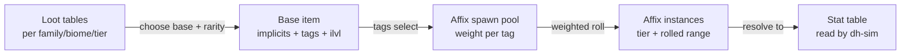

# 14 — Items, Loot & Affixes

**2026-09-12 review extension:** [design/26](26-living-pixel-world.md) defines
the Legendary / Relic / Mythic / Divine candidate artifact ladder, connected
lore and budgeted effect facets. Its offline schema does not migrate existing
items or saves. The shared power ceiling and all acquisition rules below
remain in force; the equipment slot `relic` is distinct from Relic rarity.

> Part of the Dragon Heroes document set. Canon: [00-canon.md](../00-canon.md). Adjacent docs:
> [creatures & bestiary](13-creatures-and-bestiary.md), [economy & marketplace](15-economy-and-marketplace.md),
> [content pipeline](../tech/23-content-pipeline.md), [economy integrity](../tech/27-security-anticheat-and-economy-integrity.md).

## Purpose

This document specifies itemization: the item taxonomy, the data model, rarity and affix rules, loot
distribution across an ever-growing bestiary, the **power cap contract** that keeps the meta horizontal,
and the **sink and bind rules** that keep a real-money marketplace from inverting the loot loop the way
Diablo 3's auction house did. Two canon constraints govern everything here: money never buys a random
outcome ([canon §2](../00-canon.md)), and every drop probability must be publishable as an exact table
([canon §8](../00-canon.md)). Items are pure data with stable string IDs (`core.item.emberfang_blade`),
so every system below describes rows that ship in weekly content drops, not code.

---

## 1. Item taxonomy and slot layout

### 1.1 Equipment slots (proposal)

Ten gear slots per character — deliberately one screen of UI on mobile, and a clean denominator for the
per-slot power budget (§4.3).

| Slot | Category | Notes |
|---|---|---|
| Main hand | Weapon | Determines the attack moveset (see [combat](11-combat-and-controls.md)) |
| Off-hand | Weapon/utility | Shield, quiver, grimoire, or talisman; two-handed weapons occupy both hands |
| Helm | Armor | |
| Chest | Armor | Largest defensive budget of the armor slots |
| Gloves | Armor | Attack-oriented affix pool |
| Boots | Armor | Movement-oriented affix pool |
| Belt | Armor/utility | Consumable capacity, resource affixes |
| Amulet | Accessory | Widest affix pool of any slot |
| Ring ×2 | Accessory | Two ring slots sharing one affix pool |

The Pet companion slot ([canon §3](../00-canon.md)) is not an item slot; pets are covered in the
[bestiary](13-creatures-and-bestiary.md). Bestial Skill stones socket into skill slots, not gear (§9.2).

### 1.2 Weapon classes at launch (proposal)

Eight weapon classes, none class-locked — attribute requirements and skill synergies steer each of the
six classes toward natural picks without hard gates.

| Weapon class | Hands | Natural users | Moveset identity |
|---|---|---|---|
| Sword | 1H | Warden, Reaver | Balanced arcs, shield-compatible |
| Greatblade | 2H | Reaver | Slow sweeps, big swept-arc hitboxes |
| Paired daggers | 1H pair | Reaver, Hunter | Fast multi-hit, short capsules |
| Spear | 2H | Warden, Hunter | Long thrust capsules, spacing tool |
| Bow | 2H (+quiver) | Hunter | Charged projectiles |
| Crossbow | 1H | Hunter, Occultist | Flat, fast bolts; off-hand free |
| Wand | 1H | Elementalist, Occultist | Tracking bolts, caster stat stick |
| Staff | 2H | Elementalist, Ritualist | AoE-focused caster weapon |

Adding a weapon class later (scythe, chakram, …) is a content drop: a new base-item family plus new
attack primitives on the shared rig, per [classes & progression](10-classes-and-progression.md).

### 1.3 Non-equipment item types

Consumables (potions, elixirs, hunt beacons), crafting materials and reagents, Spirit Essences, Bestial
Skill stones, and cosmetics. All share the same data model and ID scheme; only equipment carries affixes.

---

## 2. The data model: bases, affixes, stats, tags

We adopt the Path of Exile table structure, as documented by the community
[RePoE export](https://github.com/brather1ng/RePoE) of GGG's internal `base_items`, `mods`, and `stats`
tables: **three separate tables joined by tags**, so a new item or affix is a data row, never code. This
pattern is what lets PoE ship league content on a fixed cadence, and it is already canon at the
architecture level ([canon §4, §7](../00-canon.md)).

- **Stat table** — atomic, engine-meaningful quantities (`core.stat.fire_damage_flat`,
  `core.stat.move_speed_pct`). The simulation in `dh-sim` only ever reads stats; it knows nothing about
  affixes or items. New stats are the only itemization change that touches code.
- **Base-item table** — one row per base (`core.item.emberfang_blade`): slot, weapon class, implicit
  stats, attribute requirements, item level, and a **tag set** (e.g. `weapon`, `sword`, `one_hand`,
  `fire_themed`).
- **Affix table** — one row per affix family (`core.affix.of_embers`): prefix or suffix, a **tier
  ladder** (T5 weakest → T1 strongest) with stat ranges and minimum item level per tier, and **spawn
  weights keyed by tag** (e.g. weight 1000 on `weapon`, 0 on `armor`, 2000 on `fire_themed`).

When an item drops, the generator intersects the base's tags with every affix's weight table to build
the spawn pool, then rolls affixes by weight. Tags are the entire coupling surface: a weekly drop can
add a new base whose tags light up existing affixes, or a new affix that only spawns on an existing
tag — either way, zero code and zero risk to old items.

Item *instances* (a specific dropped sword with rolled affixes) are separate from these definition
tables: each has a DB-enforced unique GUID and lives in the economy core's ledger
([canon §8](../00-canon.md), [economy integrity](../tech/27-security-anticheat-and-economy-integrity.md)).
Definitions are never deleted or renamed, only deprecated ([canon §10](../00-canon.md)).

---

## 3. Rarity rules

Item rarities are canonical: **Common → Uncommon → Rare → Epic → Legendary** ([canon §4](../00-canon.md)).
Affix counts per rarity (proposal):

| Rarity | Affix count | Max prefixes / suffixes | Role |
|---|---|---|---|
| Common | 0 | — | Implicits only; salvage fodder, crafting bases |
| Uncommon | 1–2 | 1 / 1 | Leveling gear, first trade goods |
| Rare | 3–4 | 2 / 2 | Core endgame currency of the marketplace |
| Epic | 5–6 | 3 / 3 | Chase tier for rolled gear; can hit the slot budget cap |
| Legendary | hand-authored | fixed | Unique mechanics, not bigger numbers (§4.4) |

Rarity is rolled at drop time from the loot table (§5) and can be raised by crafting (§6), never by
spending money. Within a rarity, affix count is rolled uniformly (proposal).

---

## 4. The power cap — the anti-powercreep contract

The canon is explicit: *"the meta stays fresh through diversity … never through power inflation.
Best-in-slot must be reachable by playing — the marketplace accelerates, it must never exceed the cap"*
([canon §4](../00-canon.md)). This section turns that sentence into enforceable numbers. The cap is the
competitive-integrity backbone of [PvP](16-pvp-and-tournaments.md) and the price-stability backbone of
the [marketplace](15-economy-and-marketplace.md): if power inflates, old items become worthless, sellers
churn, and fee revenue erodes with them.

### 4.1 Item level cap

Item level (ilvl) is capped at **60**, matching the character level cap ([canon §3](../00-canon.md); 60
is itself a proposal there). Ilvl gates which affix tiers can spawn; at launch, ilvl 60 content already
unlocks every tier. No future drop, biome, or season may raise the ilvl cap — that is the vertical-creep
door and it stays welded shut.

### 4.2 Affix tier caps

Every affix family's ladder tops out at **T1**, and T1 stat ranges are frozen at first publication.
Weekly drops may add *new affix families* (new effects, tags, trade-offs) whose T1 is budget-priced like
every other T1 (§4.3), but may never add a T0 or extend an existing family's range upward. CI validation
in the [content pipeline](../tech/23-content-pipeline.md) enforces this mechanically: a content drop
that raises any published tier's range fails the build.

### 4.3 Per-slot power budget (proposal)

Every affix tier has a **budget cost**, and every slot has a **budget cap of 100 points**:

| Affix tier | Budget cost (proposal) |
|---|---|
| T1 | 20 |
| T2 | 16 |
| T3 | 12 |
| T4 | 8 |
| T5 | 4 |

Spirit Essence enchants (§9.1) cost 5–15 points within the same slot budget (proposal). Implicits are
fixed per base and sit outside the budget — they are the base's identity, not a roll. The deliberate
consequence: a 6-affix Epic at all-T1 would cost 120 points, **exceeding the 100-point cap** — so no
single mathematically perfect item exists. Every top-end item is a trade-off (which T1s, which T3s,
enchant or not), which is what makes the meta horizontal: new affix families create new *combinations*
at the same ceiling, and last season's well-rolled Epic stays competitive. Ranked PvP applies this same
per-slot budget, possibly tighter (see [canon §12](../00-canon.md), open decision 2).

### 4.4 Legendaries: hand-authored, mechanic-defining, under the cap

Legendaries are never "Epics with bigger numbers." Each is a hand-authored unique with a fixed affix set
whose raw stat budget is capped at **80 of the 100 points (proposal)** — the remaining identity comes
from a **unique mechanic** that changes how a build plays (e.g. "your Pet's attacks apply your weapon's
enchant", "Bestial Skills cost health instead of resource"). Mechanics open build archetypes and must
never be strict DPS upgrades; each is reviewed against the budget and expressed as data referencing
existing skill/behavior primitives, so it still ships as a content row.

---

## 5. Drop philosophy and loot tables

### 5.1 The dilution problem

With weekly creature drops ([canon §4](../00-canon.md)), a single global loot table would mean every new
item silently lowers every existing item's drop rate — chase items would drift from "rare" to
"practically extinct," and the published probability tables (§10) would be invalidated every week. The
rule, therefore: **new content brings its own loot rows; existing rows keep their published rates.**

### 5.2 Layered loot tables

Loot resolution layers three tables, all pure data in `content/*/loot-tables/`:

1. **Global fallback table** — Gold, consumable reagents, and generic bases; keyed by the creature's
   *tier* (Normal / Elite / Legendary) and *rarity* (Common → Legendary).
2. **Creature-family table** — each family (see the [bestiary](13-creatures-and-bestiary.md)) owns its
   thematic bases, its Spirit Essence line, its Bestial Skill stones, and any family-bound Legendaries.
3. **Biome table** — biome-exclusive reagents and signature bases (e.g. Cinderwastes contributes
   `fire_themed` bases), so *where* you hunt matters as much as *what*.

Because chase Legendaries live on **specific families and bosses**, they stay *targetable*: a player who
wants a known unique learns which biome, family, and boss to hunt — knowledge and routing are the
farming skill. Creature tier and rarity multiply the rarity weights: Elite and Legendary pack leaders
are where Epic and Legendary odds concentrate, which is what anchors their marketplace value.

Illustrative rarity weights **per loot roll** (proposal — the published table is generated from the
real data, §10). A kill grants multiple rolls; the [bestiary](13-creatures-and-bestiary.md) owns the
roll counts per creature tier and rarity:

| Item rarity | Normal tier | Elite tier | Legendary tier |
|---|---|---|---|
| Common | 79.0% | 55.0% | 25.0% |
| Uncommon | 17.0% | 30.0% | 35.0% |
| Rare | 3.5% | 12.0% | 28.0% |
| Epic | 0.5% | 2.9% | 11.0% |
| Legendary | 0.01% | 0.1% | 1.0% |

The tier-kill guarantees in the [bestiary](13-creatures-and-bestiary.md) — an Elite kill grants a
guaranteed Uncommon+ item, a Legendary kill a guaranteed Rare+ item — are implemented as **one separate
dedicated roll each** (drawn from this table with sub-threshold rarities truncated and reweighted), *in
addition to* the standard rolls above — never a reweighting of the standard rolls themselves. The
published probability page (§10) therefore discloses one unambiguous model: N standard rolls from this
table plus the tier's single dedicated guarantee roll.

### 5.3 No smart loot (proposal)

Drops are **not** weighted toward the killer's class. In a marketplace game, off-class drops are not
waste — they are trade goods; unbiased drops keep the market liquid and give every hunt
marketplace-relevant output. This deliberately diverges from Diablo 3's post-RMAH "Loot 2.0" smart-loot
direction, because unlike post-2014 D3 we *keep* trading and must feed it.

---

## 6. Crafting (proposal)

**Legal constraint stated up front:** all crafting randomness is gameplay-earned. Materials come
exclusively from play (salvage, Spirit Essences, biome reagents) and are **never sold by the studio,
directly or indirectly** — money buying a random outcome would classify the game as unlicensed gambling
in Brazil ([canon §2](../00-canon.md) — Lei 14.790/2023, Lei 15.211/2025, TJDFT June 2026 rulings). To
stay clearly on the safe side of that line, crafting materials are also **excluded from the real-money
marketplace** at launch (proposal): they trade only for Gold, which is never cashable. Whether counsel
later clears material RMT is an open question.

Crafting verbs at launch (proposal), all executed server-side with per-system seeded RNG:

| Verb | Input | Effect | Risk |
|---|---|---|---|
| Salvage | Any item | Destroys item → materials scaled by rarity | None (item sink) |
| Reforge | Rare/Epic + materials | Rerolls all affixes within rarity | Result may be worse |
| Augment | Item below max affixes + materials | Adds one random affix from the tag pool | Material cost only |
| Ascend | Uncommon/Rare + rare materials | Raises rarity by one, adds rolled affixes | Expensive; capped at Epic |
| Enchant | Item + Spirit Essence | Applies essence enchant (§9.1) | High tiers can **destroy the item** (§7) |

Crafting can never exceed the per-slot budget: the generator simply cannot produce an over-budget item,
whether by drop or by craft. Deterministic "bench" recipes (fixed outcome, no RNG) are the safe
complement for gap-filling mid-tier gear.

---

## 7. Item sinks — existential, not optional

With a real-money market, faucets without sinks are fatal: supply compounds, prices collapse toward
zero, selling stops paying, the 10% fee ([canon §2](../00-canon.md)) stops earning, and cheap buying
beats playing — the spiral that made Blizzard remove the Diablo 3 auction house in 2014
([GameSpot retrospective](https://www.gamespot.com/articles/ten-years-later-lessons-from-diablo-iiis-auction-house-disaster-have-not-been-remembered/1100-6503489/)).
Sinks are therefore first-class design, sized against faucets from day 1 (mint-rate monitoring per
[canon §8](../00-canon.md)):

- **Death risk in the Hunt:** loot picked up during an excursion is *carried* until banked in a safe
  zone. The death rules are owned by [world & biomes](12-world-and-biomes.md): on death, **30%
  (proposal)** of unbanked non-Legendary items are **destroyed** — permanently removed from the game
  and the economy, not dropped for recovery — along with **25% (proposal)** of carried Gold; Legendary
  items are never destroyed and instead fall into a same-session **death cache** where you fell. The
  destroyed-not-dropped model is what makes death a true sink rather than a corpse run. This doc adds
  the equip-side rule: equipped gear is never at risk from death but takes a durability hit, and repair
  costs Gold. Together these create extraction tension that scales with greed and biome depth without
  full-loot brutality that real-money stakes would make intolerable.
- **Enchant risk (proposal):** essence enchant attempts above tier 3 (of 5) carry a disclosed failure
  chance that destroys the item — a voluntary high-end sink that continuously consumes top-tier supply.
- **Salvage:** the material economy runs on destroying items (§6), giving every drop a floor value and
  steadily draining mid-tier supply.
- **Consumables:** potions, biome-resist elixirs, and hunt beacons burn materials and Gold every session.

Every sink and faucet routes through the economy core's item state machine and append-only ledger, so
sink rates are measurable and tunable server-side without a client patch ([canon §7–8](../00-canon.md)).

---

## 8. Trade and bind rules — the anti-RMAH design

Diablo 3's real-money auction house failed as *game design*: frictionless supply of the best items made
buying strictly better than playing, and the loot loop that retains players died
([GameSpot](https://www.gamespot.com/articles/ten-years-later-lessons-from-diablo-iiis-auction-house-disaster-have-not-been-remembered/1100-6503489/)).
Our marketplace must **accelerate** progression, never **substitute** for it ([canon §4](../00-canon.md)).
Bind rules per category (proposal):

| Category | Tradable? | Rationale |
|---|---|---|
| Common–Epic gear | Freely tradable (Gold + marketplace) | The liquid body of the market |
| Standard Legendaries | Tradable, **lifetime trade count 3** | Chase items circulate but can't churn forever |
| Boss-bound chase Legendaries | Trade count **1** (one sale, then bound) | Apex items are mostly earned, occasionally bought once |
| High-tier enchanted items | **Bind on enchant** (tier 4–5 essences bind) | Buying gets a great base; *finishing* it to BiS is play |
| Bestial Skill stones | Tradable; **bind on socket** | A skill market exists, but committed builds are earned |
| Spirit Essences, materials | Gold trade only, no RMT (§6) | Keeps money away from random outcomes |
| Tournament rewards & Glory cosmetics | **Account-bound, always** | Prestige must be unbuyable ([PvP](16-pvp-and-tournaments.md)) |
| Consumables | Gold trade only | No RMT churn on throwaways |

The combined effect: money legitimately buys time on the broad middle of the market, but the last mile
to best-in-slot — top enchants, socketed builds, most apex uniques — passes through play, and prestige
never touches money at all. Trade counts and bind state are attributes of the item instance, enforced by
the economy core's state machine ([backend & services](../tech/26-backend-and-services.md)).

---

## 9. Item-adjacent depth: Spirit Essences and Bestial Skills

The three creature-derived layers ([canon §3](../00-canon.md)) are where horizontal depth compounds:
every weekly creature drop also ships an essence line and skill stones, expanding build space without
touching the power cap.

### 9.1 Spirit Essence enchanting

Spirit Essences — spirits of slain creatures — are the enchantment material. Each gear item has **one
enchant socket (proposal)**. Essence quality follows creature rarity (Common → Legendary essences),
mapping to enchant tiers 1–5. Enchants grant themed stats or minor behaviors from the source family (a
Gloamfen wisp essence might grant poison resist plus a faint on-hit slow) and cost 5–15 slot-budget
points (§4.3). Tier 4–5 attempts risk item destruction (§7) and bind the item on success (§8).

### 9.2 Bestial Skill sockets

Bestial Skill stones socket into the character's **6 active skill slots** ([canon §3](../00-canon.md)),
letting any class run creature abilities alongside class skills. As loot they are first-class items —
droppable, family-scoped (§5.2), tradable, rarity-tiered — but their power is budgeted exactly like
class skills of the same tier, so the cap holds in PvP: a Legendary skill stone is a *different* option,
not a bigger one. Socketing binds the stone (proposal). Design details live in the
[bestiary](13-creatures-and-bestiary.md); balance rules in [classes & progression](10-classes-and-progression.md).

---

## 10. Probability disclosure (legal requirement)

Per [canon §8](../00-canon.md), the TJDFT June 2026 standard requires publishing **exact
drop-probability tables**, randomness warnings, and a refund channel. Design consequences:

- Every loot table, rarity weight, affix spawn weight, tier weight, crafting outcome distribution, and
  enchant failure chance must be **expressible as exact published probabilities**. The public odds page
  is **auto-generated from the same content data the server runs**, as part of the weekly-drop pipeline
  ([content pipeline](../tech/23-content-pipeline.md)) — hand-maintained disclosure pages drift, and
  drifted disclosure is legal exposure.
- **No hidden dynamic weighting.** Pity timers, "luck protection," or kill-streak bonuses are permitted
  only if their exact mechanics are published; anything that would falsify the published table is banned
  by construction.
- CI fails any content drop whose loot data cannot be rendered into the disclosure format — the same
  everything-is-data rule that makes weekly drops cheap makes compliance automatic.

Published odds are also a promise the studio cannot fudge drop rates — brand-positive for a game whose
economy runs on trust (see [legal & compliance](../business/30-legal-payments-compliance.md)).

---

## Open questions (for Ricardo)

1. **Slot layout:** approve the 10-slot layout (§1.1) and 8 launch weapon classes (§1.2), or trim slots
   (e.g. merge Belt into accessories) for a lighter mobile UI?
2. **Crafting materials and RMT:** the proposal excludes all crafting materials from the real-money
   marketplace (Gold trade only) to stay clearly outside "money buys a random outcome." Confirm this
   stance, and decide whether the launch-gate parecer should evaluate opening material RMT later.
3. **Death penalty (equip side):** severity of the death rules (30% destruction / 25% Gold /
   Legendary death cache) is owned by [world & biomes](12-world-and-biomes.md) and questioned there;
   this doc's remaining piece is confirming equipped-gear durability loss + Gold repair (§7) as the
   equip-side sink.
4. **Trade counts:** approve lifetime trade counts of 3 (standard Legendaries) and 1 (boss-bound chase
   Legendaries), and confirm bind-on-enchant for tier 4–5 essences — this caps resale of *finished* BiS
   items, reducing top-end marketplace volume by design (§8).
5. **Smart loot:** confirm the no-class-weighted-drops stance (§5.3) — it maximizes market liquidity but
   means solo self-found players see more off-class drops.
6. **Budget numbers:** approve the 100-point per-slot budget with T1=20 (§4.3) as the starting tuning,
   and decide whether ranked PvP uses this same budget or a tighter one (ties to canon §12, decision 2).
7. **Item destruction on failed enchants:** confirm the studio is comfortable destroying
   real-money-purchased items via disclosed-risk crafting (§7) — it is our strongest top-end sink, but
   it will generate support tickets and must be airtight in the disclosure page and refund-channel policy.

## Sources

- [RePoE — Path of Exile data exports (base_items / mods / stats tables, tag-based spawn weights)](https://github.com/brather1ng/RePoE)
- [GameSpot — Ten Years Later, Lessons From Diablo III's Auction House Disaster](https://www.gamespot.com/articles/ten-years-later-lessons-from-diablo-iiis-auction-house-disaster-have-not-been-remembered/1100-6503489/)
- Internal: research digest `research/live-content-architecture.md` (data-driven content pattern, D3 RMAH and economy-integrity findings); [00-canon.md](../00-canon.md) (all hard rules and named laws: Lei 14.790/2023, Lei 15.211/2025, TJDFT June 2026 standard).
