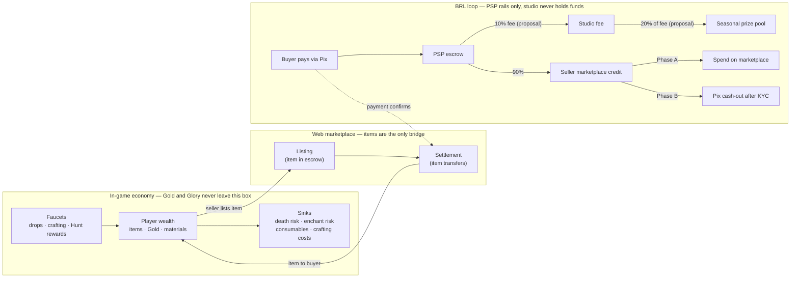

# 15 — Economy & Marketplace

> Part of the Dragon Heroes design set. Canon: [00-canon.md](../00-canon.md). Sibling systems:
> [items, loot & affixes](14-items-loot-and-affixes.md) ·
> [PvP & tournaments](16-pvp-and-tournaments.md) · [world & biomes](12-world-and-biomes.md).
> Implementation lives elsewhere: legal/payment plumbing in
> [business/30](../business/30-legal-payments-compliance.md), economy-core service and ledgers in
> [tech/26](../tech/26-backend-and-services.md), threat model (dupes, fraud, kill switches) in
> [tech/27](../tech/27-security-anticheat-and-economy-integrity.md).

## Purpose

This document is the player-facing design of the Dragon Heroes economy: what creates and destroys
value, what the three currencies are and why Gold is walled off from real money, how the
marketplace looks and feels to buyers and sellers, what the fees fund, and how we avoid becoming
the second coming of Diablo 3's real-money auction house — stated plainly, the single biggest
design risk this game carries. Everything here holds to two canon rules: **no paid randomness,
ever** and **no paid power** ([canon §2](../00-canon.md)); the marketplace is a complement to
play, never a substitute for it.

---

## 1. Design goals

1. **Playing is always the best path to power.** The hard power cap
   ([items doc](14-items-loot-and-affixes.md)) means best-in-slot is reachable by playing; buying
   compresses time but never raises the ceiling.
2. **The economy must consume value as fast as it creates it.** A market where items are immortal
   drowns in supply; every loop below has a matching sink.
3. **Real money touches exactly one surface**: the web marketplace ([canon §1](../00-canon.md) —
   never inside the mobile apps), and the studio never holds funds ([business/30](../business/30-legal-payments-compliance.md)).
4. **Everything suspicious is measurable.** The design emits the signals (§7) that
   [tech/27](../tech/27-security-anticheat-and-economy-integrity.md) alarms on.

## 2. The three currencies and the Gold–BRL firewall

Canonical names and roles from the [glossary](../00-canon.md):

| Currency | Earned by | Spent on | Player-to-player transfer | Cashable |
|---|---|---|---|---|
| **Gold** | Creature/boss drops, salvage, Hunt objectives | Crafting fees, enchant attempts, consumables, respecs, fast travel | **None (proposal)** — see below | **Never** |
| **Marketplace credit** | Selling items on the marketplace | Buying on the marketplace (Phase A); Pix cash-out (Phase B) | Not transferable — credit moves only through purchases | Phase B only |
| **Glory** | PvP kills and objectives | Cosmetics and effects **only** | None | Never |

**Items are the only asset class that crosses between the in-game economy and BRL**, and only
through the audited marketplace. Gold is never sold by the studio, never purchasable with BRL or
marketplace credit, and never convertible in either direction. Two reasons, both structural:

1. **Gambling classification.** Gold funds RNG outcomes — enchant attempts, crafting rolls. If
   Gold were purchasable, money would buy random outcomes in a game whose items are cashable,
   which is the exact fact pattern of an unlicensed *jogo online* under
   [Lei 14.790/2023](https://www.gov.br/fazenda/pt-br/composicao/orgaos/secretaria-de-premios-e-apostas/apostas-de-quota-fixa)
   (R$30M/5-year license; 12% GGR at enactment, escalating 13% (2026) / 14% (2027) / 15% (2028)
   via LC 224) and the pattern the
   [February 2026 New York AG suit against Valve](https://www.gamevicio.com/noticias/2026/02/valve-processo-loot-boxes-counter-strike-2/)
   attacks: paid randomness plus a market converting items to money. Our whole legal defense is
   that random drops come **only** from gameplay ([canon §2](../00-canon.md)); a purchasable Gold
   would burn that defense one step removed.
2. **Gold-farming incentives.** A cashable or purchasable soft currency turns every Gold faucet
   into a bot target and every balance patch into a financial event. Keeping Gold worthless in BRL
   keeps industrial farming pointed at items — which are throttled by drop rates, trade counts
   (§5), and per-item provenance ledgers — instead of at an anonymous fungible number.

The canon glossary says Gold is "never cashable, not tradable for BRL". We propose the stricter
reading: **no player-to-player Gold transfer at all (proposal)** — any Gold transfer channel
becomes a BRL bridge by proxy (pay R$100 for a junk item, hand back Gold in-game). Open question 2.

## 3. Value-flow map

### Sources and sinks

| Flow | Direction | What moves | Notes |
|---|---|---|---|
| Creature drops | Faucet | Items, Gold, Bestial Skill stones, Spirit Essences | Tuned per tier/rarity in [13-creatures](13-creatures-and-bestiary.md); Legendary bosses anchor top-end supply ([canon §4](../00-canon.md)) |
| Crafting | Faucet (items) / Sink (Gold, materials) | Materials + Gold → items | Net item creator, net Gold destroyer — the recipe costs are a primary Gold sink |
| Hunt objectives & salvage | Faucet | Gold, materials | Salvaging an item destroys it (item sink) and yields materials (faucet) |
| PvP | Faucet | Glory | Cosmetics-only; sealed off from the rest of the economy |
| Pet capture | Faucet | Pet instances — rolled attributes + skill set | Soul Snare capture in the Hunt; family pools and roll tables in [13-creatures](13-creatures-and-bestiary.md); the roll distribution is the top-end rarity engine ([canon §3](../00-canon.md), §4.6) |
| **Death loot risk** | Sink | Unsecured items and Gold | Loot is not safe until banked/extracted; dying in the Hunt forfeits a share of unsecured carried loot — **destroyed, not dropped for others** (proposal; transfers-on-death are a laundering and grief vector). Exact rules in [12-world](12-world-and-biomes.md) |
| **Enchant risk** | Sink | Spirit Essences, gear items | Enchant attempts above tier 3 (of 5) can fail, consuming the essence — and a failed tier-4/5 attempt can **destroy the item** (proposal); rules owned by [14-items](14-items-loot-and-affixes.md) |
| Consumables | Sink | Gold, materials | Potions, hunt sigils, waypoint charges — recurring per-session burn (proposal) |
| Respec & convenience | Sink | Gold | Attribute/skill respec fees, fast travel |
| **Pet sink (open)** | Sink | Pets | No canonical pet sink yet — breeding/fusion/release are candidates (proposal); §4.6, open question 8 |
| Marketplace fee | Sink (BRL) | 10% of every sale (proposal) | The only BRL-side sink; §4.5 |

The design target is that **sinks track faucets at roughly 1.0–1.1 faucet/sink ratio for Gold
(proposal)** and that item destruction (salvage + death + enchant failure) keeps effective supply
of tradable mid/high-tier items scarce enough to hold prices meaningful. §7 defines how we watch
this.

## 4. The marketplace

### 4.1 Surface and scope

The marketplace is **web-only** (`web/marketplace/`, [canon §1](../00-canon.md)) — mobile builds
carry **no cash-out/purchase UI and no links to the marketplace at all** (strict no-link posture,
the safe default pending counsel + store-policy review; the UI consequence is stated in
[17-art-direction §8](17-art-direction.md)). At launch it supports **fixed-price listings only
(proposal)**: no auctions, no buy orders, no bidding. Auctions and buy orders multiply the
price-manipulation surface (§8) and complicate escrow; we add them, if ever, only after the
market-health dashboard (§7) has a stable baseline.

### 4.2 Listing flow (seller's view)

1. Seller opens the marketplace, authenticated with the game account (already 18+/KYC-verified —
   §6.2). Their tradable inventory is shown; bound items and items with zero remaining trades
   (§5.3) appear greyed out with the reason.
2. Seller picks an item. The listing page shows the item card (base, affixes, remaining trade
   count) and **price guidance**: the last 30 comparable sales, the current cheapest comparable
   listings, and a suggested price band (proposal).
3. Seller sets a price in BRL — minimum listing price **R$5.00 (proposal)** — and confirms. The
   item leaves their in-game inventory immediately and enters escrow.
4. Listings expire after **14 days (proposal)** if unsold; the item returns automatically.
   Cancelling early is free but counts toward the listing-rate limits in §8.

### 4.3 Escrow as the player sees it

The economy core's item state machine (owned → listed → escrowed → settled;
[tech/26](../tech/26-backend-and-services.md)) surfaces to players as:

| Player-visible state | Seller sees | Buyer sees | Underlying state |
|---|---|---|---|
| **Listed** | "Your item is on the market" — item absent from inventory | Searchable listing | `listed` |
| **Sale pending** | "Buyer found — payment confirming" (listing locked) | "Pix payment processing" | `escrowed` |
| **Sold / Delivered** | Credit posted to marketplace balance | Item in in-game inventory | `settled` |
| **Returned** | Item back in inventory (expiry or cancel) | — | `owned` |

The invariant players can rely on: **an item and its payment are never in flight at the same
time without escrow** — the buyer's money sits at the PSP and the item sits locked with us until
one atomic settlement swaps both ([tech/26](../tech/26-backend-and-services.md)). No trade ever
"half-completes" from the player's perspective.

### 4.4 Search and price discovery

Search mirrors the affix system's structure ([14-items](14-items-loot-and-affixes.md)): filter by
item base, rarity, and **individual affixes with tier/value ranges** (PoE-trade style), plus
Bestial Skill stones and Spirit Essences by creature and effect. Every listing links to the
**price history of its basket** — a basket being base + rarity + key affix tiers — as a 90-day
chart of median sale price and volume (proposal). Because we must publish exact drop-probability
tables anyway (the TJDFT June 2026 standard is canon —
[canon §8](../00-canon.md),
[TJDFT ruling](https://www.tjdft.jus.br/institucional/imprensa/noticias/2026/junho/justica-condena-empresa-de-jogos-eletronicos-por-pratica-abusiva-com-criancas-e-adolescentes-em-recompensas-pagas)),
the marketplace links each base's drop odds next to its price history: scarcity is public
information, and prices can be sane.

### 4.5 Fees and what they fund

- **10% of each sale (proposal — canon §2)**, deducted at settlement via automatic PSP split.
  Fee floor: **max(10%, R$1.00) (proposal)** — combined with the R$5 minimum price this makes
  micro wash trades strictly lossy (§8).
- **20% of fee revenue (proposal — canon §2)** accrues to the seasonal tournament prize pool —
  i.e., 2% of gross marketplace volume funds the prizes in
  [16-pvp-and-tournaments](16-pvp-and-tournaments.md). This is shown publicly: the prize-pool
  ticker on the marketplace front page is both a marketing loop and an honesty device.
- No listing fee beyond the settlement fee at launch (proposal); if listing spam appears despite
  §8 rate limits, a small non-refundable listing deposit is the reserved lever.
- Invoicing (NFS-e per commission) and tax treatment are
  [business/30](../business/30-legal-payments-compliance.md)'s scope.

### 4.6 Pets as a market asset class

Canon v0.2 makes pets a first-class marketplace asset ([canon §3](../00-canon.md)): a pet
*instance* rolls random attributes **and a random skill set** drawn from its creature family's
pool — sparse, lore-coherent **family-shared skills** (e.g. Abyssal creatures share a few abyssal
skills) plus **species-signature skills**, with sharing deliberately rare so permutations stay
novel. Pets are fully tradable, and **perfect-roll pets are intended to be among the most
valuable assets on the marketplace**. Economically they sit on the item side of the §2 firewall —
a tradable asset, never a currency. What the canon means for this design:

- **The faucet is capture, not drops.** Pets enter the economy by capture (**Soul Snare**) in the
  Hunt; capture mechanics, family skill pools, and roll tables are owned by
  [13-creatures](13-creatures-and-bestiary.md).
- **The roll distribution is the rarity engine.** A pet's value spans several independent axes —
  each attribute roll plus which skills it drew — so a perfect multi-axis roll is
  *multiplicatively* rare. Top-end scarcity comes from the roll math itself rather than from a
  capture-rate knob, which keeps the studio's hands off the supply lever (§5.4) but concentrates
  value in long-tail outliers.
- **Search goes attribute-level.** §4.4's affix-style search extends to pets: filter by creature
  family, species, individual skills, and attribute-roll ranges. Without skill and roll filters a
  pet market is unsearchable noise.
- **Price discovery needs attribute-level history.** Pets are far more heterogeneous than affix
  baskets; the §4.4 basket becomes family + species + skill set + roll-quality band, with
  **attribute-level price history (proposal)** so a near-perfect roll has comps at all. Expect
  wide bands and thin comps at the top end — price guidance (§4.2) should degrade gracefully to
  family/species medians.
- **Pets have no matching sink yet.** Design goal 2 demands a sink per faucet, and a captured pet
  is otherwise immortal. Candidate sinks — breeding/fusion (consume pets to combine or reroll) or
  release-for-materials — are **(proposal)** only, and any such mechanic fed by BRL-bought pets
  must be checked against the paid-randomness line exactly as enchant inputs are (open
  question 5). Decision flagged as open question 8.

## 5. Why RMAHs fail: Diablo 3, and our three structural differences

Diablo 3's real-money auction house (2012–2014) is the canonical failure and the reason this
section exists. Blizzard took a fee on player-to-player real-money item sales — exactly our
revenue model — and had to
[remove it in 2014](https://www.gamespot.com/articles/ten-years-later-lessons-from-diablo-iiis-auction-house-disaster-have-not-been-remembered/1100-6503489/):
drop rates were tuned around the market, items never left the economy, and the efficient path to
power became the wallet. The kill-and-loot loop that retains ARPG players inverted — buying beat
playing — and the game bled players until Loot 2.0 shipped alongside the AH's removal. The
failure was **game design, not technology**; no ledger integrity fixes an itemization loop where
buying beats playing.

Our three structural differences:

### 5.1 The hard power cap

D3's power ceiling was open-ended, so money could always buy a better number. Dragon Heroes has a
**hard power cap** ([canon §4](../00-canon.md)): best-in-slot is reachable by playing, and the
meta refreshes through *diversity* — weekly new bases, affixes, Bestial Skills, Spirit Essences —
never through power inflation. Buying compresses the time to reach the cap; it cannot move the
cap. The marketplace sells sideways options, not upward power.

### 5.2 Aggressive sinks

D3 items were immortal, so supply only accumulated and every player eventually needed nothing.
Our economy destroys items continuously: death loot risk, enchant failure, salvage, and
consumable burn (§3) mean even a fully-geared player keeps generating demand — replacement gear,
essences for enchants, consumables for the next Hunt. Recurring destruction keeps drops exciting
*after* the market exists.

### 5.3 Bind and trade-count rules

Every tradable item carries a **finite trade count: 3 lifetime marketplace sales (proposal)**,
shown on the item card and decremented at each settlement. **A successful tier-4/5 enchant binds
the item, and a failed tier-4/5 attempt can destroy it (proposal)** — per
[14-items](14-items-loot-and-affixes.md), the enchant-rules owner. Committing an item to your
build takes it off the market permanently, and chasing top-tier enchants can remove it from the
economy entirely. Select
top-end uniques may drop account-bound with tradable crafting components instead (specifics owned
by [14-items](14-items-loot-and-affixes.md)). Together these cap how many times any item can
re-enter supply and make the strongest items *leave* the market as they are used.

### 5.4 Honest assessment: is that enough?

Probably necessary; **not provably sufficient**. Three residual risks we should be honest about:

1. **The cap protects the endgame, not the climb.** A new player can still buy their way through
   the mid-game, and if the climb is the fun, we resurrect D3's problem at a lower altitude.
   Mitigation is loot design (leveling drops bind-heavy, cheap, and fast to replace) — but this is
   a tuning bet, not a structural guarantee.
2. **The studio's incentive is the conflict.** We earn from trades, so every drop-rate decision
   has a revenue shadow — the precise trap D3 fell into. Proposed governance rule: **marketplace
   volume and fee revenue are never design-team OKRs, and drop-rate changes require published
   probability-table updates (proposal)** — the legal disclosure duty doubles as an honesty
   mechanism.
3. **Extrinsic value changes why people play.** Cashable loot can professionalize the Hunt into a
   job. Steam's Community Market
   [survives as a closed loop](https://help.steampowered.com/en/faqs/view/61F0-72B7-9A18-C70B)
   partly because stakes stay in-platform; our Phase B raises the stakes deliberately.

Consequence: **the marketplace does not open with real BRL until a closed-beta economy season has
run with play-money and the §7 dashboard live (proposal)**. If buying beats playing in beta
telemetry, we fix itemization before we take a single real fee (open question 7).

## 6. Selling: the seller's journey

### 6.1 Phase A vs Phase B ([canon §2](../00-canon.md))

| | Phase A — closed loop (launch) | Phase B — cash-out (gated) |
|---|---|---|
| After a sale | Proceeds appear as **marketplace credit** (held in PSP subaccounts) | Same, plus a "Withdraw via Pix" option |
| What credit can do | Buy any listed item; nothing else | Buy items, or cash out to the seller's **own verified Pix key only** |
| Feel for the seller | "Sell what you don't need, buy what you do" — a trading loop, Steam-model | Playing well has real-world value |
| Unlock condition | — | Formal legal opinion (parecer) + proven KYC/AML controls ([canon §2](../00-canon.md), [business/30](../business/30-legal-payments-compliance.md)) |

The architecture supports Phase B from day 1; the switch is legal, not technical. Sellers see the
phase clearly at onboarding — we never imply cash-out exists before it does.

### 6.2 Onboarding and taxes (reference only)

Selling requires an 18+ document-grade age-verified account with validated CPF KYC, handled in
the account portal (`web/account/`); details, PSP flows, and the PLD/AML program live in
[business/30](../business/30-legal-payments-compliance.md). Two seller-facing commitments this
design makes: an **annual sales statement** for every seller, and an in-product notice that gains
are taxable at 15% (GCAP) with the
[R$35,000/month small-value exemption](https://www.portaltributario.com.br/guia/isencao_ganho_capital_pf.html)
covering virtually all casual players.

## 7. Market-health metrics

The live dashboard the design team watches weekly (alert thresholds and automated responses are
[tech/27](../tech/27-security-anticheat-and-economy-integrity.md)'s scope):

| Metric | Definition | Healthy band (proposal) | Primary lever |
|---|---|---|---|
| Sale velocity | Median days from listing to sale, per rarity basket | < 2 d Common–Rare, < 10 d Epic, Legendaries may sit | Drop rates, listing duration |
| Price indices | Weekly median sale price per basket (base+rarity+affix tier) | Drift < ±15%/week outside patch weeks | Faucet/sink tuning |
| Gold faucet/sink ratio | Gold minted ÷ Gold destroyed, weekly | 1.0–1.1 | Sink pricing (crafting, consumables) |
| Item mint/destroy ratio | Items created ÷ items destroyed (salvage+death+enchant), per rarity | ~1.0 at steady state for tradable tiers | Death/enchant risk tuning |
| Wealth concentration | Top-1% share of Gold and of BRL proceeds; Gini over both | Watch trend, alarm on step changes | Listing limits, investigation |
| Listing hygiene | Cancel ratio, unsold-expiry ratio, relist frequency | Cancel < 20%, expiry < 30% | Price guidance UX, deposit lever (§4.5) |
| Mint-rate anomalies | Per-source item/Gold creation vs baseline | Any spike | Kill switches ([canon §8](../00-canon.md)) |

## 8. Wash trading and price manipulation — design-level counters

Wash trading (selling to yourself or an accomplice) has three motives here: laundering money
through item sales, painting fake price history, and bridging Gold to BRL (§2). Detection and
enforcement belong to [tech/27](../tech/27-security-anticheat-and-economy-integrity.md) and the
COAF-aligned PLD program in [business/30](../business/30-legal-payments-compliance.md); this is
what the *design* does to make manipulation expensive before detection matters:

- **Every cycle is lossy.** 10% fee with an R$1.00 floor and R$5.00 minimum price (§4.5) means
  round-tripping an item burns at least 10% per hop — painting a price history has a real cost.
- **Listing limits**: **10 concurrent listings and 3 new listings per hour per account
  (proposal)**, raised for accounts with sale history in good standing. One marketplace account
  per CPF, enforced at KYC.
- **Trade counts** (§5.3) cap how many times the same item can cycle at all.
- **Relist cooldown**: a purchased item cannot be relisted for **48 hours (proposal)**. This
  dampens flip-bots and same-item wash loops; it also dampens legitimate market-making, a
  trade-off we accept at launch and revisit with data.
- **No buy orders or auctions** at launch (§4.1) — the classic spoofing/bid-manipulation surfaces
  simply do not exist.
- **Off-price friction**: listing far outside the basket's comp band triggers a confirmation
  interstitial showing recent comps (proposal) — protects honest sellers from mispricing and
  makes deliberate off-market pricing (a laundering signature) an explicit, logged choice.

## Open questions (for Ricardo)

1. **Fee shape** — confirm 10% flat + R$1.00 floor + R$5.00 minimum price, or do you want tiered
   fees by price band (e.g., lower % on high-value Legendaries to keep whales on-platform)?
2. **Gold strictness** — canon says Gold is never cashable/tradable-for-BRL; this doc proposes
   the stricter rule that Gold is not player-to-player transferable *at all*. Confirm or relax.
3. **Death loot risk severity** — approve the "unsecured loot is destroyed on death" direction
   (harsh, strong sink) vs. a milder durability-damage model, given items carry real-money value.
4. **Trade counts and enchant bind/destroy rules** — confirm 3 lifetime sales per item, and the
   [14-items](14-items-loot-and-affixes.md) enchant rules this doc mirrors (tier-4/5 success binds
   the item; failed tier-4/5 attempts can destroy it); these numbers gate market supply.
5. **Marketplace-bought RNG inputs** — buying Spirit Essences with BRL and gambling them on
   enchants is one step from paid randomness. Should enchant inputs be non-tradable, or do we put
   this question explicitly in the parecer scope? (Recommend at minimum the latter.)
6. **Fixed-price-only launch** — accept the liquidity cost of no auctions/buy orders at launch?
7. **The beta gate** — approve "no real-BRL marketplace until a closed-beta economy season with
   play-money passes the §7 health bands" as a formal launch criterion (this also feeds canon
   open decision 5, the Phase A→B gate).
8. **Pet sink** — pets are a canon faucet (Soul Snare capture) with no matching sink; approve
   exploring breeding/fusion/release (proposal, §4.6), or accept pets as destruction-free assets
   whose scarcity rests entirely on the roll distribution?

## Sources

- [GameSpot — Ten Years Later, Lessons From Diablo III's Auction House Disaster](https://www.gamespot.com/articles/ten-years-later-lessons-from-diablo-iiis-auction-house-disaster-have-not-been-remembered/1100-6503489/)
- [Steam Support — Community Market FAQ (closed-loop model)](https://help.steampowered.com/en/faqs/view/61F0-72B7-9A18-C70B)
- [SPA/Ministério da Fazenda — Apostas de Quota Fixa (Lei 14.790/2023)](https://www.gov.br/fazenda/pt-br/composicao/orgaos/secretaria-de-premios-e-apostas/apostas-de-quota-fixa)
- [GameVicio — Nova York processa Valve por loot boxes de CS2 (fev/2026)](https://www.gamevicio.com/noticias/2026/02/valve-processo-loot-boxes-counter-strike-2/)
- [TJDFT — condenação por prática abusiva em recompensas pagas (jun/2026)](https://www.tjdft.jus.br/institucional/imprensa/noticias/2026/junho/justica-condena-empresa-de-jogos-eletronicos-por-pratica-abusiva-com-criancas-e-adolescentes-em-recompensas-pagas)
- [Portal Tributário — Isenção do ganho de capital PF (bens de pequeno valor, R$35 mil/mês)](https://www.portaltributario.com.br/guia/isencao_ganho_capital_pf.html)
- Internal research digests: `pix-marketplace-legal`, `live-content-architecture` (July 2026 research pass).
