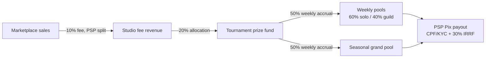

# 16 — PvP & Tournaments

> Part of the Dragon Heroes document set. Canonical names and numbers come from the
> [canon](../00-canon.md) (§5 PvP & tournaments, §2 monetization, §9 creature AI).
> Status: v0.1 draft — 2026-07-07.

> **Sequencing (2026-07-17):** PvP is milestone **M-B** in the
> [multiplayer roadmap](21-multiplayer-roadmap.md) — after co-op exploration and the
> combat/skill overhaul it depends on. That document orders *when* PvP arrives; **this
> document stays authoritative for PvP formats and rules**. Nothing here is scheduled yet.

## Current continuity direction (2026-09-12)

Characters, gear and skills never reset with seasons. Skill uncertainty/MMR and
standings are separate from accumulated matches; bots are visibly tagged and
start in exhibition play with no human prize eligibility. Guild territory and
100v100 benchmarking are scheduled, not proven. See [design/27](27-continuity-and-community.md).

## Purpose

This document specifies competitive Dragon Heroes: the three PvP modes (1v1 duel, 3v3 arena, and the Gloomfall battle royale), the Trophies ranked system and Glory reward currency, how gear is handled in ranked play, the weekly and seasonal tournament structure with its marketplace-funded prize pools, the legal constraints that shape prize design in Brazil, and the Champion Ghosts feature that turns each week's winner into a challengeable AI opponent. The core stance, inherited from the canon's anti-pay-to-win rules, is that competition must be won with skill and build strategy — never bought — even though the game contains a real-money item marketplace ([economy](../design/15-economy-and-marketplace.md)).

## Design goals

1. **Skill decides matches.** The global power cap ([items](../design/14-items-loot-and-affixes.md)), the ranked per-slot power budget (§ Gear in ranked), and input-segregated ranked queues together keep the wallet out of the outcome.
2. **PvP is a destination, not a chore.** No PvE progression is gated behind PvP; Glory buys cosmetics only, so PvE-focused players lose nothing by ignoring it.
3. **Tournaments are free to enter, always.** This is a legal hard line, not a preference (§ No entry fees, ever).
4. **Every competitive match is reviewable.** The deterministic simulation ([simulation core](../tech/21-simulation-core.md)) makes full replays cheap; integrity is enforced with evidence, not vibes.
5. **Champions become content.** Weekly winners feed the Champion Ghosts pipeline ([creature AI & RL](../tech/25-creature-ai-and-rl.md)) — the ladder produces next week's boss fight.

## The three modes

| Mode | Players | Format | Target match length | Map |
|---|---|---|---|---|
| 1v1 Duel | 2 | Best-of-3 rounds, 90 s round cap (proposal) | 3–6 min | Small symmetric procgen arena from templates |
| 3v3 Arena | 6 | Single round + Ascendant Altar objective (proposal) | 5–8 min (proposal) | Mid-size symmetric arena, lane/pillar features |
| Gloomfall (BR) | 40 (proposal) | Last hunter standing; the Gloom closes the map | 12–16 min (proposal) | Full procgen wilderness, ~1.5×1.5 km (proposal) |

All PvP runs on the same 30 Hz authoritative simulation, 20 Hz snapshots, and 300 ms lag compensation as the Hunt ([netcode](../tech/22-netcode-and-server-hosting.md)); the damage model and hitbox rules are identical to PvE ([combat](../design/11-combat-and-controls.md)) with a single global PvP damage multiplier per mode as the only tuning knob (proposal — keeps skills readable across modes without forking balance tables).

### 1v1 Duel

The purist mode and the source of Champion Ghosts. Rounds start at fixed spawn points on a small arena (~40×40 m, proposal) assembled from hand-authored symmetric templates, biome-skinned by the procgen stack ([world generation](../tech/24-procedural-world-generation.md)) so duels visually rotate through the five launch biomes. At 60 s into a round, **Sudden Surge** begins: both duelists take stacking +5% damage taken per 5 s (proposal), guaranteeing a round ends by the 90 s cap. Healing effectiveness is reduced by 40% in duels (proposal) to prevent attrition stalemates. Pets and summons are **allowed in ranked 1v1 and 3v3** — they are part of the build, counted inside the per-slot power budget like everything else (§ Gear in ranked; pet capture and instance rolls in [creatures & bestiary](../design/13-creatures-and-bestiary.md)) — but revive between rounds only.

### 3v3 Arena

Team fights with a stall-breaker. The arena is larger (~80×80 m, proposal) with generated pillar cover, elevation ledges (z-height matters — divers and fliers get real angles), and a central **Ascendant Altar** that activates at the 3-minute mark (proposal): a channelable objective granting a stacking team damage aura. Teams win by full wipe or by holding the Altar through three activations (proposal). One respawn wave per player at 90 s and 180 s (proposal) keeps early picks from deciding the match outright; after the Altar activates, deaths are permanent.

### Gloomfall

Forty hunters (proposal) drop into a freshly generated wilderness slice — same noise stack, biomes, and POIs as the Hunt, seeded per match, so no one has map knowledge beyond biome literacy. **The Gloom**, a wall of consuming darkness, contracts in phases (5 phases, ~2.5 min each, proposal) toward a seeded final zone; standing in the Gloom deals escalating percent-max-HP damage.

Gloomfall runs on **normalized loadouts** (proposal): players drop with their class and class-skill loadout only, and **all gear is found in-match** from a curated BR loot table — nothing carries in, nothing carries out. The marketplace-tradable asset classes stay explicitly **outside** the mode: gear, pets, and Bestial Skill stones — marketplace-bought or self-looted — do not enter a Gloomfall match (proposal). This makes Gloomfall **gear-normalized** — marketplace power is kept out by construction, though accounts still differ in class progression and skill unlocks — and gives it its own looting-under-pressure rhythm. Roaming creature packs and a mid-match Legendary boss at a marked POI (proposal) provide PvPvE third-party pressure and high-tier in-match gear for whoever dares. Low-rating lobbies are filled with RL bots per the canon (§9); bots are trained with human-fairness constraints and visibly labelled [AI] before and during play (current proposal, canon §12.47; supersedes the old post-match-only disclosure proposal).

Gloomfall matches burst-schedule onto Edgegap capacity rather than the persistent Agones fleet ([hosting](../tech/22-netcode-and-server-hosting.md)).

## Trophies — ranked rating

**Trophies** is the ranked rating (canon glossary). We propose a **Glicko-2** implementation (proposal — Ricardo to confirm) rather than plain Elo: Glicko-2's rating deviation (RD) gives fast placement for new players, honest uncertainty after absences, and a volatility term that resists rating manipulation.

- **Per-mode ratings.** Separate Trophies for Duel, Arena, and Gloomfall. Skill transfer between a 1v1 duel and a 40-player BR is too weak for one number.
- **Parameters (proposal):** start rating 1500, RD 350, volatility 0.06; rating period = one calendar day of matches.
- **3v3:** team rating for premades is the party average weighted 60% toward the highest member (proposal) — an anti-boosting measure; solo-queue players are matched within a ±150 rating band.
- **Gloomfall:** placement converts to implicit pairwise results — a win against every player you outlasted, a loss to every player who outlasted you — weight-normalized so one BR match moves Trophies about as much as one arena match (proposal). Kills influence Glory, not Trophies (placement-first metas are healthier for BR pacing).
- **Leagues (proposal):** Bronze < 1300, Silver 1300–1499, Gold 1500–1699, Platinum 1700–1899, Diamond 1900–2099, **Dragon League** 2100+ (top league, ladder position shown).
- **Seasonal soft reset (proposal):** at each 12-week season boundary, `r' = 0.75·r + 0.25·1500` and RD is raised to at least 200. Standings compress, history isn't erased, and the first ranked week stays sane.

Ranked unlocks at account level 15 (proposal). Nakama's leaderboard/tournament APIs back the ladder ([backend](../tech/26-backend-and-services.md)); rating math runs server-side in the backend, never on clients.

**Season-end rewards (proposal):** peak league reached grants a Glory bundle (500–5,000 scaled by league), a seasonal border cosmetic, and — Diamond and Dragon League only — an animated title. Rewards are cosmetics and Glory exclusively, consistent with the no-paid-power and cosmetics-only reward rules; ranked never pays out items, Gold, or anything marketable, so the ladder itself can never become an RMT farming surface ([economy](../design/15-economy-and-marketplace.md)).

## Ranked queues and input segregation

Per canon (§1), ranked queues are **segregated by input class — mouse+keyboard vs touch/controller — at launch** (proposal — revisit with data). Each mode therefore has two parallel ranked ladders. Input class is detected at queue time and locked for the match; switching input mid-match flags the match for review and voids rating change (proposal). **Casual and Hunt cross-play is unrestricted** — segregation exists only where rating and money are at stake.

Weekly tournaments and the seasonal grand tournament run **parallel brackets per input class**, with prize allocations split pro-rata by entrant count and a floor of 25% for the smaller bracket (proposal), so neither community's prizes evaporate if populations skew.

Matchmaking behavior (all proposal): the queue seeks opponents within ±100 Trophies, widening by 50 every 15 s to a hard ceiling of ±400; queues longer than 3 minutes offer the player an optional unrated match instead. Gloomfall lobbies assemble from a wider band (±300) because a 40-player field averages out variance, and short-fill lobbies top up with RL bots below Gold league (canon §9) rather than waiting. Dodging a found match costs a short queue lockout (30 s, doubling per repeat within 24 h) but never Trophies — rating should only ever move on played matches.

## Gear in ranked: the per-slot power budget

Canon (§5) sets the approach: ranked applies a **per-slot power budget** on top of the global power cap. Concretely (all numbers proposal):

- Every affix already carries a **power cost** derived from its tier in the affix tables ([items](../design/14-items-loot-and-affixes.md)); an item's Power Score is the sum of its affix costs. Legendary uniques carry a hand-assigned cost for their special effect.
- Each equipment slot has a ranked budget — e.g. weapon 100, each armor slot 70, each accessory 50 — tuned so a **well-rolled Rare reaches ~90% of budget and a perfect Epic or Legendary reaches exactly 100%**.
- Entering a ranked match, any item over budget has its numeric stats **proportionally downscaled to the budget** (the tooltip shows the ranked-adjusted values). Under-budget items are untouched. Nothing is banned; nothing needs a second gear set.
- Bestial Skill stones and Spirit Essence enchantments count against the budget of the item they occupy.
- **Pets and summons are allowed in ranked 1v1 and 3v3.** The companion slot carries its own ranked budget (proposal), computed from the pet instance's attribute roll and skill set (rolls and capture rules in [creatures & bestiary](../design/13-creatures-and-bestiary.md)). The canon's anti-pay-to-win lever is the power cap, not exclusion: a pet is a build choice inside the same ceiling, so a marketplace-bought perfect roll buys convenience, not headroom. Whether pets would be normalized on a tournament realm rides with that open question (§ Open questions).

The intended effect: the marketplace can get you *to* the ranked ceiling faster, but never *past* it, and the gap between a grinder's gear and a whale's gear inside ranked is a few percent of stat efficiency — build choice (which affixes, which Bestial Skills, which pet) dominates. Gloomfall sidesteps the question via normalized loadouts — match-local gear, no marketplace assets (§ Gloomfall).

The known alternative — a fully **normalized "tournament realm"** where everyone picks from identical standardized gear sets — is stronger on paper for esports purity but severs the loop that makes loot matter in Dragon Heroes and removes tournament visibility from the marketplace economy. It stays an explicit open question (§ Open questions, and canon §12.2).

## Glory and the cosmetics shop

**Glory** is earned from kills and objectives and spends **only on cosmetics and effects** (canon §5). It is never purchasable, never tradable, and never converts to Gold, marketplace credit, or BRL — keeping it entirely outside the real-money and RMT surface ([economy](../design/15-economy-and-marketplace.md)).

| Source | Glory (proposal) |
|---|---|
| Duel round win / match win | 5 / 25 |
| Arena kill / objective tick / match win | 5 / 10 / 40 |
| Gloomfall kill | 8 |
| Gloomfall placement | top 20: 10 → winner: 100 (stepped) |
| First win of the day (per mode) | 50 |
| Weekly tournament participation (≥3 qualifier matches) | 200 |
| Defeating a Champion Ghost (first time each week) | 150 |

A weekly soft cap of 2,000 Glory (proposal; earnings beyond it are quartered) paces the shop without punishing enthusiasts. Shop stock: victory poses, kill effects, arena banners, Gloom-drop trails, palette-LUT weapon glows, and Champion Ghost commemorative badges, priced 500–15,000 Glory (proposal). Casual PvP earns Glory at ~60% of ranked rates (proposal) so the currency is not ranked-exclusive.

## Weekly tournaments

Two free tournaments run every week of the season, operated on Nakama's tournament API with prize custody in the economy core's ledger ([backend](../tech/26-backend-and-services.md)).

### Solo weekly — 1v1 Duel (proposal)

- **Qualifier ladder, Monday 00:00 → Friday 20:00 (BRT):** unlimited matches in a dedicated tournament queue at ranked rules; a player's score is their **best 10 match results** (win = 3 points weighted by opponent rating; this rewards playing up, not farming volume).
- **Bracket, Saturday:** top **64 per input class** (proposal) seed a single-elimination bracket; best-of-3, semifinals onward best-of-5. Matches are scheduled in fixed windows; a no-show forfeits.
- The bracket winner is that week's **Champion** — prize money, the Champion cosmetic title, and (with consent) a Champion Ghost.

### Guild weekly — aggregate + team bracket (proposal)

- **Aggregate stage (Mon–Fri):** guilds score points from members' tournament-queue and ranked play (top 30 member-results count per guild, proposal) — broad participation beats a mercenary trio.
- **Team bracket (Sunday):** top **16 guilds** field 3v3 rosters (up to 6 rostered players, substitutions between series) in single elimination, best-of-3.

Gloomfall gets a weekly **Gloomfall Cup** point ladder (best 5 placements Mon–Sat, proposal) folded into the same prize schedule once operational load allows — flagged as an open question rather than promised for launch.

## Season structure and prize pools

A season is **12 weeks** (canon, proposal): 11 weekly cycles, then a **Seasonal Grand Tournament** across the final week(s), then the soft reset.

| Season weeks | What runs |
|---|---|
| 1 | Placement push (soft-reset RD is high; ratings settle fast), first weekly tournaments |
| 2–10 | Steady weekly cadence: solo + guild tournaments, Champion Ghost each Monday |
| 11 | Last weekly tournaments; Grand Tournament qualification locks at week's end |
| 12 | Seasonal Grand Tournament (1v1, 3v3, Gloomfall championships), season rewards, then soft reset |

Because weekly content drops land throughout the season ([content pipeline](../tech/23-content-pipeline.md)), a **balance lock** freezes combat-affecting content changes for the final two weeks (proposal): week 11 qualifiers and the week 12 grand bracket play on the same patch, and Champion Ghost fine-tunes for those weeks skip redeployment unless the eval gate flags a regression.

Funding revision (2026-09-12, canon §12.47): evaluate 10% of distributable profit for prizes plus 10% for contributors, detailed in [business/33](../business/33-community-funding.md). No unfunded guaranteed floor. The following 20%-of-fees diagram is the historical proposal, retained for comparison only.

- **Weekly pools:** 50% of each week's accrual pays that week's tournaments — 60% to the solo bracket, 40% to the guild bracket (all proposal). Pools are announced at week start based on the prior week's actuals, so players see a concrete number before they compete.
- **Seasonal grand pool:** the other 50% compounds all season, making the Grand Tournament the headline payout. Grand events (proposal): Gloomfall Championship 40%, 3v3 Championship 35%, 1v1 Championship 25% of the grand pool. Qualification: season Trophy standings plus automatic seeds for weekly champions.

### Prize distribution curves (proposal)

Solo weekly, per input-class bracket (top 16 paid):

| Place | 1st | 2nd | 3rd–4th | 5th–8th | 9th–16th |
|---|---|---|---|---|---|
| Share | 30% | 18% | 10% each | 5% each | 1.5% each |

Guild weekly (top 8 paid): 35% / 20% / 13% / 10% / 5.5% × 4. A guild's prize is **split at source into individual PSP payouts** — equal shares among rostered members who played at least 3 bracket matches or 10 aggregate-stage matches (proposal). The studio never pays a "guild treasury" and never lets a guild leader redirect shares: every centavo lands on a verified individual's own Pix key, which is also the AML posture the canon requires (§8).

Curves are deliberately flat-ish for a weekly cadence: a 30% first-place share keeps winning meaningful while paying deep enough that top-16 regulars feel the pool exists. The Grand Tournament may steepen (winner ~35–40%, proposal).

**Illustrative math (not a projection):** at R$500k/month of marketplace sales, the 10% fee yields R$50k/month; the 20% allocation is R$10k/month ≈ R$2,300/week to the prize fund. Weekly pools would be ~R$1,150 (R$690 solo / R$460 guild across both input-class brackets) with ~R$13,800 compounding into the grand pool over 12 weeks. These are small at launch scale — which is fine: the weekly cadence, titles, and Champion Ghosts carry prestige while pools grow with the marketplace, and the studio can sponsor top-ups for milestone seasons as marketing spend. What we must never do is inflate pools with entry fees (§ No entry fees, ever).

## No entry fees, ever

This is a canon hard rule (§5) with a statutory reason. **Lei 14.790/2023** regulates fixed-odds betting and "jogos online" — games where prizes are wagered on outcomes influenced by chance — under a federal SPA/MF license costing **R$30M per 5 years** plus taxation of **12% GGR at enactment, escalating 13% (2026) / 14% (2027) / 15% (2028) via LC 224** ([SPA/Ministério da Fazenda](https://www.gov.br/fazenda/pt-br/composicao/orgaos/secretaria-de-premios-e-apostas/apostas-de-quota-fixa); details in [legal & compliance](../business/30-legal-payments-compliance.md)); operating such a scheme without a license remains a criminal contravention (art. 50 LCP), and enforcement against unlicensed betting-adjacent operations is active and aggressive (e.g. the Federal Police's July 2026 [Operation Véu de Maia](https://www.gov.br/pf/pt-br/assuntos/noticias/2026/07/pf-deflagra-operacao-para-apurar-esquema-de-lavagem-de-dinheiro-ligado-a-apostas-ilegais)). Entry fees pooled into prizes for matches that any regulator could argue contain chance elements (procgen maps, drop RNG, matchmaking) is exactly that fact pattern.

Dragon Heroes tournaments are therefore structured as **skill-predominant competitions with studio-sponsored prize pools**: free entry for every eligible account, prizes funded from the studio's own fee revenue, never from participants. This mirrors the research recommendation and keeps the tournament system on the promotional-competition side of the line. Full legal analysis lives in [legal & compliance](../business/30-legal-payments-compliance.md). Corollary: no paid "tournament tickets," no consumable required to queue, and cosmetic pass ownership must never gate entry.

## Prize payout — player experience

Prizes are cash via Pix (canon §5) — a studio→player sponsored payment on PSP rails, distinct from marketplace cash-out phases:

1. **Before competing:** prize-eligible brackets require a KYC-complete account. Since every account already passed CPF/document-grade 18+ verification (canon §1), the incremental step is payout onboarding — confirming the player's own Pix key via the PSP's key-ownership check.
2. **Winning:** the post-tournament screen shows the gross prize, the **30% IRRF withholding on cash prizes**, and the net Pix amount — no surprises at settlement. Tax mechanics and the annual statement live in [legal & compliance](../business/30-legal-payments-compliance.md).
3. **Settlement:** payouts execute **T+72 h after the bracket ends** (proposal) — the integrity review window (§ Integrity) — only to the verified holder's own Pix key (canon §8, AML posture).
4. **Declining KYC:** a placer who won't complete payout onboarding within 30 days (proposal) forfeits the cash (redistributed per curve) and receives a Glory/cosmetic consolation bundle (proposal).

All prize liabilities are entries in the economy core's double-entry ledger; the economy core is the sole writer and the PSP executes ([backend](../tech/26-backend-and-services.md)).

## Champion Ghosts

The headline retention feature: **every week, the outgoing solo champion becomes a boss.** From Monday, any player can challenge the **Ghost of last week's Champion** — an RL sparring bot trained on the champion's actual play, running the champion's exact build, loadout, and cosmetics.

- **Pipeline** (detailed in [creature AI & RL](../tech/25-creature-ai-and-rl.md)): server-side obs+action replay logs from the champion's tournament and ranked matches feed behavioral-cloning pretraining, then RL fine-tuning with a KL penalty toward the cloned policy so the ghost stays *their* style rather than converging to a generic optimum; the policy is conditioned on the champion's build embedding. Weekly cadence is viable because the sim is a headless C++ library trained via PufferLib and the schema absorbs weekly content as new embedding rows (canon §9).
- **Fairness is trained in, not bolted on:** 150–250 ms observation delay, burst action-rate caps, aim noise, client-equivalent observations (canon §9). The ghost should feel like fighting a very good human, not an aimbot.
- **Weights never ship to clients** — inference is ONNX INT8 on server CPU only. A leaked strong policy becomes a ranked-cheat and farming tool, as the Rocket League "Nexto" incident demonstrated ([Kotaku](https://kotaku.com/rocket-league-machine-learning-cheating-nexto-bot-1849980593)). Self-play sparring agents beating pros is proven territory (NCSoft's Blade & Soul duel agent, [arXiv:1904.03821](https://arxiv.org/abs/1904.03821)); ours are deliberately detuned to championship-human level via the eval gate.
- **Consent, credit, revenue share** (canon §5): tournament registration includes explicit opt-in to replay training and likeness use — LGPD-reviewed, revocable for future weeks. A champion who declines still keeps the full prize; that week simply ships no ghost. Ghosts are challengeable **free**; the champion is credited on the challenge screen, and a weekly direct-purchase champion-themed cosmetic ("Champion's Colors" palette recolor, proposal) pays the champion a **25% net revenue share (proposal)** through the same KYC'd payout rails.
- **Player experience:** unlimited attempts; first weekly victory awards 150 Glory and a dated badge (§ Glory table). Ghost difficulty is served at two checkpoints — "as crowned" and a mid-league-tuned variant (proposal) — so mid-ladder players get a fair sparring partner, not a wall.

## Spectating, replays, and integrity

- **Replays:** the deterministic fixed-tick sim means a replay is just the input/event log re-simulated ([simulation core](../tech/21-simulation-core.md)). Every ranked and tournament match produces a server-stored replay, retained for the full season (proposal); players can review any of their own matches and any tournament bracket match in the replay viewer with free camera.
- **Spectating:** live tournament spectating and all official broadcasts run at a **3-minute delay** (proposal) to kill stream-sniping and real-time coaching; competitors streaming their own qualifier matches must use ≥2 min delay per tournament rules (proposal).
- **Replay review before payout:** the T+72 h settlement window (§ Payout) exists so anti-cheat can act on evidence. All bracket matches from quarterfinals up are auto-queued for review — anomaly scoring first (input cadence, reaction-time distributions, accuracy-vs-visibility checks against the AOI record), human review on flags. Server-authoritative simulation plus interest-managed snapshots already exclude whole cheat classes ([security & anti-cheat](../tech/27-security-anticheat-and-economy-integrity.md)).
- **Win-trading and collusion:** qualifier pairings are randomized within rating bands; repeat-opponent results decay in qualifier scoring (proposal); economy-style anomaly monitors watch for result patterns correlated with off-platform relationships (shared devices, mutual trade history). Gloomfall teaming detection uses proximity-without-aggression heuristics on replays (proposal).

Confirmed violations forfeit prizes (redistributed per curve), void ratings, and — because every account is CPF-anchored — carry real recidivism cost: tournament bans stick to the person, not the account.

## Smurfing and boosting countermeasures

Dragon Heroes has an unusual structural advantage: **18+ CPF/document-grade verification on every account** (canon §1) means one ranked identity per human is enforceable at signup, not inferred afterward. On top of that:

- **Fast placement, honest uncertainty:** Glicko-2's high initial RD moves genuinely strong new accounts out of low ranks within ~10 matches, shrinking any smurf's damage window.
- **Party rating skew:** 3v3 premade rating weights 60% toward the strongest member (§ Trophies), making carry-duos face appropriately hard lobbies; Dragon League restricts premades to ±250 rating spread (proposal).
- **Account-sharing (boosting) detection:** input-pattern and reaction-distribution drift on a per-account baseline, correlated with device/geo changes (proposal); flagged accounts are rating-frozen pending review. Prize eligibility requires the KYC'd owner to be the player — a boosted account cannot legally collect, which removes most of the commercial incentive.
- **Bot lobbies as a pressure valve:** Gloomfall's RL lobby fill (canon §9) keeps low-rating queues fast without feeding smurfs a stream of genuine novices.
- **Penalty ladder (proposal):** rating void → season disqualification → prize forfeiture → marketplace suspension. The last one has teeth precisely because the marketplace carries real money.

## Open questions (for Ricardo)

1. **Ranked gear policy (canon §12.2):** confirm the per-slot power budget for launch, or direct us to prototype the normalized "tournament realm" for the Seasonal Grand Tournament only (hybrid: budgeted weekly ranked, normalized grand finals)?
2. **Gloomfall normalized loadouts:** approve the proposal that Gloomfall uses match-local gear only (nothing in, nothing out) and keeps marketplace assets — pets and Bestial Skill stones included — out of the match entirely, exempting it from the power-budget system?
3. **Glicko-2 adoption:** approve Glicko-2 as the Trophies implementation with the proposed parameters and 0.75-compression seasonal soft reset?
4. **Prize fund split:** approve 50% weekly / 50% seasonal accrual, 60/40 solo/guild weekly split, and the top-16 / top-8 payout curves — or reweight toward the seasonal grand pool for a bigger headline number?
5. **Input-class tournament brackets:** confirm parallel brackets per input class with pro-rata pools and a 25% floor, or should tournaments launch mkb-and-controller merged despite segregated ranked queues?
6. **Champion Ghost revenue share:** approve the 25% net share on the weekly champion cosmetic as the canonical "revenue share" mechanism, and the free-to-challenge stance?
7. **Prize cash in Phase A:** canon says prizes pay via Pix after KYC — confirm this applies from launch (studio-sponsored payouts are legally distinct from marketplace cash-out), or should Phase A prizes pay as marketplace credit until the parecer lands?
8. **Gloomfall Cup at launch:** the weekly Gloomfall point ladder adds a third weekly operation — include at launch or defer to season 2?
9. **Bot disclosure:** approve "undisclosed in lobby, labeled in post-match report" for Gloomfall RL fill, or require upfront disclosure (safer optics, weaker low-MMR experience)?

## Sources

- [SPA/Ministério da Fazenda — Apostas de Quota Fixa (Lei 14.790/2023)](https://www.gov.br/fazenda/pt-br/composicao/orgaos/secretaria-de-premios-e-apostas/apostas-de-quota-fixa) — licensing and scope of regulated betting; basis for the no-entry-fee rule.
- [Polícia Federal — Operação Véu de Maia (jul/2026)](https://www.gov.br/pf/pt-br/assuntos/noticias/2026/07/pf-deflagra-operacao-para-apurar-esquema-de-lavagem-de-dinheiro-ligado-a-apostas-ilegais) — active enforcement climate around unlicensed betting-adjacent schemes.
- [Kotaku — Rocket League players used the Nexto bot to cheat](https://kotaku.com/rocket-league-machine-learning-cheating-nexto-bot-1849980593) — precedent for never shipping policy weights to clients.
- [NCSoft — Creating Pro-Level AI for a Real-Time Fighting Game Using Deep RL (arXiv:1904.03821)](https://arxiv.org/abs/1904.03821) — closest shipped analog for duel-mode sparring agents.
