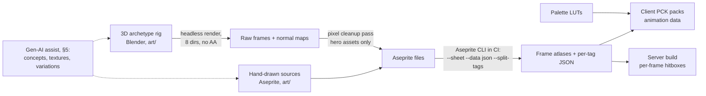

# 17 — Art Direction

**2026-09-12 direction update:** [design/26](26-living-pixel-world.md) and
canon §12.45 supersede this document's console-generation/retro quality
metaphor. Modern clustered pixel art, expressive animation and material detail
are the target. Existing camera, palette, readability and performance rules
still apply. The new pipeline and candidates are described in
[tech/34](../tech/34-living-content-pipeline.md).

> **Status:** v0.2 draft — 2026-07-08. Conforms to [canon](../00-canon.md) v0.2 §1 (art
> identity, perspective, 60 FPS performance identity), §4 (creature archetypes, biomes, boss
> canon), §6 (client rendering, particle/frame budgets), §7 (art pipeline, gen-AI production).
> Numbers marked **(proposal)** are starting values for the art test and first playable.
> v0.2 adds the gen-AI production pipeline (§5), the 60 FPS performance budgets (§3.5), and
> AI-assisted production ranges (§10) per canon v0.2.

## Purpose

This document defines the visual identity of Dragon Heroes and the production machinery that
sustains it at a weekly content cadence. It establishes the art pillars and concrete style
anchors, proposes the technical art specification (tile metrics, projection, lighting,
palettes, performance budgets), makes the pipeline recommendation for the shared creature
archetype rigs, defines the curated gen-AI production pipeline, and standardizes animation,
telegraph, VFX, and UI language so that every asset shipped by any artist reads as one game.
It closes with the mandatory art test that must run before we commit to a pipeline, and a
weekly production budget. Combat feel numbers here are presentation-side only; anything that
touches combat math lives in [combat](11-combat-and-controls.md) and runs in `sim/` per the
canon coupling rules.

## 1. Identity — the 64-bit 2D generation that never happened

The canon fixes our identity as "the 2D games a 64-bit console generation would have produced."
We interpret that literally: imagine the studio that made a 16-bit masterpiece got one more
console generation of 2D — quadruple the colors, real-time lighting, huge animated sprites —
before 3D took over. That game never existed. We are making it. Four art pillars follow:

1. **Beautiful first, dark beneath.** This is dark fantasy where the horror lives *inside* a
   breathtaking world — luminous forests, bioluminescent fens, auroras over frozen peaks —
   never a brown, desaturated one. Dread comes from what moves through the beauty, from what
   the light reveals at its edges, not from murk. If a screenshot is not gorgeous, the darkness
   has failed, because darkness with nothing to violate is just gloom.
2. **Fidelity you can feel, pixels you can count.** High-fidelity means density of authored
   detail — cluster counts, animation frames, material response to light — not high resolution.
   Every asset lives on a hard pixel grid at integer scale. No rotation blur, no sub-pixel
   sprite motion, no mixed pixel densities in the world layer.
3. **Readability is sacred.** This is a fast online ARPG with 40-player battle royale
   ([PvP](16-pvp-and-tournaments.md)). Silhouette, telegraph, and VFX clarity always win
   arguments against decoration. A player must parse threat in under 150 ms at mobile screen
   sizes.
4. **Astonishing light.** Dynamic 2D lighting over normal-mapped pixel sprites is our single
   biggest "how is this pixel art?" lever. Torchlight wrapping around a sprite's form, biome
   skies grading the whole palette, spell light staining the ground — this is what the
   64-bit-that-never-was could do that the 16-bit era could not.

A fifth constraint binds the four: **beautiful AND optimized** is a standing directive
(canon §1). The locked 60 FPS client on all platforms — mid-range mobile included — is part of
the art identity, not a tech afterthought: astonishing light that drops frames is a failed
feature. The budget discipline lives in §3.5.

## 2. Style anchors

We name three reference points, and we are explicit about what we take and what we refuse from
each — anchors are calibration tools, not moodboards to imitate.

| Anchor | What we take | What we explicitly do not take |
|---|---|---|
| **Eastward / Octopath Traveler** | The *fidelity bar*: dense, painterly pixel environments; Octopath's lesson that dramatic lighting on pixel art reads as premium, not retro. | Octopath's HD-2D 3D dioramas (we render a true 2D scene, canon §1); Eastward's slow cinematic pacing — our density must survive combat speed. |
| **CrossCode** | The *readability bar* for exactly our projection: 3/4 angled top-down, Y-sorted, fast combat with z-height, where players track a dozen entities without confusion. Proof our perspective works at speed. | Its clean sci-fi surfaces and relatively flat lighting — our world is hand-grown and lit. |
| **Hades** | The *telegraph language*: standardized windup flashes and ground-decal grammar (outline → fill = time until impact) that made a chaotic screen fair. We adopt the grammar wholesale (§6.1). | Its hand-painted high-res look and 3D-assisted rendering style — wrong medium for us. |

The synthesis: **Eastward's world, at CrossCode's clarity, speaking Hades' threat language,**
under lighting none of the three attempted on a strict pixel grid.

## 3. Technical art specification

### 3.1 Core metrics (all proposals unless marked canon)

| Spec | Value | Rationale |
|---|---|---|
| Simulation tile | 1 tile = 1 m, chunk 64×64 tiles | **Canon §4** — fixed. |
| Base tile art | **32×32 px per tile (proposal)** | The 64-bit sweet spot: 2× SNES-era 16 px density, still cheap enough for weekly tilesets. |
| Player height | **~64 px (~2 tiles) (proposal)** | Big enough for expressive gear layering on the base rig ([classes](10-classes-and-progression.md)); reads on phones. |
| Internal render target | **640×360 (proposal)** | Integer-scales exactly to 720p (×2), 1080p (×3), 1440p (×4), 4K (×6). Shows 20 m × 11.25 m of world — validate ranged-combat sightlines in the first playable (open question 3). |
| Scaling | **Integer only; letterbox/extend on odd aspects** | Pillar 2. Camera moves in whole base-res pixels; no sub-pixel sampling of the world layer. |
| Sprite directions | **8 for player + humanoids; 4 + mirroring for creatures where silhouette allows (proposal)** | 8-way is near-free under the 3D-bake pipeline (§4); hand-drawn assets may mirror. |
| z-height rendering | **1 m of sim z = 32 px screen offset upward, with a grounded shadow blob (proposal)** | The CrossCode solution: the shadow anchors the true 2D position so jumps/flight stay readable against the flat-plane hitboxes ([simulation](../tech/21-simulation-core.md)). |
| Client frame rate | **Locked 60 FPS on all platforms incl. mid-range mobile** | **Canon §1/§6** — fixed. Sim stays 30 Hz; the client interpolates; animations never hitch. Budgets in §3.5. |

### 3.2 Projection and sorting

Per canon §1, the simulation is a flat 2D top-down plane and rendering is 3/4 angled top-down:
ground tiles are drawn square (32×32 px footprint), vertical surfaces (walls, cliffs, trees)
are drawn upward from their base line, and all entities Y-sort on a feet-anchored origin.
Crowds and projectiles render via MultiMesh/RenderingServer (canon §6). Art consequences:
every sprite is authored with an explicit sort origin and ground-contact line; tall assets get
top-transparency or cutaway rules so they never hide combat; nothing is authored that assumes
true isometric diamond tiles.

### 3.3 Lighting and normal maps

All world and creature sprites ship with **baked normal maps**, lit by Godot's 2D lighting
(PointLight2D / DirectionalLight2D + canvas shaders). This is the pillar-4 lever, and it is a
major reason for the 3D-bake pipeline recommendation: a low-poly source model exports correct
normal maps for free on every frame, exactly as the Dead Cells pipeline demonstrated
([Game Developer deep dive](https://www.gamedeveloper.com/production/art-design-deep-dive-using-a-3d-pipeline-for-2d-animation-in-i-dead-cells-i-)).
Rules: one global directional "sky" light per biome sets the mood key; local lights (spells,
lava, bioluminescence) are budgeted per screen — **max 16 active dynamic lights (proposal)** so
mobile GPUs hold frame rate, with cost tiers and eviction rules in §3.5. Normal-map response is
clamped so sprites never lose their authored pixel shading; light *wraps* the form, it does not
repaint it.

### 3.4 Palette discipline

- **One global dark-base palette** — **64 colors (proposal)** of shared ramps (stone, metal,
  cloth, skin, bone, foliage bases) used by every asset in the game. This is what makes five
  biomes feel like one world.
- **Per-biome accent LUTs** layer the identity on top: Everbloom Wilds (luminous greens/golds),
  Gloamfen (teal/violet bioluminescence), Cinderwastes (ember orange on black glass),
  Palecrown Peaks (blue-white with aurora accents), Umbral Depths (deep violet, fungal cyan) —
  biome list is canon §4; see [world](12-world-and-biomes.md).
- **All rarity and elemental recolors are runtime palette-LUT shader swaps, never hand-drawn
  variants** (canon §6/§7). Sprites are authored on indexed ramps; a cheap LUT shader remaps
  them ([reference technique](https://gist.github.com/Yanrishatum/86794e9e663a7e343f9ef66e8b0f38ae)).
  One creature sprite sheet serves every rarity tint and every element; a weekly recolor is a
  256×N LUT texture in the content pack, not an atlas.
- Rarity accent hues (shared with item outlines/beams, [items](14-items-loot-and-affixes.md)):
  Common gray-white, Uncommon green, Rare blue, Epic violet, Legendary amber **(proposal)** —
  and these hues are *reserved*: no biome LUT may make its ambient light read as a rarity color.

### 3.5 Performance budgets — the 60 FPS mandate

Canon §1 locks a **60 FPS client on all platforms, mid-range mobile included**, and makes
"beautiful AND optimized" a standing directive; canon §6 keeps the simulation at 30 Hz with
the client interpolating, so smoothness is a rendering obligation — the sim never excuses a
hitch. For art this compresses to one hard rule: **every VFX, lighting, or shader feature
lands with a measured per-feature frame-time budget on the mobile reference device — no
measured budget, no merge.** The starting allocation **(all proposal)** against the 16.6 ms
frame, with deliberate headroom because phone thermal throttling is real:

| Frame-time slice (mobile reference device) | Budget |
|---|---|
| World layer (tiles, Y-sorted sprites, MultiMesh crowds) | 5.0 ms |
| Dynamic lighting + normal-map shading | 2.5 ms |
| Particles + VFX (GPUParticles2D) | 2.0 ms |
| UI layer + text | 1.0 ms |
| Post (palette LUTs, screen effects) | 1.0 ms |
| **Reserved headroom (thermals, OS, spikes)** | **5.1 ms** |

- **Particles are GPU-driven** — GPUParticles2D per canon §6, with per-scene live-particle caps
  **(proposal)**: exploration 2,000; pack fight 4,000; Elite boss 6,000; Legendary duo /
  field-combo scenes and Gloomfall 8,000. A single skill's VFX may not exceed **300 live
  particles (proposal)**. CPUParticles2D is forbidden in any combat scene.
- **Dynamic-lighting cost tiers**, within the max-16 active light budget of §3.3:
  - **Tier 0 — biome key:** the one global directional "sky" light. Always on, unshadowed.
  - **Tier 1 — gameplay lights:** telegraphs, projectiles, spell impacts. Small radius,
    unshadowed, pooled and recycled. Gameplay lights have priority: a Tier 1 light may evict a
    Tier 2 light, never the reverse — readability is sacred (pillar 3).
  - **Tier 2 — mood lights:** lava, bioluminescence, torches. Medium radius, unshadowed,
    aggressively distance-culled.
  - **Tier 3 — shadow-casting:** the only tier allowed shadow occluders; **max 2 on mobile
    (proposal)**, reserved for boss set pieces and hero moments.
- **Reference device:** budgets are measured on locked mid-range hardware, never dev PCs —
  proposal: a Snapdragon 7-series-class Android plus an A15-class iPhone (open question 8).
  The worst-case perf scene (8-creature pack fight, a Legendary duo mid field-combo, four
  players' VFX — canon §4) is a maintained test scene, and every weekly drop replays it on the
  reference devices before ship.

## 4. Production pipeline — one shared rig per creature archetype

Canon §7 fixes the shape: one shared rig per archetype, baked in CI to plain frame atlases;
runtime is simple frame-based sprites; the exported per-tag/per-frame JSON is the single source
of truth for both client animation and server per-frame hitboxes. The open choice is *how the
rig is made*. Three options, evaluated against the weekly cadence and the six launch rigs
(quadruped, humanoid, winged beast, avian, spirit, dragon — canon §4):

| Criterion | Hand-drawn frames | Spine rig, stepped keys | **Low-poly 3D rig → pixel bake (Dead Cells style)** |
|---|---|---|---|
| Fidelity ceiling | Highest (every pixel authored) | Good, but stepped-key skeletal motion can read as "puppet" ([Spine docs](https://en.esotericsoftware.com/spine-in-depth)) | High after a toon-shade + cleanup pass; proven at scale by Dead Cells |
| New archetype rig cost | ~8–12 artist-weeks per full move set **(proposal)** | ~3–4 weeks | ~3–4 weeks (model+rig+animate) |
| New creature on existing rig | Full redraw (~2–3 weeks) | Skin/attachment swap (~2–4 days) | Mesh/texture variant (~2–3 days) |
| 8 directions | ×8 cost | Re-pose per direction | Rotate camera — near-free |
| Normal maps (pillar 4) | Hand-authored or tool-generated per frame (slow, error-prone) | Not native | **Exported from geometry, correct on every frame, free** |
| CI bake to atlas | Trivial (already frames) | Headless Spine export — licensable, workable | Headless Blender render — fully scriptable |
| Key risk | Cadence-killer at weekly drops | Aesthetic bar risk: interpolation vs pixel-grid crispness | Needs one technical artist to build the bake rig; look must pass the art test |

**Recommendation: the 3D-bake pipeline for all creature archetype rigs and the player base
rig**, rendered tiny with no antialiasing, toon-shaded, with exported normal maps — Motion Twin
explicitly credits rig/animation reuse across characters with saving hundreds of hours
([source](https://www.gamedeveloper.com/production/art-design-deep-dive-using-a-3d-pipeline-for-2d-animation-in-i-dead-cells-i-)),
and it is the only option that delivers per-frame normal maps and 8-way directions at weekly
cost. Hand-drawn pixel work remains the medium for tilesets, props, icons, portraits, and a
**polish pass on hero frames** (player idle/signature attacks, Legendary boss key poses), where
an artist cleans baked frames by hand. Spine is not adopted for creatures; it remains a
candidate for UI/flag/cloth flourishes only. This recommendation is **conditional on the art
test in §9** — the research is explicit that whether any baked output meets a "high-fidelity
retro" bar is an aesthetic judgment requiring a real test.

Gen-AI production (canon §7, our pipeline in §5) does not compete with this recommendation —
the two compose. The 3D rig stays the source of motion, per-frame normal maps, and hitbox
truth (things image models cannot guarantee); gen-AI accelerates what surrounds the rig:
concept exploration before anything is modeled, mesh-texture and variation generation on
existing rigs, and assisted cleanup passes over baked frames. The art test in §9 therefore
gains a fourth, AI-assisted variant scored against the §5 acceptance bar.

The bake and packaging flow (details in [content pipeline](../tech/23-content-pipeline.md)):

The per-tag/per-frame JSON drives both client animation and server hitbox timing (canon §7),
so an animation retime is automatically a gameplay retime — one source of truth, no drift.
Aseprite's CLI (`--batch --sheet --data --split-tags --filename-format`, `--palette` chains) is
built for exactly this CI role ([Aseprite CLI docs](https://www.aseprite.org/docs/cli/)).

## 5. Generative AI production (curated pipeline)

Canon §7 makes generative AI a **first-class art production tool**. This section makes that
compatible with the pillars that raw AI output would violate first — the hard pixel grid,
palette discipline, and one-game coherence. The stance: gen-AI multiplies artist throughput;
it never replaces art direction. Three sanctioned uses:

1. **Concepting** — moodboards, thumbnails, biome/creature/silhouette exploration, key-art
   drafts. Widest freedom, because none of it ships directly.
2. **Sprite & variation generation** — texture variants for existing archetype rigs (§4), prop
   and tileset variations, icon drafts, palette-exploration passes.
3. **Animation assistance** — rough inbetweens, effect-frame suggestions, style-transfer passes
   over baked 3D frames ahead of hand cleanup.

Everything runs through the curated pipeline, and the stage order is mandatory:

| Stage | Rule |
|---|---|
| **Style-locked models** | Production generation uses models fine-tuned on **our own approved art** (the `art/` repository) only — no off-the-shelf general models in a shipping path. The technical artist owns the model registry and retrains when the style bible changes. |
| **Palette enforcement in post** | Every output is quantized to the global 64-color base ramps + the target biome LUT (§3.4) and snapped to the pixel grid at integer scale. Non-conforming pixels are a hard reject — checked by tooling, not eyeballs. |
| **Human art direction + cleanup** | Every shipped asset gets a named artist's pass: silhouette review (§6), reserved-color check (§7), grid/palette verification, hand cleanup. **No raw AI output ever ships.** |

**Acceptance bar:** an AI-assisted asset must be **indistinguishable from hand-authored work
under our style rules** — same grid, same ramps, same silhouette clarity, same animation
principles. If blind review can tell which asset had AI in its history, the asset fails,
regardless of hours saved.

**Disclosure & IP posture:** Steam requires AI-content disclosure at submission (pre-generated
content is declared in the Content Survey; the stricter live-generation rules do not apply to
us — nothing generates at runtime, weekly drops are baked data per canon §7)
([Valve — AI content on Steam](https://store.steampowered.com/news/group/4145017/view/3862463747997849618)).
We tag AI-assisted assets in `art/` metadata so the disclosure stays true and auditable
**(proposal)**. The IP posture — training-data provenance (our own art), output
copyrightability, and its interaction with marketplace item value — is reviewed with counsel
alongside the marketplace parecer ([legal](../business/30-legal-payments-compliance.md)); this
matters more for us than for most studios, because items wearing this art are sold for real
money.

## 6. Animation principles

1. **Silhouette first.** Every creature must be identifiable from its black silhouette alone at
   50% zoom; every attack must be readable from silhouette before VFX are added. Silhouette
   review is a named step in creature sign-off ([bestiary](13-creatures-and-bestiary.md)).
2. **Poses over inbetweens.** 64-bit-era animation is strong keys held with snap, not smooth
   interpolation: **8–12 frames (proposal)** for a standard attack, 6 for locomotion cycles,
   with windups given disproportionate frame counts because they are gameplay information.
3. **Animation is netcode-aware.** The sim ticks at 30 Hz and clients interpolate 20 Hz
   snapshots (canon §6), so anticipation poses must be authored at tick granularity (33 ms) and
   every attack's first windup frame must be visually distinct — remote players may see it for
   only 2–3 snapshots before impact.

### 6.1 Telegraph color language (standardized across ALL creatures)

Hades proved a fixed threat grammar keeps chaotic screens fair; ours is a hard standard — no
creature, boss, or weekly drop may deviate. Mechanics ownership is
[combat](11-combat-and-controls.md); the visual grammar is fixed here:

| Signal | Meaning | Rule |
|---|---|---|
| **White sprite flash** (2 frames) | Windup begun; attack is interruptible | Always the first windup frame |
| **Red sprite flash + red ground decal** | Committed attack; do not trade — dodge | Decal outline appears at windup, **fills inward to impact** (Hades grammar) |
| **Amber/gold flash + decal** | Legendary-boss unavoidable-by-block mechanic | Reserved to Legendary tier only |
| **Violet decal, pulsing** | Persistent hazard / curse zone (DoT) | Never used for instant hits |
| **Cyan/blue decals & flashes** | Friendly — player and ally effects only | Enemies may never emit cyan |

Telegraph decals render on the ground plane (the true hitbox plane), so what players read is
literally the swept arc/circle/capsule the server will test — honest telegraphs by construction.
The boss canon raises the stakes on this grammar: Elite bosses carry at least 5 signature
skills and Legendaries up to 10, composed into learnable strategies with telegraphs, punish
windows, and phases (canon §4) — the grammar is what makes a 10-skill kit learnable rather
than noise.

### 6.2 Hit-stop and screen-shake budgets (presentation-only)

The authoritative sim never pauses; hit-stop is a client-side animation freeze that must
reconcile inside the interpolation buffer ([netcode](../tech/22-netcode-and-server-hosting.md)).
Budgets **(all proposal)**: light hits 33 ms, heavy hits 66 ms, local killing blow 100 ms —
hard cap 100 ms so remote entities never visibly pop on catch-up; global cap of one hit-stop
event per 250 ms during pack fights so 8-creature brawls (canon §4 pack sizes) don't strobe.
Screen shake is trauma-based with decay: max amplitude 4 px at base resolution, max event
duration 200 ms, never rotational. Both effects expose accessibility sliders (0–100%), and
shake defaults lower on mobile. VFX/shake never gate gameplay information: a telegraph must
remain readable through any ally's effects.

## 7. VFX language per damage type

VFX are built from a shared primitive library (slashes, bursts, trails, decals, ribbons)
recolored and parameterized per damage type — primitives are hand-animated pixel art;
palette-LUT swaps keep elemental variants free (canon §6). The damage-type list itself is owned
by [combat](11-combat-and-controls.md) / [items](14-items-loot-and-affixes.md); the set below
is this document's working proposal for the language **(proposal, open question 2)**:

| Damage type | Core hue | Shape language | Motion signature |
|---|---|---|---|
| Physical | Steel-white / bone | Hard-edged arcs, sparks | Fast linear, 2–3 frame impacts |
| Fire | Ember orange-red | Licking triangles, embers | Rising, flickering decay |
| Frost | Pale cyan-white | Crystalline shards, facets | Sudden freeze, slow shatter |
| Storm | Violet-white | Jagged instant arcs | 1-frame strikes, lingering sparks |
| Venom | Acid green | Droplets, bubbles, pools | Dripping, downward, persistent |
| Umbral | Deep violet-black | Smoke, reaching tendrils | Inward pull, slow dissipation |
| Blood | Dark crimson | Ribbons, sigils (Ritualist) | Arcing, deliberate, ritual timing |

Element hues coexist with the reserved telegraph colors (§6.1) and rarity hues (§3.4) — the
tech-art bible maintains one master reserved-color chart; any collision is a blocking bug.

**Elemental field states (canon §4 field combos):** Legendary duos combine their kits into
field combos — e.g. fire dragon + earth elemental producing lava tiles — and the sim owns an
elemental field-interaction system on the tile grid. Their visuals are **ground-plane tile
overlays in the owning element's hue** from the table above (lava reads Fire, never violet):
the pulsing-violet grammar of §6.1 stays reserved for curse DoT zones, so field hazards carry a
standardized **hazard-edge treatment** (animated rim + ambient VFX such as heat shimmer or
steam) that reads "persistent — stand elsewhere" in any element's color. Field-combo scenes
sit in the top particle-budget tier (§3.5). Pet skill rolls (canon §3) draw on the same
primitive library: a family-shared abyssal skill looks abyssal on every species that rolls it —
shared VFX are what make the deliberately sparse family sharing legible to players.

## 8. UI art direction

Diegetic-leaning dark fantasy: frames read as carved stone, bone, and etched metal from the
world; Bestial Skill stones look like the physical skill stones you loot (canon §3); creature
lore pages read as a hunter's bestiary. But readability outranks diegesis — this ships on
phones with cross-play from day 1 (canon §1). Concretely: the UI renders as a **separate
native-resolution layer** styled to the pixel aesthetic (world layer stays integer-pure; UI
text is not pixel-locked); minimum text size **16 px at 1080p-equivalent (proposal)**; minimum
touch target **48×48 dp (proposal)**; damage numbers and health bars are optional overlays,
off-by-default numbers, on-by-default boss bars **(proposal)**. Color-blind-safe redundancy:
every color-coded signal (telegraphs, rarity) pairs with a shape or pattern difference. The
real-money marketplace has **no in-game UI surface at all** — it is web-only per canon §1; in
mobile builds no button may even link to it ([legal](../business/30-legal-payments-compliance.md),
[marketplace](15-economy-and-marketplace.md)).

## 9. Mandatory art test before pipeline commitment

Per the research caveat, the Spine-vs-bake-vs-hand-drawn call is an aesthetic judgment that
requires a real test — so this is a **gate**, scheduled before any pipeline tooling is built
(see [roadmap](../business/31-roadmap.md)). Plan **(proposal)**:

- **Subject:** the **quadruped** archetype — hardest locomotion, high reuse (it seeds multiple
  biome creature sets).
- **Scope per option:** idle, walk, run, two attacks with full §6.1 telegraphs, hit react,
  death; 4 directions minimum; one palette-LUT recolor; normal-mapped and shown under a moving
  PointLight2D in a Godot 4.6 scene at 640×360 integer-scaled.
- **Options built:** (a) hand-drawn Aseprite frames, (b) Spine rig with stepped keys snapped to
  a low-res render, (c) low-poly 3D rig baked to unfiltered frames + cleanup pass, (d) option
  (c)'s reskin re-run with sanctioned gen-AI assistance (§5) — AI-generated texture variant +
  assisted cleanup on the same rig.
- **Scoring:** fidelity vs pillar 2 (blind side-by-side review), artist-hours for the set,
  projected hours for a *reskin* of the same rig, normal-map quality under dynamic light, CI
  bake friction; for option (d), hours saved vs option (c) and whether it clears the §5
  acceptance bar in the same blind review. Deliverable: a one-page recommendation with real
  hour counts, decided with Ricardo.
- **Budget:** ~4.5 artist-weeks total across the four options **(proposal)** — the AI-assisted
  variant reuses option (c)'s rig, so it adds days, not weeks.

## 10. Weekly art production budget (steady state)

Canon §4 sets the cadence: items/creatures/skills weekly, a new biome every 4–6 weeks. Two
lanes **(all figures proposal, assume the 3D-bake pipeline; AI-assisted ranges additionally
assume the §5 pipeline is operational and are unvalidated until the art test)**:

| Weekly drop lane (every week) | Qty | Artist-days (hand) | AI-assisted **(proposal)** |
|---|---|---|---|
| Creature variant on existing rig (mesh/texture variant + 1 unique attack anim + LUT) | 1 | 2.5 | 1.5–2.0 |
| Item icons + on-rig gear visuals (1–2 wearables among 3–5 items) | 3–5 | 2.0 | 1.0–1.5 |
| Skill / Bestial Skill VFX from primitive library | 1–2 | 2.0 | 1.5–2.0 |
| Palette LUTs, drop key art, patch banner | — | 1.5 | 0.5–1.0 |
| **Weekly total** | | **~8 artist-days ≈ 2 FT sprite/VFX artists** | **~4.5–6.5 artist-days (proposal)** |

The hand column stays the planning baseline until four drops of measured AI-assisted actuals
exist. The leverage is uneven by design: variation, icon, and key-art work compresses most;
hand-animated VFX primitives and unique attack animations compress least.

| Biome lane (per 4–6-week biome) | Artist-days |
|---|---|
| Tileset + props + POI set pieces (32×32, normal-mapped) | ~15 |
| Biome light/palette pass + ambient VFX | ~4 |
| 2–3 launch creatures for the biome (rig variants) | ~7 |
| New archetype rig, when the biome demands one | ~15–20 |
| **Biome lane total** | **~1.5 FT equivalent, sustained** |

Biome-lane figures keep their hand-authored estimates; concepting and tileset-variation work
should compress ~20–30% **(proposal)** once §5 is live — revise after the first AI-assisted
biome ships.

Where the saved time goes: gen-AI moves the bottleneck from authoring to **curation, cleanup,
and tech-art QA** — style-locked model upkeep, palette-quantization tooling, blind-review
sessions, and per-feature frame-time verification (§3.5). Steady-state art team: **3–4 FT
artists + 1 technical artist** (bake rig, shaders, CI, §5 model registry and enforcement
tooling) **(proposal)** — this is a floor, not a target to cut: we bank AI leverage as *more
shipped variation per drop*, not fewer artists. The tech artist is the pipeline's single point
of failure — now doubly so — and should be an early hire. If actual weekly costs exceed this
by >50% after four drops, the correct response is reducing weekly *visual* scope (more LUT
variants, fewer unique animations), never breaking pillar 2.

## Open questions (for Ricardo)

1. **Pipeline gate:** approve the 3D-bake recommendation as the working default *pending* the
   §9 art test, or hold all pipeline tooling until the test concludes? (Default-pending lets
   the technical artist start the bake rig ~4 weeks earlier, at risk of rework.)
2. **Damage-type set:** confirm the proposed seven damage types (Physical, Fire, Frost, Storm,
   Venom, Umbral, Blood) as shared canon with the combat and items docs, or direct a different
   list before VFX primitives are built.
3. **View distance vs sprite size:** 640×360 base resolution with a 64 px player shows ~20 m of
   world. If combat prototyping shows ranged builds need more sightline, do we accept a smaller
   player (48 px) or a larger base res (854×480, weaker integer-scaling story)?
4. **Art staffing under AI leverage:** confirm budget for 3–4 FT artists + 1 technical artist
   ahead of the content-drop cadence commitment. Gen-AI (§5) raises throughput per artist but
   shifts the work toward curation/cleanup and tech-art QA — do we bank the leverage as more
   weekly content (this doc's recommendation) or as a smaller team? The budget in §10 does not
   close below 3 FT + 1 technical artist either way.
5. **Gore policy:** the 18+ rating (canon §1) legally permits explicit gore. Pillar 1 argues
   for restraint (dread over splatter) — set the house rule now (blood yes, dismemberment on
   Legendary executions only **(proposal)**) since it affects every death animation.
6. **Direction count:** approve 8-way sprites for player/humanoids and 4-way+mirror for
   creatures, or standardize all on one count? (8-way everywhere is cheap only if the 3D bake
   wins the art test.)
7. **Gen-AI scope line:** confirm the sanctioned-use list in §5 (concepting, sprite/variation
   generation, animation assistance) and the house line that hero assets (player rig,
   Legendary boss key poses, shipped key art) always receive full hand finish; sign off the
   provenance-tagging + Steam-disclosure policy before the first AI-assisted asset ships
   **(proposal)**.
8. **Mobile reference device:** lock the mid-range hardware the §3.5 frame-time budgets are
   measured on (proposal: Snapdragon 7-series-class Android + A15-class iPhone) — every
   performance number in this doc floats until this is fixed.

## Sources

- [Game Developer — Art Design Deep Dive: using a 3D pipeline for 2D animation in Dead Cells](https://www.gamedeveloper.com/production/art-design-deep-dive-using-a-3d-pipeline-for-2d-animation-in-i-dead-cells-i-)
- [Spine: In Depth — skins, attachment swaps, rig reuse](https://en.esotericsoftware.com/spine-in-depth)
- [Aseprite CLI documentation — batch export, --sheet, --split-tags, --palette](https://www.aseprite.org/docs/cli/)
- [Cheap pixel-art color swap based on LUTs](https://gist.github.com/Yanrishatum/86794e9e663a7e343f9ef66e8b0f38ae)
- [Valve — AI content on Steam (disclosure policy, Jan 2024)](https://store.steampowered.com/news/group/4145017/view/3862463747997849618)
- Internal research digest: `scratchpad/research/live-content-architecture.md` (pixel-art
  pipeline at scale, §4; caveat on the three-way art test)
