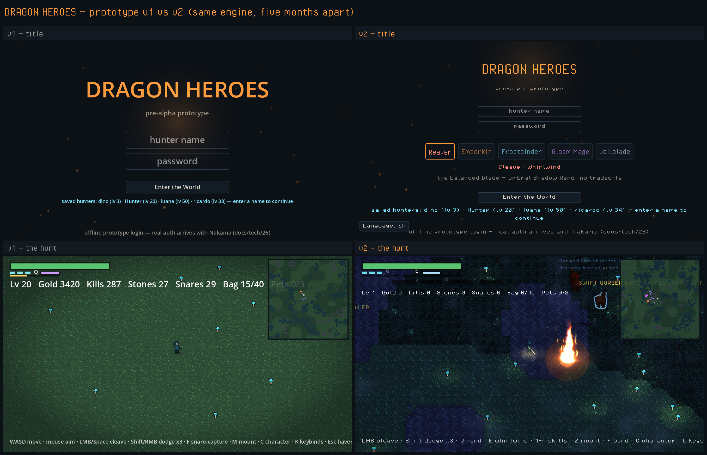

# 20 — Release Retrospective: v1 → v2

> Part of the Dragon Heroes document set. Canonical names and numbers come from the
> [canon](../00-canon.md); the decision log for every step below is canon §12.
> Status: retrospective — 2026-07-17. Scope: what the playable prototype was at the
> first snapshot (git tag `v0.1`, `dce3aba`, 2026-07-10) versus what it is today
> (`v0.1.18`, `3dbfc53`, plus the `v0.2.0` infinite-world patch landing this session).

## Purpose

This document is release archaeology, not a plan. It compares the first playable
slice with the current one so the team (and Ricardo) can see the delta in one place,
and — importantly — records that the whole distance was covered **without an engine
change**. Every claim here is traceable to a git tag, a commit, or a canon §12 entry.

## What v1 was (the first playable snapshot)

Tagged `v0.1` on 2026-07-10, described in its own commit as a "development snapshot
(not even pre-alpha)". It was already a real, end-to-end game loop — Main Menu → Haven
→ Hunt — but a flat one:

- **World:** a bright, uniformly-lit top-down TileMap. Chunks came from a **static
  finite dump** — `game/prototype/chunks.json` plus the shipped `worlds/world_*.json`
  islands — emitted once by the seeded `dh-server` CLI and built whole at boot. There
  was no lighting model: the scene was flat-bright everywhere (canon §12.28 later named
  this exactly: "the WORLD WAS FLAT-BRIGHT").
- **UI:** vector/default-font chrome — Godot's built-in font, not the pixel grid.
- **FX:** node-and-emitter spectacle — pooled `GPUParticles2D` emitters, `Line2D`
  lightning and shockwave rings, per-event telegraph and damage-number nodes. Several
  of these allocated a node per event (canon §12.23 later lists four such allocators
  converted to pools).
- **Content:** the schema-validated seed set — 36 content definitions, an effects
  registry, monster archetypes/affixes, a first skill tree, mounts, pets+stables,
  forge/enchant/runes, character saves, a themed UI and CODEX.
- **Backing systems already in place:** the full C++20 sim workspace (`sim/libs/`:
  dh-math, dh-sim, dh-content, dh-procgen, dh-net, dh-server, dh-godot, dh-env; tests
  green) and GenForge v0's parts-sheet pipeline. The engine bones were done; the game
  on top of them was thin.

The authoritative v1 feature manifest is the `v0.1` tag's own commit message
(`git show v0.1`) — it enumerates the slice above verbatim.

## What v2 is (today)

Eighteen point releases later, grouped into three arcs. Tags and commits are cited so
each line is checkable against `git log v0.1..HEAD`.

### Arc 1 — content explosion

- **The living bestiary (`v0.1.5`, `1450c77`):** GenForge batch generation produces
  the bestiary as pure data — **1000 normal creatures** (catalog-driven pack spawning
  over archetype chassis + art bundles) and **100 legendary creatures** (per-hunt
  sampled, power-scaling). Catalogs live in `content/generated/` with provenance.
- **Five playable classes (`v0.1.5`):** Gloam Mage and Veilblade join
  Reaver/Emberkin/Frostbinder; class kits reshape LMB and E, not just stats. (Canon §3
  targets 6 launch classes as a proposal; the prototype ships five.)
- **Real skill trees (`v0.1.7`, `a8f37a4`):** every class gets a tree — 20 actives +
  8 passives (one keystone with a tradeoff) + a free root, **145 nodes total, 100
  actives across the five classes** — all data (`registries/skill_trees.json`) run by
  one generic executor, so weekly skills never require engine work (canon directive 4,
  §12.21). Synergies are data-expressed (Ignite spread/detonate, Shatter, Combo stacks).
- **Three-boss difficulty ladder + economy QoL (`v0.1.2`–`v0.1.3`):** the Fenwitch Hag
  Elite, the Pyre Sovereign + Terravore Colossus **legendary duo** with the first
  playable LAVA Duologue field fusion, and the Emberwing Matriarch; plus safe
  enchanting, per-rarity sell-alls, a 120-slot Haven chest, and material stacking.

### Arc 2 — the visual program

This is the arc that produced the image at the top. It ran as a deliberate program
(canon §12.30, following the order-of-magnitude catalog in design/19) and was validated
frame-by-frame via the capture loop (Arc 3).

- **Media-grade VFX (`v0.1.12`–`v0.1.14`):** fire and darkness authored as *media*, not
  hard shapes — time-advected persistent firestorm fields, the first mix-blend umbra
  smoke, ground light pools that let effects light the world, folded-in heat haze
  (§12.27); then the **2D lighting model** — `ProtoDarkness`, a multiplicative quad with
  up to 16 nearest light holes, so everything above it reads as a light source (§12.28);
  then **atmosphere layers** — ground mist, fireflies, animated water, foliage sway,
  all riding the same light registry, coupled to a day/night cycle (§12.29).
- **SDF shadow lighting + the light registry (`v0.1.15`, `e1419ec`):** the **one light
  registry** — `darkness.gd` packs the gathered light holes into a 16×2 RGBAF data
  texture published as shader globals (`dh_light_tex` / `dh_light_count`); one gather,
  many consumers (fog, water, sprite shading). Plus **SDF shadows** — a per-hunt chamfer
  distance field over rock that caster-flagged lights sphere-trace, so light no longer
  crosses walls; and 4×4 Bayer ordered dither (§12.30).
- **The four overhauls (`v0.1.16`, `303774a`):** normal-mapped sprites (GenForge
  bevel+Sobel normals pipeline), dual-grid autotiling terrain with macro variation,
  3D-LUT per-biome color grading, and pixel-crisp typography — landed together (§12.30).
- **Sprite N·L lighting (`v0.1.17`, `ac05d74`):** the Dead Cells sprite-lighting stack
  goes live — sprites shade against the light registry using their generated normals.
- **Pixel-grid UI (`v0.1.18`, `3dbfc53`):** pixel-grid typography lands on every
  screen and the title menu is recomposed as name-chip class cards; every text override
  routed through the shared size tokens (§12.31).

### Arc 3 — systems and methodology

- **GenForge pipeline:** from the v0 parts-sheet pipeline at `v0.1` to hi-fi baked art
  bundles driving all five actors (`v0.1.4`, `1c9d8c4`) to a provider-agnostic gen-AI
  **image backend** with an OpenAI path behind the same seam as the stub, default off so
  nothing spends API budget by accident (canon §12.24). Gen-AI is a curated production
  tool, not a runtime dependency.
- **The capture loop (`v0.1.13`, `e0079a7`):** the permanent methodology shift — a
  capture harness (`game/prototype/tests/vfx_showcase.tscn`, `vfx_iso.tscn`) boots the
  real hunt, fires signature moments, and saves viewport PNGs, so the *composited* frame
  is reviewable in-loop, not just isolated lab sheets. It caught the flat-bright world
  and a shockwave-ring bug that had shipped invisibly since `v0.1.5` (canon §12.28). The
  standing lesson: lab sheets validate effects, captures validate frames.
- **C++ sim workspace (M0):** the simulation, math, content, procgen, net, and server
  cores are C++20 in `sim/` from `v0.1` onward (canon directive 1); the prototype is a
  thin Godot presentation layer over them, with `dh-server` today invoked as a seeded
  CLI and `dh-godot` (GDExtension) as the shipping in-process transport.

## Same engine — the delta is authored systems, not an engine swap

Every v2 pixel ships from the **same Godot 4 `gl_compatibility` renderer** v1 used.
`game/project.godot` still declares `rendering_method="gl_compatibility"` for both
desktop and mobile, at the same 640×360 integer-stretch resolution as v1. Nothing in
the visual program required Vulkan, a different engine, or a node-per-entity scene tree.

The engine question was raised and re-answered more than once during Arc 2 — most
pointedly at `v0.1.12`, when the "hard shapes on top of the rest instead of actual fire
and darkness" read prompted a direct "should we swap engines?" The decision was **no
overhaul**: the hard-shape read was authorship (crisp SDF bands, additive-only blending,
effects casting no scene light), not an engine limit — "the same math renders equally
hard in Unreal/Unity" (canon §12.27; the "stay on Godot" call is also recorded at
§12.23 and §12.28). The optional Vulkan opt-in (`tools/run_vulkan.sh`) adds real HDR
glow *on top of* the same look through a single seam; `gl_compatibility` remains the
default and the whole v2 look ships on it.

The takeaway for the retrospective: v1 → v2 is what authored systems — a lighting
model, a light registry, media shaders, a normals pipeline, dual-grid terrain, LUT
grading, pixel typography — buy on an engine that was never the bottleneck.

## What v2.0 means: the infinite world

The `v0.2.0` patch landing this session turns the last finite piece of v1 — the static
`chunks.json` dump built whole at boot — into a **moving window**. The C++ generator was
always infinite (stateless coordinate hashing, constant-time random access per chunk);
v2.0 makes the *consumers* stream a 5×5-chunk window around the player (load radius 2,
unload radius 3 with hysteresis, per-frame apply budgets, worker-thread SDF/minimap/JSON
work, and a self-retreating walkability fence outside loaded chunks). The authored hunt
stays anchored near origin on purpose; frontier chunks repopulate deterministically with
distance-scaled danger. No worldgen logic moves engine-side — the engine still only
renders windows the C++ generator emits (canon §12.32).

Full architecture, budgets, and the streaming test gate:
[29-infinite-world-streaming](../tech/29-infinite-world-streaming.md). Those same
streaming windows are the future multiplayer AOI story — see
[21-multiplayer-roadmap](21-multiplayer-roadmap.md).
