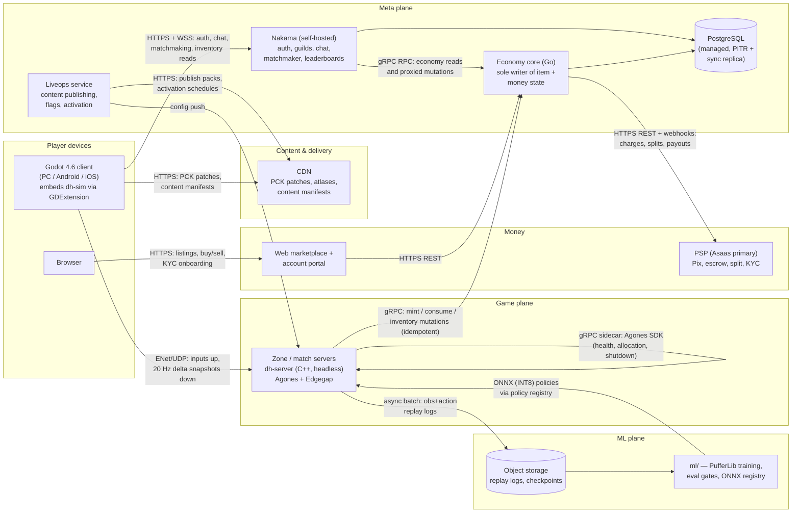
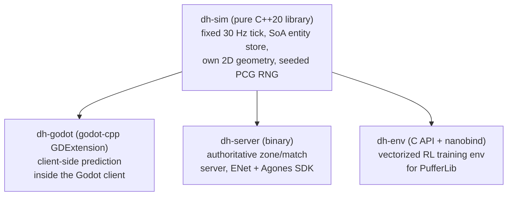

# 20 — Architecture Overview

> **Status:** v0.2 draft — 2026-07-08 (refit to canon v0.2: C++20 systems language, 60 FPS
> mandate, gen-AI art production, elemental field interactions). Subordinate to
> [the canon](../00-canon.md); where this document and the canon disagree, the canon wins.

## Purpose

This is the document an engineer reads first. It maps every system in Dragon Heroes — the Godot client, the C++ zone/match servers, Nakama, the economy core, liveops/CDN, the web marketplace, and the ML training loop — and names the protocol on every arrow between them. It reproduces the canonical repository layout, explains the coupling rules that keep weekly content drops from ever requiring engine work, walks the six end-to-end data flows that define the product, and records why each major technology was chosen over its alternatives. Detailed designs live in the sibling documents linked throughout; this one exists so those documents share a single spine.

## 1. System map



Protocol summary, one line per arrow: game traffic is custom byte-packed ENet/UDP only (never HTTP); everything client↔meta is HTTPS/WSS through Nakama; everything server↔economy is idempotent gRPC; everything money is HTTPS REST + signed webhooks with the PSP; content reaches clients exclusively as data files over HTTPS from the CDN; ML consumes logs from object storage and ships back ONNX files, never a live connection into gameplay.

## 2. The load-bearing decision: one sim, three consumers

Everything else in this architecture hangs off a single choice: the authoritative game simulation is **one pure C++20 library, `dh-sim`**, compiled into three different hosts.



The same library, the same combat math, the same content loader — linked into the client for prediction, run standalone as the server, and wrapped for Python as the training environment. This buys four things, and each is a product requirement rather than an engineering nicety:

1. **Train/live parity.** RL bosses and Champion Ghosts ([25-creature-ai-and-rl](25-creature-ai-and-rl.md)) train against literally the shipped simulation. There is no "sim2real" gap between the training env and production, so a policy that passes the eval gate behaves the same on live servers.
2. **Replay determinism.** The sim is deterministic within a build (fixed timestep, per-system seeded RNG — [21-simulation-core](21-simulation-core.md)), so a logged input stream replays bit-exactly on the same build: tournament review, dupe forensics, and behavioral-cloning datasets all come from the same replay files.
3. **Headless load-test bots.** Because the sim needs no engine, `tools/` can drive thousands of scripted bot clients against real zone servers in CI — the only credible way to validate the 50–80 CCU/zone target (§7) before players do it for us.
4. **Anti-cheat by authority.** The client's copy of the sim is a prediction convenience, never a source of truth. The server simulates everything and clients receive only AOI-filtered state, which kills state-fabrication cheats (speed, teleport, damage injection, dupes) by construction and makes interest management the wallhack defense ([27-security-anticheat](27-security-anticheat-and-economy-integrity.md)).

The cost is that `dh-sim` must stay pure — no Godot types, no I/O, no globals — which is exactly what coupling rule 1 (§5) enforces.

## 3. Language rule

Canonical (see [canon §6](../00-canon.md)) and strict:

- **C++ (C++20)** for everything performance-critical and authoritative: the `sim/` CMake workspace (simulation, netcode, procgen, content loading), exposed to Godot through GDExtension via **godot-cpp** — the first-party, battle-tested binding — compiled standalone as `dh-server`, and exposed to Python for RL training as `dh-env`, a C API with a **nanobind** binding (PufferLib-native environments are C, so this is a direct fit rather than a bridge). This supersedes the earlier Rust decision (canon v0.2, 2026-07-08); "write everything possible in C++ with maximized performance" is a standing directive. Rust-ecosystem conveniences get C++-appropriate equivalents: own schema-validated content loaders in `dh-content` (no serde), clang-tidy lints, ctest suites, and ASan/UBSan sanitizer jobs in CI (§9).
- **GDScript** for presentation only: UI, menus, VFX, animation drivers, content glue. GDScript is the slowest Godot language and that is fine, because nothing performance-critical or authoritative lives there.
- **No C#, no Rust — one systems language, one script language.** The C# exclusion is not taste: C# cannot call GDExtensions (there are no generated bindings), so a C# gameplay layer could not talk to the C++ sim ([research](https://chickensoft.games/blog/gdscript-vs-csharp); confirmed by CipSoft's Godot 4.4.1/.NET MMO post-mortem, which also flagged that C# is invisible to Godot's built-in profiler — [forum post, March 2026](https://forum.godotengine.org/t/our-experience-building-an-mmo-tech-demo-with-godot-4-4-1-net-c/134348)). Zero bridge tax.

Performance is no longer a second-order reason but part of the mandate: community benchmarks put compiled GDExtension code at roughly 4× C# in tight loops (~0.9 ms vs ~3.8 ms for 10k physics checks/frame), the sim runs hundreds of creatures and projectiles per zone tick, and the client must hold a locked 60 FPS on mid-range mobile (canon §1).

## 4. Repository layout

The canonical layout from [canon §10](../00-canon.md), reproduced with expanded responsibilities:

```
dragon-heroes/
├── docs/                  # This document set — canon, design, tech, business.
├── sim/                   # C++20 CMake workspace — the authoritative heart. Pure library + two hosts.
│   └── libs/
│       ├── dh-math/       # Fixed-tick math, 2D geometry (circles/capsules/swept arcs), seeded PCG RNG.
│       ├── dh-content/    # Loads + validates content definitions (own schema-validated loaders);
│       │                  #   the only path data enters the sim.
│       ├── dh-sim/        # THE sim: SoA entity store, combat, hitboxes, projectiles, elemental
│       │                  #   field interactions on the tile grid (field combos), BT/utility AI, loot rolls.
│       ├── dh-procgen/    # Seeded, versioned chunk/biome generation; constant-time random access.
│       ├── dh-net/        # Snapshot encode/delta-compress, input packets, prediction/reconciliation support.
│       ├── dh-server/     # Headless zone/match server binary: ENet transport, Agones SDK, economy-core gRPC client.
│       ├── dh-godot/      # GDExtension bindings via godot-cpp — the client embeds the same sim for prediction.
│       └── dh-env/        # C API + nanobind vectorized RL environment over dh-sim, consumed by PufferLib.
├── game/                  # Godot 4 project — presentation ONLY (coupling rule 2).
│   ├── scenes/            # UI, HUD, menus.
│   ├── presentation/      # Entity views, VFX, animation drivers, palette-LUT shaders, MultiMesh
│   │                      #   crowds, GPUParticles2D within per-scene frame budgets.
│   └── addons/            # Editor tooling and third-party addons.
├── content/               # Canonical content repo — pure data, stable snake_case string IDs.
│   ├── schemas/           # JSON Schemas per content type; CI validates every definition against these.
│   ├── core/              # Launch content: classes/ skills/ creatures/ items/ affixes/ loot-tables/
│   │                      #   biomes/ spirits/ pets/ ai-profiles/.
│   └── drops/             # Weekly drops as versioned packs: 2026-w40/ ...
├── backend/
│   ├── nakama/            # Nakama config + TypeScript/Go runtime modules (auth glue, RPC proxies to economy core).
│   ├── economy-core/      # Go — double-entry ledgers, item instances, marketplace, prize pools. Sole DB writer.
│   └── liveops/           # Content publishing to CDN, feature flags, scheduled activation, kill switches.
├── web/
│   ├── marketplace/       # The ONLY real-money surface — web, never in mobile apps.
│   └── account/           # Player portal, age verification (18+ gate), seller KYC onboarding.
├── ml/
│   ├── training/          # PufferLib configs, self-play league, behavioral-cloning pipelines.
│   ├── eval/              # Bot eval gates and regression suites — nothing redeploys without passing.
│   └── serving/           # ONNX (INT8) export, policy registry consumed by dh-server.
├── art/                   # Source art: Aseprite files, the 6 archetype rigs, palettes — gen-AI-assisted,
│                          #   human-directed (canon §7). Baked in CI, never at runtime.
├── tools/                 # Content validator, atlas baker, balance sims, headless bot load-tester.
└── infra/                 # Terraform, k8s/Agones manifests, Dockerfiles, CI pipelines.
```

Key library boundaries worth memorizing: `dh-sim` depends on `dh-math` and `dh-content` and nothing else; `dh-net` depends on `dh-sim`'s state types but owns all wire formats; `dh-server` and `dh-godot` and `dh-env` are thin hosts that each embed `dh-sim` and add exactly one concern (transport+orchestration, engine bindings, Python vectorization respectively).

## 5. Coupling rules and why they exist

Extensibility is the product: the business model is a weekly content drop and a 4–6-week biome cadence, forever. That only works if content never requires engine work. The four canonical rules ([canon §10](../00-canon.md)) exist to protect that, and each has a concrete rationale:

1. **`sim/` never imports Godot (except `dh-godot`) and never does I/O (except `dh-server`, `dh-net`).** A pure library is the only thing that can be simultaneously a GDExtension, a server, and a Python training env (§2). One `#include <godot_cpp/...>` in `dh-sim` and the RL pipeline and headless load tests die.
2. **`game/` contains zero gameplay rules.** The client renders replicated state and plays animations; if a number affects combat, it lives in `content/` and executes in `sim/`. This is what makes balance hotfixes server-side-only, keeps hacked clients unprofitable, and means a new class or creature needs no client code — only data and art.
3. **`backend/` never simulates combat; `dh-server` never writes economy tables (RPC to economy-core only).** Two authorities over one row is how every documented dupe happened — the MU Online, New World (2021), and OSRS (Oct 2024) post-mortems are all timing/persistence races across dual writers ([research](https://munique.net/item-duplication-exploits/)). One writer per domain, full stop.
4. **Everything cross-references content by stable string ID; definitions are deprecated, never deleted or renamed.** Items in player inventories, replay files, and ML embeddings all reference `pack.type.name` IDs. A rename would corrupt every one of them; deprecation keeps ten years of drops loadable.

## 6. End-to-end data flows

### 6.1 Login and authentication

1. Client opens HTTPS to Nakama and authenticates (device → email/social link per [26-backend-and-services](26-backend-and-services.md)); Nakama returns a session token.
2. Nakama checks the account's age-verification flag (set by the web account portal's CPF/document flow — a launch blocker, [30-legal](../business/30-legal-payments-compliance.md)); unverified accounts are rejected into the verification funnel.
3. Client presents its **content-version hash**. Mismatch → graceful reject with a patch prompt pointing at the CDN (never a hard error, never a partial join).
4. Client opens the Nakama WSS socket for chat, presence, and notifications.

### 6.2 Entering the world (matchmaker → Agones → zone handoff)

1. Client asks Nakama to enter the Hunt at a world position (or queues for a PvP mode via the matchmaker).
2. Nakama's zone directory (a runtime module) resolves which zone process owns that area. If none is running, it calls the **Agones Allocation API**; Agones picks a ready `dh-server` pod from the fleet in sa-east-1/southamerica-east1 and returns IP:port. Burst modes (Gloomfall, tournaments) allocate via the same thin abstraction pointed at **Edgegap** instead.
3. Nakama hands the client a short-lived **signed zone ticket** (address, session claims, expiry).
4. Client connects over ENet/UDP and presents the ticket; `dh-server` validates the signature, loads the player's sim-relevant state, and streams the initial AOI snapshot.
5. Crossing a zone boundary is a coordinated handoff: the current zone serializes the player's sim state, the directory allocates/locates the neighbor, the client receives a new ticket and reconnects. Inventory is untouched — it lives in the economy core, not the zone (rule 3). Details in [22-netcode-and-server-hosting](22-netcode-and-server-hosting.md).

### 6.3 A combat tick (input → prediction → snapshot → reconciliation)

1. Client samples input each 30 Hz sim tick and sends it in a redundant, unreliable ENet packet (inputs re-sent until acked).
2. The client's embedded `dh-sim` **predicts the local hero immediately** — zero perceived input latency.
3. `dh-server` applies inputs at its authoritative 30 Hz tick; hit registration uses **server-side lag compensation** with a 300 ms hitbox history rewind.
4. At 20 Hz, the server emits per-client snapshots: AOI-filtered (spatial hash — you are never sent what you cannot see), delta-compressed against the last acked snapshot, byte-packed.
5. Client reconciles: rewinds the local hero to the acked authoritative state, replays pending inputs through `dh-sim`; all remote entities are rendered via snapshot interpolation. Divergence beyond tolerance = server wins, always. Details in [22-netcode](22-netcode-and-server-hosting.md) and [11-combat-and-controls](../design/11-combat-and-controls.md).

Rendering is decoupled from the sim tick: the client renders at a locked **60 FPS on all platforms, mid-range mobile included** (canon §1), interpolating between 30 Hz sim states — animations must never hitch. Crowds and projectiles draw through MultiMesh/RenderingServer, particles through GPUParticles2D, and every visual feature ships with a measured per-scene/per-feature frame-time budget; "beautiful AND optimized" is a standing directive.

### 6.4 A loot drop (sim event → economy path → inventory)

1. A creature dies; `dh-sim` rolls the loot table deterministically (seeded RNG, tag-based affix spawn weights from `content/`) and emits an `ItemDropped` event. The roll is in the sim so replays reproduce it.
2. On pickup, `dh-server` calls economy-core `Mint` over gRPC with an **idempotency key** derived from (zone, tick, event sequence) — a retry after a crash can never mint twice.
3. Economy core writes, in one transaction: the item-instance row (DB-enforced unique GUID, single owner, state `owned`) and an append-only mint ledger entry with provenance (who, where, which loot table, when).
4. The ack flows back; the client's inventory UI reads through Nakama's RPC proxy to the economy core. The zone never writes an item row (rule 3); if the economy core is unreachable, pickups queue with their idempotency keys and retry (§8).

### 6.5 A marketplace trade (escrow → Pix → settlement)

1. Seller lists an item on the **web** marketplace (never in mobile apps); economy core transitions the instance `owned → listed`.
2. Buyer commits to purchase; economy core transitions `listed → escrowed` and creates a Pix charge at the PSP (Asaas primary). The studio never touches funds — buyer pays into PSP escrow.
3. PSP confirms payment via signed webhook (idempotent handler).
4. Economy core executes **one atomic settlement transaction**: item transfers to the buyer (`escrowed → owned`), double-entry postings move seller proceeds to the seller's PSP subaccount (Phase A: marketplace credit), the 10% (proposal) studio fee is taken by automatic PSP split, and 20% (proposal) of that fee accrues to the seasonal prize-pool ledger account.
5. Nightly reconciliation asserts the ledger sums to zero and no GUID has two owners; violations page a human and can trip the per-vector kill switches ([27-security](27-security-anticheat-and-economy-integrity.md), [15-economy](../design/15-economy-and-marketplace.md)).

### 6.6 A weekly content drop (content repo → CI → CDN + servers + PCK)

1. Designers author the drop as pure data in `content/drops/2026-wNN/` and matching source art in `art/`. Gen-AI is a first-class production tool for that art — concepting, sprite/variation generation, animation assistance — behind a curated pipeline: style-locked models, palette enforcement, human art direction and cleanup on everything shipped (canon §7). AI-assisted or not, every asset lands as normal Aseprite sources and flows through the same CI bake.
2. CI validates: JSON Schema per type, referential integrity of all string IDs, the no-delete/no-rename rule, balance sims from `tools/`; the atlas baker runs Aseprite CLI and emits frame atlases plus the per-tag/per-frame JSON that is the single source of truth for both client animation and server hitboxes.
3. On merge, CI builds (a) a new `dh-server` container image embedding the content, and (b) a **data-only** client PCK patch (Godot 4.6 partial-resource patches; no scripts in downloaded content, ever — the iOS-compatible rule).
4. Liveops publishes the PCK + manifest to the CDN behind a scheduled activation flag, then rolls the server fleet (Agones rolling update; zones drain and recycle).
5. At activation, the content-version hash flips: clients patch from the CDN at next login (6.1 step 3). Balance-number-only changes skip the client entirely — servers read them live, so hotfixes need no patch. Runbook in [23-content-pipeline](23-content-pipeline.md).

### 6.7 The ML loop (closing the circle)

`dh-server` batch-logs observation+action pairs and replays to object storage (from the very first playtest — canonical requirement). `ml/training` runs PufferLib over `dh-env`; candidate policies must pass `ml/eval` gates (win-rate bands, fairness caps, no-regression on old content) before `ml/serving` exports ONNX INT8 into the policy registry, which `dh-server` loads for CPU inference. Policy weights never ship to clients. Details in [25-creature-ai-and-rl](25-creature-ai-and-rl.md).

## 7. Scaling model

The infinite world shards into **zone processes**: one `dh-server` process per active world area, target **50–80 CCU each (proposal — validate by load test)**. Within a zone, spatial-hash AOI bounds per-client bandwidth regardless of zone population. Persistent-world zones run on an Agones fleet with autoscaling buffers; burst modes (Gloomfall's 40 players (proposal), tournament brackets) allocate on Edgegap pay-per-use capacity. The orchestrator sits behind a thin allocation abstraction so neither vendor is load-bearing (§9).

The CCU target deserves honesty: the published failure data is for Godot's *stock* high-level netcode (~40 CCU in Rivet's testing; CipSoft saw collapse at 80–100 connections on a 2-core VM — [post-mortem](https://forum.godotengine.org/t/our-experience-building-an-mmo-tech-demo-with-godot-4-4-1-net-c/134348)), which we do not use. A data-oriented C++ sim with custom ENet netcode should land far above that, but no shipped Godot ARPG proves this exact profile — so `tools/` bot load tests against real zones, from Brazilian residential ISPs, are the **M2 exit gate**, not a nice-to-have ([22-netcode §10](22-netcode-and-server-hosting.md), [31-roadmap](../business/31-roadmap.md)). Snapshot egress is also a cost line: at $0.10/GB (Edgegap), bandwidth budget per player is a tracked metric from the first load test.

## 8. Failure modes and blast radii

| Failure | What degrades | What keeps working | Recovery |
|---|---|---|---|
| **Zone process crash** | Players in that zone disconnect; world deltas since last persistence flush are lost (bounded, seconds) | Every other zone; economy state (items already minted are safe in Postgres); login, chat, marketplace | Agones reschedules; zone directory reallocates; clients auto-reconnect via a fresh ticket |
| **Nakama down** | No new logins, matchmaking, chat, guild ops, inventory *reads* | Active zone sessions keep playing (tickets already issued); economy core settles in-flight trades; CDN serves patches | Restore Nakama; sessions re-sync on next login |
| **Economy core down** | Loot pickups queue (idempotent retry), trades/listings/settlements halt, prize accrual pauses | All combat and exploration; Nakama; zones | Queued mints drain on recovery; reconciliation verifies no loss/dupe before reopening the marketplace |
| **PSP down/degraded** | New Pix charges and payouts fail; purchases stall in `escrowed` | Listings browsing, all gameplay, closed-loop credit balances (ledger is ours, funds are at the PSP) | Escrow state machine times out or resumes on webhook replay; no manual money handling, ever |
| **CDN down** | New clients can't patch to the latest content version | Already-patched clients; all servers (content is baked into server images) | Serve previous version until CDN restores; activation flags can roll the required hash back |
| **Postgres instance down** | Only the affected plane halts — [26-backend §9.1](26-backend-and-services.md) puts the two logical databases on **separate instances (proposal)**, so `nakama` and `economy` are independent failure domains: `nakama` down → no logins/matchmaking/inventory reads; `economy` down → mints/trades/settlements halt | Active combat in zones (in-memory) — pickups/trades queue against a down economy instance; the other plane's instance keeps serving | Managed failover to the synchronous replica; PITR is the floor for disaster recovery (both non-negotiable on the economy instance per 26 §9.1) |

The design intent: **combat never depends on the meta plane tick-to-tick**, and **money state never depends on game servers being honest**. Kill switches for every wealth-transfer vector (trade, marketplace, mail, drop) exist before the marketplace opens — canon §8.

## 9. Build and CI overview

Every merge to main runs, in order: (1) **content validation** — JSON Schemas, referential integrity, ID-stability rules; (2) **atlas bake** — Aseprite CLI in CI produces frame atlases + hitbox JSON; (3) **C++ workspace** — CMake builds plus ctest suites including determinism regression (same seed + inputs → same replay hash) and `dh-procgen` version-consistency tests, clang-tidy lints, and sanitizer jobs (ASan/UBSan) on the sim libraries; (4) **Godot headless exports** — client per platform and the `dedicated_server` Linux export (strips visual assets); (5) **container images** — `dh-server`, Nakama runtime modules, economy-core, liveops, pushed to the registry that Agones/Edgegap fleets pull from; (6) **PCK patch build** for content drops. `ml/eval` gates run on their own cadence and block only bot redeploys, never the game release train. Infra changes flow through Terraform in `infra/`.

## 10. Decision table

| Decision | Chosen | Alternatives considered | Why |
|---|---|---|---|
| Engine | **Godot 4.6+** | Unity 6.x; Bevy 0.18; MonoGame | Editor iteration speed + open PCK data patching fit weekly drops; zero licensing. Unity: most mature netcode (Fish-Net) but +5% Pro/Enterprise Jan 2026 and ongoing [licensing volatility](https://unity.com/products/pricing-updates); Bevy: best raw performance but no editor — weekly content becomes code work; MonoGame: fully DIY networking ([research](https://ziva.sh/blogs/godot-multiplayer)) |
| Combat netcode | **Custom: raw ENet/UDP, byte-packed 20 Hz delta snapshots, prediction + lag compensation** | Godot MultiplayerSynchronizer/Spawner; rollback netcode | Stock high-level API has documented ceilings (~40 CCU Rivet; 80–100 collapse in [CipSoft's post-mortem](https://forum.godotengine.org/t/our-experience-building-an-mmo-tech-demo-with-godot-4-4-1-net-c/134348)); rollback can't scale to hundreds of creatures+projectiles (re-simulates the world per mispredict) |
| Sim language | **C++20 via godot-cpp GDExtension + standalone binary + C API/nanobind** | Rust via gdext (the superseded v0.1 choice); C#; GDScript sim | Supersedes Rust per canon v0.2 — maximized performance is a standing directive. godot-cpp is the first-party, battle-tested binding (gdext is community-maintained); GDExtension ≈4× C# in tight loops; PufferLib-native envs are C, so the training binding is a direct fit; C# still cannot call GDExtensions and is excluded from Godot's profiler; one library, three consumers (§2) unchanged |
| Meta backend | **Self-hosted Nakama (Apache-2.0) on managed Postgres** | PlayFab; AccelByte; EOS-only | PlayFab Foundation Mode (Mar 11, 2026) cut the free tier to 1,000 lifetime accounts unless shipping on Xbox ([Microsoft release notes](https://developer.microsoft.com/en-us/games/articles/2026/04/microsoft-game-dev-release-notes-q1-2026/)); AccelByte is enterprise PCCU-priced (~$0.055–0.11/PCU/day); EOS has no queryable server-side economy ([research](https://crux.supercraft.host/blog/epic-online-services-vs-custom-backend/)) — usable later for free Easy Anti-Cheat only |
| Economy state | **Custom Go economy core, sole writer, double-entry ledger** | Nakama wallet/Hiro GDK | Nakama's wallet suits soft currency only; Hiro is closed/commercial (recreates vendor risk); RMT demands DB-enforced GUID uniqueness, escrow state machine, idempotency, SERIALIZABLE isolation ([research](https://www.pgrs.net/2025/06/17/double-entry-ledgers-missing-primitive-in-modern-software/)) |
| Server hosting | **Agones on K8s (sa-east-1/southamerica-east1) + Edgegap burst, behind an abstraction** | Single managed vendor; W4 Cloud | Hathora was acquired and shut down May 5, 2026, stranding shipped games like Stormgate ([Game Developer](https://www.gamedeveloper.com/business/stormgate-rushing-offline-mode-after-losing-server-access-to-an-ai-company)); never couple to one host. W4 Cloud (AGPL) worth evaluating as complement |
| Database | **Managed PostgreSQL, PITR + synchronous replica** | CockroachDB | Cockroach pays off only for multi-region active-active writes; single-region Postgres is simpler and sufficient at our scale; Nakama speaks Postgres wire either way, so migration stays open |
| Sync model | **Snapshot interpolation + client prediction** | Deterministic lockstep/rollback | Server authority means cross-platform determinism is unnecessary; Godot/Jolt physics is explicitly non-deterministic anyway — our own fixed-tick 2D geometry sidesteps the whole question |

## Open questions (for Ricardo)

1. **Kubernetes vendor for the Agones fleet:** GKE southamerica-east1 vs EKS sa-east-1 — pick one so `infra/` Terraform targets a single provider from M1. (AKS Brazil South is the distant third.)
2. **Edgegap São Paulo confirmation:** their São Paulo PoP and measured latency from Brazilian residential ISPs are unconfirmed on public pages. Approve a one-week spike to measure before we commit the burst path, with "second Agones fleet" as the fallback.
3. **Loot-mint granularity:** should *every* drop mint synchronously through the economy core, or only marketplace-eligible items (e.g., Rare and above), with Common/Uncommon held zone-locally until first trade-relevant action? This trades economy-core write volume against a uniform provenance ledger. Recommendation pending load numbers, but the schema must be chosen before M1.
4. **DevOps staffing:** the Agones path assumes a dedicated infra/SRE competence. Confirm the hire (or contractor) before M1, or we flip the default to Edgegap-primary and accept the single-vendor risk knowingly.
5. **W4 Cloud evaluation:** the Godot-maintainer-founded, AGPL, self-hostable backend overlaps Nakama + Agones. Approve a time-boxed evaluation (including legal review of AGPL implications for `backend/`) or explicitly park it.
6. **Easy Anti-Cheat on PC:** free via EOS and complementary to server authority (targets input automation, which server authority cannot see). Adopt for the Steam build, or launch on pure server authority + statistical detection?
7. **The Go economy-core carve-out under the everything-in-C++ directive:** canon keeps money code in Go (memory-safe, high-velocity — canon §6/§8, open decision #7), and this document assumes that stands. Confirm the carve-out or mandate C++ for `backend/economy-core` too.

## Sources

- [Canon — Dragon Heroes decision log](../00-canon.md)
- [CipSoft: MMO tech demo on Godot 4.4.1/.NET — Godot Forum, March 2026](https://forum.godotengine.org/t/our-experience-building-an-mmo-tech-demo-with-godot-4-4-1-net-c/134348)
- [Ziva — Godot 4 multiplayer benchmarks (40 CCU claim)](https://ziva.sh/blogs/godot-multiplayer)
- [Game Developer — Stormgate loses server access after Hathora/Fireworks AI acquisition](https://www.gamedeveloper.com/business/stormgate-rushing-offline-mode-after-losing-server-access-to-an-ai-company)
- [Microsoft Game Dev — What's New Q1 2026 (PlayFab Foundation Mode)](https://developer.microsoft.com/en-us/games/articles/2026/04/microsoft-game-dev-release-notes-q1-2026/)
- [AccelByte pricing (PCCU-based)](https://accelbyte.io/pricing)
- [EOS vs custom backends — economy limitations](https://crux.supercraft.host/blog/epic-online-services-vs-custom-backend/)
- [Chickensoft — GDScript vs C# in Godot 4 (C#/GDExtension constraint)](https://chickensoft.games/blog/gdscript-vs-csharp)
- [godot-cpp — first-party C++ GDExtension bindings](https://github.com/godotengine/godot-cpp)
- [nanobind — C++17+/Python bindings](https://github.com/wjakob/nanobind)
- [PufferLib — native (C) environment vectorization](https://github.com/PufferAI/PufferLib)
- [Unity pricing updates (2026)](https://unity.com/products/pricing-updates)
- [Edgegap pricing (pay-per-use, egress)](https://edgegap.com/resources/pricing)
- [Agones releases (v1.59, July 2026)](https://github.com/googleforgames/agones/releases)
- [Nakama — heroiclabs/nakama (Apache-2.0)](https://github.com/heroiclabs/nakama)
- [Double-entry ledgers as a software primitive (Paul Gross)](https://www.pgrs.net/2025/06/17/double-entry-ledgers-missing-primitive-in-modern-software/)
- [MU Online — item duplication post-mortem](https://munique.net/item-duplication-exploits/)
- [Godot docs — exporting for dedicated servers](https://docs.godotengine.org/en/stable/tutorials/export/exporting_for_dedicated_servers.html)
- [Godot 4.6 release notes (partial resource patches)](https://godotengine.org/releases/4.6/)
- [W4 Cloud — multiplayer infrastructure for Godot](https://www.w4games.com/blog/w4-games-news-1/w4-cloud-is-here-the-new-multiplayer-infrastructure-for-godot-games-1)
