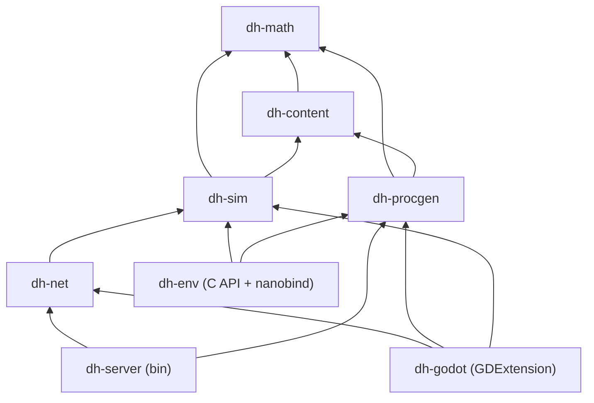

# 21 — Simulation Core (`sim/` C++20 CMake workspace)

> Part of the Dragon Heroes document set. Canon: [00-canon.md](../00-canon.md) (§6, §7, §10).
> Siblings: [architecture overview](20-architecture-overview.md) ·
> [netcode & hosting](22-netcode-and-server-hosting.md) ·
> [content pipeline](23-content-pipeline.md) ·
> [procedural world generation](24-procedural-world-generation.md) ·
> [creature AI & RL](25-creature-ai-and-rl.md) ·
> [combat & controls](../design/11-combat-and-controls.md).

## Purpose

This document specifies the design of the C++20 simulation workspace (`sim/`) — the
authoritative heart of Dragon Heroes. One codebase must serve three masters: the headless
zone/match server (`dh-server`), the Godot client's prediction of the local hero
(`dh-godot`), and the vectorized RL training environment (`dh-env`). The design goal that
makes all three possible is the same one: `dh-sim` is a pure, deterministic-within-a-build,
data-oriented library with no I/O, no engine dependency, and no wall-clock — everything
else is a thin shell around it. This document defines the library boundaries, the entity
store, the fixed 30 Hz tick pipeline, the combat geometry, the elemental field layer, the
determinism contract, the replay format, performance budgets, and the testing strategy
that keeps all of it honest.

## 1. Workspace layout and library responsibilities

The workspace is a CMake workspace living at `sim/libs/` per the canonical repo layout
([canon §10](../00-canon.md)). Responsibilities and hard boundaries:

| Library | Responsibility | May do I/O? | Key dependencies |
|---|---|---|---|
| `dh-math` | Fixed-tick math: 2D vectors, circles/capsules/arcs, swept tests, spatial hash, seeded PCG RNG streams, stable-sort helpers | No | none (C++ standard library only) |
| `dh-content` | Load + validate content definitions with its own loader (no third-party serialization framework), intern stable string IDs (`core.item.emberfang_blade`) into dense `u32` handles, expose typed tables (items, affixes, skills, creatures, AI profiles, hitbox frames, field types + combination rules) | No (caller hands it bytes) | `dh-math` |
| `dh-sim` | Entity store, tick pipeline, movement, combat resolution, hitboxes, projectiles, elemental field layer, status effects, loot rolls, BT/utility creature AI, event + replay log | **No** | `dh-math`, `dh-content` |
| `dh-procgen` | Seeded chunk/biome generation implementing the `TerrainSource` interface `dh-sim` consumes; generator versioning (see [24-procgen](24-procedural-world-generation.md)) | No | `dh-math`, `dh-content` |
| `dh-net` | Snapshot encode/delta-compress (byte-packed, 20 Hz), field-layer dirty-run encoding, input command encoding, prediction/reconciliation support types | Serialization only | `dh-math`, `dh-sim` |
| `dh-server` | Headless zone/match server binary: ENet transport, AOI, tick driver, lag-compensation rewind, Agones SDK, ONNX policy serving for RL bosses, RPC to economy-core | **Yes** (the only library with sockets) | all of the above |
| `dh-godot` | GDExtension bindings via **godot-cpp** (the first-party binding): embeds `dh-sim` for local-hero prediction, decodes snapshots, exposes render-ready state to GDScript | Via Godot APIs only | `dh-sim`, `dh-net`, `dh-procgen`, `dh-content` |
| `dh-env` | C API + **nanobind** module: vectorized headless sim instances with a batch `reset`/`step` API for PufferLib (see [25-creature-ai-and-rl](25-creature-ai-and-rl.md)) | Python FFI only | `dh-sim`, `dh-procgen`, `dh-content` |

### Dependency DAG

The graph is acyclic and `dh-sim` sits below everything platform-flavored. **`dh-sim`
never depends on `dh-net`, `dh-godot`, or `dh-env`** — those are consumers. `dh-sim` also
does not depend on `dh-procgen`: it consumes terrain through a narrow `TerrainSource`
interface (walkability, collision edges, z-height per tile), which lets `dh-env` substitute
flat test arenas and keeps world generation independently testable.

Two boundary rules worth restating from [canon §10](../00-canon.md): RL policy inference
(ONNX) lives in `dh-server`, never in `dh-sim` — the sim receives boss actions through the
same command-intake path as player inputs, so it stays free of ML dependencies. And
`dh-server` never writes economy tables; loot the sim rolls becomes a real item only after
an RPC to economy-core (see [26-backend](26-backend-and-services.md)).

## 2. Entity store: struct-of-arrays with generational indices

### Why not Godot nodes

Godot's own performance documentation places node-per-entity architectures at "hundreds at
most" before scene-tree overhead dominates
([Godot docs — Optimization using Servers](https://docs.godotengine.org/en/stable/tutorials/performance/using_servers.html)),
and the research pass found no counter-example: CipSoft's March 2026 Godot MMO tech demo
collapsed at 80–100 concurrent connections on the stock high-level stack
([CipSoft post-mortem](https://forum.godotengine.org/t/our-experience-building-an-mmo-tech-demo-with-godot-4-4-1-net-c/134348)).
A zone targets hundreds of creatures plus hundreds of projectiles (§9), and the sim must
also run where Godot does not exist at all (`dh-server`, `dh-env`). Nodes are for
presentation; the [game/ project](20-architecture-overview.md) renders replicated state
with MultiMesh/RenderingServer and contains zero gameplay rules ([canon §10, rule 2](../00-canon.md)).

### Why not a full ECS framework

Frameworks like `EnTT` or `flecs` earn their complexity when component composition is
dynamic and open-ended. Ours is not: Dragon Heroes has five entity kinds with fixed,
compile-time-known component sets (below). What we need instead is what frameworks make
harder: **guaranteed stable iteration order** (a determinism requirement, §7), zero
scheduler nondeterminism (parallel system schedulers reorder work), a minimal dependency
surface for the nanobind and GDExtension builds, and trivially inspectable memory layout
for snapshot delta encoding in `dh-net`. A hand-rolled store is a few hundred lines and we
own every byte of it.

### The store

Each entity kind gets its own struct-of-arrays table. An entity handle is a 64-bit
generational index — kind (8 bits), index (24 bits), generation (32 bits) — so a stale
handle to a despawned-and-reused slot fails the generation check instead of aliasing a new
entity. Freed slots go to a per-table free list and are reused in deterministic LIFO order.
Iteration is always a dense forward scan of the alive range; there is no hash-map
iteration anywhere in the tick path. C++ polices none of this for us, so the discipline is
explicit and mechanical: the store's public API deals in handles and `std::span` views —
**never raw owning pointers** — allocation stays private to the tables, builds are
warnings-as-errors, and CI runs ASan/UBSan/TSan jobs over the full test suite (§12).

### Archetype component layout

| Archetype | Components (each a parallel array) |
|---|---|
| **Players** | transform (pos `f32×2`, z-height, facing), velocity, attribute block + derived stats, HP/resource pools, skill loadout + cooldown timers, active status list, buffered input commands, pet link (creature handle), provisional inventory refs, collision capsule, animation state (frame tag + index → drives hitbox lookup) |
| **Creatures** | transform, velocity, content handle (stat block / tier / rarity per [13-creatures](../design/13-creatures-and-bestiary.md)), pack ID + leader handle, AI profile handle + blackboard (BT node state, utility scores, target handle, leash anchor), skill set + cooldowns, status list, collision shape, animation state |
| **Projectiles** | transform (pos, z-band), velocity, radius, owner handle, skill/effect handle, TTL ticks, pierce/bounce counters, already-hit list (small fixed array) |
| **Drops** | transform, content handle + rolled affix payload, loot-reservation owner (party allocation), despawn timer, pickup radius |
| **Zone objects** | transform, static collision shape, object type handle (shrine, chest, destructible, portal, POI trigger), interaction state machine, respawn timer |

Players and creatures share the movement, status, and combat code paths through common
component slices; the archetype split exists for layout and iteration, not for logic
duplication. The elemental field layer (§5) lives beside the entity store as chunked tile
arrays — it is grid state, not entities.

## 3. The fixed 30 Hz tick pipeline

The sim advances in fixed 33.33 ms ticks ([canon §6](../00-canon.md)). Each tick runs an
ordered list of systems; **the order below is part of the determinism contract** — two
builds of the same code with systems reordered are different sims, so the order is defined
in one place (`dh-sim`'s pipeline table) and asserted by the golden-replay tests (§8).

| # | System | What it does | RNG stream |
|---|---|---|---|
| 1 | **Input intake** | Drain and validate queued commands for this tick: player inputs (from `dh-net`), RL boss actions (injected by `dh-server`), scripted bot commands (tests). Everything nondeterministic enters the sim here and only here. | — |
| 2 | **Creature AI** | Tick BT/utility profiles ([25-creature-ai](25-creature-ai-and-rl.md)) in entity-index order: target selection, pack coordination (incl. Legendary duo sequencing), skill choice. Emits movement/skill intents. | `ai` |
| 3 | **Movement & steering** | Integrate velocities, apply steering/separation, resolve against `TerrainSource` collision, update z-height (jump/flight arcs). | — |
| 4 | **Combat resolution** | Activate skills whose windup completes; test melee/arc hitboxes (current-tick for creatures vs. players; lag-compensated history for player attacks, §6); apply the damage model from [11-combat](../design/11-combat-and-controls.md); crit/variance rolls; queue field applications carried by activated skills (§5). | `combat` |
| 5 | **Projectiles** | Sweep each projectile along this tick's motion with swept-circle CCD (§4) against hurtboxes and terrain; apply hits, pierce/bounce, expiry; queue impact field applications where the skill defines them (§5). | `combat` |
| 6 | **Elemental fields** *(position: proposal)* | Apply queued field applications to the tile-grid field layer in deterministic order; resolve combination rules (e.g. fire onto earth/rock → lava, §5); decay intensity/duration and expire cells; emit standing-in-field damage/status intents for the next system. | — |
| 7 | **Status effects** | Tick DoTs/HoTs (including field-applied ones), expire buffs/debuffs, resolve deaths (creature deaths queue loot; player deaths queue respawn flow). | `status` |
| 8 | **Loot & events** | Roll loot tables for queued deaths (drop entities with rolled affixes — minting is deferred to economy-core via `dh-server`), fire zone events, append everything to the tick event log. | `loot` |
| 9 | **Emit & bookkeeping** | Capture this tick's hitbox/position history into the lag-compensation ring buffer (§6), mark dirty state — entities and field-layer tiles — for `dh-net` snapshot encoding (sim publishes every tick; `dh-net` samples at 20 Hz per canon), append inputs+events to the replay log (§8), advance the tick counter. | — |

Loot rolls deliberately use their own PCG stream so a change to AI or combat randomness
can never silently shift drop outcomes between builds — drop tables are a published legal
commitment ([canon §8](../00-canon.md)) and must be independently simulable by the balance
tools in `tools/`.

## 4. Hitbox math

All combat geometry is our own 2D code in `dh-math` on the flat top-down plane with scalar
z-height ([canon §1](../00-canon.md)) — no engine physics anywhere in the combat path, per
the research recommendation to keep combat math as simple fixed-timestep geometry
([engine research](https://docs.godotengine.org/en/stable/tutorials/performance/using_servers.html)).

**Shapes.** Three primitives cover everything:

- **Circle** — projectiles, small creatures, pickup radii, AoE pulses.
- **Capsule** (segment + radius) — elongated bodies (serpents, dragons), beams, dash/lunge
  sweeps (a moved circle *is* a capsule, which makes CCD closed-form).
- **Oriented arc** (origin, radius range, facing, angular width) — melee swings, breath
  cones, shield-block cover angles.

**Swept tests.** Fast projectiles use swept-circle CCD: the circle's motion over one tick
forms a capsule, tested against target circles/capsules analytically (no tunneling at any
speed, no substeps). Melee arcs are instantaneous tests on the ticks where the animation's
active frames land. Entity-vs-entity overlap for body blocking uses static
circle/capsule tests after movement.

**Broadphase.** A uniform spatial hash (cell size 4 m, proposal) over entity positions;
the same structure backs AOI queries in `dh-server` and AI perception queries, built once
per tick.

**z-height gating.** Every hit volume carries a `[z_min, z_max]` band; a hit requires 2D
overlap **and** z-interval overlap. This is how flight, jumps, and burrowing interact with
combat: a ground slash whiffs a flying creature, a diving attack has a descending z-band.

**Per-frame hitbox data.** Active frames, arc parameters, hurtbox capsules per animation
frame come from the art pipeline: the Aseprite-CLI-baked per-tag/per-frame atlas JSON is
the **single source of truth for both client animation and server hitboxes**
([canon §7](../00-canon.md); [Aseprite CLI](https://www.aseprite.org/docs/cli/)). The
atlas baker in `tools/` compiles that JSON into binary hitbox tables that `dh-content`
loads; `dh-sim` indexes them by (animation tag, frame). An attack that looks like it hits
does hit — there is no separately authored server hitbox to drift out of sync. Pipeline
details in [23-content-pipeline](23-content-pipeline.md) and
[17-art-direction](../design/17-art-direction.md).

## 5. Elemental field layer: the field-combo system

Canon makes elemental ground state a first-class combat mechanic: Legendary creatures may
hunt in coordinated duos whose kits combine into **field combos** — the canonical example
is a fire dragon + earth elemental producing lava tiles ([canon §4 + glossary](../00-canon.md)).
The sim therefore owns a tile-grid **field layer** as a first-class system.

**Representation.** A per-chunk grid parallel to terrain (64×64 tiles per chunk, 1 tile =
1 m — [canon §4](../00-canon.md)), stored as dense per-chunk arrays beside the entity
store (§2). Each cell holds at most **one field (proposal)**: a field-type handle
(content-defined — fire, lava, ice, poison mist, …), an intensity, a remaining duration in
ticks, and a source handle for damage attribution. Field types are content definitions in
`content/` loaded by `dh-content` — per-type tick effects (DoT, movement modifiers, stat
mods), client VFX hooks, and the combination rules below are all data, so adding a field
type is a content drop, not an engine change ([canon §7](../00-canon.md)).

**Application.** Skills and creature abilities carry optional field-application payloads:
one of the §4 shapes (circle, capsule, arc) stamped onto the covered tiles with a type,
intensity, and duration. Combat resolution and projectiles queue applications (pipeline
systems 4–5); the field system applies the queue in deterministic order (tick order →
source entity index → payload index).

**Combination rules.** A content-defined lookup table
`(existing field, incoming field) → resulting field` resolves every collision: fire onto
earth/rock → **lava** (canon's fixed example); pairs canon does not fix — e.g. fire onto
ice → cleared + a steam burst — are **(proposal)**, and unlisted pairs default to
replace-if-stronger **(proposal)**. The table is a pure lookup — no RNG — so field
evolution is fully deterministic and replayable. This is the entire mechanism behind
Legendary duo field combos: each duo member simply applies its own element; the
*coordination* lives in the AI layer ([25-creature-ai](25-creature-ai-and-rl.md)), the
*composition* lives here. Nothing in the sim distinguishes a duo combo from any other pair
of applications, which keeps the system open to other sources (player skills,
environmental hazards — open question 6).

**Per-tick work.** The field system runs after combat resolution and projectiles, before
status effects **(position: proposal)** — so a field created this tick can hurt this tick.
Each tick it applies the queue with combination, decays and expires cells, then samples
alive entity positions against nonzero cells (position → tile is a trivial lookup) and
emits damage/status intents consumed by the status system in the same tick.

**Snapshots and the client.** Fields change slowly relative to entities, so `dh-net`
encodes the layer as per-chunk dirty-tile runs (run-length encoding over changed cells)
inside the normal 20 Hz delta snapshots, with a full nonzero-cell keyframe on AOI entry or
late join. The client renders field visuals from this layer (GPUParticles2D per field type
in `game/`, inside the per-scene particle budgets of [canon §6](../00-canon.md)) and never
simulates it — field damage is server-authoritative and not predicted (§10).

**Budget.** Hard cap of **8,192 active field cells per zone (proposal)**; over the cap,
eviction is deterministic — lowest intensity first, then oldest. The field system's share
of the tick budget is **≤ 1 ms at the cap (proposal)** — counted inside the `dh-sim` tick
budget of §9. The field layer is part of the per-tick state digest and the replay
keyframes (§8) like all other sim state.

## 6. Lag-compensation history: the 300 ms ring buffer

Per [canon §6](../00-canon.md), the server rewinds hitboxes up to **300 ms** when
validating a client's attack, so players hit what they saw. At 30 Hz that is 9 ticks;
`dh-sim` keeps a ring buffer of **12 ticks (proposal)** of history for slack. Each slot
stores, for every alive player and creature: position, z, facing, animation (tag, frame),
and alive/generation stamp — enough to reconstruct exact hurtboxes for any historical
tick, since shapes derive from the animation frame via the atlas tables (§4).

The rewind decision lives in `dh-server`/`dh-net` (it knows each client's interpolation
offset and RTT — see [22-netcode](22-netcode-and-server-hosting.md)); `dh-sim` just
exposes `resolve_attack_at(tick, …)`. Rewound resolution is itself deterministic and
recorded in the replay log as part of the attack command (the rewind tick is a field of
the command, not re-derived), so replays reproduce lag-compensated hits exactly.

## 7. Determinism contract

Scope, stated precisely, because over- and under-promising here are both expensive:

- **Required: same-binary determinism.** The same build, given the same seeds and the
  same input/event log, produces bit-identical state on every run. This is what replays,
  golden-replay CI, RL training reproducibility, and server-side cheat forensics need.
- **Not required: cross-platform / cross-build bit-exactness.** The server is
  authoritative; clients predict and get corrected ([canon §6](../00-canon.md)). This is
  why plain `f32` is fine and we do not pay for fixed-point or software-deterministic
  math — the real performance cost of cross-platform float determinism is well documented
  ([Rapier determinism docs](https://godot.rapier.rs/docs/documentation/determinism/)),
  and fixed-point remains the documented fallback if this ever changes.

Rules that make same-binary determinism hold, enforced by review + the fuzz tests in §12:

| Rule | Consequence in code |
|---|---|
| Fixed timestep only | No `dt` parameters; tick count is the only time. No wall-clock reads inside `dh-sim` — a clang-tidy custom check bans `std::chrono` clocks, `time()`, and `clock_gettime` in the library, enforced as an error in CI. |
| Seeded per-system PCG streams | Each system owns a named PCG32 stream seeded from `hash(world_seed, zone_id, system_name)`. No global RNG, no `std::random_device`, ever. |
| Stable iteration order | Dense SoA scans in index order; deterministic LIFO slot reuse; no `std::unordered_map` iteration in the tick path (interned-ID-keyed dense vectors, or `std::map` where sparse ordered maps are unavoidable). |
| Single-threaded tick | The tick pipeline runs on one core at launch (§9). If profiling ever demands intra-tick parallelism, only deterministic partitioning (fixed chunking, ordered joins) is admissible. Parallelism *across* zone instances and `dh-env` instances is free — they share nothing. |
| All nondeterminism enters at input intake | Player inputs, RL actions, economy RPC outcomes, join/leave — recorded verbatim in the replay log (§8). Nothing else in the sim may observe the outside world. |
| Pinned float behavior | One toolchain + flag set for the workspace; no `-ffast-math` (or `/fp:fast`); no target-feature divergence between the binary that records a replay and the binary that plays it (build hash is checked in the replay header). |

## 8. Replays and golden-replay CI

Every zone session and match produces a replay log — a canonical requirement, since
behavioral cloning trains on obs+action pairs from real play starting at the first
playtest ([canon §9](../00-canon.md)).

**Format (proposal).** A framed binary log:

1. **Header** — build hash, content-version hash, world seed + zone config, tick 0 state
   digest.
2. **Per-tick records** — the full input-intake payload for that tick (player commands,
   injected RL actions, external events such as economy RPC results and join/leave), plus
   a 64-bit digest of post-tick state every tick (cheap xxhash over dirty state) for early
   divergence detection.
3. **Keyframes** — a full state snapshot every **300 ticks / 10 s (proposal)**, enabling
   seek, mid-session replay start, and bounded divergence localization.

Playback = load header, seed streams, feed each tick's recorded inputs into input intake.
Because of §7 the result is bit-identical, so replays are tiny (inputs, not state) and
double as the RL training substrate and the dispute/forensics record.

**Golden replays in CI.** A curated set of recorded replays (melee duel, 4-player pack
fight, projectile storm, boss with lag-compensated hits, a Legendary duo field-combo
fight, loot session) is replayed on every PR; per-keyframe and final-state digests must
match the stored goldens.
An intentional sim change regenerates goldens in the same PR — a reviewed, deliberate act
— so unintentional behavior changes cannot land silently. Any divergence pinpoints the
first differing tick and system via the per-tick digests.

## 9. Performance budgets

Targets per zone process, single sim core, 30 Hz (33.3 ms tick budget):

| Metric | Target (proposal) |
|---|---|
| Players | 80 (upper end of canon's 50–80 CCU zone target) |
| Creatures alive | 600 |
| Projectiles alive | 500 |
| Drops + zone objects in hot set | 300 |
| Active field cells | 8,192 cap, deterministic eviction (§5) |
| `dh-sim` tick time | ≤ 8 ms median, ≤ 16 ms p99 (field layer ≤ 1 ms of it, §5) |
| Headroom remainder | snapshot encode (`dh-net`), AOI, procgen streaming, ONNX boss inference — all outside `dh-sim`'s budget |

**Caveat, stated honestly:** these numbers are extrapolated from Godot's performance
documentation and community benchmarks (data-oriented compiled code at roughly 4× C# in
tight loops — [Chickensoft benchmark](https://chickensoft.games/blog/gdscript-vs-csharp)),
not from a shipped comparable title. The research pass is explicit that no public
benchmark covers this exact 2D ARPG workload
([engine-netcode digest caveat](https://ziva.sh/blogs/godot-multiplayer)). Therefore an
**M0 benchmark harness is mandatory and blocking**: a synthetic zone in `dh-sim`'s bench
suite (Google Benchmark) filling the table above with scripted bots, run in CI with
regression thresholds, plus the `tools/` bot load-test against a real `dh-server` on the
target server SKU. If M0 numbers miss, the fallback levers are (in order): shrink per-zone
entity targets, reduce AI tick rate for off-screen packs, then deterministic intra-tick
parallelism — never a rewrite of the store.

## 10. Client embedding: `dh-godot` and prediction

The Godot client links the same `dh-sim` via GDExtension (godot-cpp) and runs a **strict
subset** for client-side prediction of the local hero only ([canon §6](../00-canon.md)):

- **Predicted:** local hero movement/steering vs. terrain and replicated entities treated
  as inert obstacles, skill activation gating (cooldowns, resource spend), z-height arcs,
  and cosmetic-latency-critical state (facing, animation triggers).
- **Not predicted:** damage outcomes, creature AI, other players, projectile hits,
  elemental fields, loot, status application — all of that renders from interpolated
  20 Hz snapshots.

`dh-sim` exposes a `predict_step(hero_state, commands, terrain, obstacles)` entry that
steps only the hero-relevant systems (movement, cooldowns) without a full world tick. On a
server correction, `dh-godot` rewinds to the last acknowledged tick and replays buffered
inputs through `predict_step` (standard reconciliation — protocol in
[22-netcode](22-netcode-and-server-hosting.md)). Because prediction and authority are the
same C++ code, mispredictions come only from missing information (unseen collisions,
server-applied stuns), not from divergent math — and since cross-platform bit-exactness is
not required (§7), small float drift is absorbed by reconciliation. GDScript never touches
any of this: it reads render-ready state (positions, animation tags, HP for the HUD) from
`dh-godot` and remains presentation-only ([canon §10, rule 2](../00-canon.md)).

## 11. RL environment: `dh-env` and PufferLib

`dh-env` wraps N independent headless sim instances as one vectorized environment for
PufferLib 3.x ([canon §9](../00-canon.md); training design in
[25-creature-ai-and-rl](25-creature-ai-and-rl.md)):

- **Batch API.** `DhVecEnv(config, num_envs)` with `reset(mask) -> obs` and
  `step(actions: ndarray) -> (obs, rewards, dones, infos)`; observations and actions cross
  the Python boundary as contiguous NumPy buffers over env-owned memory. The underlying
  surface is a plain **C API** (opaque instance handles, flat buffers) with **nanobind**
  as a thin binding layer on top — PufferLib-native environments are C, so the C API is a
  direct fit ([canon §6](../00-canon.md)). Batches are filled across instances by a
  work-stealing thread pool (each instance stays single-threaded and independently seeded,
  preserving per-instance determinism for reproducible training runs).
- **Faster than realtime.** No tick pacing, no snapshot encoding, no sockets; terrain
  comes from fixed arena `TerrainSource` stubs or pre-generated chunk sets. The 33 ms tick
  becomes "as fast as one core steps it" — the whole point of the pure-library rule.
- **Client-equivalent observations.** `dh-env` builds observations from exactly the state
  a client could see (AOI-filtered entity sets, including the visible field layer);
  fairness shaping (150–250 ms observation delay, action-rate caps, aim noise) is applied
  in the env config so it is baked into training, per canon §9. Entity-set encoding and
  per-content-ID embeddings live in `ml/`, above this library.
- **Scenario configs** select arena vs. Hunt-slice vs. Gloomfall-lobby setups and scripted
  opponent mixes; replay logs (§8) feed behavioral cloning through the same observation
  builder, so BC and RL see identical feature spaces.

## 12. Testing strategy

All suites run under `ctest` in CI; builds are warnings-as-errors with clang-tidy as a
blocking check.

| Layer | What runs |
|---|---|
| **Property tests** (rapidcheck) on `dh-math` | Swept-circle CCD vs. brute-force substepped reference; arc containment symmetry; capsule distance invariants (symmetry, triangle inequality); z-gating edge cases; spatial-hash query = brute-force query. |
| **Golden replays** (CI, every PR) | The curated replay set of §8; digests must match byte-for-byte. |
| **Determinism fuzzing** (CI, nightly) | Random seed + random scripted-input sessions, run twice in-process and once in a fresh process: all three final digests must be identical. Catches stray wall-clock reads, hash-order iteration, and uninitialized state better than review does. |
| **Sanitizer jobs** (CI) | ASan + UBSan over the unit/property/golden-replay suites on every PR; TSan on `dh-env` vectorized stepping (the only intra-process parallelism) nightly. This is the C++ substitute for language-level safety guarantees — it is not optional. |
| **Bot soak tests** (M0 onward) | `tools/` headless bots drive a real `dh-server` at the §9 targets for multi-hour runs: memory growth, tick-time p99, generational-index leak detection (alive-count audits). Network-layer soak from Brazilian residential ISPs against sa-east-1 belongs to [22-netcode](22-netcode-and-server-hosting.md). |
| **Content-integration tests** | Every content pack in `content/` loads through `dh-content` in CI; every animation tag referenced by a skill has hitbox frames in the baked atlas tables; the field-combination table is total over shipped field types, and every field application referenced by a skill names a defined field type ([23-content-pipeline](23-content-pipeline.md)). |

## Open questions (for Ricardo)

1. **Entity store build-vs-adopt:** approve the hand-rolled SoA + generational-index store
   (recommended, §2), or require a one-week M0 spike comparing it against `EnTT` before
   committing? Decision needed before M0 coding starts.
2. **M0 benchmark gate:** confirm the pass/fail numbers in §9 (80 players + 600 creatures
   + 500 projectiles + 8,192 field cells at ≤ 8 ms median tick on one core) and pick the
   reference server SKU they must hold on — the zone-capacity plan and hosting cost model
   both hang off this.
3. **Single-threaded tick at launch:** accept the one-sim-core-per-zone constraint
   (recommended for determinism simplicity), scaling by adding zone processes rather than
   threads, until the M0 benchmark proves it insufficient?
4. **Replay retention policy:** replays are required from the first playtest for
   behavioral cloning (canon §9). Retain all replays indefinitely, or full retention for
   tournament/ranked plus sampled retention (e.g. 10%, 90 days) for Hunt sessions? This is
   a storage-cost and LGPD-scope decision.
5. **Client terrain determinism:** should clients regenerate base terrain locally from the
   seed (requires `dh-procgen` to be cross-platform deterministic — integer-hash noise, no
   platform-varying float paths), or should servers stream compressed chunk data?
   Recommendation: locally with integer-based noise; to be settled in
   [24-procgen](24-procedural-world-generation.md), but it constrains `dh-procgen`'s math
   from day one, unlike `dh-sim` where f32 is fine.
6. **Player participation in field combos:** the field-combination table (§5) doesn't care
   who applied a field, so player skills (e.g. Elementalist) could create lava combos with
   pets and allies from day 1. Enable that at launch (emergent, on-brand, harder to
   balance), or restrict combo-producing applications to Legendary kits until the balance
   pass? The sim supports both; this is a design/balance gate.

## Sources

- [Godot docs — Optimization using Servers (node-count ceiling, data-oriented path)](https://docs.godotengine.org/en/stable/tutorials/performance/using_servers.html)
- [CipSoft — MMO tech demo with Godot 4.4.1 post-mortem (Godot Forum, March 2026)](https://forum.godotengine.org/t/our-experience-building-an-mmo-tech-demo-with-godot-4-4-1-net-c/134348)
- [Ziva — Godot 4 multiplayer benchmarks (CCU ceilings, transport comparison)](https://ziva.sh/blogs/godot-multiplayer)
- [Chickensoft — GDScript vs C# in Godot 4 (compiled-language sim-loop headroom)](https://chickensoft.games/blog/gdscript-vs-csharp)
- [Godot Rapier Physics — determinism documentation (cost of cross-platform float determinism)](https://godot.rapier.rs/docs/documentation/determinism/)
- [Aseprite CLI documentation (atlas + per-tag/per-frame JSON export)](https://www.aseprite.org/docs/cli/)
- [godot-cpp — first-party GDExtension C++ binding](https://github.com/godotengine/godot-cpp)
- [nanobind documentation (C++/Python binding used by `dh-env`)](https://nanobind.readthedocs.io/)
