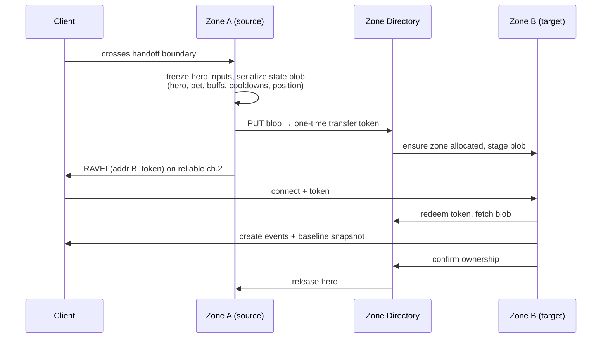

# 22 — Netcode & Server Hosting

> Part of the Dragon Heroes document set. Canonical decisions live in
> [00-canon.md](../00-canon.md) §6; this document specifies how we implement them.

## Purpose

This document specifies the wire protocol, replication model, latency-hiding techniques, interest management, zone topology, and server hosting strategy for Dragon Heroes. It exists so that `dh-net` and `dh-server` (see [architecture overview](20-architecture-overview.md)) can be built without re-litigating transport or hosting choices mid-implementation, and so the load-test gate that validates the whole stack is agreed on **before** code is written. The simulation this netcode replicates is defined in [21-simulation-core.md](21-simulation-core.md): fixed-tick 30 Hz, server-authoritative, data-oriented C++. Everything here assumes that canon; numbers introduced in this document are marked **(proposal)**.

---

## 1. Transport: raw ENet/UDP, not the high-level Godot API

We use **raw ENet over UDP** (`ENetConnection`/`ENetPacketPeer` on the Godot client side, the ENet C library linked into the C++ `dh-server` binary). We explicitly do **not** use Godot's high-level multiplayer stack (`MultiplayerSynchronizer`, `MultiplayerSpawner`, RPC-based state sync) for anything in the combat path.

The evidence for this exclusion is concrete, not aesthetic. [Rivet's testing](https://rivet.dev/blog/godot-multiplayer-compared-to-unity/) (as summarized in [Ziva's 2026 benchmark write-up](https://ziva.sh/blogs/godot-multiplayer)) found connection instability above **~40 CCU** per server on the stock stack. More damningly, [CipSoft — the Tibia studio — published a March 2026 post-mortem](https://forum.godotengine.org/t/our-experience-building-an-mmo-tech-demo-with-godot-4-4-1-net-c/134348) of an MMO tech demo on Godot 4.4.1 where the high-level API over ENet **"collapsed around 80–100 concurrent connections"** (CPU spikes, mass disconnects on a 2-core VM); their fix was the same as our plan: replace the high-level API with a custom transport layer. Our target is **50–80 CCU per zone** ([canon](../00-canon.md) §6) — squarely inside the stock stack's documented failure range. Both data points come from modest hardware and partly interested sources, so they don't prove our stack works either; that is what the load-test gate in §10 is for.

ENet gives us channels, optional reliability, sequencing, connection management, and MTU-aware fragmentation without inventing our own UDP framing. Channel assignment:

| Channel | Direction | Delivery | Contents |
|---|---|---|---|
| 0 | server → client | unreliable-sequenced | World snapshots (delta-compressed) |
| 1 | client → server | unreliable-sequenced | Input packets (self-redundant, see §2.3) |
| 2 | both | reliable-ordered | Entity create/destroy, combat events (damage confirms, deaths, loot notifications), zone-handoff control |
| 3 | both | reliable-ordered | Chat, social, low-priority meta traffic |

Stale snapshots and inputs are worthless — resending them (reliable delivery) only adds latency behind head-of-line blocking, hence unreliable-sequenced on channels 0–1. Events that must never be missed (an entity you can see was created; your item dropped) ride the reliable channel. [netfox](https://github.com/foxssake/netfox) (v1.35.x) serves as a reference implementation for the prediction/interpolation patterns below, but our encode/decode lives in C++ (`dh-net`) and is shared bit-for-bit by client (via `dh-godot`) and server.

## 2. Protocol design

### 2.1 Snapshots: 20 Hz, delta-compressed against last-acked baseline

The server emits per-client snapshots at **20 Hz** (canon). Each snapshot is encoded as a delta against the **last snapshot that client acknowledged** (Quake 3 model): the client acks every snapshot by sequence number inside its input packets; the server keeps a short ring of recent authoritative states (32 snapshots ≈ 1.6 s (proposal)) and diffs against the acked one. If a client falls outside the ring (long packet loss burst), it receives a full keyframe baseline. Because every snapshot is a delta against an *acknowledged* state, packet loss never corrupts state — it only makes the next delta slightly larger.

Encoding is byte-packed, hand-rolled in `dh-net` (no serialization framework/JSON on the hot path):

- **Entity set:** the snapshot lists changed entities only, each with a per-entity field bitmask (position changed? health changed? …) so an idle creature costs 2–3 bytes and an absent one costs zero.
- **Position:** zone-local **i32 millimeters** per axis in baselines (±2,147 km range — far more than a zone will ever span; zone-local origins also sidestep f32 precision drift in the infinite world, see [24-procedural-world-generation.md](24-procedural-world-generation.md)); deltas are zig-zag varints of the mm difference, so small movements cost 1–2 bytes per axis. z-height as **i16 centimeters**.
- **Facing/rotation:** a single byte (256 directions ≈ 1.4° resolution — below sprite-flipbook granularity anyway).
- **Velocities and scalar rates:** **f16** where the client needs them for extrapolation.
- **Health/resources:** quantized to u16 against the entity's max.

### 2.2 Entity create/destroy

Entity **creation and destruction are reliable events on channel 2**, not implicit snapshot content. A create event carries the full archetype reference (content ID per [23-content-pipeline.md](23-content-pipeline.md)), initial baseline state, and the entity's network ID; a destroy event carries the ID and a reason code (death, despawn, left-AOI). Snapshots on channel 0 only ever reference entity IDs the client already holds, which keeps the entity table impossible to desync and keeps per-snapshot headers small. "Left-AOI" destroys are how interest management manifests on the wire (§4).

### 2.3 Input packets: client → server, stamped to sim ticks

The client samples input every render frame but sends **tick-stamped commands**: each input packet targets a specific 30 Hz sim tick, using a client tick clock synchronized to `estimated_server_tick + RTT/2 + margin`. Packets are self-redundant — each one repeats the last **10 inputs (proposal)** — so up to 9 consecutive lost packets cost nothing. The server holds a small adaptive de-jitter buffer of **1–2 ticks (proposal)** per client so inputs arrive just before their tick executes; the buffer grows under measured jitter and shrinks when the link is clean. Inputs also carry the latest received snapshot sequence (the ack that drives §2.1) and the client's current interpolation delay (which drives lag compensation, §3.3).

### 2.4 Tick/snapshot alignment

30 Hz sim with 20 Hz snapshots means snapshots are emitted on **2 of every 3 ticks** (ticks where `tick % 3 != 1` (proposal)), producing alternating 33.3 ms / 66.7 ms gaps that average 50 ms. The interpolation buffer (§3.2) absorbs this unevenness completely; it is invisible to players but must be accounted for in the buffer sizing math (§8).

### 2.5 Versioning at connect

The first packet after the connection token (§11) carries protocol version and the content-version hash ([canon](../00-canon.md) §7). Mismatch produces a graceful reject with a "please update" reason code — never a silent hang. See [23-content-pipeline.md](23-content-pipeline.md).

## 3. Latency hiding

### 3.1 Client-side prediction & reconciliation — local hero only

The client embeds the same `dh-sim` library as the server (via GDExtension) and **predicts the local hero forward** from the last authoritative state using its own unacknowledged inputs. On each snapshot, the client rewinds the hero to the authoritative state, replays pending inputs, and visually smooths any residual error over 100–150 ms (proposal).

What is predicted, and what is never predicted, is a design contract with [combat & controls](../design/11-combat-and-controls.md):

| Predicted (feels instant) | Never predicted (server-only truth) |
|---|---|
| Hero movement and facing | Damage numbers and health changes on any entity |
| Dodge start-up and i-frame timing | Loot drops, pickups, item state of any kind |
| Skill windup animations and locks (the visual/lock begins immediately; the *effect* waits for the server) | Kills, deaths, status effect application to others |
| Resource *spend preview* (greyed until confirmed) | Gold, XP, Spirit Essence gains |

The rule of thumb: anything that only moves *your* body may be predicted; anything that changes the world or another entity — and especially anything with economic value, given the real-money marketplace ([27-security](27-security-anticheat-and-economy-integrity.md)) — is displayed only when the server says so. Mispredicting a dodge costs a small visual correction; "mispredicting" a Legendary drop would be a support ticket.

### 3.2 Snapshot interpolation for remote entities

Everything that is not the local hero — other players, creatures, projectiles, pets — is rendered **in the past**, interpolated between two buffered snapshots. Baseline interpolation delay: **100 ms (proposal)**, i.e. two snapshot intervals, which tolerates one lost snapshot plus the uneven 33/67 ms cadence from §2.4. The buffer is adaptive per client within a **80–200 ms clamp (proposal)**: it grows on measured jitter (cellular clients, §12) and decays slowly when the link is clean. If the buffer runs dry, the client extrapolates from last known velocity for at most **100 ms (proposal)**, then freezes the entity rather than let it rubber-band into a wall.

### 3.3 Server-side lag compensation

Hit registration favors the shooter: when an input commanding an attack executes on tick `T`, the server rewinds *hurtboxes* to what that client was actually seeing — `rewind = RTT/2 + client_interpolation_delay`, both measured server-side (the client-reported value from §2.3 is cross-checked, never trusted). The rewind is served from the **300 ms hitbox history** ring maintained by the simulation core ([21-simulation-core.md](21-simulation-core.md); canonical value).

Fairness bounds:

- Rewind is clamped to the 300 ms history; a client whose effective delay exceeds it simply gets no further compensation (they are already outside our latency budget, §8).
- Only *hurtbox positions* rewind. Authoritative state — current health, active i-frames granted by a server-confirmed dodge, death — is evaluated at present time. A player the server has already killed cannot fire from the grave.
- **(proposal)** In PvP modes, effective rewind is capped at **200 ms** even though 300 ms of history exists, bounding the "I was already behind cover" injustice for the victim. PvE keeps the full 300 ms (creatures don't complain). Raised as an open question.

## 4. AOI / interest management

Interest management is mandatory for an open-world zone and doubles as our **anti-wallhack measure**: the server never serializes state a client shouldn't see, so no client-side hack can reveal it ([27-security](27-security-anticheat-and-economy-integrity.md)).

- The zone maintains a **spatial-hash grid** over its active area, cell size **32 m (proposal)** — half a 64-tile chunk, so a subscription is a handful of cells.
- Each client subscribes to entities within a radius of **70 m (proposal)** of its hero, with hysteresis (enter at 70 m, leave at 80 m (proposal)) so entities oscillating on the boundary don't spam create/destroy events.
- Per client, the server keeps a **delta list**: the set of entities currently replicated to that client, with per-entity last-acked field state. Entering AOI emits a create event (channel 2) + baseline; leaving emits a destroy with reason `left_aoi`.
- Within the AOI, send rates are **tiered by distance** (proposal): full 20 Hz within 25 m, 10 Hz from 25–50 m, 5 Hz beyond. Projectiles and anything currently targeting the client's hero are always full-rate regardless of distance. This tiering is also the first rung of the bandwidth-culling ladder (§9).

The subscription radius comfortably exceeds the client's visible screen area at gameplay zoom; it is a server tunable per mode (Gloomfall may want a larger radius for its bigger engagement ranges — see [16-pvp-and-tournaments.md](../design/16-pvp-and-tournaments.md)).

## 5. Zone topology for the infinite world

### 5.1 One process, a set of chunks

A **zone process** is one headless `dh-server` binary owning the set of active 64×64 m chunks around its resident players ([canon](../00-canon.md) §6, §10). Chunks activate when a player approaches (generation is seeded and deterministic — [24-procedural-world-generation.md](24-procedural-world-generation.md)) and deactivate, persisting deltas, when no player has been near for **5 minutes (proposal)**. There is no fixed world-to-zone mapping: zones follow players. A **Zone Directory** service (part of [26-backend-and-services.md](26-backend-and-services.md)) tracks which process owns which chunks and where players should connect.

### 5.2 Split and merge policy (proposal)

Target load is **50–80 CCU per zone** (canon, pending load-test validation). Proposed policy, all numbers tunable:

| Trigger | Action |
|---|---|
| Sustained > **70 CCU** for 60 s, or p95 tick time > **25 ms** for 60 s | **Split:** partition the player population along chunk boundaries (k-means on player positions, snapped to chunks); request a new gameserver from the orchestrator; hand off the smaller partition's players via §5.3 |
| Two adjacent zones each < **20 CCU** for 5 min, combined < 60 | **Merge:** drain the smaller zone into the larger via the same handoff protocol, then deallocate |

Players standing near a split boundary are assigned by party first (parties of 1–4 never straddle zones), position second. Cross-zone visibility is **not** supported at launch — zone borders are placed through low-density chunks, and the AOI radius never spans processes. Seamless border ghosting is a post-launch upgrade, noted as an open question.

### 5.3 Cross-zone travel handoff

The state blob contains only the hero's own state (hero, pet, active buffs/cooldowns, position/velocity) — inventory and items are **not** serialized through the handoff; they live in the economy core and Nakama, which zones read by RPC ([coupling rule](../00-canon.md) §10). In-flight projectiles die at the boundary. Target handoff hitch: **< 500 ms (proposal)** perceived. Failure fallback: if the client does not appear at Zone B within **10 s (proposal)**, the token expires, Zone A (or the Directory, if A is gone) re-owns the hero, and the client is directed back — the hero is never ownerless or doubly-owned, and the Directory is the single arbiter (the same single-owner discipline the economy core enforces for items).

## 6. Matchmade modes: same binary, ephemeral servers

1v1 duels, 3v3 arenas, and **Gloomfall** (40-player battle royale, canon proposal) run as **ephemeral match servers built from the same `dh-server` binary**, launched in "match mode": a fixed procedurally generated map instead of open-world chunk streaming, no persistence writes, match ruleset from content data, results reported to Nakama's tournament/leaderboard APIs at match end ([26-backend-and-services.md](26-backend-and-services.md)). One binary means the netcode, sim, and content pipeline are identical across modes — a weekly balance drop hits Hunt and PvP simultaneously. Match servers are allocated on demand by matchmaking and deallocated at match end; they are the natural burst workload for Edgegap (§7). Gloomfall at 40 players is our worst-case single-process CCU and is explicitly in the load-test matrix (§10).

## 7. Orchestration & hosting

### 7.1 The Hathora lesson: never couple to one host

**Hathora was acquired by Fireworks AI (announced March 4, 2026) and permanently shut down May 5, 2026, stranding shipped games** — Stormgate's multiplayer [went offline](https://www.gamedeveloper.com/business/stormgate-rushing-offline-mode-after-losing-server-access-to-an-ai-company) and the studio scrambled to ship an offline mode ([industry context](https://gameye.com/blog/game-server-shake-up-2026/)). Rivet has meanwhile pivoted toward AI-agent infrastructure. This is now a demonstrated risk, not a theoretical one, and it is canon: game servers are **plain Docker containers**, and all orchestration calls go through a thin **`GameServerProvider`** abstraction (allocate, list, deallocate, health, port/IP discovery) with one implementation per backend. Migrating hosts must be an implementation swap, not a rewrite.

### 7.2 Chosen providers

| Workload | Provider | Where | Why |
|---|---|---|---|
| Persistent world zones | **Agones** (v1.59+, July 2026) on GKE `southamerica-east1` or EKS `sa-east-1` | São Paulo | Open source, no platform-shutdown risk, full control of fleet autoscaling and zone lifetimes ([Agones releases](https://github.com/googleforgames/agones/releases), [GKE install docs](https://agones.dev/site/docs/installation/creating-cluster/gke/)) |
| Burst: tournaments, Gloomfall, weekly PvP peaks | **Edgegap** | São Paulo PoPs (to be confirmed, open question 6) | Pay-per-use ($0.00115/min/vCPU + $0.10/GB egress, [pricing](https://edgegap.com/resources/pricing)); no idle fleet cost for spiky workloads |

`dh-server` links the Agones SDK for health/lifecycle when running under Agones; under Edgegap the same hooks map to Edgegap's lifecycle API inside the provider implementation. The Agones path costs real Kubernetes DevOps effort — that staffing assumption is flagged in the [roadmap risk register](../business/31-roadmap.md). W4 Cloud (AGPL, Godot-native, self-hostable) is worth a watching brief as a third `GameServerProvider` implementation but is not on the launch path (its SaaS pricing was undisclosed as of the research pass, and AGPL implications need the legal review in [30-legal-payments-compliance.md](../business/30-legal-payments-compliance.md)).

## 8. Brazil latency budget

Brazil is the home market and São Paulo is the region. Typical residential RTT to `sa-east-1`/`southamerica-east1` from Brazilian ISPs is **30–80 ms** (fiber in the Southeast at the low end; Northeast, mobile, and long-haul routes at the high end). End-to-end feel decomposes as:

| Stage | Typical | Notes |
|---|---|---|
| Input sampled → packet sent | ~4–8 ms | half a render frame |
| Client → server | 15–40 ms | RTT/2 |
| Input de-jitter buffer | 0–33 ms | 1 tick avg (§2.3) |
| Tick execution alignment | 0–33 ms | 30 Hz sim |
| Wait for next snapshot | 0–67 ms | uneven 20 Hz cadence (§2.4) |
| Server → client | 15–40 ms | RTT/2 |
| Interpolation buffer | 100 ms | remote entities only (§3.2) |

For the **local hero**, prediction (§3.1) masks the entire round trip: movement and dodges feel instant at any RTT in budget. For **remote entities**, players see the world roughly **170–260 ms** in the past — which is exactly what the 300 ms lag-compensation history (§3.3) is sized to cover: worst-case `RTT/2 (40) + interp (up to 200 clamped)` stays inside 300 ms with margin at the baseline 100 ms buffer, and degrades gracefully (uncompensated tail) only for clients simultaneously at max jitter and max RTT.

## 9. Bandwidth budget

Egress at **$0.10/GB** (Edgegap; cloud egress from GKE/EKS is the same order) makes snapshot size a cost line, not just a UX concern.

- **Downstream target: 15 kB/s (120 kbps) average per player, 30 kB/s ceiling (proposal).** Sizing: an AOI of 40–80 entities, delta-encoded with tiered rates, averages 8–14 bytes per changed entity → 400–900 bytes per snapshot + UDP/ENet overhead, ×20 Hz ≈ 10–20 kB/s in dense fights.
- **Upstream: ~3 kB/s** (tick-stamped redundant inputs are tiny).
- **Cost check:** 15 kB/s = 54 MB/hour ≈ **$0.0054 per player-hour** of egress — acceptable, but it doubles if we get sloppy, so the encoder budget is enforced by the load-test gate (§10), not by hope.

When a client's budget is exceeded, the server culls in this order (proposal): (1) drop distant entities to lower tiers earlier (§4 tiering tightens); (2) strip cosmetic-only fields (VFX seeds, non-gameplay animation params); (3) shrink the AOI radius toward the visible screen; (4) skip a snapshot (sequencing makes this safe). **Never culled:** anything that can damage the player within engagement range, inbound projectiles, party members, and channel-2 events — those are reliable and gameplay-critical by definition. Damage numbers and loot notifications are events, not snapshot state, so congestion delays them slightly but never loses them.

## 10. The load-test gate (blocks M2 exit)

Nothing above is considered true until proven under load. The stock-Godot failure range (40–100 CCU, §1) is exactly where our target sits, and the research digest is explicit that no shipped Godot ARPG proof exists at this profile — **our own load tests are the only real evidence**. This gate blocks [M2 exit in the roadmap](../business/31-roadmap.md).

- **Harness:** headless bot clients driven by `dh-sim` (the `tools/` bot load-test harness in the [canonical repo layout](../00-canon.md) §10). Bots speak the real protocol — prediction, acks, input redundancy — and run scripted behavior profiles: pack-fight brawls, boss fights with dense projectiles, marketplace-adjacent idling, chaotic Gloomfall drops.
- **Phases:** (1) LAN soak for encoder/sim profiling; (2) cloud-to-cloud at scale (bots in-region, isolates server capacity); (3) **from Brazilian residential ISPs** — probes on Vivo/Claro/TIM fiber and 4G/5G, because loss/jitter on real last-mile links is what broke the stock stack, not clean datacenter paths.
- **Pass criteria (proposal):** 80 CCU sustained per zone for 2 h with p95 tick time ≤ 25 ms and zero disconnect storms; a 40-bot Gloomfall match end-to-end; per-player egress within the §9 budget at p95; hit-registration consistency (bot-measured server/client agreement) ≥ 99.5%; zone split/merge exercised under load without a dropped hero.
- Failing the gate has a predefined response ladder: shrink AOI/tiering first, drop the per-zone CCU target second, revisit snapshot rate last (20 Hz is canon; changing it is a canon revision).

## 11. DDoS posture & connection admission

- **Volumetric mitigation is the provider's job:** game UDP ports sit behind GCP Cloud Armor / AWS Shield network-layer mitigation on the Agones path and Edgegap's built-in mitigation on the burst path. We do not build our own scrubbing.
- **Connection tokens:** clients authenticate with Nakama first ([26-backend-and-services.md](26-backend-and-services.md)) and receive a short-lived, single-use, signed connect token bound to the target server address (netcode.io-style). The first ENet packet must present it; packets from unauthenticated sources are **silently dropped** — no reply, ever, so the server cannot be used as an amplification reflector and attackers get no probe feedback.
- **Rate limits:** per-IP connection-attempt caps and per-connection packet/byte ceilings at the transport layer; anything anomalous escalates to the monitoring described in [27-security-anticheat-and-economy-integrity.md](27-security-anticheat-and-economy-integrity.md).

## 12. Mobile networking realities

Cross-play from day 1 (canon) means cellular clients are first-class, and cellular means jitter spikes (50–200 ms on 4G handovers), carrier NAT, and the OS killing the socket the moment the app backgrounds.

- **Jitter:** the adaptive interpolation buffer (§3.2, 80–200 ms clamp) and adaptive input de-jitter buffer (§2.3) absorb cellular variance; mobile clients will simply sit higher in the clamp. Lag compensation covers them within the 300 ms history.
- **Background/disconnect:** when the socket dies mid-Hunt, the server holds the hero **linkdead**: it stops acting but remains in-world, simulated and killable, for a **30 s grace window (proposal)**; if it was in combat (damaged or aggroed within the last 10 s — proposal), the window extends until combat resolves (no free escapes). Death during the window applies the normal death rules exactly as if connected — owned by [12-world-and-biomes.md](../design/12-world-and-biomes.md): 30% destruction of unbanked non-Legendary items, 25% of carried Gold, Legendaries to a death cache. After the window the hero despawns and persists. A session-resume token lets the client reconnect within the grace window and resume in place via a fresh keyframe baseline — no re-login, no loading screen if the zone still holds the session. These numbers are stated identically in [27-security §6](27-security-anticheat-and-economy-integrity.md). In Gloomfall there is no linkdead grace: the hero stays in the world, standard battle-royale rules.
- **Reconnect flow** is the same three steps everywhere: re-present session-resume token → full baseline snapshot (no delta chain to rebuild) → prediction restarts from the baseline. It reuses the §5.3 handoff machinery (a reconnect is a handoff to the same zone).
- **Radio/battery:** input packets on mobile coalesce to tick-aligned 30 Hz sends rather than per-render-frame (proposal) — identical tick semantics, fewer radio wakeups.

## Open questions (for Ricardo)

1. **PvP lag-compensation cap:** keep the full 300 ms rewind in PvP, or cap PvP rewind at 200 ms (proposal, §3.3) to bound "killed behind cover" at the cost of slightly worse hit-reg for high-ping players? Recommend the 200 ms cap; needs your call because it trades fairness between the shooter and the victim.
2. **Adaptive interpolation buffer:** approve the per-client adaptive buffer with an 80–200 ms clamp (§3.2), or hold a fixed 100 ms for all clients at launch for simpler debugging? Recommend adaptive — cellular players are unplayable otherwise.
3. **Bandwidth gate number:** approve 15 kB/s average / 30 kB/s ceiling per player (§9) as the binding pass criterion for the M2 load test? This number sizes our egress cost model.
4. **Zone split/merge thresholds:** approve split at sustained >70 CCU or p95 tick >25 ms, merge below 20 CCU (§5.2) as starting values for the load test to validate?
5. **Reconnect grace:** approve the 30 s killable grace window in Hunt (extended while in combat until combat resolves, reconnect-in-place within the window), and *no* linkdead protection in Gloomfall (§12)? Numbers are shared with [27-security §6](27-security-anticheat-and-economy-integrity.md); death during the window applies the death rules owned by [12-world-and-biomes](../design/12-world-and-biomes.md).
6. **Edgegap São Paulo verification:** their São Paulo PoPs and real BR-ISP latency are not publicly confirmed. Approve a small paid pilot (measure from Vivo/Claro/TIM) before M2, with the fallback of provisioning Agones burst headroom instead if results disappoint?
7. **Seamless zone borders:** confirm that hard handoffs with a <500 ms hitch (§5.3) are acceptable for launch, with cross-zone border ghosting deferred to post-launch? Building ghosting now would add roughly a milestone of netcode work.
8. **Cadence mismatch:** 20 Hz snapshots over a 30 Hz sim produce uneven 33/67 ms gaps (§2.4). This is absorbed by interpolation and I recommend keeping both canon values, but if load tests show budget headroom, do you want us to evaluate 30 Hz snapshots for PvP match servers only (better freshness, +50% egress on those servers)?

## Sources

- [Rivet — Is Godot 4's Multiplayer a Worthy Alternative to Unity?](https://rivet.dev/blog/godot-multiplayer-compared-to-unity/) (≈40 CCU instability finding)
- [Ziva — Godot 4 Multiplayer: Best Practices & Benchmarks (2026)](https://ziva.sh/blogs/godot-multiplayer)
- [CipSoft — Our experience building an MMO tech demo with Godot 4.4.1 (.NET/C#), Godot Forum, March 2026](https://forum.godotengine.org/t/our-experience-building-an-mmo-tech-demo-with-godot-4-4-1-net-c/134348) (80–100 CCU collapse post-mortem)
- [netfox — GitHub (v1.35.x)](https://github.com/foxssake/netfox) (reference implementation for CSP/lag compensation/interpolation)
- [Gameye — The Game Server Shake-up of 2026](https://gameye.com/blog/game-server-shake-up-2026/) (Hathora shutdown context)
- [Game Developer — Stormgate loses server access after Hathora/Fireworks AI acquisition](https://www.gamedeveloper.com/business/stormgate-rushing-offline-mode-after-losing-server-access-to-an-ai-company)
- [Agones releases (v1.59, July 2026)](https://github.com/googleforgames/agones/releases)
- [Agones — GKE installation docs](https://agones.dev/site/docs/installation/creating-cluster/gke/)
- [Edgegap — Pricing](https://edgegap.com/resources/pricing) ($0.00115/min/vCPU, $0.10/GB egress)
- [W4 Cloud — multiplayer infrastructure for Godot](https://www.w4games.com/blog/w4-games-news-1/w4-cloud-is-here-the-new-multiplayer-infrastructure-for-godot-games-1)
