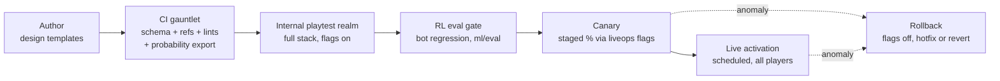

# 23 — Content Pipeline: Schemas, Validation, PCK Patches, and the Weekly Drop Runbook

> Part of the Dragon Heroes document set. Canon: [00-canon.md](../00-canon.md) (§7 Content & data
> is the governing section). Status: v0.1 draft — 2026-07-07.

## Purpose

Dragon Heroes lives or dies on cadence: new items, creatures, and skills **weekly**, a new biome
every 4–6 weeks, forever ([canon §4](../00-canon.md)). That cadence is only survivable for a small
studio if shipping content is a *data operation with a runbook*, not an engineering event. This
document specifies the machine that makes that true: the content type inventory and schemas, the
single canonical content repo, the CI validation gauntlet (including the legally required
drop-probability export), ID lifecycle and versioning rules, distribution to server and clients
(data-only PCK patches), the end-to-end weekly drop runbook with canary and rollback, how art
assets and RL evaluation gates ride the same flow, and the tooling roadmap. The architecture
follows the proven PoE/Warframe pattern from the live-content research pass: everything is pure
data with stable IDs and heavy indirection, so a new item is a data row, not code.

## 1. Content type inventory

Everything gameplay-affecting is a data definition in `content/` (see the canonical repo layout in
[20-architecture-overview.md](20-architecture-overview.md)). The launch inventory:

| Content type | Directory | Defines | Primary consumers |
|---|---|---|---|
| `item_base` | `items/` | Equipment bases: slot, implicit stats, requirements, tags | dh-sim, client UI, marketplace |
| `affix` | `affixes/` | Prefix/suffix modifiers: stat ranges per tier, tag spawn weights | dh-sim, loot roller, probability export |
| `stat` | `stats/` | Atomic stat definitions (id, aggregation rule, display format) | dh-sim, client UI |
| `skill` | `skills/` | Class skills and Bestial Skills: costs, timings, hitbox refs, stat scaling | dh-sim, client presentation |
| `class` | `classes/` | Class identity, skill-tree graph, starting attributes | dh-sim, client UI |
| `creature` | `creatures/` | Stat block, archetype rig, tier/rarity, skills, AI profile, loot | dh-sim, dh-env (RL), bestiary UI |
| `ai_profile` | `ai-profiles/` | BT/utility parameters for normal creatures ([25](25-creature-ai-and-rl.md)) | dh-sim |
| `loot_table` | `loot-tables/` | Weighted drop entries by tag/tier/rarity | dh-sim, probability export |
| `biome` | `biomes/` | Generation parameters, creature/POI rosters, palettes ([24](24-procedural-world-generation.md)) | dh-procgen, client |
| `spirit` / `pet` | `spirits/`, `pets/` | Spirit Essences and capturable Pets ([13](../design/13-creatures-and-bestiary.md)) | dh-sim, economy core |
| `pet_family` | `pet-families/` | Creature families pets roll from: lore, sparse family-shared skill pool, species-signature skills, roll rules (canon §3) | dh-sim (pet rolls), economy core, bestiary UI |
| `field_type` / `field_combination` | `registries/` (`fields.json`) | Elemental field types and the `(existing, incoming) → result` combination table ([21 §5](21-simulation-core.md)) | dh-sim, dh-net (field-layer snapshots), client VFX |

Design intent for each type lives in the design docs
([10](../design/10-classes-and-progression.md), [13](../design/13-creatures-and-bestiary.md),
[14](../design/14-items-loot-and-affixes.md)); this document owns the *format and flow*.

Two shapes worth calling out. `pet_family` is the pool a captured pet's random skill set rolls
from (canon §3): the schema lives at `content/schemas/pet_family.schema.json` and definitions in
`content/core/pet-families/` — each family declares a deliberately sparse `family_shared_skills`
list (schema-capped at 4) plus per-species `signature_skills`, all by skill ID. Field types and
the combination table are content definitions, not sim code ([21 §5](21-simulation-core.md)
declares both); the repo shape is a single registry file, `content/core/registries/fields.json`,
holding the field-type list (`values`) plus a `combos` table of `{a, b, result}` rows (e.g.
fire + earth → lava), so a new field or duo combo is a data row here.

## 2. Identity, tags, and indirection — the schema pattern

Three rules govern every definition, borrowed from Path of Exile's internal tables as exposed by
the community [RePoE export](https://github.com/brather1ng/RePoE), which separates base_items,
mods, stats, and tag-based spawn weights so that content and balance are decoupled:

1. **Stable string IDs**, snake_case, namespaced `pack.type.name` (canon §7), e.g.
   `core.item.emberfang_blade`, `2026-w40.creature.ashwing_matriarch`. The pack segment is the
   content pack that introduced the definition and never changes afterward.
2. **Tag vocabularies are closed.** `content/schemas/tags.json` enumerates every legal tag per
   domain (item tags, creature tags, biome tags). A typo'd tag is a CI failure, not a silently
   dead spawn weight.
3. **Indirection everywhere.** Definitions never embed other definitions; they reference stats,
   skills, loot tables, and rigs *by ID*, and affixes target items *by tag weight*, never by item
   ID. This is what makes a weekly drop additive: a new sword picks up every existing
   sword-weighted affix automatically, and a new affix reaches every tagged base without touching
   any item file.

### 2.1 Example: item base + affix

```jsonc
// content/core/items/emberfang_blade.json
{
  "id": "core.item.emberfang_blade",
  "type": "item_base",
  "slot": "weapon.sword_1h",
  "tags": ["weapon", "sword", "one_hand", "melee", "fire_affinity"],
  "rarity_floor": "common",
  "requirements": { "level": 18, "might": 34 },          // (proposal)
  "implicit_stats": [
    { "stat": "core.stat.physical_damage", "min": 11, "max": 17 },  // (proposal)
    { "stat": "core.stat.attack_time_ms", "value": 800 }            // (proposal)
  ],
  "power_budget_slot": "weapon",
  "art": { "icon": "atlas://items/emberfang_blade", "palette": "core.palette.ember" }
}
```

```jsonc
// content/core/affixes/of_embers.json
{
  "id": "core.affix.of_embers",
  "type": "affix",
  "kind": "suffix",
  "family": "core.affix_family.added_fire",   // one affix per family per item
  "tiers": [
    { "tier": 1, "min_item_level": 1,  "stats": [{ "stat": "core.stat.fire_damage", "min": 3,  "max": 6  }] },
    { "tier": 2, "min_item_level": 24, "stats": [{ "stat": "core.stat.fire_damage", "min": 9,  "max": 14 }] }
  ],
  "spawn_weights": [
    { "tag": "sword",   "weight": 800 },
    { "tag": "caster",  "weight": 0   },
    { "tag": "default", "weight": 400 }
  ]
}
```

### 2.2 Example: creature

```jsonc
// content/drops/2026-w40/creatures/ashwing_matriarch.json
{
  "id": "2026-w40.creature.ashwing_matriarch",
  "type": "creature",
  "archetype": "winged_beast",                 // one of the 6 launch rigs (canon §4)
  "tier": "legendary",
  "rarity": "epic",
  "tags": ["flying", "fire", "pack_leader"],
  "biomes": ["core.biome.cinderwastes"],
  "stats": { "core.stat.max_health": 5200, "core.stat.move_speed": 6.5 },  // (proposal)
  "skills": [                                  // legendary: 5–10 signature skills (canon §4)
    "2026-w40.skill.cinder_dive",
    "2026-w40.skill.ash_veil",
    "2026-w40.skill.magma_gout",
    "2026-w40.skill.brood_screech",
    "2026-w40.skill.firestorm_wake",
    "core.skill.wing_buffet"
  ],
  "ai_profile": "2026-w40.ai.ashwing_matriarch",  // boss phase machine over the kit;
                                                  // RL policy layered on top ([25](25-creature-ai-and-rl.md))
  "loot_table": "2026-w40.loot.ashwing_matriarch",
  "spirit_essence": "2026-w40.spirit.ashwing",
  "pet": null
}
```

Boss canon ([canon §4](../00-canon.md)) sets the skill-count floor and ceiling: Elite bosses
carry **at least 5** signature skills composing one coherent, learnable strategy; Legendary
creatures carry **5–10**. A boss therefore always references its *own* AI profile — a phase
machine over the kit (phases, telegraphs, punish windows), with the RL policy layered on top
for Elite/Legendary bosses ([25](25-creature-ai-and-rl.md)) — never a generic profile like
`core.ai.aggressive_flier`. The §4 gauntlet lints the counts (elite ≥ 5, legendary 5–10),
already implemented in `tools/validate_content.py`.

### 2.3 Example: skill

```jsonc
// content/drops/2026-w40/skills/cinder_dive.json
{
  "id": "2026-w40.skill.cinder_dive",
  "type": "skill",
  "source": "bestial",                          // class | bestial
  "tags": ["fire", "movement", "melee"],
  "cost": { "resource": "core.stat.stamina", "value": 30 },   // (proposal)
  "cooldown_ticks": 240,                        // 8 s at 30 Hz sim (canon §6)
  "animation": "winged_beast.dive",             // per-archetype animation tag (§8)
  "hitbox": { "kind": "swept_capsule", "frames": "winged_beast.dive" },  // baked per-frame data, §8
  "effects": [
    { "stat": "core.stat.fire_damage", "scale_from": "core.stat.might", "coefficient": 1.4 }  // (proposal)
  ]
}
```

Formal JSON Schemas for every type live in `content/schemas/` and are the machine contract; the
`dh-content` C++ library ([21](21-simulation-core.md)) deserializes the same files, so a
schema/struct mismatch fails the build, not the live game.

## 3. One canonical repo, two build targets

`content/` is the **single source of truth**. CI compiles it into two artifacts from the same
commit (canon §7):

- **Server build:** definitions are validated, packed into a binary blob by `dh-content`, and
  baked into the `dh-server` container image. The server's copy is canonical; the client's copy
  is presentational.
- **Client packs:** the same definitions plus baked art atlases are exported as **data-only** PCK
  files per platform. No scripts, ever, in these packs — runtime-loaded `.tres` can embed
  GDScript, so anything the client downloads is JSON and raw assets only, a
  [documented Godot risk](https://uhiyama-lab.com/en/notes/godot/custom-resource-data-driven/)
  and an iOS App Store hard requirement (canon §1: weekly drops are data-only on mobile because
  iOS forbids downloaded code).

Because combat is server-authoritative, **balance numbers are server-readable at runtime**: the
server can load a superseding balance overlay (stat values, weights, cooldown numbers — never new
content types) from the liveops service without a redeploy. This is the hotfix path: a broken
drop rate or an overtuned skill is corrected server-side in minutes, with no client patch, and the
client's displayed numbers refresh from the server's authoritative values at next login.

## 4. Validation CI — the gauntlet

Every PR against `content/` runs four gates; all must pass before merge.

| Gate | Checks | Failure example |
|---|---|---|
| **Schema** | Every file validates against its JSON Schema; tags exist in `tags.json`; IDs match `pack.type.name` grammar and file path | Unknown field, misspelled tag |
| **Referential integrity** | Every referenced ID (stats, skills, loot tables, rigs, palettes, AI profiles) resolves; a skill's `applies_field` resolves in the fields registry; the field-combination table is total (every `combos` row references registered field types; pairs without a row must resolve via the default rule of [21 §5](21-simulation-core.md)); pet-family pools resolve (family-shared and species-signature skills exist, species creatures exist, and a capturable creature belongs to exactly one family); no reference to a deprecated ID from new content; no duplicate IDs across packs | Skill references `core.stat.fire_dmg` (doesn't exist) |
| **Balance lints** | Per-slot stat totals within the hard power cap and per-slot power budget from [14](../design/14-items-loot-and-affixes.md); affix tier ranges monotonic; drop weights positive; creature stats within tier envelope (proposal: envelope tables live in `content/schemas/budgets/`); boss skill counts per boss canon — elite ≥ 5, legendary 5–10 (already implemented in `tools/validate_content.py`) | New sword exceeds weapon-slot budget by 12% |
| **Probability export** | All loot tables + affix weights compile deterministically into the public drop-rate disclosure page; export must succeed and diff cleanly | Loot table with unreachable entries |

The probability export is not optional polish — it is a **legal launch gate**. Canon §8 (per the
TJDFT June 2026 standard, see
[30-legal-payments-compliance.md](../business/30-legal-payments-compliance.md)) requires publishing
exact drop-probability tables with randomness warnings. CI therefore treats loot data as
*compilable to a human-readable page*: the exporter resolves tag weights against the live item
pool, computes effective probabilities, and emits the pt-BR/EN disclosure page deployed to
`web/account/` alongside every activation. If the numbers can't be computed, the drop can't ship.

## 5. ID lifecycle — deprecate, never delete

Items live in player inventories and in the real-money marketplace ledger for years, so canon
§10's coupling rule 4 is absolute: **no definition is ever deleted or renamed, only deprecated.**

- Deprecation sets `"deprecated": {"since": "2027-w03", "reason": "...", "successor": "id-or-null"}`.
  Deprecated definitions stay in the repo and in every future build forever — existing item
  instances must render, compute, and trade correctly indefinitely.
- Deprecated content stops *generating*: loot tables, spawn weights, and vendor pools may no
  longer reference it (CI-enforced), but nothing owned by a player changes.
- Renames are modeled as deprecate-old + add-new; the economy core's item instances
  ([26](26-backend-and-services.md)) reference the original ID forever.
- Balance changes to deprecated (or any live) definitions are allowed — that is the hotfix path —
  but stat *removal* on a live item base requires an explicit migration entry reviewed like code.

## 6. Content versioning

Every compiled content set gets a **content-version hash**: a SHA-256 over the canonical
serialization of all active definitions plus the activation flag state. The client presents its
hash at login; on mismatch the server **rejects gracefully** — a structured "content update
required" response carrying the CDN manifest URL, never a mid-session desync (this login
handshake is the research digest's core recommendation for keeping server and client stat tables
in agreement). Zone handoff re-checks the hash, so a client can never wander from an updated zone
into a stale one.

Manifests follow the Warframe
[Public Export](https://wiki.warframe.com/w/Public_Export) pattern: a tiny index file whose hash
changes each update points at content-addressed pack files, so clients download only what changed
and CDN caching is trivially correct (immutable objects, cache forever).

## 7. Distribution

**Server side.** Content is baked into the `dh-server` image; a weekly drop is a normal container
rollout through Agones ([22](22-netcode-and-server-hosting.md)) — new zone processes come up on
the new image, old zones drain. Activation is *separate* from deployment (see §9): the data can be
resident on servers and clients days before any of it spawns.

**Client side.** Weekly drops ship as data-only PCK patches loaded at startup via
`ProjectSettings.load_resource_pack()`
([Godot export docs](https://docs.godotengine.org/en/stable/tutorials/export/exporting_pcks.html)),
using [Godot 4.6's partial-resource patch system](https://godotengine.org/releases/4.6/)
(released January 2026) to keep downloads small — a weekly patch should be atlas deltas plus JSON,
target **≤ 25 MB (proposal)**. Caveat carried from research: partial-resource patches have a
**limited production track record** (shipped ~6 months ago), so every patch soaks on the internal
staging realm across all three platforms before canary (§9), and the pipeline keeps a fallback
path that emits a full (non-partial) PCK if patch application misbehaves on any platform.

**CDN layout (proposal):**

```
cdn.dragonheroes.example/
├── manifest/latest.json            # signed; points at the current index by hash
├── manifest/<content-hash>.json    # immutable index: pack list, sizes, checksums
└── packs/<platform>/<pack-hash>.pck  # immutable, content-addressed, cached forever
```

All packs are signed and checksummed; the client verifies before loading. Steam builds may
additionally ship drops through Steam's own delta patcher, but the CDN path is canonical so all
three platforms update at the same instant.

## 8. Art assets ride the same pipeline

Per canon §7, art is data with the same single-source-of-truth discipline. Source `.aseprite`
files and archetype rigs live in `art/`; CI runs the
[Aseprite CLI](https://www.aseprite.org/docs/cli/) in batch mode
(`--batch --sheet --data --format json-hash --split-tags`) to produce frame atlases plus
per-tag/per-frame JSON. That exported JSON is consumed by **both** sides:

- the **client** drives frame-based sprite animation from it ([17](../design/17-art-direction.md));
- the **server** reads the per-frame hitbox shapes (circles/capsules/swept arcs keyed to the same
  animation tags and frame indices) into `dh-sim` ([21](21-simulation-core.md)).

One export, one truth: an animator retiming a wind-up automatically retimes the authoritative
hitbox window. Recolors (elemental/rarity variants) are runtime palette-LUT shader work, never
exported asset variants, so a weekly creature reskin adds a palette definition, not an atlas.
A CI lint fails any skill or creature whose `animation`/`hitbox` reference has no matching tag in
the baked export.

## 9. The weekly drop runbook

Deployment (data present) and **activation** (content live) are decoupled: liveops flags in
`backend/liveops/` ([26](26-backend-and-services.md)) gate every new ID's ability to spawn, drop,
or appear in UI. This decoupling is what makes canary and rollback cheap.



Proposed week shape (all times BRT; day/time is an open question):

| Day | Stage | What happens |
|---|---|---|
| T-7 → T-4 | **Author** | Designers create definitions from schema-validated templates in a `drops/2026-wNN/` branch; art exports bake in CI on every push. |
| T-4 | **Validate** | PR runs the §4 gauntlet; design review uses the diff/preview tooling (§11); merge to main. |
| T-3 | **Playtest** | Deploy to the internal playtest realm with flags on; studio + trusted testers play it for real; probability page reviewed. |
| T-3 → T-2 | **RL eval gate** | Per canon §9, new content triggers the automated bot regression in `ml/eval/`: existing boss/Ghost policies are evaluated against the new content set (new IDs become new embedding rows, not new tensor shapes) and warm-start fine-tunes run if needed. No bot redeploys, and no drop ships, without a green gate — details in [25-creature-ai-and-rl.md](25-creature-ai-and-rl.md). |
| T-2 | **Stage** | Server images built; PCK patches published to CDN (inactive); staging soak of the partial-patch flow on PC + Android + iOS. |
| T-1 | **Canary** | Clients update on login (data inert). Flags activate the drop for **5% of Hunt-mode zones (proposal)** for ~12 h (proposal); dashboards watch crash rate, mint-rate anomalies ([27](27-security-anticheat-and-economy-integrity.md)), drop-rate realized-vs-published, and skill usage. |
| T-0 | **Live** | Liveops scheduled activation flips flags globally at the weekly drop time; the public probability page updates in the same transaction. |

**Rollback procedure.** Because activation is flag-driven, first response is always
*flags off* — the content stops spawning/dropping globally within seconds, with no client action
and no server redeploy. Items already minted during canary are **not** deleted (§5); if a minted
item is broken or exploitable, the follow-up is a server-side balance hotfix (§3) or, for economy
damage, the ledger-traced targeted rollback owned by
[27-security-anticheat-and-economy-integrity.md](27-security-anticheat-and-economy-integrity.md).
Client PCKs are never recalled — inert data in a pack is harmless by construction.

## 10. Hotfixes without client patches

Summarizing the fast path, since it shapes on-call reality: every number that affects combat lives
in `content/` and executes in `sim/` (canon coupling rule 2), and the server can overlay balance
values at runtime (§3). So the mid-week emergency toolkit, fastest first: (1) liveops flag off a
specific content ID; (2) server-side balance overlay for a bad number; (3) server image rollout
for structural data fixes; (4) client PCK re-issue — needed only when art or client-visible
structure is wrong, and never urgent because the server remains correct without it.

## 11. Tooling roadmap

| Phase | Tooling | Rationale |
|---|---|---|
| Now → launch | Schema-validated JSON + per-type templates; editor integration via JSON Schema (autocomplete/inline errors in VS Code); `tools/` CLI validator identical to CI | Cheapest thing that enforces correctness; designers get red squiggles, not runtime bugs |
| Launch window | **Diff/preview tools for design review:** render a content PR as a human-readable changelog (new/changed stats, effective drop-rate deltas from the probability exporter, before/after affix pools per slot) posted to the PR | Reviewing raw JSON diffs does not scale to weekly cadence; reviewers must see *game* deltas |
| Post-launch (after ~10 stable weekly drops, proposal) | In-house content editor: forms over the same schemas, tag pickers, live budget meters, one-click template stamping; still emits plain JSON to the same repo | Built only once the schemas have stopped churning; the editor is a veneer, never a second source of truth |

Balance simulation (`tools/` batch runs of `dh-sim` against candidate content) is on the roadmap
of [21-simulation-core.md](21-simulation-core.md) and slots in at the Validate stage when ready.

## Open questions (for Ricardo)

1. **Weekly activation slot:** pick the canonical drop day/time (e.g. Thursday 14:00 BRT) — it
   anchors the whole T-7…T-0 runbook, on-call rotation, and marketing beat.
2. **Canary shape:** staged percentage of live Hunt zones (current proposal, 5% for ~12 h) vs. an
   opt-in public "preview realm". Percentage is cheaper; preview realm gives cleaner data and
   community hype but adds an environment to run. Choose one for launch.
3. **Probability-page granularity:** canon requires exact tables; confirm with counsel whether
   the published page must list per-item effective probabilities (large, auto-generated) or
   whether per-rarity/per-table exact rates satisfy the TJDFT standard — this sets exporter scope.
4. **Partial-patch trust gate:** how many clean weekly cycles on staging + canary before Godot
   4.6 partial-resource patches become the default client path (proposal: 4), with full-PCK
   fallback retained indefinitely?
5. **Cadence of client patches:** must every weekly drop ship a client PCK, or may art-less weeks
   ship server-side only (new numbers/flags, zero client download)? Allowing server-only weeks
   reduces mobile patch fatigue but means some weeks' content is invisible until the next PCK.
6. **In-house editor trigger:** agree the "after ~10 stable weekly drops" criterion (or a date)
   for funding the editor, so it doesn't get built prematurely against churning schemas.

## Sources

- [RePoE — Path of Exile data exports (base_items/mods/stats separation, tag spawn weights)](https://github.com/brather1ng/RePoE)
- [Warframe Public Export — hashed JSON content manifests on CDN](https://wiki.warframe.com/w/Public_Export)
- [Godot docs — Exporting packs, patches, and mods (runtime PCK loading)](https://docs.godotengine.org/en/stable/tutorials/export/exporting_pcks.html)
- [Godot 4.6 release notes (Jan 2026: partial resource patches)](https://godotengine.org/releases/4.6/)
- [Godot custom Resources for data-driven content (.tres script-injection caveat)](https://uhiyama-lab.com/en/notes/godot/custom-resource-data-driven/)
- [Aseprite CLI documentation (batch export, --sheet, --data, --split-tags)](https://www.aseprite.org/docs/cli/)
- Internal: research digest `live-content-architecture.md` (July 2026 research pass).
