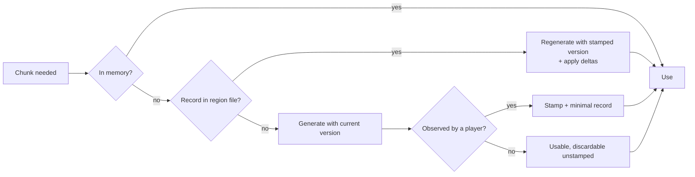

# 24 — Procedural World Generation (`dh-procgen`)

> Part of the Dragon Heroes document set. Canon: [00-canon.md](../00-canon.md) §4, §6, §10.
> Sibling docs: [world & biomes](../design/12-world-and-biomes.md) (what the world should feel
> like), [21-simulation-core](21-simulation-core.md) (who consumes chunks),
> [22-netcode-and-server-hosting](22-netcode-and-server-hosting.md) (zones, AOI),
> [23-content-pipeline](23-content-pipeline.md) (weekly drops that feed the generator).

## Purpose

This document specifies `dh-procgen`, the C++ library that turns a world seed into the infinite
Hunt world: the coordinate scheme, the layered generation stack, danger/reward gradient math,
generator versioning, delta persistence, the server's on-demand generation flow, and the bounded
variant that builds Gloomfall arenas. It exists so that determinism — the single most fragile
property of a live infinite world — is written down as an engineering contract with tests, not an
aspiration. Everything here is design intent for review before code; tunables are marked
**(proposal)**.

## Requirements recap

From canon §4 and the [live-content research](https://www.alanzucconi.com/2022/06/05/minecraft-world-generation/),
the generator must satisfy five hard requirements:

1. **Infinite.** The Hunt world has no edge; generation is on demand, forever (Terraria's
   finite pregenerated world is the anti-pattern).
2. **Seeded.** One global `u64` world seed per realm. The seed plus the generator version is the
   entire description of the base world.
3. **Deterministic with constant-time random access.** For any chunk coordinate,
   `generate(seed, version, coord)` returns the same bytes every time, computable directly —
   **no neighbor dependency chains**. A chunk must never need another chunk to have been
   generated first. Anything that spans chunks (rivers, POIs, biome cells) is derived from
   deterministic macro-cell hashing any chunk can evaluate independently, in bounded work.
4. **Versioned.** Weekly/monthly content drops change the generator; existing space must
   regenerate byte-identically forever (see [Generator versioning](#generator-versioning-and-the-determinism-contract)).
5. **Server-authoritative.** Valheim's model of delegating zone simulation to the first client in
   the area ("zone owner") is cheap but non-authoritative and
   [disqualifying for a real-money economy](https://valheim.fandom.com/wiki/Dedicated_servers).
   Zone processes generate, simulate, and persist chunks; clients never own world state.

### Who runs the generator

The server is canonical. But clients also run `dh-procgen` (embedded via `dh-godot`) to produce
base terrain locally from the seed, so the server streams only deltas and entity state instead of
tile data. This imposes a requirement **stricter than the dh-sim canon** (which demands
determinism only within a build): `dh-procgen` must be **bit-exact across platforms and
compilers**. Concretely: all randomness comes from integer hashing (no sequential RNG draws), f32
usage is restricted to IEEE-754 basic operations (fast-math and FP contraction are disabled project-wide — `-ffast-math` is banned and
`-ffp-contract=off` is enforced, so the compiler never reassociates), and libm transcendentals are forbidden — `dh-math` provides polynomial approximations
where curves are needed. The golden-chunk suite (below) enforces this on every target platform in
CI; if bit-exactness proves fragile in practice, the fallback is server-streamed terrain at
roughly 12 KB per chunk compressed (open question 1).

## Coordinates, chunks, and units

| Concept | Definition |
|---|---|
| Tile | 1 × 1 m, the atomic terrain cell (canon: simulation units are meters). |
| Chunk | **64 × 64 tiles** (64 × 64 m), the unit of generation, persistence, and streaming (canon §4). |
| Chunk coordinate | `(i64, i64)` — `chunk = tile >> 6`. i64 makes the world practically infinite with no wraparound cliff. |
| Region | **32 × 32 chunks** (2,048 × 2,048 m), the unit of on-disk storage (see [Persistence](#persistence-delta-model-and-region-files)). |
| Macro cell | 1,024 × 1,024 m (16 × 16 chunks) **(proposal)** — the hashing lattice for biome cells, rivers, and POI stratification. |
| Supercell | 8,192 × 8,192 m (128 × 128 chunks) **(proposal)** — the claiming unit for new-biome drops. |

Entity positions are **f32 meters relative to a zone origin**: each zone process
([22-netcode](22-netcode-and-server-hosting.md)) anchors an i64 tile origin and simulates in local
f32, keeping precision at sub-millimeter across a zone's span. The client applies a
**floating-origin** rebase — the render world is periodically re-centered on the camera so f32
render coordinates never drift far from zero, no matter how deep a party hunts. Global entity
identity uses `(zone origin i64, local f32)`; zone handoff re-anchors positions exactly on tile
boundaries so nothing is lost in translation.

Per-tile chunk output is compact: terrain tile ID (u16, a stable content string ID interned per
content-pack set), elevation terrace (i8), and flags (collision, water, spawn-blocker) — about
16 KB raw per chunk, far less after zstd.

## The generation stack

Generation is a fixed pipeline of layers, each a pure function of `(seed, coords)` and the layers
above it. Layer seeds are derived by hashing — `layer_seed = hash(world_seed, layer_id)` — never
by drawing from a shared sequential stream, so inserting a new layer in a future version cannot
shift any existing layer's randomness.

| # | Layer | Produces | Characteristic scale |
|---|---|---|---|
| 1 | Continental / elevation | Elevation field, land/water mask | 8,192 m base wavelength, 4-octave FBM **(proposal)** |
| 2 | Climate | Temperature and moisture fields | 4,096 m wavelength **(proposal)** |
| 3 | Biome assignment | Biome ID per point | ~1,024 m Voronoi cells **(proposal)** |
| 4 | Biome blending | Blend weights at seams | 24 m blend band **(proposal)** |
| 5 | Terrain detail | Tile IDs, terraces, decoration | Per tile |
| 6 | Features | Rivers, cliffs, ramps | Macro-cell graph |
| 7 | POI placement | POI sites + types | Stratified per macro cell |
| 8 | Spawn-table assignment | `spawn_table_id` per chunk | Per chunk |

### 1–2. Continental and climate fields

Low-frequency FBM noise (OpenSimplex-family gradients hashed from the layer seed) produces
elevation and the land/water mask; two independent fields produce temperature and moisture. These
are the "physics" the biome layer reads, and they are the cheapest layers — evaluable at any
coordinate for map previews and river tracing without generating chunks.

### 3. Biome assignment — domain-warped Voronoi

Biomes are assigned by scattered Voronoi cells (one jittered seed point hashed per macro cell),
with the lookup position **domain-warped** by mid-frequency noise before the nearest-point query.
Each cell picks its biome from the launch set of five (canon §4: Everbloom Wilds, Gloamfen,
Cinderwastes, Palecrown Peaks, Umbral Depths) weighted by the climate and elevation values at its
seed point — so frozen Palecrown claims high/cold cells and Gloamfen claims wet lowlands, while
cell shapes stay organic. Scattered-point, domain-warped assignment is the standard cure for grid
artifacts in chunked biome systems — see
[KdotJPG's "Fast Biome Blending, Without Squareness"](https://noiseposti.ng/posts/2021-03-13-Fast-Biome-Blending-Without-Squareness.html)
and [Amit Patel's polygonal map generation](http://www-cs-students.stanford.edu/~amitp/game-programming/polygon-map-generation/).
Umbral Depths (caverns) additionally requires an entrance feature to be reachable — its surface
cells render as fissured badlands with generated descent points (detail owned by
[design/12](../design/12-world-and-biomes.md)).

### 4. Biome blending at seams

Within a 24 m band **(proposal)** of a Voronoi boundary, terrain parameters (tile palettes,
decoration density, elevation shaping) are interpolated between the neighboring biomes using
normalized distance-to-boundary weights, per KdotJPG's scattered-point blending scheme. Blending
is a pure function of position — it evaluates the biome field at offset sample points, never reads
neighbor chunk state — so it cannot create dependency chains. Gameplay-relevant values (danger
tier, spawn tables) do **not** blend; they switch at the boundary so a chunk has exactly one
spawn table.

### 5. Terrain detail

High-frequency hashed noise picks ground tiles from the biome's content-defined tile palette
([23-content-pipeline](23-content-pipeline.md)), places decorations (flora, rocks, luminous
accents), and quantizes elevation into discrete **terraces**. The simulation is a flat 2D plane
with scalar z-height (canon §1), so elevation is not a heightfield the physics walks — terraces
are cosmetic strata whose edges become cliffs.

### 6. Features — rivers and cliffs

Rivers: each macro cell hashes a chance of a river source at a local elevation maximum; the path
is traced by gradient descent on the layer-1 elevation field until it reaches water or merges.
Because the elevation field is evaluable anywhere, any chunk can re-trace the (deterministic)
paths of rivers originating in its own and surrounding macro cells — bounded work, no stored
state, no generation-order dependence. Cliffs are terrace edges where layer-1 slope exceeds a
threshold; the generator guarantees ramp cuts so every terrace is reachable — cliffs are collision
barriers in the 2D sim, ramps are the doors through them.

### 7. POI placement — stratified sampling with a danger gradient

POIs (ruins, dens, shrines, camps — taxonomy owned by
[design/12](../design/12-world-and-biomes.md)) are placed by **stratified sampling**: each macro
cell hashes 0–2 candidate sites **(proposal)** with jittered positions, subject to a minimum
separation of 96 m **(proposal)** enforced by comparing against the deterministic candidates of
adjacent cells (again: recomputed, not read from state). The POI *type and quality* roll is
weighted by the chunk's danger tier (next section), so deep space gets lairs and Legendary dens
while haven outskirts get camps and small ruins. **Havens** — the safe hubs defined in design/12 —
are themselves placed by this layer on a sparser lattice, target spacing ~7 km **(proposal)**,
with the guarantee that a new character always spawns inside a haven's safe radius.

### 8. Spawn-table assignment

Each chunk deterministically resolves a `spawn_table_id` — a stable content string ID such as
`core.spawn_table.gloamfen_d3` — from its dominant biome and danger tier. That ID is the entire
procgen output for creatures. Actual pack spawning (packs of 3–8 led by an Elite or Legendary,
canon §4) is **runtime** behavior in `dh-sim` using the zone's live RNG against that table —
deliberately outside the determinism contract, so hunts differ visit to visit while the world
never does. Table contents ship as content data owned by [design/13](../design/13-creatures-and-bestiary.md).

## Danger and reward gradient

The world's core promise — deeper is deadlier and richer
([design/12](../design/12-world-and-biomes.md)) — is implemented as a distance field from havens:

```
d    = distance in meters from the nearest haven center (deterministic, layer 7)
tier = clamp(floor((d - 250) / 750), 0, 5)      # r_safe = 250 m, ring = 750 m, max D5 (proposals)
```

Tier feeds three consumers: spawn-table selection (share of Elite/Legendary-led packs rises with
tier), POI quality weights, and the loot-quality bias inside spawn/loot tables
([design/14](../design/14-items-loot-and-affixes.md)). Illustrative starting weights
**(proposal — design/13 owns the final mix)**:

| Tier | Distance band | Elite-led packs | Legendary-led packs |
|---|---|---|---|
| D0 | < 1,000 m | 5% | 0% |
| D1–D2 | 1,000–2,500 m | 15–25% | 1–2% |
| D3–D4 | 2,500–4,000 m | 35–50% | 4–8% |
| D5 | > 4,000 m | 60% | 12% |

With ~7 km haven spacing, the deep interior between havens reaches D5 — risk appetite maps to a
walk, not a menu. Endgame scaling beyond D5 is a design/12 decision; the formula absorbs it by
raising the clamp.

## Generator versioning and the determinism contract

Every generator release carries a monotonically increasing **generator version** (`u32`). Every
chunk is stamped at first generation with the version that produced it (canon §4), and from then
on **that chunk regenerates with that version's code path, byte-identically, forever**. This is
[Minecraft's long-standing practice](https://www.alanzucconi.com/2022/06/05/minecraft-world-generation/):
new terrain rules apply only to virgin space; visited space is frozen. Consequences we accept up
front:

- **Old code paths live forever.** Versioned layers are kept behind a registry in `dh-procgen`;
  a release may only add layers or add versioned branches, never edit an existing version's math.
- **New biomes claim virgin supercells.** A biome drop (every 4–6 weeks, canon §4) runs a liveops
  query against the persistence layer for supercells containing **zero stamped chunks**, claims a
  set, and bakes the claim list into the release as data. The new biome field applies only inside
  claimed supercells; outside them the field is bit-identical to the previous version. At
  supercell borders, the generator blends old-field and new-field outputs over a transition band —
  a pure function of both (always-evaluable) field versions, constructed to equal the old field
  exactly at the band's outer edge, so a pre-drop chunk sitting on the border meets the new
  terrain continuously with no neighbor reads.
- **Determinism is a regression-tested contract, not a property.** The research caveat is blunt:
  a single floating-point reassociation, hash change, or iteration-order change silently corrupts
  the world — old chunks would regenerate differently under players' feet. Ordinary tests will not
  catch it; the golden-chunk suite (below) is the gate every generator release must pass.

## Persistence: delta model and region files

We adopt the [Valheim split](https://valheim.fandom.com/wiki/World_seed): the base world is never
stored — it is always regenerable from `(seed, stamped version)` — and disk holds only **deltas**:

| Persists (delta records) | Regenerates (never stored) |
|---|---|
| Chunk version stamp (mandatory, ~bytes) | Terrain, terraces, cliffs, rivers |
| Looted/opened container states (+ reset timestamps) | Vegetation and decoration |
| Boss kill records + respawn-at timestamps (long timers) | Ambient creature packs (respawn from spawn tables) |
| World-event outcomes flagged persistent by [design/12](../design/12-world-and-biomes.md) | Transient event state, short respawn timers (held in zone memory) |
| Terrain edits — **not planned at launch** (open question 3) | POI structure layout |

Short-lived respawn timers live in zone-process memory and simply reset if a zone recycles;
timers long enough to outlive a zone (Legendary boss respawns) are deltas. The exact
persistence-vs-regeneration boundary per world system is a design/12 decision; this file defines
the mechanism.

On disk, deltas are stored in **Anvil-style region files** — the mechanics proven by
[Minecraft's region format](https://minecraft.wiki/w/Region_file_format): one file per 32 × 32
chunks (`r.<rx>.<ry>.dhr`), a fixed header with a sector index (offset + length per chunk slot),
zstd-compressed chunk records, and a per-chunk header carrying the generator version stamp and a
last-modified timestamp. A chunk with no deltas but a stamp is a minimal record; a chunk never
observed has no record at all. One deliberate rule: chunks generated speculatively (prefetch) that
no player ever observed are **discarded unstamped** **(proposal)** — the frontier stays virgin and
claimable for future drops.

Region files do **not** live on any single zone's persistent volume. Zones follow players with no
fixed world-to-zone mapping ([22-netcode §5](22-netcode-and-server-hosting.md)) — the process that
flushed a region last week may be gone today, and two adjacent zones can straddle one region — so
region files live in **shared storage keyed by region coordinate**: one addressable record per
region (`r.<rx>.<ry>.dhr`), backed by object storage or a network filesystem (technology choice
owned by [26-backend-and-services](26-backend-and-services.md)). Writes follow the same
single-owner discipline the **Zone Directory** already enforces for chunk ownership and hero
handoff: before its first flush to a region, a zone acquires that region's **write lease** from
the Directory, holds it while any of its active chunks map into the region, and releases it on
eviction or shutdown; at most one zone holds a region's write lease at a time, and lease-less
zones may only read. Backup rides on the shared store — versioned objects (or filesystem
snapshots) with point-in-time restore, continuously replicated to object storage where the primary
store is not object storage itself (infra details in
[26-backend-and-services](26-backend-and-services.md)).

## Server on-demand generation flow

A zone process ([22-netcode](22-netcode-and-server-hosting.md)) maintains an **active set** of
chunks: everything within 4 chunks (~256 m) **(proposal)** of any player, plus a 2-chunk prefetch
ring generated asynchronously ahead of movement. The load-or-generate decision:



Generation runs on a worker pool (2 threads per zone **(proposal)**) — the 30 Hz sim thread
(33 ms tick) never generates. It only *integrates* finished chunks: at most 4 activations per
tick, ≤ 1 ms **(proposal)**. Dirty chunks flush to region files every 30 s and on zone shutdown
**(proposal)**; chunks with no subscriber for 60 s **(proposal)** are evicted after flush. A
player sprinting into virgin space is the bounded worst case: prefetch hides latency, and if a
player outruns the workers, entry is briefly withheld while a worker generates — never a blocking
stall on the sim thread.

## Gloomfall map generation — the bounded variant

Gloomfall ([design/16](../design/16-pvp-and-tournaments.md); 40 players, canon §5) uses the same
stack with three overrides rather than a second generator:

- **Finite arena.** 2,048 × 2,048 m — 32 × 32 chunks, exactly one region **(proposal)** — fully
  generated at match spin-up on the Edgegap match server, entirely in memory, no persistence. The
  match seed comes from the match service; since clients learn the seed at lobby time, they
  pregenerate the map during loading.
- **Guaranteed landmark distribution.** Stratified placement switches from "0–2 candidates per
  cell" to hard quotas: the arena is divided into 8 sectors, each guaranteed an equal landmark
  count ±1 **(proposal)**, with one marquee landmark pinned to the center where the Gloom
  ultimately closes.
- **Fairness constraints.** The 40 spawn points sit equidistant on a perimeter ring; no
  extreme-hazard biome features within 128 m of the ring **(proposal)**; loot-density variance
  across sectors capped. An automated validator checks every constraint post-generation; a failing
  seed is deterministically re-rolled (`seed + 1`, bounded retries) so match starts never block on
  a pathological map.

Gloomfall maps always use the **current** generator version — there is no old space to honor —
which also makes them a weekly live-fire exercise for the newest generation code.

## Performance targets

| Metric | Target **(all proposals)** |
|---|---|
| Full chunk generation (all 8 layers), one worker thread | ≤ 5 ms p50, ≤ 12 ms p99 |
| Sim-thread chunk integration | ≤ 1 ms per tick, ≤ 4 chunks/tick |
| Gloomfall arena (1,024 chunks) on 4 worker threads | < 2 s wall clock |
| Active chunk memory footprint | ≤ 64 KB (≈ 6 MB per 100-chunk active set) |
| Region-file flush pause | 0 ms on sim thread (async I/O on workers) |

These budgets size the 50–80 CCU zone target (canon §6): worst case, a full party sprinting in
four directions demands ~12 chunks/s — comfortably inside two workers at 5 ms/chunk.

## Testing

1. **Golden-chunk suite.** For every released generator version: a committed corpus of
   `(seed, chunk coord)` pairs — including biome seams, supercell borders, river crossings, haven
   sites — with blake3 hashes of the canonical chunk encoding. CI regenerates the full corpus on
   every commit, on every target platform (Linux x86-64, Windows, macOS ARM, Android ARM), and
   fails on any hash mismatch. A release is appended to the corpus, never edited. This is the
   enforcement mechanism for the "old chunks regenerate byte-identically forever" contract.
2. **Determinism fuzz.** Nightly job samples random `(seed, coord, version)` triples and compares
   the current binary against a pinned reference binary of each prior release — catching drift the
   fixed corpus might miss.
3. **Biome distribution statistics.** Per release, sample ~10⁶ points across ~100 seeds
   **(proposal)** and assert biome share, haven spacing, POI density per macro cell, river
   frequency, and danger-tier area shares stay within tolerance bands — catching a "correct but
   degenerate" generator (e.g., a warp change that starves Palecrown Peaks) before players do.
4. **Gloomfall fairness regression.** Run the match validator across 1,000 seeds per release
   **(proposal)**; assert re-roll rate < 1% and zero double re-rolls.

## Open questions (for Ricardo)

1. **Client-side base-world generation vs. server-streamed terrain.** Running `dh-procgen` on
   clients saves ~12 KB/chunk of bandwidth but requires cross-platform bit-exactness (stricter
   than the sim canon). Approve the client-generation plan with streamed-terrain as the tested
   fallback, or mandate streaming from day 1 for simplicity?
2. **Danger gradient tunables.** Confirm the starting shape: 250 m safe radius, 750 m rings,
   D0–D5, ~7 km haven spacing — or direct a flatter/steeper world before design/12 builds its
   reward tables on top.
3. **Terrain edits at launch.** The delta model supports player terrain modification, but it is
   excluded from launch scope here (sim cost + griefing surface). Confirm exclusion, or scope a
   limited version (e.g., quest-driven digs only)?
4. **Prefetch-only chunks stay unstamped.** Proposed: only player-observed chunks get frozen at
   their generator version, keeping speculative generation from shrinking virgin space for future
   biome drops. Accept, or stamp everything ever generated for a stricter audit trail?
5. **Gloomfall biome composition.** Should arenas draw from the full launch biome set per seed, or
   from curated per-week biome themes (better readability for a competitive mode, less variety)?
6. **Frontier hygiene.** Do we ever archive/compact region files for space that was stamped years
   ago and never revisited (cold storage with on-demand restore), or is "stamped is forever hot"
   acceptable at projected storage cost?

## Sources

- [Alan Zucconi — The World Generation of Minecraft](https://www.alanzucconi.com/2022/06/05/minecraft-world-generation/) — seeded layered noise, constant-time access, versioned generation in virgin space.
- [Minecraft Wiki — Region (Anvil) file format](https://minecraft.wiki/w/Region_file_format) — 32×32-chunk region files, sector index, compressed per-chunk records.
- [Valheim — world seed and persistence](https://valheim.fandom.com/wiki/World_seed) — regenerable base world + delta-only save split.
- [Valheim — dedicated servers](https://valheim.fandom.com/wiki/Dedicated_servers) — client zone-ownership as the anti-pattern for authoritative economies.
- [KdotJPG — Fast Biome Blending, Without Squareness](https://noiseposti.ng/posts/2021-03-13-Fast-Biome-Blending-Without-Squareness.html) — scattered-point biome assignment and seam blending without grid artifacts.
- [Amit Patel — Polygonal Map Generation for Games](http://www-cs-students.stanford.edu/~amitp/game-programming/polygon-map-generation/) — Voronoi-cell biome maps.
- Internal research digest: live-content-architecture (July 2026) — determinism caveats, persistence precedents, server-authority requirement.
