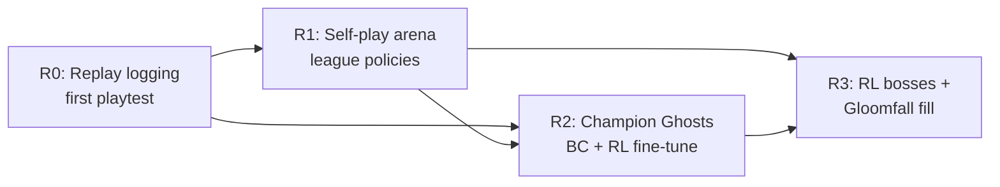

# 25 — Creature AI & the RL Program

> **Status:** v0.1 draft — 2026-07-07. Conforms to [canon §9](../00-canon.md). Author: AI/ML engineering.

## Purpose

This document specifies how every creature in Dragon Heroes decides what to do, and how we build, train, evaluate, and serve the small set of reinforcement-learning (RL) policies that the canon reserves for the places where adaptiveness is the product. It covers the two-layer AI strategy (data-driven behavior trees and utility scoring for all normal creatures; RL exclusively for Elite/Legendary bosses, Champion Ghosts, and Gloomfall lobby fill), the AI-profile content format designers author, execution inside `dh-sim` at 30 Hz, the four-phase RL roadmap (R0–R3), the observation/action schema that survives weekly content drops, fairness constraints baked into training, CPU-only ONNX serving with a versioned policy registry, the automated eval gate, reward-hacking countermeasures and their productive inverse (exploit-finder agents), the compute budget, and an honest statement of the one genuinely novel risk we are taking on.

---

## 1. The two-layer strategy

Canon §9 fixes the split, and the research record backs it as the industry-validated pattern:

| Layer | Who uses it | Why |
|---|---|---|
| **BT / utility AI** (data-defined AI profiles) | **All** Normal-tier creatures; the baseline layer of Elite/Legendary bosses | Cheap to author, deterministic to debug, designer-tunable per weekly drop, zero training cost. RL adds nothing here. |
| **RL policies** | Elite/Legendary bosses (as an augmentation layer, Phase R3), Champion Ghosts, Gloomfall lobby fill | These are exactly the roles where "plays like a skilled human" or "adapts to your build" is the feature itself. |

Two production findings anchor this. First, the October 2025 AMD Schola paper on combining RL and behavior trees for NPCs ([arXiv 2510.14154](https://arxiv.org/abs/2510.14154)) found that the hybrid far exceeds pure curriculum-RL success rates while approaching pure-BT reliability — the hybrid is not a compromise, it dominates both extremes. Second, Ubisoft La Forge's production experience (GDC, ["Smart Bots for Better Games: RL in Production"](https://www.gdcvault.com/play/1026281/ML-Tutorial-Day-Smart-Bots); [Roller Champions agents](https://arxiv.org/pdf/2012.06031)) reaches the same conclusion from the shipping side: keep scripted/utility AI for the hundreds of ordinary NPCs and spend RL effort only where it changes the player's experience.

The strategic consequence: **the vast majority of our weekly creature content never touches the ML pipeline.** A new pack of Gloamfen creatures is a rig reference, a stat block, a skill set, and an AI profile — pure data, shipped like any other content (see [content pipeline](23-content-pipeline.md)). RL retraining is triggered only when a drop materially changes the *player-side* meta that Ghosts and Gloomfall bots must respond to.

## 2. AI profiles: the data format

An **AI profile** is a content definition (`content/core/ai-profiles/`, stable ID like `core.ai.quadruped_pack_skirmisher`), validated by JSON Schema in CI like every other content type ([canon §7](../00-canon.md)). It has two parts.

### 2.1 Utility scorers

A profile declares a list of **scorers**: small, composable functions over sim-visible state that produce a score per candidate behavior. Scorer inputs are restricted to a whitelisted feature set so profiles stay cheap and deterministic:

| Input family | Examples |
|---|---|
| Distance | range to current target, range to nearest ally, distance from pack leader, distance from spawn anchor |
| Health | own HP fraction, target HP fraction, pack aggregate HP |
| Cooldowns | readiness of each equipped creature skill, global attack cooldown |
| Pack state | pack size alive, leader alive?, count of packmates currently engaging, assigned pack role (harasser / flanker / anchor) |
| Partner (Legendary duos) | partner alive?, distance to partner, partner's active fragment, element of partner's last field-affecting cast, ticks since that cast (the element-sequencing window) |
| Threat | recent damage taken window, target's facing, number of hostile heroes in aggro radius |

Each scorer is a curve (response curve over one input, PoE/Utility-AI school) with designer-set weights. The highest-scoring behavior wins, with hysteresis — a switching margin of **15% (proposal)** so creatures don't oscillate between behaviors on noisy inputs.

### 2.2 The shared behavior library

Scorers select **behavior-tree fragments** from a shared, engineering-maintained **behavior library** compiled into `dh-sim`. Designers compose; engineers implement primitives. The launch library (all names are stable content-facing IDs):

| Primitive | Behavior |
|---|---|
| `approach` | Close to a target band (melee reach, or preferred cast range) using archetype steering |
| `strafe` | Orbit the target at current range, direction re-rolled on a seeded timer |
| `flank` | Path to a position in the target's rear 120° arc before engaging |
| `retreat` | Disengage toward pack leader or spawn anchor, optionally firing retreat skills |
| `pack_converge` / `pack_stagger` | Coordination primitives: collapse on the leader's target / take turns engaging so a pack of 3–8 doesn't alpha-strike as one blob |
| `duo_pincer` / `duo_cover` | Duo-coordination primitives (Legendary duos, [bestiary §4.2](../design/13-creatures-and-bestiary.md)): hold the target between both partners / screen the partner through its wind-up — scorers read the partner input family (§2.1) |
| `element_sequence(skill_id)` | Time a field-affecting cast against the element and recency of the partner's last cast so the two kits combine into **field combos** on the tile grid (e.g. fire dragon + earth elemental → lava tiles — canon §4's elemental field-interaction system) |
| `telegraph_attack(skill_id)` | Play the wind-up, commit to the attack's active frames, recover — the telegraphed-attack pattern that [combat](../design/11-combat-and-controls.md) readability depends on |
| `guard_zone` | Hold and patrol an area (POI guardians) |
| `use_skill(skill_id)` | Fire a creature skill definition when its own conditions pass |

A creature definition in the [bestiary](../design/13-creatures-and-bestiary.md) is therefore: archetype rig + palette/part variants + stat block + skill set + **AI profile** — all five slots are data. Designers can ship a new creature personality in a weekly drop by writing a new profile that recombines existing primitives; a genuinely new *primitive* (new C++ code) is an engine change and follows the normal release train, never a data patch (canon: no scripts in downloaded content).

A sketch of the format (illustrative, not final schema — the schema lives in `content/schemas/ai-profile.schema.json`):

```json
{
  "id": "core.ai.quadruped_pack_skirmisher",
  "archetype": "quadruped",
  "behaviors": [
    { "fragment": "approach",
      "scorers": [
        { "input": "distance_to_target", "curve": "inverse_linear", "range_m": [2.0, 14.0], "weight": 1.0 },
        { "input": "skill_ready", "skill": "core.skill.lunge_bite", "curve": "step", "weight": 0.6 }
      ] },
    { "fragment": "strafe",
      "scorers": [
        { "input": "distance_to_target", "curve": "band", "range_m": [2.0, 4.0], "weight": 0.8 },
        { "input": "packmates_engaging", "curve": "linear", "range": [0, 3], "weight": 0.5 }
      ] },
    { "fragment": "retreat",
      "scorers": [
        { "input": "own_hp_fraction", "curve": "inverse_smoothstep", "range": [0.0, 0.35], "weight": 1.4 },
        { "input": "leader_alive", "curve": "step_not", "weight": 0.7 }
      ] }
  ],
  "pack_role_bias": { "harasser": 0.6, "flanker": 0.3, "anchor": 0.1 },
  "switch_hysteresis": 0.15
}
```

### 2.3 Designer tooling and debuggability

Debuggability is the whole reason the normal-creature layer is *not* RL, so it gets first-class tooling: the client debug build renders a per-creature overlay (active fragment, live scorer values, pack role) driven by a server debug channel; `tools/` ships a headless profile linter (every referenced fragment/skill/input exists, curves are well-formed) that runs in content CI alongside schema validation ([content pipeline](23-content-pipeline.md)); and because AI is deterministic under the seeded RNG, any reported "creature did something dumb" bug reproduces exactly from the replay file. A balance-sim harness in `tools/` runs profile-vs-profile and profile-vs-scripted-hero matchups headlessly to smoke-test a weekly drop's creatures before a human ever fights them.

### 2.4 Execution in dh-sim

AI runs inside `dh-sim` (see [simulation core](21-simulation-core.md)) as an ordinary fixed-tick system at **30 Hz**, over the struct-of-arrays entity store — no Godot nodes, no engine physics. Per tick:

1. **Sense** — refresh the whitelisted feature set from sim state (spatial-hash queries reuse the AOI structures from [netcode](22-netcode-and-server-hosting.md)).
2. **Score** — re-evaluate utility scorers every **5 ticks (proposal)** per creature, staggered across the population so cost is flat; the winning fragment persists between evaluations.
3. **Act** — tick the active BT fragment, which emits the same intent commands a player client would (move vector, face, use skill N). AI and players share one command pathway; this is also what makes the RL action space trivial to define later.
4. **Steer** — a per-archetype steering pass turns move intents into velocities: quadrupeds arc into turns, avians/winged beasts steer in z-height as well ([canon §1](../00-canon.md): flat 2D plane + scalar z), spirits ignore certain terrain costs, serpents (post-launch rig) path with body-follow. Steering parameters live in the archetype definition, not the profile.

Determinism: scorer timers and strafe re-rolls draw from the per-system seeded PCG stream (canon §6), so replays reproduce AI exactly — a hard requirement for Phase R0.

## 3. Bosses: scripted phase machines over the BT layer

Every Elite/Legendary pack leader ([bestiary](../design/13-creatures-and-bestiary.md)) carries a **phase machine** layered *above* its AI profile: a small scripted state machine, authored as data, whose states swap the active profile, unlock skills, and trigger set-pieces (HP thresholds, enrage timers, add-summoning, arena hazards). The phase machine owns *what the fight is*; the BT/utility layer owns *how the creature moves moment to moment*.

The kit sizes the phase machine must express are canon (v0.2): an **Elite boss composes at least 5 signature skills** into one coherent, learnable strategy — telegraphs, punish windows, phases — and a **Legendary carries up to 10 skills** with a richer strategy ([bestiary §4.1–4.2](../design/13-creatures-and-bestiary.md)). The phase machine is where that composition is authored: which of the kit's skills each phase unlocks, and which punish windows each phase opens. **Legendary duos** are two phase machines paired by authored data: a duo pairing names both creatures and their combo sequences, each partner's profile scores over the partner input family (§2.1), and the `duo_pincer`/`duo_cover`/`element_sequence` primitives (§2.2) turn the two kits into field combos on the tile grid. Like everything else in this section, duo coordination is designed, not emergent — the pairing table is content, not a training artifact.

The design rule is canonical in spirit and worth stating plainly: **boss difficulty is designed, not emergent.** A boss must be hard because a designer decided its phase 2 punishes greed, not because a training run happened to converge on something brutal. When RL boss augmentation arrives (Phase R3, §4.4), the policy operates *within* a phase — replacing the utility layer's moment-to-moment decisions for designated phases — and the phase machine remains the scripted, designed spine. Legendary drop rarity anchors marketplace value ([economy](../design/15-economy-and-marketplace.md)); boss difficulty must therefore be a deliberate, tunable dial, never a training artifact.

## 4. The RL program: phases R0–R3



### 4.1 Phase R0 — replay logging from the first playtest

Before any model exists, the server logs **observation + action pairs** (not video) for every combat participant, at the sim tick they occurred, keyed by replay ID and content-version hash. The research digest is unambiguous that this is the canonical cheapest-now, highest-value item: "Instrument server-side replay logging (observation + action pairs, not video) from the first playtest. This is the cheapest thing you can do now and it unlocks behavioral cloning, tournament-champion ghosts, bot-vs-human evaluation, and cheat detection later." It is a canonical requirement (canon §9) and lands with the first playtest build — VPT-style inverse-dynamics recovery of actions from state-only logs exists ([Rocket League replay pretraining](https://github.com/Rolv-Arild/replay-pretraining)) but is a rescue technique; logging actions directly from day one avoids ever needing it.

Storage format: the observation is the *same* encoded tensor the live policy will consume (§5), so logged data never needs re-featurization. Retention — this document owns the retention question; other docs (e.g. [simulation core](21-simulation-core.md)) link here rather than restating numbers: **full retention for tournament/ranked replays** (they feed Champion Ghost training, §4.3, and dispute review) plus a **10% sample of Hunt sessions kept 90 days (proposal)**, which supersedes the earlier blanket 180-day figure. Logs are tied to account IDs only where the ToS consent of §4.3 covers it — LGPD scoping goes to the DPO ([legal](../business/30-legal-payments-compliance.md)).

### 4.2 Phase R1 — self-play arena policies

Training stack, per canon §9:

- **Environment:** `dh-env` — the same C++ `dh-sim` library exposed through a C API + nanobind binding as a **vectorized** environment (thousands of headless arena instances per process). This is the decisive architectural fact from research: fast RL requires the sim to be a deterministic headless native library, and we need that anyway for server-authoritative combat, so **training env and live server share one codebase** — train/live parity by construction.
- **Trainer:** **PufferLib 3.x** ([puffer.ai](https://puffer.ai/), [GitHub](https://github.com/PufferAI/PufferLib)) — its [RLC 2025 paper](https://rlj.cs.umass.edu/2025/papers/Paper151.html) demonstrates full PPO at **300k–1.2M environment steps/s on a single RTX 4090-class GPU** against optimized native envs, including a MOBA-style arena. The 3.x PPO variant (Muon optimizer, GAE+VTrace, prioritized trajectory replay, automatic hyperparameter tuning) is explicitly designed for small teams. Sample-factory ([GitHub](https://github.com/alex-petrenko/sample-factory)) is the designated fallback.
- **Why not engine-in-the-loop:** Godot-in-the-loop training (Godot RL Agents-style, ~12k interactions/s) is roughly **100× too slow** and would invert the compute economics. The headless C++ sim is what makes RL affordable at all.

**League training** for arena (1v1/3v3) policies follows the AlphaStar recipe ([DeepMind](https://deepmind.google/blog/alphastar-grandmaster-level-in-starcraft-ii-using-multi-agent-reinforcement-learning/)): a population of **main agents + frozen past checkpoints + exploiter agents**, matched by **prioritized fictitious self-play** so main agents spend training time against the opponents they lose to, preventing strategy cycling (rock-paper-scissors collapse). NCSoft's Blade & Soul arena agent — the closest published analog to a fighting-style ARPG duel — reached 62% win rate versus pros with a self-play curriculum ([arXiv 1904.03821](https://arxiv.org/abs/1904.03821)), which we treat as an existence proof, not a launch bar.

**Reward design (proposal, R1 starting point):** sparse win/loss as the dominant term, small shaping terms for damage dealt/taken differential and time-alive, and explicit penalties for degenerate states (§9). Shaping weights anneal toward zero as the league matures so final policies optimize the actual objective, not the scaffolding. Every reward term is registered in the training config with an owner and a rationale — unowned reward terms are how hacking surprises happen.

### 4.3 Phase R2 — Champion Ghosts

Per [PvP & tournaments](../design/16-pvp-and-tournaments.md) and canon §5: each week's tournament winners' builds train sparring bots players can challenge. Pipeline:

1. **BC pretraining** on the winner's replays, **augmented with population replays** — one player's week is thin data and BC on it alone overfits, so the population provides coverage while the winner's data provides style.
2. **RL fine-tune with a KL-divergence penalty toward the BC policy**, so the agent gets stronger without drifting away from human-like, recognizably-the-champion play.
3. **Build/loadout conditioning:** the policy is conditioned on an embedding of the champion's class, skill loadout, and gear affix profile, so one network family serves many champions and a Ghost actually plays *that* build.

Two non-negotiables travel with this feature: **explicit ToS consent** to train on tournament replays (tournament ruleset, drafted with counsel — LGPD applies), and **champion credit** — the Ghost is presented as a feature honoring the winner ("fight last week's champion"), with named credit and possibly revenue share (open question 1). Research flagged both the consent requirement and the reframing-as-feature as the correct pattern.

### 4.4 Phase R3 — RL bosses and Gloomfall fill

- **RL boss augmentation:** designated phases of designated Elite/Legendary bosses swap their utility layer for an RL policy (within the phase machine's scripted spine, §3). Scope starts at **1–2 flagship Legendaries (proposal)**, not the whole boss roster.
- **Gloomfall lobby fill:** human-like bots fill 40-player Gloomfall lobbies in low-population brackets and off-peak hours, trained from the same arena/league lineage plus BR-specific curricula (Gloom pressure, looting, third-party avoidance). Apex Legends' June 2026 move to bot-filled low-skill lobbies ([EA announcement](https://www.ea.com/en/games/apex-legends/apex-legends/news/overclocked-matchmaking-update)) is our demand evidence — note the research caveat that Apex's bot *training method* is unspecified, so we cite it as evidence that player-like fill is wanted, not as shipped RL.

## 5. Observation/action schema: designed for weekly content on day one

Weekly item/skill drops and 4–6-week biome drops (canon §4) are the defining constraint. OpenAI Five needed roughly **20 "surgery" operations over its 296-day run** to survive Dota patches, and the estimate from that program is that from-scratch retrains after each change would have turned ~10 months of training into ~40 — a **4× cost multiplier** ([OpenAI, Dota 2 with Large Scale Deep RL](https://cdn.openai.com/dota-2.pdf)). We therefore fix the schema contract before the first model trains:

- **Entity-set encodings:** observations are variable-length sets of entity feature vectors (heroes, creatures, projectiles, hazards) pooled by the network, never fixed-slot tensors.
- **Learned embeddings per content ID:** every item base, affix, skill, creature, and Bestial Skill ID maps to a learned embedding row (**32 dims, proposal**). **New content = new embedding rows, not new tensor shapes.** A weekly drop appends rows; the architecture is untouched.
- **Warm-start fine-tunes per patch:** each drop triggers a fine-tune from the current checkpoint with new rows initialized from the embedding-table mean (proposal), never a from-scratch retrain — this is the surgery lesson operationalized.
- **Actions** mirror the player command pathway (§2.4): move vector, facing, skill-slot activation — so the action space is stable regardless of what skills occupy the slots.
- Both sides of the schema carry a **schema version**, stamped into replays (R0) and the policy registry (§7), so old replays remain trainable and mismatches fail loudly in CI.

### 5.1 The action head is three outputs, and every runtime must spend them the same way

The arena policy head is `[move_x, move_y, logits_0..6, dodge]` — `ml/training/policy_net.py::act` returns **three** things, `(move, pick, dodge)`, and `dodge` is an independent flag, not an eighth entry in the categorical. The shipping arena (`game/arena/neural_policy.gd`) spends them as:

```gdscript
match pick:                       # attempt the chosen command
    1: ok = fighter.cmd_attack()
    ...
if dodge_logit > 0.0 and not ok:  # dodge ONLY if the pick was refused
    ok = fighter.cmd_dodge(...)
```

**That fallback rule is the contract.** It is easy to lose, because the C surface (`dh_env_step`) carries a single action integer, and folding a separate flag into it is a silent lossy encode. On 2026-09-14 the same weights meant three different things in three places: an **override** for anything driving `dh-env` externally (`7 if dodge else pick` — the dodge replaced the attack), a **fallback** in the Godot arena, and **nothing at all** in `Arena::mlp_act`, the frozen self-play opponent, which never read the logit. Measured cost on the deployed `fen_boar` net, whose build has `dodge_max = 0`: it chose dodge on **95–98% of ticks**, every one of them a guaranteed no-op, and dealt **0.087 health bars per episode against the arena's 0.816**.

The encoding that keeps the contract: bit 3 of the action integer (`DH_ENV_ACT_DODGE = 8`) carries the flag on top of the pick, so `act & 7` is the pick and `act & 8` is "…and dodge if that pick is refused". Values 0–7 are unchanged, 7 still means dodge-and-nothing-else, and `dh_env_action_dodge_bit()` exists so a caller can detect a library too old to understand the bit — a dropped dodge is invisible in every metric a trainer prints, which is exactly how this survived.

**The same encoding is what makes PPO's likelihood correct.** Overwriting the pick with 7 destroyed it, so the update recomputed `Categorical.log_prob(0)` for every dodging tick. Measured at an unchanged policy, where the PPO ratio must be exactly 1: **43.1% of actions reconstructed wrong, ratio spread 0.87–1.17**. With the flag: ratio `1.000000` everywhere, 0% wrong. Gate: `sim-tests::test_arena_dodge_is_a_fallback`.

### 5.1.1 Pay for the effect, never for the intent

An agent chooses an action every tick; the sim decides whether it *happens*. Cooldowns, empty kit slots, being mid-recovery — all of these refuse an action silently. A shaping term that reads the agent's own choice therefore pays for asking, and asking is free.

This was not hypothetical. `R_KIT = 0.02` paid per kit *selection*, and `field_cast` has an 8 s cooldown, so 480 of every 481 ticks that selected it did nothing at all. Over a 3600-tick episode that is **72 reward**, against a terminal worth at most 1 — the exploit outscored winning the fight by 72×, and the learner found it exactly as it should have: kit slot 1 on **100.000%** of ticks, `|move| mean 0.059`. The policy was optimal for the reward it was given.

The fix is a signal, not a smaller constant: `dh::sim::Arena::last_commit(who)` records the action the sim **accepted** this tick, or `-1` if it refused, and `dh_env_step_many_commit()` carries it through the C ABI (a *new* symbol — the old entry point forwards with `nullptr`, so a stale `.so` raises `AttributeError` instead of reading an unset register). PPO masks the dodge bit off before testing the range, because bit 3 is not part of the pick:

```python
pick = vec.commit & (ACT_DODGE - 1)
kit  = (vec.commit >= 0) & (pick >= 3) & (pick <= 6)
```

Measured on the collapsed net: 600 kit selections, **1** actual cast. Gate: `sim-tests::test_arena_reports_what_actually_committed`. Commit tracking is observation only — the golden `state_hash` matrix is unchanged.

**The general rule, since this class of bug is silent by construction:** any per-tick shaping term must read sim state (what changed), not agent output (what was requested). A reward hack does not look like a bug in a training log; it looks like a policy that learned something.

### 5.2 The scoring model: one weighted, scale-normalized definition of "good fight"

Ricardo, 2026-09-14: *"perhaps we should better model our reward model. What is currently considered? […] weight out which is the most importante performance metric, and attribute weights to each variable, sclaing values to what is most impactful. Numbers magnitudes must be scaled tho, as to not compare 40 seconds with 0.087 dmg_dealt. If winner, the shorter the better. If loser, the longest the better."*

**What was scored before.** Two different functions, neither of which saw most of what a fight produces:

| | formula | sees |
|---|---|---|
| `league.fitness()` (ES ranking, the gate) | `wins + 0.1 × (hp_self − hp_foe)` | outcome, end-of-fight health |
| `ppo.py` per tick | `1.0 × (foe_hp_lost − self_hp_lost) − 0.002` `+ 0.02/kit + 0.05/chain`, `±1.0` terminal | outcome, health delta, kit usage |

Neither scored **damage** or **duration**, and `hp_frac` clamps at zero, so overkill is invisible and a kill is indistinguishable from a long grind that ended at the same health. Worse, the per-tick clock was wrong twice over: `− R_TIME` applied regardless of outcome, so **a losing agent was paid to die sooner**, and `0.002 × 3600` ticks totals **7.2 against a win bonus of 1.0** — the clock outweighed the result 7×. And the symmetric health delta meant **avoiding a hit paid exactly as well as landing one**, which is the avoidance local optimum written down as code; PPO seed 7 found it (`mean_loser_hp 0.967`).

**`ml/training/reward.py` replaces both.** Four rules:

1. **Normalize first.** Every term becomes a goodness in `[0, 1]` *before* any weight touches it, each against its own reference scale (one full health bar; the 60 s episode cap). Seconds and damage-bars are never compared as raw magnitudes.
2. **Directions are declared, not implied** by a sign buried in an expression — `TERMS` in the module is the single source of truth. Anything "lower is better" is normalized as `1 − x`.
3. **Duration is conditional on the outcome:** shorter when winning, longer when losing, **neutral on a draw** — deliberately, because giving a draw the loser's rule pays an agent to stall to the time limit.
4. **The outcome outweighs everything else combined.** `assert_sane_weights` enforces `w_win > Σ(others)` at load, so no amount of damage, health or clock can make a lost episode outrank a won one.

| term | better | weight | why that weight |
|---|---|---|---|
| `win` | higher | 0.55 | the product is winning; dominates by construction |
| `dmg_dealt` | higher | 0.15 | offence has been the hardest thing to teach — the move head sat untrained for PPO's whole history |
| `dmg_taken` | lower | 0.11 | **deliberately below offence**; symmetric was the avoidance optimum |
| `hp_foe` | lower | 0.08 | clamped, end-of-episode confirmation of `dmg_dealt`, not a second vote |
| `hp_self` | higher | 0.06 | likewise for `dmg_taken` |
| `duration` | split | 0.05 | a tiebreaker: win faster, lose slower |

Weights live in `ml/training/reward_weights.json` — data, so tuning needs no engine work (canon directive 4) — and `"model": "v1"` restores `league.fitness_v1`, which is kept rather than deleted because every ES ranking in the repo's history was made with it. Both consumers read the one file: ES ranks candidates with it and PPO pays `R_TERMINAL × (score − 0.5)` at the episode boundary, so the two optimisers can no longer pull in different directions. Gates: `ml/tests/test_reward.py` pins one test per clause of the specification above.

```bash
python3 -m ml.training.reward --explain     # terms, weights, worked examples
```

### 5.1.2 The opponent curriculum: clone, then scripts, then self-play

Ricardo, 2026-09-14: *"after tuning the arena training as to learn from scripts first and, once reliably wiining against it, self playing, run a train_all experiment"*.

Before this, PPO put **a third of its environments on self-play from step 0**. Given §5.2.3's finding — that the move head never trained — that meant two policies which both stand still, teaching each other nothing, for a third of every rollout. Self-play only teaches you something once you have something to teach.

Three stages, each one gated on the last:

| stage | opponent | leaves when |
|---|---|---|
| **0. clone** (`distill --teacher heuristic`) | — | the student exists; optional but recommended, it is what gets the move head off zero |
| **1. scripts** | `scripted` + `native`, half the envs each | win rate ≥ `--promote-wr` (0.60) **held** for `--promote-hold` (3) consecutive updates |
| **2. self-play** | a third of envs switch to the learner's own frozen snapshot; the rest stay on scripts | end of run |

Both scripts, not one: the gate requires beating `scripted` **and** `native`, and training against one while gating on two is how a net passes half a gate.

**Held, not touched.** A win rate that crosses the line for one update and falls back has not learned to beat the scripts — it has had a good batch. The counter resets to zero on any update below the threshold, and no promotion is considered until at least 40 script episodes have finished, because a promotion decided on a handful of episodes is noise wearing a threshold.

**Measured on the script envs only.** A pooled win rate rises on its own as self-play gets easier against a frozen snapshot of yourself, so pooling would let a policy promote on its own reflection.

The switch itself is `dh::sim::Arena::set_opp_policy` → `dh_env_set_opp_policy` → `DhEnv.set_opp` — a new C symbol, so a stale `.so` raises rather than leaving a run silently stuck in phase 1 forever, which would look exactly like a policy that never learns. Determinism is untouched: the opponent's mind is not arena state, and `state_hash` is a function of the seed and the actions taken, not of who chose them (`sim-tests::test_arena_opponent_mind_can_change_between_episodes` pins both halves of that). Switching to the self-play opponent before weights have been handed over is **refused**, because promoting into an unset net would look like a policy that suddenly got much better.

**One caveat, stated rather than discovered later:** the promotion threshold is measured in `dh-env`, and §5.3's unresolved `dps_taken` divergence means dh-env's opponents are not the arena's. Until that closes, 0.60 in dh-env is not 0.60 in the gate — the gate remains the only verdict.

### 5.1.3 dh-env and the arena disagree hard enough to flip a verdict

Measured 2026-09-14, and it is the sharpest statement of §5.3's parity gap yet. **The same policy, the same build, opposite outcomes:**

| `heuristic` vs `scripted`, `core.arena.cinder_drake` mirror | result |
|---|---|
| in `dh-env` (8 episodes) | **win 1.00**, opponent dead every time |
| in the Godot arena (`league versus`, 3 rounds × 4) | **0–12 episodes**, `hp 0.00/0.24` |

Not a near-miss in either direction. This is why a PPO run can print a healthy win rate while its gate reads `wr 0.00` — the number PPO optimizes and the number the gate reports come from two environments that do not agree, and the gate is the one that matters because it is the game.

Three consequences, all of them live:

1. **A conclusion measured only in dh-env is not evidence about the game.** Every dh-env figure in these docs carries that caveat, including §5.1.2's promotion threshold.
2. **`distill`'s qualifying gate runs in the arena**, which is correct, and is why the heuristic teacher is refused for builds where dh-env says it wins comfortably.
3. **Closing `dps_taken` stops being cosmetic.** It was the last open parity term; it is now the thing standing between training and a gate that agrees with it.

**RESOLVED the same day — see §5.1.4.** The flip is gone (dh-env now scores that
heuristic 0.00, agreeing with the arena) and it took five fixes, not one. Read
§5.1.4 before trusting any dh-env measurement recorded above this line.

### 5.1.4 Closing it: dh-env was not the game

Resolved the same day, on Ricardo's "close `dps_taken` first". The flip had five
causes, and only one of them was the one already suspected. Each was settled by
reading the shipping GDScript and matching it, never by picking whichever number
looked nicer.

**1. The fairness layer of canon §9 §6 existed only in the arena.** `delay_s_`
was sampled on every `reset` and never read — grep found exactly two
occurrences, the declaration and the assignment — and there was no action budget
anywhere in the sim. So PPO trained a policy acting 60 times a second on
zero-latency information, and the gate then measured the same weights acting
6 times a second on 200 ms-stale information. That is the exact inverse of the
canon rule, which says fairness is *baked into training, not patched at
inference*.

The sim now carries it on **both** sides:

| piece | where | twin in `game/arena` |
|---|---|---|
| 24-frame obs ring per side, `obs()` returns `now - delay_s_` | `Arena::push_fairness_frame` / `Arena::obs` | `policy.gd::_obs_log` / `delayed_obs()` |
| delayed `Percept` (foe pos, distance, foe windup, own hp) behind every built-in mind; own cooldowns and position stay live | `Arena::percept`, used by `scripted_act` / `native_act` / `mlp_act` | `scripted_policy.gd`: reads those four out of `delayed_obs()`, everything else through live `cmd_*` |
| 6 commits/s, only an ACCEPTED command spends budget | `Arena::budget_ok` in `apply_action` | `policy.gd::can_commit` / `note_commit` |
| undelayed truth, for probes and replay only | `Arena::obs_now` | — (nothing in the arena may read it) |

The budget lives in `apply_action` rather than in the minds because the
learner's action arrives from outside the sim; that is the one structural
difference from the GDScript, and it makes the cap apply to both sides at one
chokepoint. `set_obs_delay` / `set_action_budget` ablate either knob so this is
measurable rather than arguable — and the delay is **drawn before being
overridden**, or an ablation would shift the policy RNG stream and measure two
changes at once.

**And it was not the damage.** Measured: the fairness layer alone moved
`dps_taken` from 2.24× to 2.23×. It was still necessary — training and grading
on different information is indefensible — but the deployed net barely moves
(`|move|` 0.110), and a stale view of a nearly-stationary target is the same
view. The budget never binds for the scripted mind either, whose cooldowns hold
it far below 6 commits/s; on a gatling build it binds hard (200 commits → 60).
**Believing the fairness layer was the whole answer would have shipped a wrong
fix that measured as a success.**

**2. Ranged basic attacks could not fire.** `melee_hit` gated the bolt behind
*melee* reach (≈2.5 tiles) while both minds only ever shoot from a 4–7 tile
band, and refused the shot outright if the target happened to be dodging. A
scripted ranged drake landed **zero** basic-attack damage on a standing target
in 15 s. Its twin, `player.gd::_cast_bolt`, has no range gate at all — the
bolt's own life and speed are the range.

**3. A swing was a circle, not a cone.** `creature.gd::_strike` and
`player.gd::_arc_hit` both test an arc (90° creature, 110° geared) around the
direction locked when the windup begins. The sim had no arc and no aim, so every
swing connected and a target could not circle out of one. Now
`FighterSpec::attack_arc_deg` plus a `Fighter::aim` locked at commit —
deliberately **not** a `DhFighterSpec` field, because that struct crosses the C
API by value and a silently widened struct read by a stale `.so` is exactly the
failure the optional-symbol rule exists to prevent; `dh_env` derives it from
`is_player`, which is already in the struct.

**4. The attack cooldown started at the wrong end.** `creature.gd` sets `_cd`
inside `_strike`, *after* the windup has run; the sim set it at the commit. Sim
attack period 1.20 s against the arena's 1.55 s — 29% more swings per second out
of identical content. `kWindup` was also 0.25 against `windup_time`'s 0.35,
i.e. 100 ms of dodge window the learner never had to learn to find.

**5. Creatures had a whirlwind they do not own.** `fighter.gd::cmd_special`
sends a geared body to `_whirlwind` / `_frost_nova` / `_fan_of_knives`, and a
creature body straight to `bot_attack` — one more ordinary swing on the ordinary
cooldown. The sim gave everyone the geared version: an instant, arc-free,
1.2×-damage AoE every 6 s. **Every arena build shipping today is
`kind: creature`**, so that was a phantom damage source in every match dh-env
has ever run.

| measurement | before | after |
|---|---|---|
| `heuristic` vs `scripted`, cinder_drake, in dh-env | win **1.00** | win **0.00** (the arena says 0–12) |
| `dps_dealt` parity, fen_boar pin vs scripted | 1.12× | **1.02×** |
| `dps_taken` parity, same | 2.24× | **1.71×** |
| episode length parity, same | 1.97× | **1.50×** |
| `dps_taken` parity vs native | 1.57× | **1.47×** |

Those five left `dps_taken` at 1.71×, still outside the 1.25× tolerance. Four
more divergences closed it.

**6. dh-env trained against level-1 creatures.** `creature.gd::_apply_entry`
scales hp by `1 + 0.02*(level-1)` and damage by `1 + 0.01*(level-1)`, read from
`Session.level` once at spawn. `arena.gd` pins that to 20 for every rated match
— `game/arena/tools/dump_specs.gd` did not. So `ml/env/specs.json` froze
level-1 bodies: `fen_boar_alpha` at 339.72 max hp against the 468.8 the arena
fields, 1.38× the hit points and 1.19× the damage, and nothing in the pipeline
said so. The tool now pins `ARENA_LEVEL = 20` and writes `"level"` into the
JSON; `ml/tests/test_specs.py` fails loudly if either goes missing.

*While re-dumping, note this and do not rediscover it as a bug:* the five geared
builds roll their equipment from the match seed, so their rows in `specs.json`
are **one sample** of a per-seed roll, not a fixed stat block. It does not bite
today because every build being trained is `kind: creature`.

**7. No knockback.** `creature.gd::take_damage` ends with
`_move(from_dir * 6.0)` and the arena proxy passes the direction through, so in
the shipping game every landed hit shoves the victim 6 px and the attacker has
to re-close before the next swing. The sim had none, so its duellists stayed
glued together and traded faster than the arena's.

**8. 4.8 px of reach nobody has.** `melee_hit` tested
`attack_reach + radius + 0.3 * kTile`; `creature.gd::_strike` tests
`attack_reach + body_radius`, full stop. `_strike_recoil`, the only forward
motion in that path, is a sprite-pose tween that never moves
`global_position`. That was 11% of a boar's envelope.

**9. The move magnitude was never read by the game.** This is the one with
consequences beyond parity. `fighter.gd::pre_tick` spends a move command two
different ways:

```gdscript
if me is ProtoPlayer:
    me._bot_step = _move_dir.limit_length(1.0) * spd * delta      # magnitude kept
elif me.bot_drive:
    if _move_dir.length() > 0.05:
        me._move(_move_dir.normalized() * me._speed() * delta)    # magnitude DISCARDED
```

A creature body throws the magnitude away: anything longer than 0.05 moves at
full speed, anything shorter does not move. The sim scaled by magnitude for
everyone. The deployed net's `|move|` is 0.110 — **it crawled at 11% speed
through every training step and ran at 100% in the arena on the same weights**.
PPO spent its entire budget tuning a number the shipping runtime never reads,
and §5.2.3's "move head std 0.006, magnitude 0.110" reads differently once you
know that: the head collapsed toward a magnitude that was never a lever.

The same function settles who may walk while winding up: a policy-driven body
keeps moving (`pre_tick` never looks at `_state`), while a native body freezes
(its movement lives in `creature.gd`'s state machine, whose `"windup"` branch
only ticks the timer). The sim froze everyone.

**10. Enrage was a damage buff it never was.** `_enrage_t` appears in exactly
four places in `creature.gd`: the declaration ("failed snare: +30% speed while
> 0"), the timer, `_speed()`'s 1.3×, and the setter. No damage multiplier
anywhere. The sim multiplied every packet by 1.5 while enraged.

| term, fen_boar pin | at the start | now |
|---|---|---|
| heuristic vs scripted in dh-env (arena: 0–12) | win **1.00** | win **0.00** |
| `dps_taken` vs scripted | 2.24× | **1.25×** (tol 1.25×) |
| `dps_taken` vs native | 1.57× | **1.01×** |
| `dps_dealt` vs scripted | 1.12× | **1.22×** |
| episode length vs scripted | 1.97× | **1.12×** |
| `dmg_dealt` gap vs native | 0.249 | **0.030** |

Measured over 24 episodes at seed 7777, both matchups. **Every rate term now
passes in both** — `seconds`, `dps_dealt` and `dps_taken` all inside 1.25×.

**`dps_taken` is closed.** What is not, and it is only the absolute outcome
terms: `dmg_dealt`/`hp_foe` against scripted (0.215, tolerance 0.15) and
`win_rate` against native (0.50 vs 0.96).
Both are absolute outcome terms measured on a degenerate policy that barely
moves and loses to a statue, so they sit on a knife edge and swing with the
seed; the *rate* terms, which describe the combat rather than who happened to
survive to the cap, now agree. Re-measure both once a policy exists that
actually plays.

**The standing consequence: every net trained before 2026-09-14 was trained in a
different game from the one that grades it.** That is the most likely reason
nothing trained so far beats a statue, and it means the converged `train_all`
run must start from here, not from those weights.

### 5.1.5 The policy that trains is not the policy that ships (2026-09-19)

With §5.1.4 closed, the first honest measurement of a PPO net was of the SAME
weights under two decodes. `fen_boar v7.0` (1 M steps, post-fairness): the
trainer's policy — a sample from Categorical(logits), Bernoulli(dodge),
Normal(move, 0.3) — won **0.96** of episodes against native; the serving
policy — argmax, dodge = logit > 0, move = mean — won **0.04**. Head entropy
was 1.940/1.946 nats, i.e. ln 7: the categorical was flat, and its argmax was
"act 3 forever". The older `v6.0` showed the other face of the same thing:
argmax fired a kit on 13 of 8 315 ticks, the sample on 643. The promotion gate
(§5.1.2) read the SAMPLED win rate, so it could promote a policy that never
ships. Nothing here is a bug in PPO; it is the standard gap between a
stochastic policy and its mode, and every runtime in this repo executes the
mode.

**The two options, stated as what they are.** Same πθ, same training; the
choice is the EXECUTION RULE at serving. **(A)** keep executing πθ^greedy =
argmax, and train so that the mode becomes the policy: anneal the entropy bonus
and the move std towards zero, evaluate the greedy policy inside the loop, and
promote/gate on THAT number. **(B)** execute πθ itself at serving — a seeded
sample per tick in every runtime. B keeps the policy that was actually
optimized (no gap by definition) at the cost of a per-tick RNG in GDScript,
C++ and numpy that must agree bit-for-bit, and of a creature that is
stochastic to the player. Ricardo: A, with masking, and B only if a post-hoc
sampled-vs-greedy measurement on the CONVERGED nets still shows a gap.

**Masking is orthogonal to A/B and both need it.** A kit on an 8 s cooldown is
selectable on 480 ticks per cast and executable on one. The categorical put
mass on it every tick; the sim refused 479 of 480; the credit for the one real
cast was diluted across all of them. `arena.mask.v1` (ml/env/dh_env.py) sends
the logits of actions the body cannot take *right now* to −1e9 before the
softmax (trainer) and skips them in the argmax (serving), from the observation
alone plus `kit_count`/`is_player`: noop always; attack `o[5] <= 0`; special
`o[6] <= 0` for a player, `o[5] <= 0` for a creature (fighter.gd routes its
"special" to the basic swing); kit k `k < kit_count and o[7+k] <= 0`; the
dodge flag needs `o[12] > 0`. It reads the DELAYED obs, so it is the same bits
in all five runtimes: `torch_policy.mask_heads` (sample AND update — log πθ(a|s)
and the entropy are those of the masked distribution), `policy_net.decode`,
`neural_policy.gd::decode`, `Arena::action_mask` inside `mlp_act` (decided
before the forward pass reuses the obs buffer), `env_parity.act_from`. One
fixture, `game/arena/tests/fixtures/action_mask_v1.json` (18 cases, written by
`ml/tests/test_action_mask.py`), is read by the GDScript test and hand-mirrored
in `sim-tests`, which also proves the frozen opponent commits attacks while
its favourite kit cools instead of committing nothing.

**The curriculum, corrected the way Ricardo asked.** "Interchange scripted vs
self-play until we are constantly winning scripted, as to not exploit some
strategy" became: the promotion number is the GREEDY win rate against the
scripts (`--eval-envs 64` argmax probes ride in the same `step_many`, are
excluded from the update because their actions are not samples, and print as
`greedy=` next to the sampled `scripts=`); promotion is REVERSIBLE
(`--demote-wr 0.45` under `--promote-wr 0.60`, both held `--promote-hold 3`
updates); scripts are never dropped to zero (after promotion the train envs
are ⅓ scripted, ⅓ native, ⅓ self-play; the probes stay on scripts); and the
self-play opponent is drawn round-robin from a `--reservoir 8` of past
snapshots, so the learner faces a spread of its own history rather than one
moving target. The extra stochasticity lives in the OPPONENTS: the policy's
own stochasticity is the gap being closed. Then β 0.01 → 0.001 and move std
0.3 → 0.1, linear in steps over the budget, and a plateau stop on `greedy=`
(`--plateau-updates 80 --plateau-delta 0.02 --plateau-min-steps 20M` for the
converged run) so the 60 M/creature budget is a ceiling.

**Measured (fen_boar mirror, 2026-09-19).** Step-2 smoke, 3.28 M steps / 50
updates, mask on (`kit_count=2`): sampled `scripts=` swung 0.25 → 0.94 → 0.28
→ 0.94 → 0.59 while `greedy=` went 0.19 → 0.34 → 0.32; promotion fired at
it=40 on the greedy number, 149 of 448 train envs moved to a 3-snapshot
reservoir, the pooled `win_rate` dropped to 0.40 as self-play entered, and the
plateau stop fired at it=50. `env_parity` on the exported net against native
(12 episodes, seed 7777): **PARITY OK on every term, win 1.00 in dh-env and
1.00 in the arena** — the first net whose SHIPPED decode wins in both
runtimes. Throughput 165–175 k steps/s on the laptop GPU: 60 M steps is ~6
minutes per creature. The gap at 3 M steps is expected — the anneal only
reaches its final values at the end of the nominal budget — and the converged
run's `greedy=` trace is the experiment that settles whether B is ever built.
Knobs and reasons in one page: `TRAINING_HYPERPARAMETERS.md` at the repo root;
every run's knobs and verdict: tech/39.

### 5.2.4 The heuristic is not one policy, and the qualifying gate is right to say so

`distill --teacher heuristic` refuses to clone a teacher that does not beat both baselines — Ricardo's own condition, *"once they surpass the default script/engine behaviour"*. Measured against `scripted` in dh-env, 8 episodes per cell:

| build | base (walk in) | + range band + strafe |
|---|---|---|
| cinder_drake | **1.00** | 0.38 |
| bog_golem | **1.00** | 0.12 |
| fen_boar_alpha | 0.00 | **1.00** |
| gloamfen_stalker | 0.00 | 0.00 |

**No single rule set wins everywhere**, and the two that do win are mutually exclusive: `fen_boar` (move speed 41.8, attack cooldown 1.8 s) has to hold its distance and strafe, while `cinder_drake` (speed 107.5, cooldown 0.9 s) has to close and burst. A build-agnostic "back off while everything is on cooldown" rule was tried and is worse than both everywhere.

The conclusion is not to tune the heuristic per build — that would be fitting it to `scripted` rather than to the game. It is that **the clone stage is optional per build**: where a teacher qualifies, clone it; where none does, the curriculum trains from scratch. `tools/train_run.sh` treats a failed clone as a warning, not an error, so one build without a teacher does not abort the sweep.

### 5.2.2 Always measure a policy against a statue and a heuristic

A win rate on its own cannot tell "the learner is bad" from "the matchup is hard" from "the gate is wrong". Two controls settle it, and both cost minutes:

* **a statue** — act 1 forever, never move. The floor.
* **a heuristic** — walk at the foe, attack in reach, spend each kit off cooldown. Five lines.

Measured 2026-09-14, `core.arena.cinder_drake` mirror, 12 episodes each:

| policy | vs scripted (foe hp / reward) | vs native (win / reward) |
| --- | --- | --- |
| heuristic | 0.018 / 0.526 | **1.00** / 0.859 |
| trained net v5.0 | 0.557 / 0.402 | 0.33 / 0.421 |
| statue | 0.559 / 0.401 | 0.00 / 0.238 |

And `fen_boar` v6.0 — the **deployed** pin, the net driving creatures players actually fight:

| policy | vs scripted (foe hp / reward) | vs native (foe hp / reward) |
| --- | --- | --- |
| heuristic | 0.000 / 0.839 (win 1.00) | 0.000 / 0.869 (win 1.00) |
| **deployed net v6.0** | 0.579 / 0.113 | 0.348 / 0.176 |
| statue | **0.463** / **0.140** | **0.156** / **0.218** |

The statue takes *more* health off the opponent than the deployed net does, in both matchups, and outscores it. Against scripted the drake net is likewise indistinguishable from the statue. That single row reframed the whole investigation: the gate was honest and the reward model ranked all three correctly (its first independent confirmation), so the learner was the problem. Run these controls before tuning anything.

**The reward model is not the arena's vocabulary.** `episode_terms()` reads `winner_is_self`/`seconds`; an arena row says `winner_side`/`duration_s`. Passed a raw arena row, the two heaviest terms both defaulted to 0.5 and a loss scored 0.528 instead of 0.238 — above real wins, and above the 0.45 ceiling `assert_sane_weights` guarantees. It is refused now; always convert with `from_arena_row(row, side)`.

### 5.2.3 What policy collapse looks like in the weights

`argmax` hides the difference between "entropy collapsed" and "nearly uniform, argmax just has to pick something". Print the softmax and the head outputs instead — drake v5.0, over real observations:

```
logit means  +0.24  +11.40  +11.40  -2.96  -2.51  -4.13  -4.01
entropy      0.693 nats (= ln 2 exactly; uniform is 1.946)
|move| head  mean 0.110  std 0.006  max 0.168   (scale is ±1)
dodge        sigmoid 1.000
```

Two distinct failures, and they need different fixes:

1. **The pick head collapsed.** ~15 logits between attack/slam and the kits is e¹⁵ ≈ 3.3 million to 1; the softmax gradient there is nil, so the kits cannot come back. `ENTROPY = 0.01` contributes at most 0.0195 on a 7-way head and cannot hold logits away from ±11. Note it *did* learn the build — the drake's two real kit slots rank above its two empty ones — it simply cannot act on it.
2. **The move head never trained.** std 0.006 across thousands of observations means the same tiny vector regardless of where the enemy is. The suspected cause is exploration, not the loss: `MOVE_STD = 0.3` is undirected per-tick Gaussian noise, a random walk, while closing distance needs a sustained direction over ~60 ticks. The advantage signal for "walk at the enemy" is never generated.

The entropy bonus is also applied **only to the Categorical**. For the move Normal that is harmless (fixed std ⇒ constant entropy ⇒ no gradient); for the dodge Bernoulli it is not, and the dodge logit duly saturates at +13.0.

### 5.2.1 `native` is not one AI — and in the arena it used to be asleep

`native` names two different things. In `dh-env` it is `Arena::native_act`, a hand-port of `creature.gd`'s essence that chases from any distance. In the Godot arena it means **no policy driver at all** (`ai_defaults.gd`: *"inert: the body's own AI runs"*), so the real `creature.gd` brain drives the fighter — and that brain has an aggro range:

| | aggro range | |
|---|---|---|
| `creature.gd` | `7 × TILE` (TILE = 16.0) | **112 px** |
| `wisp.gd` / `hag.gd` / `boss.gd` / `terravore` / `pyre` | 9–13 tiles | **144–208 px** |
| arena spawn separation | `±150 px` | **300 px** |

**Every species spawns outside its own aggro range.** A native arena fighter starts in `_idle`, wandering, and wakes only if the opponent closes to within 112–208 px; `_chase` then gives up again past `aggro_range × 1.8`. Against another native or the scripted baseline this never shows, because those close the distance themselves. Against a policy that keeps its distance it never wakes at all — measured 2026-09-14 on the deployed `fen_boar` net: **0.083 health bars dealt in 44.7 s (0.002 bars/s)**, against **0.981 bars** when native fights native.

`creature.gd::arena_duel`, set only by `game/arena/fighter.gd`, skips the aggro gate in `_idle` and the disengage in `_chase`. It changes no `aggro_range` and nothing outside the arena: a duel is two committed combatants placed to fight each other, and a duel has no disengage. After it, the same net vs native reads `win_rate 0.083 → 0.917`, `dmg_dealt 0.083 → 0.992`, and `dps_dealt` moves from **11.37× divergent to 1.16× — agreeing**. The baselines barely move (native-vs-native 44.7 s → 39.4 s; scripted-vs-scripted unchanged), which is the control.

A kiting policy graded against a sleeping native scores draws, and a draw is not a win, so the `suite_native` band `[0.30, 1.00]` was being failed by nets that simply could not provoke a fight. Every league number ever recorded against `native` was measured against a creature that may have been asleep.

### 5.3 Environment parity: the twin of the policy-parity gate

`game/arena/tests/policy_parity_test.tscn` proves the **network** matches across runtimes — same weights, same numbers, bit-for-bit. Nothing proved the **environment** those numbers are spent in, and a net can compute identical outputs in two worlds where identical outputs mean different things. `ml/eval/env_parity.py` closes that: one fixed policy, one fixed baseline, the same seeds, both runtimes, and it reports the gap without taking a position on which side is right.

```bash
python3 -m ml.eval.env_parity --key fen_boar --build core.arena.fen_boar_alpha --opp scripted
```

It compares `win_rate`, `hp_self`, `hp_foe` and — added 2026-09-14 — `dmg_dealt` / `dmg_taken`, in **health bars**, because `dh-env`'s stats come from `ml/env/specs.json` and the arena's from live content, so absolute hit points are two different units. The damage columns are what turn "they disagree" into "**this term** disagrees": health fraction alone cannot separate hits that land *rarely* (reach, cooldown, tracking) from hits that land *softly* (damage, scaling, mitigation), and those call for opposite fixes. Dividing episode length out — the `dps` column — separates them. `Arena::damage_taken()` and `dmg_taken_a`/`dmg_taken_b` + `max_hp_a`/`max_hp_b` on the arena's episode rows are the two ends of that measurement.

## 6. Fairness is baked into training, not patched at inference

Canon §9 makes these training-time constraints, and the research history explains why post-hoc nerfs fail: OpenAI Five *had* a 217 ms average reaction time and still read as "programmable-mouse telepathy" because of coordination and precision; AlphaStar's APM caps were gamed by burst micro because they bound on averages ([AI Impacts analysis](https://aiimpacts.org/the-unexpected-difficulty-of-comparing-alphastar-to-humans/)). If the agent never experiences the constraints during training, it learns skills the constraints then break — or finds the gaps in them.

| Constraint | Specification |
|---|---|
| Observation delay | **150–250 ms** enforced inside the training loop; sampled per episode within the band (proposal) so policies are robust across it |
| Action-rate caps | Hard caps that **bind on bursts, not averages** — a sliding-window limit (window and ceiling tuned in playtest, proposal) — the AlphaStar lesson |
| Aim noise | Gaussian noise on targeting/facing outputs, scaled to observed human dispersion from R0 replay data (proposal) |
| Observation parity | Agents receive **client-equivalent observations only** — exactly what a client sees under spatial-hash AOI at typical Brazilian latency (30–80 ms to a São Paulo server), never server-omniscient state |

Even with all four, research warns human-likeness needs iteration and perception testing — especially for Champion Ghosts, which are *sold* as practice partners. Bot-vs-human perception studies are part of the R2 eval plan.

## 7. Serving: ONNX INT8 on server CPU, weights never leave the server

- **Runtime:** policies (<1M-parameter MLP/LSTM class) export to **ONNX, INT8-quantized**, and run on the **zone/match server CPU** — approximately **15–30 microseconds per decision** for models this size on CPU, with INT8 giving a further 2–3× ([ONNX Runtime low-latency data](https://medium.com/@Modexa/8-onnx-runtime-tricks-for-low-latency-python-inference-baee6e535445)). At a bot decision rate of **10 Hz (proposal;** the sim ticks at 30 Hz, bots re-decide every 3 ticks and the sim interpolates intents**)**, hundreds of concurrent bots cost a fraction of one core. GPU inference is explicitly out of scope; there is no GPU in the serving fleet.
- **Policy registry** (`ml/serving/`, canon §10): every deployed policy is a versioned artifact — weights hash, schema version (§5), content-version hash it was fine-tuned against, eval-gate report (§8), and lineage (parent checkpoint). Zone servers pull by version pin from [liveops](26-backend-and-services.md); rollback is a pin change.
- **Weights never ship to clients** (canon §9, absolute). The Rocket League **Nexto** precedent is the warning: a community bot strong and human-like enough that players ran it to cheat in ranked ([Kotaku](https://kotaku.com/rocket-league-machine-learning-cheating-nexto-bot-1849980593)). For Dragon Heroes the blast radius is worse than ranked integrity: a leaked policy is also an automated **marketplace-farming** tool in a game with a real-money Pix marketplace — this is a direct economy-integrity threat ([security](27-security-anticheat-and-economy-integrity.md)). Server-side inference makes the leak surface the server fleet, not every installed client.

## 8. The eval gate: no bot redeploys without passing

Canonical requirement (§9): an **automated evaluation gate** sits between any training run and any redeploy — including routine weekly warm-starts. The gate (`ml/eval/`):

| Check | Pass criterion (all proposals) |
|---|---|
| Scripted suite | Win-rate and completion bands vs. a fixed battery of scripted BT opponents and combat scenarios |
| Past-policy ladder | Win rate vs. the last N=5 deployed policies within a target band — strong enough to be worth shipping, not so strong it jumps difficulty tiers overnight |
| Behavior regression | Distributional checks on action-rate, reaction-time, positioning-entropy, and skill-usage statistics vs. the previous deployed policy; alarms on drift beyond thresholds |
| Fairness audit | Constraints of §6 verified *at inference*: measured reaction distribution, burst-APM ceiling, observation parity assertions |
| Sanity/degeneracy | No out-of-bounds states, no stalling loops, no zero-action collapses across the eval batch |
| **Controls** (§5.2.2) | **`STATUE_FLOOR = 0.75` vs the statue — ENFORCED.** Plus the win rate vs the heuristic, reported |

A failed gate means the fleet stays on the previous pinned policy version. That failure mode is deliberately boring (see open question 5).

**Why the controls are a gate check and not a probe.** Every other row above compares the candidate against something *tuned* — a scripted battery, past policies, itself. None of them can answer "is this better than nothing?", and on 2026-09-14 the answer for the deployed `fen_boar` v6.0 was no: it took less health off its opponent than a body standing still did, in both matchups, and the gate had nothing that could see it. The statue is now a floor (`ml/eval/gate.py::STATUE_FLOOR`), the heuristic is reported beside it, and both are ordinary arena policies (`game/arena/statue_policy.gd`, `heuristic_policy.gd`) so `league versus`, the training console and the gate all reach them by name. Ricardo's call, on being shown the measurement: *"Add the statue/heuristic controls to the gate."*

## 9. Reward hacking — defended against, and weaponized

**Defense.** An infinite procedural world maximizes the reward-hacking attack surface — the classic failure catalog (CoastRunners' infinite checkpoint loop, [Lilian Weng's survey](https://lilianweng.github.io/posts/2024-11-28-reward-hacking/); OpenAI hide-and-seek agents [exploiting physics](https://arxiv.org/pdf/1909.07528)) is treated as a certainty, not a possibility. Standing countermeasures on every training run: **adversarial evaluation** (exploiter agents in the league exist precisely to break the main agent), **manual review of top-return trajectories** each run (a human watches the highest-scoring episodes before any checkpoint is a deploy candidate), and **explicit penalties for out-of-bounds and degenerate states** in the reward function.

**Offense.** The same property makes unconstrained RL agents excellent QA. EA used RL agents for automated exploit-finding in Battlefield 2042 and Dead Space ([arXiv 2307.11105](https://arxiv.org/abs/2307.11105)); we adopt the practice as a standing pipeline: **every weekly drop is attacked pre-ship by unconstrained exploit-finder agents** — no fairness constraints, rewards for damage-per-second outliers, gold/loot-rate outliers, unreachable-position discovery, and out-of-bounds traversal — running against the drop candidate in `dh-env`. Findings feed the [content-pipeline](23-content-pipeline.md) release checklist and the [economy-integrity](27-security-anticheat-and-economy-integrity.md) mint-rate model. This is one of the few places where reward hacking is the deliverable.

## 10. Compute budget

Per the research digest, a 2D arena with small observation/action spaces at PufferLib throughputs is not an OpenAI-Five-scale problem (Five's from-scratch "Rerun" cost ~150 PetaFLOP/s-days over two months — a different universe driven by 5v5 Dota's state space):

| Item | Budget |
|---|---|
| Training hardware | **One RTX 4090/5090-class box per concurrent experiment** (roughly R$5–30k in hardware, or low hundreds of dollars of cloud per training iteration) |
| Competent 1v1/3v3 policy | **Minutes to hours** of training |
| Full self-play league run | **1–5 days** on one box |
| Weekly warm-start fine-tune | Hours (proposal — must fit inside the weekly-drop runbook window; see §11) |
| Serving | Zero incremental hardware — CPU inference on the existing zone fleet (§7) |

Two boxes (proposal) — one for the standing league/warm-start pipeline, one for experiments and exploit-finder runs — cover the program through R3. The caveat stands: PufferLib's headline numbers are measured on its own optimized C environments; **our real throughput depends entirely on how fast `dh-sim` runs**, and benchmarking `dh-env` steps/s is an explicit early milestone ([roadmap](../business/31-roadmap.md)).

## 11. Honest risk statement

The weekly-cadence pipeline — warm-start fine-tune per drop, gate, redeploy — is the part of this program with no public precedent. Quoting the research digest directly:

> "No studio has publicly demonstrated weekly-cadence retraining of live RL bots; the OpenAI Five 'surgery' evidence is from a 10-month research run, so the weekly-patch pipeline is genuinely novel engineering risk for Dragon Heroes."

We are building that pipeline ourselves. The mitigations are structural: the schema contract of §5 exists precisely so most weekly drops require *no* retraining at all (BT creatures are patch-proof by construction; embedding rows absorb new content cheaply); the eval gate's failure mode is "bots stay one patch behind," which is degraded, not broken; and the phases are sequenced so revenue-adjacent features (Champion Ghosts) only ship after the pipeline has been exercised on internal-only arena policies for a full season. If the weekly warm-start proves unreliable, the fallback posture is fine-tuning on the biome cadence (every 4–6 weeks) with embedding-only updates in between — a scope reduction, not an architecture change.

What each drop type actually demands from the ML pipeline (all proposals, folded into the weekly-drop runbook in [23-content-pipeline](23-content-pipeline.md)):

| Drop content | BT layer | RL pipeline |
|---|---|---|
| New creatures / AI profiles | Ships as data; linter + balance-sim smoke test | Nothing (bots don't fight PvE creatures except RL bosses) |
| New items / affixes / Bestial Skills | Nothing | New embedding rows; warm-start fine-tune **only if** the drop is meta-shifting (judgment call logged per drop); exploit-finder run always |
| New player skills / class changes | Nothing | New embedding rows + warm-start fine-tune (player-facing action changes always retrain Ghosts/Gloomfall bots); exploit-finder run always |
| New biome (4–6-week cadence) | New profiles as data | Exploit-finder run against the biome; Gloomfall fine-tune only if BR maps draw from the new biome |
| Balance-number hotfix (server-side) | Nothing | Behavior-regression spot-check on deployed bots (proposal); retrain only on regression alarm |

## Open questions (for Ricardo)

1. **Champion Ghost compensation:** named credit only, or credit plus a marketplace-fee revenue share for champions whose Ghosts ship? This must be settled before the tournament ToS is drafted with counsel (affects [16-pvp-and-tournaments](../design/16-pvp-and-tournaments.md) and [30-legal](../business/30-legal-payments-compliance.md)).
2. **Gloomfall bot disclosure:** do we label lobby-fill bots as bots (nameplate or post-match reveal), or leave them undisclosed as Apex does? Recommendation: disclose at least post-match — transparency is cheap insurance given our 18+/regulated posture.
3. **Replay retention and LGPD scope:** approve the §4.1 retention split — full retention for tournament/ranked replays plus a 10% sample of Hunt sessions kept 90 days (proposal) — and route the account-linkage question (logs tied to account IDs for Ghost training vs. pseudonymized for everything else) to the DPO/DPIA workstream. This doc owns the retention question; peer docs link here.
4. **Compute procurement:** buy two local 4090/5090-class boxes up front, or run cloud-per-experiment until R1 proves throughput on our own sim? Local is cheaper within ~3–6 months of sustained use but is capex before M1.
5. **Accept the stale-bot failure mode:** confirm that "bots stay on the previous policy for a week when the eval gate fails" is an acceptable default, so the team is never pressured to bypass the gate to keep bots current.
6. **R3 sequencing:** canon reserves RL for Elite/Legendary bosses, but this doc proposes launching with scripted-phase + BT/utility bosses only and introducing RL boss augmentation on 1–2 flagship Legendaries in a later season. Confirm that sequencing satisfies the canon's intent.

## Sources

- [Canon — Dragon Heroes decision log](../00-canon.md), §§4, 5, 6, 7, 9, 10
- Research digest: `scratchpad/research/rl-creature-ai.md` (July 2026 research pass)
- [Combining Reinforcement Learning and Behavior Trees for NPCs with AMD Schola (arXiv 2510.14154, Oct 2025)](https://arxiv.org/abs/2510.14154)
- [GDC Vault — Smart Bots for Better Games: RL in Production (Ubisoft La Forge)](https://www.gdcvault.com/play/1026281/ML-Tutorial-Day-Smart-Bots)
- [Reinforcement Learning Agents for Ubisoft's Roller Champions (arXiv)](https://arxiv.org/pdf/2012.06031)
- [PufferLib 2.0: Reinforcement Learning at 1M steps/s (RLC 2025)](https://rlj.cs.umass.edu/2025/papers/Paper151.html), [puffer.ai](https://puffer.ai/), [PufferLib GitHub (3.0)](https://github.com/PufferAI/PufferLib)
- [Sample Factory (GitHub)](https://github.com/alex-petrenko/sample-factory)
- [OpenAI — Dota 2 with Large Scale Deep RL (surgery, Rerun compute, reaction times)](https://cdn.openai.com/dota-2.pdf)
- [DeepMind — AlphaStar league training](https://deepmind.google/blog/alphastar-grandmaster-level-in-starcraft-ii-using-multi-agent-reinforcement-learning/), [AI Impacts — AlphaStar APM cap controversy](https://aiimpacts.org/the-unexpected-difficulty-of-comparing-alphastar-to-humans/)
- [NCSoft — Pro-Level AI for a Real-Time Fighting Game via Deep RL (Blade & Soul, arXiv 1904.03821)](https://arxiv.org/abs/1904.03821)
- [Rocket League replay pretraining (Necto/Nexto IDM approach)](https://github.com/Rolv-Arild/replay-pretraining), [Kotaku — players used the Nexto bot to cheat](https://kotaku.com/rocket-league-machine-learning-cheating-nexto-bot-1849980593)
- [EA — Technical Challenges of Deploying RL Agents for Game Testing in AAA Games (Battlefield 2042, Dead Space; arXiv 2307.11105)](https://arxiv.org/abs/2307.11105)
- [Lilian Weng — Reward Hacking in Reinforcement Learning](https://lilianweng.github.io/posts/2024-11-28-reward-hacking/), [OpenAI — Emergent Tool Use From Multi-Agent Autocurricula](https://arxiv.org/pdf/1909.07528)
- [Apex Legends — Overclocked Matchmaking Update (bot-filled low-skill lobbies, June 2026)](https://www.ea.com/en/games/apex-legends/apex-legends/news/overclocked-matchmaking-update)
- [8 ONNX Runtime tricks for low-latency inference (small-model CPU latency)](https://medium.com/@Modexa/8-onnx-runtime-tricks-for-low-latency-python-inference-baee6e535445)
