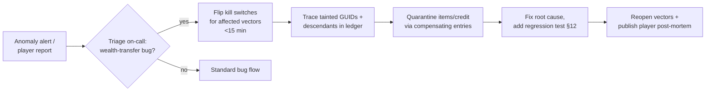

# 27 — Security, Anti-Cheat & Economy Integrity

> **Status:** v0.1 draft — 2026-07-07. Conforms to [canon](../00-canon.md). Owner: security engineering.

## Purpose

This document defines the threat model for Dragon Heroes and the controls that answer it. Because items are sellable for real money through a Pix-settled marketplace ([canon §2, §8](../00-canon.md)), every cheat, exploit, and fraud vector has a direct BRL price tag — this game must be secured to a standard closer to a fintech product than to a typical indie ARPG. The document covers: the full actor/attack/impact/mitigation threat model; the structural defenses against duplication; the pre-built economy incident playbook (kill switches, mint monitoring, targeted rollback); tournament integrity; our honest client-hardening posture; secure development practices; and the security testing roadmap, including the pre-launch external pentest we propose as a launch gate.

## 1. The one real security boundary

Dragon Heroes has exactly one security boundary: the authoritative server. The client sends **inputs only** (movement intent, skill activations, UI actions); the server simulates everything in `dh-sim` at 30 Hz and replicates results ([canon §6](../00-canon.md), [netcode](22-netcode-and-server-hosting.md)). The client is treated as fully compromised at all times — a reasonable assumption given cross-play from day 1 means we ship to platforms (Android, iOS) where no meaningful client anti-tamper exists. Every mitigation in this document is server-side or process-side; anything client-side is friction, never a boundary (§10).

Game servers never write economy state. All real-money item and money mutations flow through the economy core (Go, sole writer, append-only double-entry ledger — [backend](26-backend-and-services.md), [canon §8](../00-canon.md)). This split means a fully compromised zone server still cannot mint, transfer, or destroy marketplace items outside the economy core's validated RPC surface.

## 2. Threat model

| # | Actor | Attack | Impact | Mitigation |
|---|-------|--------|--------|------------|
| T1 | Cheater (modified client) | Speed hack, teleport, fly hack | Unfair traversal, boss skips, farm acceleration | **Killed by construction**: the client sends inputs, not positions; the server integrates movement itself. See §3. |
| T2 | Cheater (modified client) | Damage injection, cooldown skips, fabricated state (fake pickups, fake kills) | Free loot, trivialized bosses | **Killed by construction**: damage, cooldowns, drops, and inventory exist only in server state; there is no client message that asserts them. See §3. |
| T3 | Cheater (reading client memory) | Wallhack / ESP: revealing creatures, players, loot beyond sight | Unfair information in Hunt and Gloomfall | **Killed by omission**: spatial-hash AOI means unseen state is never sent to the client, so there is nothing in memory to read ([netcode](22-netcode-and-server-hosting.md)). See §4. |
| T4 | Botter (automation on a clean client) | Valid inputs at superhuman rates/durations; farm bots, market snipe bots | Inflation of supply, devalued drops, direct BRL extraction via the marketplace | Statistical input-pattern detection, server-side rate plausibility checks, economic counters (KYC seller gate, velocity caps), ban waves. See §5 — this is our highest-stakes residual threat. |
| T5 | Timing manipulator | Lag switch during PvP/boss fights | Unhittable target windows | Lag compensation is capped at the 300 ms hitbox history ([canon §6](../00-canon.md)); beyond that the player lags themselves, not others. Sustained artificial jitter flags for review. See §6. |
| T6 | Loss avoider | Disconnect-on-death / alt-F4 before a killing blow | Escaping the Hunt's death cost; PvP rating protection | Disconnect leaves the character in-world, simulated and killable, for a **30 s grace window (proposal)**, extended while in combat until combat resolves; if killed, the Hunt death rules owned by [world & biomes](../design/12-world-and-biomes.md) apply. PvP disconnect = loss. See §6. |
| T7 | Fraudster | Account takeover → liquidate inventory on the marketplace | Player loses cashable property; studio liability | Mandatory 2FA for sellers, new-device listing/withdrawal holds, notification + reversal window, Pix payout only to the verified CPF holder's own key ([canon §8](../00-canon.md)). See §7. |
| T8 | Fraudster | Pix MED dispute abuse — buy items with funds from a compromised bank account, dispute later (the Pix analogue of stolen-card fraud) | Clawed-back funds after items already transferred | PSP-side MED handling, escrow settlement, delayed seller withdrawals, buyer velocity limits. See §8. |
| T9 | Launderer / manipulator | Wash trading, price manipulation, value transfer via deliberately underpriced sales | Marketplace becomes an RMT/laundering rail; regulatory exposure | Velocity and price-deviation monitoring, volume limits, CPF/device graph analysis, 5-year records under the PLD/AML program ([canon §8](../00-canon.md)). See §8. |
| T10 | Exploiter | Item/currency duplication via timing and persistence races | Economy-destroying inflation; the single worst incident class for this game | Structural: DB-unique GUIDs, item state machine, single ACID transaction, single-session enforcement, save-ordering on disconnect/handoff. See §9. |
| T11 | Competitor / extractor | Theft of RL boss and Champion Ghost policy weights | Loss of differentiating tech; offline bot training against our policies | Weights are served ONNX-on-server-CPU only and never ship to clients ([canon §9](../00-canon.md), [creature AI](25-creature-ai-and-rl.md)). See §9.5. |
| T12 | External attacker | Infra compromise, forged PSP webhooks, dependency supply chain | Direct theft, data breach (LGPD incident) | Secrets management, signed+idempotent webhook verification, dependency audit, hardened infra. See §11. |

## 3. Combat cheats: killed by construction

The precise claim, stated once so it can be audited: **there is no protocol message by which a client can assert simulation state.** The client→server channel carries input commands (movement vector, skill slot activation, target point, interaction intent) plus session plumbing. Position, velocity, damage, health, cooldowns, buffs, inventory, drops, and creature state exist solely in the server's `dh-sim` instance; the client's copy is a rendering of received snapshots plus a locally *predicted* hero that the server freely overwrites on reconciliation ([simulation core](21-simulation-core.md), [netcode](22-netcode-and-server-hosting.md)).

Because of this, speed hacks, teleports, damage injection, item spawning, and every other "fabricated state" cheat are not detected — they are **unrepresentable**. What remains possible on this channel is sending *valid but implausible* inputs, which is why every input still passes server-side validation: type and range checks (a movement vector is unit-length, a target point is within skill range), and rate checks (inputs per tick bounded by what the 30 Hz sim accepts; skill activations bounded by server-side cooldowns). Inputs failing validation are dropped and counted; accounts exceeding an anomaly threshold are flagged (this feeds §5).

## 4. Information exposure: the client cannot leak what it never receives

Wallhacks and ESP tools work by reading state the client holds but does not display. Our defense is interest management, not obfuscation: the spatial-hash AOI in [22-netcode-and-server-hosting.md](22-netcode-and-server-hosting.md) means each client receives only entities near its hero, so out-of-range players, creatures, and loot are absent from client memory entirely. This is canonical ([canon §6](../00-canon.md)) and it is also the scaling mechanism — security and bandwidth share one design.

Residual exposure is the information *inside* the AOI radius: exact creature HP, entities behind occluders on-screen, loot rarity before identification. Rule: any information the design intends to hide from the player (unrevealed item affixes, fog-of-war within the AOI, opponents' loadouts in Gloomfall pre-engagement) must be withheld server-side or sent redacted — never sent and hidden by the UI. This rule is a review checklist item for every new feature that adds replicated state.

## 5. Bots and input automation: the highest-stakes residual threat

A bot sends perfectly valid inputs; server authority does not stop it. In most ARPGs botting devalues the experience — in Dragon Heroes it **prints money**, because farmed Legendaries convert to BRL through the Pix marketplace. That makes us a target profile closer to OSRS/Tibia gold-farming economies than to a typical indie launch, and it justifies investment here beyond genre norms. This risk is dampened in Phase A (closed-loop marketplace credit) and fully activates at Phase B cash-out ([canon §2](../00-canon.md)) — detection maturity is therefore an explicit Phase B gate criterion (see open questions).

**Detection (server-side, invisible to the attacker):**

- **Rate plausibility checks** — humans have a reaction-time floor (~150–250 ms) and high variance in inter-action timing; bots are either superhumanly fast, superhumanly regular, or both. Per-account distributions of inter-input intervals, actions-per-minute by context, and reaction latency to server-initiated events (creature aggro, telegraph start) are scored continuously.
- **Statistical input-pattern detection** — path entropy (bots repeat routes), click/target-point clustering, session-length and time-of-day distributions (24/7 play across "human" sleep cycles), identical behavior across account clusters sharing devices or payment fingerprints.
- **Replay-log classifiers** — [canon §9](../00-canon.md) already requires server-side obs+action replay logging from the first playtest for RL behavioral cloning. The same corpus trains bot/human classifiers; the RL pipeline in [25-creature-ai-and-rl.md](25-creature-ai-and-rl.md) and bot detection share infrastructure.
- **Enforcement** — shadow-flagging plus periodic **ban waves** (proposal) rather than instant bans, so botters cannot A/B-test our detectors; immediate bans reserved for economy-touching accounts. Detected-bot marketplace proceeds are frozen pending review.

**Economic counters (make botting unprofitable even when undetected):**

- Selling requires a **verified-CPF seller account** ([canon §8](../00-canon.md)) — one seller identity per CPF, payouts only to that CPF's own Pix key. Industrial botting therefore needs a supply of real, KYC-passing Brazilian identities, which converts a scripting problem into document fraud with criminal exposure.
- **Account maturity gate**: marketplace listing unlocked at level 15 and 20 hours played (proposal), making banned-bot replacement expensive.
- **Seller velocity caps**: max active listings and max weekly settlement volume per seller, scaling with account age and review status (starting caps: 20 active listings, R$2,000/week settled — proposal).
- The 10% marketplace fee ([canon §2](../00-canon.md)) taxes every extraction cycle, and the hard power cap plus genuinely-rare Legendary drops ([canon §4](../00-canon.md)) keep the farm-per-hour value of bots bounded.

## 6. Timing manipulation and disconnect abuse

**Lag switching** (artificially delaying own packets to become hard to hit) is bounded by design: server-side lag compensation rewinds hitboxes at most **300 ms** ([canon §6](../00-canon.md)). Beyond that window the laggy player's own experience degrades — their inputs arrive late into a simulation that did not wait. The server additionally tracks per-connection jitter profiles; players whose latency spikes correlate suspiciously with incoming damage windows are flagged for replay review (§10 tooling), not auto-punished.

**Disconnect-on-death** must never be strictly better than dying. One disconnect model applies everywhere: the grace window below matches the session handling in [22-netcode-and-server-hosting.md](22-netcode-and-server-hosting.md) exactly, and the death rules it triggers are owned by [12-world-and-biomes.md](../design/12-world-and-biomes.md):

- In the Hunt, a disconnected character remains in-world, simulated and killable, for a **30 s grace window (proposal)**; if it was in combat (damaged or aggroed within the last 10 s — proposal), the window extends until combat resolves. Death during the window applies the full death rules exactly as if connected — 30% destruction of unbanked non-Legendary items, 25% of carried Gold, Legendaries to the death cache ([12-world-and-biomes.md](../design/12-world-and-biomes.md) owns these).
- Reconnection within the window resumes the session seamlessly (also the honest-disconnect experience we want on Brazilian mobile networks — the same rule serves UX and integrity).
- In PvP (duel, 3v3, Gloomfall), disconnection concedes: the match records a loss, Trophies are deducted normally, and in Gloomfall the body remains lootable. Repeated combat-timed disconnects escalate to queue cooldowns (proposal).
- Persistence ordering on disconnect is a dupe-critical path and is specified in §9.

## 7. Account takeover and liquidation

An account holding cashable items is a phishing target with a bank account's threat profile. Layered controls, all enforced by the economy core and account portal (`web/account`):

1. **2FA (TOTP) is mandatory for any account with seller status or marketplace credit** (proposal: optional-but-nagged for everyone else). Marketplace listing, credit spend above R$50 (proposal), and Pix payout requests always require a fresh second factor.
2. **Device binding and new-device holds**: first login from an unrecognized device/fingerprint triggers notification (email + push) and places a **72 h hold (proposal)** on new listings, credit spends, and payout requests initiated from that device. Gameplay is unaffected — the hold is on wealth egress, not on play.
3. **Notification + reversal window**: every listing, sale, and payout generates an out-of-band notification with a one-click freeze link. Disputed transfers within **7 days (proposal)** are reversible: the append-only ledger (§9) gives full provenance, so a stolen item is traced and restored by compensating entries, and a good-faith buyer is refunded from a small insurance reserve funded from marketplace fees (proposal) rather than left holding stolen goods.
4. **Payout hard line** ([canon §8](../00-canon.md)): Pix payouts go only to a Pix key verified as belonging to the account's own KYC'd CPF. An attacker who fully controls an account still cannot route money to themselves — they can at most spend credit, which is traceable and reversible.

## 8. Marketplace fraud, MED disputes, and laundering

The PSP (Asaas primary — [canon §8](../00-canon.md)) owns payment-instrument fraud and [MED (Pix's special return mechanism, tightened under the 2025–2026 BCB rules)](https://www.mattosfilho.com.br/unico/bcb-novas-normas-pix/) dispute handling; our exposure is the gap between "payment looked settled" and "payment was clawed back." Controls, coordinated with [30-legal-payments-compliance.md](../business/30-legal-payments-compliance.md):

- **Escrow-first settlement**: funds sit in PSP escrow and release to the seller subaccount only after the economy core commits the item transfer ([canon §8](../00-canon.md)); there is no flow where an item moves before money is held.
- **Seller withdrawal delay**: new sellers' proceeds are withdrawable after **7 days (proposal)**, decaying with account history — sized against typical MED dispute timelines so clawbacks land on held funds, not on money already gone.
- **Buyer velocity limits**: purchase volume caps on new accounts and new payment sources (proposal), throttling the classic pattern of laundering compromised funds through rapid high-value item purchases.
- **Wash trading** (self-trading between controlled accounts to fake price history or move value): detected via trade-graph analysis — circular flows, shared devices/IPs/payment fingerprints, CPF-cluster correlation. The 10% fee makes each wash cycle expensive; detection makes it account-terminating.
- **Price manipulation and laundering via underpriced sales** (selling a Legendary for R$1 to transfer value off-books, or RMT settled outside the fee): every settlement is checked against a rolling per-item-class reference price; trades deviating more than **70% below the 30-day median (proposal)** are flagged, and repeated deviant pairs are escalated to manual review.
- **PLD/AML program** ([canon §8](../00-canon.md)): verified-CPF sellers, payouts only to own Pix key, wash-trade monitoring, and **5-year retention** of trade, KYC, and dispute records, aligned with COAF expectations. Suspicious-operation reporting procedure is defined with counsel before Phase B.

## 9. Duplication: structural defenses

The documented dupe post-mortems ([MU Online](https://munique.net/item-duplication-exploits/), [New World 2021](https://www.pcgamer.com/amazon-disables-new-world-wealth-transfers-to-fight-gold-dupe-exploit/), [OSRS October 2024](https://oldschool.runescape.wiki/w/Rollback)) share one anatomy: they are **timing and persistence races** — double-saves across server handoffs, trade-state confusion, save-on-disconnect ordering, lag-abused commit windows. Our defenses are structural, not reactive, and most are already canon via [26-backend-and-services.md](26-backend-and-services.md); restated here as the security contract:

1. **GUID uniqueness, DB-enforced**: every item instance has a GUID with a database unique constraint and a single-owner constraint. A dupe that somehow occurs is *unrepresentable* in the economy DB and surfaces as a constraint violation, not silent inflation.
2. **Item state machine**: owned → listed → escrowed → settled/consumed/destroyed, with all transitions validated server-side in the economy core. No code path mutates item rows outside the state machine.
3. **Single ACID transaction**: any transfer (trade, marketplace settlement, mail, prize grant) is one SERIALIZABLE transaction in the one authoritative economy database — never a dual-write across a zone server and a backend, which is where handoff dupes are born.
4. **Single-session enforcement**: one live session per account, enforced at login; a new login fences the old session's write authority before gaining any. Two zone processes can never both hold a writable copy of the same character.
5. **Save-ordering on disconnect and handoff**: character persistence uses a monotonic version and a session fence token; on zone handoff, the receiving process loads state only after the source's final save is committed and acknowledged. Disconnect saves are idempotent and versioned so a lag-delayed duplicate save cannot resurrect spent items.
6. **Idempotency keys on every mutation** and **nightly reconciliation** (ledger sums to zero; no GUID owned twice; item ledger and money ledger agree) with paging alarms on violation ([canon §8](../00-canon.md)).

### 9.5 RL policy theft

Boss, Champion Ghost, and Gloomfall-fill policies are served as ONNX INT8 **on server CPUs only; weights never ship to clients** ([canon §9](../00-canon.md), [creature AI](25-creature-ai-and-rl.md)). The residual vector is black-box extraction by repeatedly querying bots in-game — expensive, low-fidelity, and further degraded by the fairness constraints (observation delay, action-rate caps, aim noise) baked into the policies themselves. The policy registry in `ml/serving` is access-controlled like any production secret store.

## 10. Economy incident playbook

The industry standard is set by the fast responders: Jagex locked all OSRS trading **within ~15 minutes** of the October 2024 potion-storage dupe and then rolled back surgically ([OSRS Wiki](https://oldschool.runescape.wiki/w/Rollback)); Amazon [froze all New World wealth transfers](https://www.pcgamer.com/amazon-disables-new-world-wealth-transfers-to-fight-gold-dupe-exploit/) during its 2021 dupe. We build that capability *before* the marketplace opens ([canon §8](../00-canon.md) makes this a hard prerequisite):

- **Pre-built kill switches for every wealth-transfer vector**: trade, marketplace (listing and settlement independently), mail, drop-to-ground, prize payouts, and Pix payout requests. Each is a feature flag in the economy core, flippable by one on-call command without a deploy, and exercised in staging **monthly (proposal)** so they are known-working under pressure. Target: detection→freeze in under 15 minutes, matching the OSRS bar.
- **Mint-rate anomaly alerts on every faucet**: every source that creates items or currency (creature drops, chest/POI loot, quest rewards, tournament prizes, Gold sources) emits mint events tagged by cause; dashboards track per-item-class mint rates against rolling baselines with automatic paging on deviation (starting threshold: 4σ over a 1-hour window — proposal). A dupe that evades structural defenses still cannot evade arithmetic.
- **Rehearsed targeted rollback**: because every mint/trade/list/consume/destroy is an append-only ledger event with actor, timestamp, and cause, an incident response traces **tainted GUIDs and their descendants** (items bought with tainted proceeds, credit from tainted sales) through the ledger and quarantines exactly that set — compensating entries, not row updates, and never a whole-server rollback that punishes innocent players. This procedure is rehearsed on staging with seeded incidents **quarterly (proposal)**.

## 11. Tournament integrity

Cash prizes ([canon §5](../00-canon.md), [PvP & tournaments](../design/16-pvp-and-tournaments.md)) make competitive cheating a fraud problem, not just a fairness problem.

- **Replay review, server replays authoritative**: the deterministic fixed-tick sim yields exact server-side replays ([simulation core](21-simulation-core.md)); these — never client captures — are the evidence of record. Every prize-winning run in weekly and seasonal tournaments is replay-reviewed before payout (automated screening for all winners; human review for cash-prize finishes — proposal). Payouts already require CPF/KYC and IRRF withholding ([canon §5](../00-canon.md)), so the review gate adds no payout latency beyond that pipeline.
- **Delayed spectating**: all spectator and broadcast views run at a **3-minute delay (proposal)** to kill ghosting/stream-sniping; there is no live spectator protocol that could leak hidden state (consistent with §4).
- **Statistical smurf detection**: new accounts with veteran-shaped performance (winrate vs. rating trajectory, mechanical fingerprints such as input-timing distributions matching a banned or existing account, input-class mismatches with declared queue) are flagged and rating-accelerated or reviewed. Input-segregated ranked queues ([canon §1](../00-canon.md)) get integrity checks that the declared input class matches observed input patterns.
- **Manual review tooling**: an internal replay viewer with side-by-side input timelines, per-tick sim state inspection, and the §5 statistical scores surfaced inline — budgeted as real tooling work, since every documented tournament-integrity program lives or dies on reviewer throughput.
- **Champion Ghosts**: training on winners' replays requires the ToS consent + credit/revenue share already in [canon §5](../00-canon.md); ghost policies obey the fairness caps of [25-creature-ai-and-rl.md](25-creature-ai-and-rl.md) so the ghost is practice, not a superhuman replica.

## 12. Client hardening posture (honest version)

The client is untrusted **by design**, and we say so publicly rather than pretending otherwise. Consequences:

- On PC we may ship **Easy Anti-Cheat via Epic Online Services** — it is [free and usable without other EOS modules](https://crux.supercraft.host/blog/server-authoritative-anti-cheat-backend/) — purely as *friction*: it raises the cost of trivial memory-reading tools and input injectors. It is never load-bearing; no design decision may assume it works. Whether the friction is worth the integration and Linux/Steam Deck (Proton) support surface is an open question below.
- On Android and iOS there is **no equivalent**: no kernel anti-cheat, rooted/jailbroken devices in the wild, emulators indistinguishable at scale. Since cross-play is day 1 ([canon §1](../00-canon.md)), the mobile client defines our floor — which is exactly why server authority (§1) is the only real line, and why nothing in this document depends on client integrity.
- Client binaries get standard tamper-evidence only (build signing, content-version hash checked at login per [content pipeline](23-content-pipeline.md)) so a modified client fails fast rather than half-works.

## 13. Secure development practices

- **Secrets**: no secrets in repos, ever; cloud KMS/secret-manager with short-lived credentials; PSP API keys and webhook signing secrets scoped per environment and rotated on staff departure. **Payment webhooks are verified** (signature + timestamp), processed idempotently (webhook replay must be a no-op — this is also a dupe defense), and accepted only from PSP IP ranges.
- **Dependency audit**: OSV-based dependency scanning for the C++ workspace and its vendored libraries, `govulncheck` (economy core), and npm audit (web surfaces) run in CI on every merge; lockfiles committed; automated update PRs; SBOM generated per release. The Godot addon surface in `game/` is treated as dependencies too.
- **Infra hardening**: economy DB and Nakama Postgres in private subnets, no public endpoints; least-privilege IAM per service; game servers are immutable containers with no interactive access; TLS on every backend/web hop; admin/liveops surfaces behind SSO + 2FA with full audit logging; DDoS posture per [22-netcode-and-server-hosting.md](22-netcode-and-server-hosting.md) (connection tokens on the UDP path, rate limiting at the gateway).
- **LGPD overlap** ([legal & compliance](../business/30-legal-payments-compliance.md)): we hold CPFs, KYC documents, and age-verification data — high-sensitivity PII. Security controls double as LGPD controls: encryption at rest, access logging on every PII read, data minimization (game servers never see CPF or payment data), DPIA covering payments and age verification per [canon §8](../00-canon.md), and a breach-notification runbook (ANPD + affected users) folded into the §10 incident process.

## 14. Security testing roadmap

Ordered to match the build-out in [31-roadmap.md](../business/31-roadmap.md); items 1–3 are continuous once created, item 4 is a gate.

1. **Dupe-race regression suite** (before any persistence code is "done"): every historical race pattern from the §9 post-mortems encoded as an automated test — disconnect mid-trade, zone handoff mid-trade, double webhook delivery, replayed idempotency keys, concurrent login racing a save, kill-switch flips mid-settlement. Runs in CI against a real Postgres; a red test blocks merge.
2. **Economy chaos tests** (before the marketplace opens): a bot swarm fuzzes the economy core with concurrent list/buy/cancel/mail/disconnect storms under injected latency and process kills, while the reconciliation invariants (ledger sums to zero, no double ownership) are asserted continuously. Run nightly against staging.
3. **Protocol fuzzing**: malformed and hostile packet fuzzing of `dh-net` and the economy core RPC surface, plus load tests with adversarial (not just well-behaved) bot clients.
4. **Pre-launch external penetration test** of the marketplace, account portal, and payment-webhook surface by a third-party firm — **proposed as a canonical launch gate** alongside the legal parecer ([canon §8](../00-canon.md)): the marketplace does not open to real money without a passed pentest and remediated criticals. Repeat before the Phase B cash-out switch, whose scope (Pix payouts) is materially riskier.

## Open questions (for Ricardo)

1. **Pentest as launch gate**: confirm the external pentest of marketplace + account portal + payment webhooks as a canonical launch gate (like the legal parecer), and approve budget/vendor selection timing (~M-3 before marketplace open).
2. **Easy Anti-Cheat on PC at launch**: ship EAC-via-EOS as friction (accepting Proton/Steam Deck support surface and integration cost), or launch PC without client anti-cheat and rely purely on server-side detection? Recommendation: decide after closed beta bot data.
3. **2FA scope**: mandatory TOTP for sellers and any credit-holding account only (proposed), or mandatory for all accounts at launch (more friction, simpler story)?
4. **Friction constants**: approve or adjust the proposed 72 h new-device wealth-egress hold, 7-day seller withdrawal delay, 7-day takeover reversal window, and seller velocity caps (20 listings / R$2,000-week starting values) — these trade fraud losses against honest-seller UX.
5. **Disconnect grace constant**: the disconnect model itself is settled (one model everywhere, shared with [22-netcode-and-server-hosting.md](22-netcode-and-server-hosting.md): 30 s killable linger, extended while in combat until combat resolves, death rules per design/12); approve the **30 s (proposal)** value, accepting that Brazilian mobile-network drops will sometimes cost honest players.
6. **Enforcement style for bots**: ban waves with shadow-flagging (protects detector secrecy, proposed) vs. immediate bans (visible deterrence) — and confirm that bot-detection maturity (measured false-positive/negative rates from beta) is a formal Phase B cash-out gate criterion.
7. **Fraud/insurance reserve**: approve funding a small reserve from marketplace fees to make ATO victims and good-faith buyers whole (percentage TBD with finance) — without it, reversals create new victims.
8. **Security headcount**: Phase B (Pix cash-out) realistically needs a part-time fraud analyst function (review queues from §5/§8 flags). In-house, contracted, or defer Phase B until staffed?

## Sources

- [OSRS Wiki — Rollback (Oct 2024 potion-storage dupe: ~15-minute trade lockdown, targeted rollback)](https://oldschool.runescape.wiki/w/Rollback)
- [PC Gamer — Amazon disables New World wealth transfers to fight gold dupe](https://www.pcgamer.com/amazon-disables-new-world-wealth-transfers-to-fight-gold-dupe-exploit/)
- [munique.net — On item duplication exploits and how to prevent them (MU Online post-mortem)](https://munique.net/item-duplication-exploits/)
- [Server-Authoritative Anti-Cheat: Why Client Anti-Cheat Isn't Enough (2026) — incl. free EAC via EOS](https://crux.supercraft.host/blog/server-authoritative-anti-cheat-backend/)
- [Mattos Filho — Novas normas do BCB sobre Pix / MED e segurança](https://www.mattosfilho.com.br/unico/bcb-novas-normas-pix/)
- [Resolução BCB nº 506/2025 — requisitos para instituições de pagamento](https://www.legisweb.com.br/legislacao/?id=484161)
